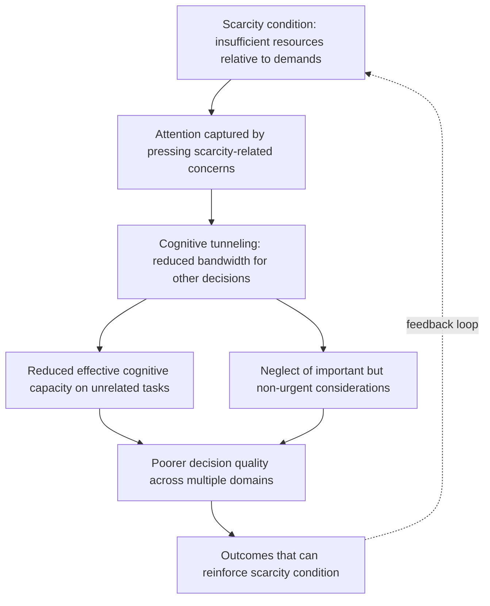

## Bounded Rationality Among the Poor

### Definition and Scope

Bounded rationality among the poor examines how cognitive, informational, and computational limits on decision-making — a concept originating with Herbert Simon — manifest specifically in the economic choices of low-income households in developing countries, and how these limits interact with the material conditions of poverty itself. This topic opens the chapter on Behavioral Development Economics, providing the cognitive-constraints foundation that complements the risk, insurance, and household-behavior material developed in the preceding chapter.

**Key Points**

- Bounded rationality departs from the standard neoclassical assumption of unlimited computational capacity and costless information processing, positing instead that decision-makers use simplified heuristics, satisfice rather than optimize, and are subject to systematic cognitive constraints
- In development economics specifically, this literature examines both **generic** cognitive limits (present in all humans regardless of income) and constraints that are **specifically amplified or induced by poverty conditions** (the scarcity/bandwidth channel, distinct from generic bounded rationality)
- This distinction — universal cognitive limits versus poverty-induced cognitive constraints — is central to interpreting the policy implications of this literature, since the two diagnoses imply different intervention targets

### Theoretical Foundations

#### Simon's Original Bounded Rationality Concept

Herbert Simon's foundational contribution characterized economic agents as **satisficers** rather than optimizers: given limited information-processing capacity, agents adopt decision rules that achieve "good enough" outcomes rather than exhaustively computing a global optimum. This framework predates and is more general than the poverty-specific literature discussed below, applying in principle to decision-makers at any income level.

$$\text{Standard rationality: } \max_x u(x) \text{ s.t. budget constraint, full information processing}$$

$$\text{Bounded rationality: } x^* \text{ such that } u(x^*) \geq \text{aspiration level}, \text{ subject to cognitive/informational limits}$$

#### The Scarcity/Bandwidth Framework

A more recent and highly influential extension, associated principally with Mullainathan and Shafir's work (synthesized in their book *Scarcity*), argues that the experience of scarcity itself — not merely low income as a static condition — consumes cognitive resources ("bandwidth"), producing a **tunneling effect** in which pressing concerns dominate attention at the expense of other important but less immediately urgent considerations.

**Key Points**

- The bandwidth framework's key theoretical contribution is treating cognitive capacity itself as *endogenous to the economic condition of poverty*, rather than as a fixed individual trait — implying that poverty could causally reduce effective cognitive functioning, not merely correlate with it due to selection or confounding factors
- This is distinguished from a simple claim that "poor people make worse decisions" (which could reflect many confounds); the scarcity framework's specific causal claim is that the psychological experience of scarcity itself imposes a bandwidth tax, testable via experiments that induce scarcity concerns and measure cognitive performance on unrelated tasks

### Key Empirical Evidence: Cognitive Load and Scarcity

#### Mani, Mullainathan, Shafir, and Zhao (2013) — Sugarcane Farmers

A frequently cited study examined Indian sugarcane farmers before and after harvest (a period of substantial income fluctuation, since sugarcane is paid in a lump sum at harvest, creating a natural pre-harvest poverty and post-harvest relative wealth comparison within the same individuals). The study found that cognitive performance on standard fluid intelligence and executive control measures was lower before harvest (when farmers were experiencing financial scarcity) than after harvest (following payment), within the same individuals — a within-subject design intended to isolate the causal effect of scarcity from stable individual differences.

**Key Points**

- The within-subject design (comparing the same farmers to themselves across a income-scarcity cycle) is methodologically important for isolating a scarcity-causation interpretation from a simple correlation between low income and cognitive test performance across different individuals
- [Inference] The magnitude of cognitive performance difference documented in this study has been described in some secondary literature using IQ-point-equivalent framing; this specific quantitative comparison should be treated as an illustrative translation of standardized test score effects rather than a literal, clinically validated IQ measurement, and readers of the primary study should consult the original effect-size reporting for precise interpretation

#### Related Laboratory Evidence

Complementary laboratory experiments inducing scarcity concerns (e.g., through simulated financial scenarios, or comparing performance under financial stress primes) have found broadly consistent patterns of reduced cognitive performance under induced scarcity conditions, though the generalizability and replication robustness of specific laboratory paradigms in this literature has been a subject of ongoing methodological discussion, consistent with broader replication debates across experimental psychology and behavioral economics.

### Distinguishing Bounded Rationality from Related Concepts

This topic is frequently conflated with, but analytically distinct from, several related concepts covered elsewhere in behavioral development economics:

| Concept | Core Distinction |
| --- | --- |
| Bounded rationality (this topic) | Limits on information processing/computation, potentially amplified by scarcity conditions |
| Present bias / hyperbolic discounting | A specific preference structure (over-weighting immediate rewards), not primarily a cognitive-processing limit |
| Limited attention | A specific manifestation of bounded rationality — failure to attend to relevant information, even when available |
| Behavioral responses to uninsured risk (prior chapter) | Rational risk-aversion-driven choices under uncertainty, distinct from cognitive processing limits, though the scarcity/bandwidth channel is noted there as a complementary mechanism |
| Rule-of-thumb decision-making | A specific heuristic response *to* bounded rationality, rather than the underlying constraint itself |

**Key Points**

- Financial literacy interventions (covered in the credit markets chapter) are, in part, a policy response premised on a bounded-rationality diagnosis: that financial decision quality can be improved by simplifying the required computation (e.g., rule-of-thumb training, as documented in Drexler, Fischer, and Schoar's Dominican Republic study), directly connecting this topic to that earlier chapter's evidence base
- The scarcity/bandwidth framework is sometimes treated as a *cause* of bounded-rationality-consistent behavior specifically among the poor (poverty reduces bandwidth, which then manifests as satisficing/heuristic use), rather than as a wholly separate phenomenon — a conceptual layering worth keeping distinct when reading the literature

### Manifestations in Economic Decision-Making

#### Financial Decision-Making Under Cognitive Load

Complex financial products (loan terms, insurance contracts, savings products) impose computational demands that may exceed available bandwidth, particularly under scarcity conditions — a mechanism directly relevant to the low take-up puzzles documented for index insurance (covered in the risk and insurance chapter), where product complexity has been identified as one plausible contributing factor alongside basis risk and liquidity constraints.

#### Attention Allocation and Salience Effects

Bounded rationality implies that decision-makers may respond disproportionately to salient, easily processed information over equally relevant but less salient information — a pattern documented in various contexts including fertilizer/input purchase timing decisions, where farmers have been found to under-invest when purchase decisions are separated in time and attention from the point of highest salience (e.g., planting season).

#### Simplification and Rule-of-Thumb Heuristics as Adaptive Response

An important nuance in this literature is that the heuristics and simplified decision rules poor households employ are not necessarily evidence of irrationality in a normative sense, but can represent a **rational adaptation** to genuine computational constraints — using simplified rules that perform reasonably well across the relevant decision space, even if they are not literally optimal in every individual instance.

$$\text{Heuristic value} = E[u(\text{heuristic-based choice})] - \text{Cognitive cost of full optimization}$$

Under this framing, a rule-of-thumb decision rule can be understood as itself the outcome of a (higher-level) rational cost-benefit calculation, given that full optimization is costly.

**Key Points**

- This reframing has significant normative implications: rather than treating heuristic-based decision-making as a deficiency to be corrected through education alone, it suggests policy and product design should work *with* bounded rationality — e.g., through simplification, defaults, and reduced-complexity products — rather than solely through attempts to increase cognitive capacity or knowledge
- This design philosophy directly parallels the finding, discussed in the financial literacy interventions topic, that simplified rule-of-thumb training outperformed comprehensive accounting-based training among Dominican Republic microentrepreneurs

### Policy and Design Implications

| Design Principle | Application |
| --- | --- |
| Simplification | Rule-of-thumb financial training rather than comprehensive curricula |
| Reduced choice complexity | Simplified product menus, fewer decision points at moments of high cognitive load |
| Timing interventions to align with bandwidth availability | Delivering information/decisions at lower-scarcity moments (e.g., post-harvest rather than pre-harvest) |
| Defaults and automatic enrollment | Reducing the cognitive burden of active choice for decisions where a sensible default exists |
| Just-in-time information delivery | Providing relevant information close to the decision point rather than requiring long-term retention |

**Key Points**

- These design principles connect directly to intervention design patterns documented elsewhere in this course: the just-in-time and simplified-messaging approaches favored in the financial literacy interventions topic, and the interlinked contract design (premium payment timed to harvest proceeds) documented in the index-based weather insurance topic, both reflect an implicit bounded-rationality/bandwidth-aware design logic
- [Speculation] Some researchers have argued that bandwidth-aware program design could yield larger welfare improvements per dollar spent than knowledge-based interventions alone, given the modest and decaying effect sizes documented in the financial literacy meta-analytic evidence; this remains a plausible but not definitively established comparative claim, since direct head-to-head cost-effectiveness comparisons between bandwidth-aware redesign and knowledge-based interventions are limited in the current literature

### Critiques and Open Debates

- **Causal identification challenges**: distinguishing scarcity-induced cognitive effects from pre-existing individual differences or reverse causality (lower cognitive resources leading to lower income, rather than the reverse) requires careful experimental or quasi-experimental design, and not all studies in this literature achieve equally strong identification
- **Generalizability across contexts**: most rigorous scarcity/bandwidth evidence derives from a relatively limited set of empirical settings; the extent to which findings generalize across different types of scarcity (income, time, food) and cultural contexts remains an active research question
- **Risk of paternalism in design responses**: policy responses built on bounded-rationality diagnoses (simplification, defaults, nudges) raise normative questions about autonomy and paternalism, since they involve designing choice environments based on an assessment that unaided decision-making is systematically suboptimal — a tension present throughout behavioral policy design more broadly, not unique to development contexts
- **Interaction with structural constraints**: critics caution against over-attributing poor economic outcomes to cognitive/bandwidth constraints in ways that could deemphasize structural barriers (credit market failures, missing insurance, discrimination) that operate independently of any cognitive-processing channel — a caution echoing the debate, noted in the financial literacy interventions topic, between "knowledge deficit" and "structural constraint" diagnoses of poor financial behavior

### Summary: Bounded Rationality Channels Relevant to Development Economics

| Channel | Mechanism | Connected Topic in This Course |
| --- | --- | --- |
| Generic bounded rationality (Simon) | Universal computational/information-processing limits | Financial literacy interventions (rule-of-thumb design) |
| Scarcity-induced bandwidth reduction | Poverty conditions consume cognitive resources, reducing effective capacity | Behavioral responses to uninsured risk (complementary channel) |
| Attention/salience effects | Disproportionate response to salient over equally relevant non-salient information | Index-based weather insurance (product complexity and take-up) |
| Heuristic use as rational adaptation | Simplified rules balance decision quality against cognitive cost | Financial literacy interventions (Drexler, Fischer, Schoar) |

**Next Steps**

- Present bias and time-inconsistent preferences among the poor
- Limited attention and salience effects in economic decision-making
- Financial literacy interventions (companion topic, prior chapter)
- Nudges, defaults, and choice architecture in development policy
- Scarcity and cognitive load: replication and generalizability debates
- Rule-of-thumb heuristics in microenterprise decision-making
- Behavioral responses to uninsured risk (prior chapter, complementary mechanism)
- Paternalism and autonomy in behavioral policy design