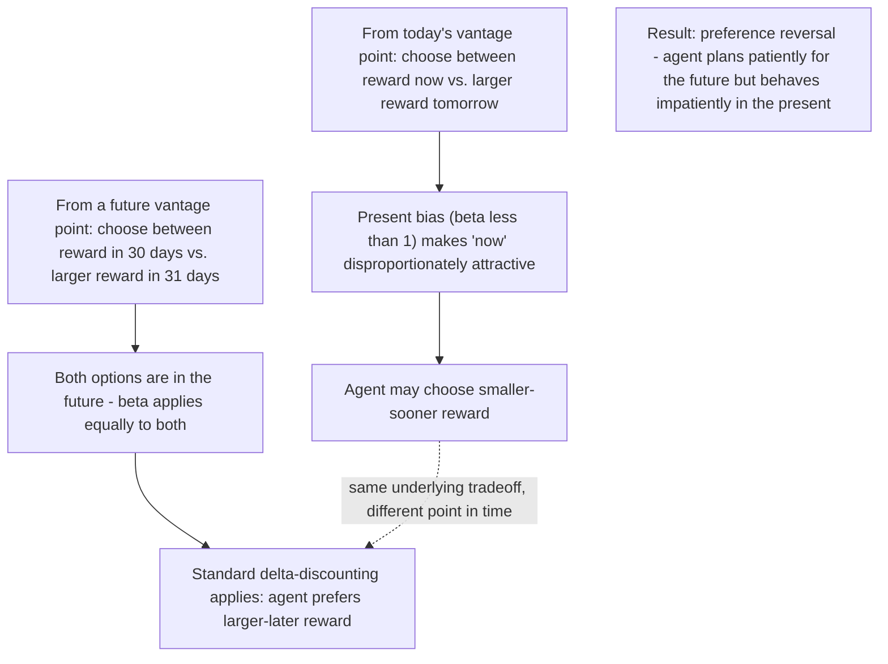

## Present Bias and Time-Inconsistent Preferences

### Definition and Scope

Present bias and time-inconsistent preferences examine a specific departure from standard exponential discounting: individuals systematically overweight immediate costs and rewards relative to future ones, in a manner that generates internally inconsistent plans over time. This topic was flagged as a related concept in the prior bounded-rationality entry and is treated here as a distinct behavioral mechanism — a preference-structure phenomenon rather than a computational/information-processing limit — with substantial independent empirical grounding in development economics.

**Key Points**

- Time inconsistency means a decision-maker's preferences over a pair of future outcomes can reverse depending on when the choice is evaluated — a pattern inconsistent with standard exponential discounting, under which relative preferences between two future dates should not depend on the vantage point from which they are evaluated
- This topic is distinguished from bounded rationality (the prior topic): present bias concerns the *structure of time preferences* even under full information and unlimited computational capacity, whereas bounded rationality concerns limits on information processing itself; in practice the two can interact and compound
- The development economics literature on this topic spans savings behavior, technology adoption, health investment, and — connecting to the credit markets chapter — demand for commitment-based financial products

### Theoretical Framework: Quasi-Hyperbolic Discounting

#### Standard Exponential Discounting Benchmark

Under the standard exponential discounting model, an agent's discount factor between any two adjacent periods is constant:

$$U_t = u(c_t) + \delta u(c_{t+1}) + \delta^2 u(c_{t+2}) + \dots = \sum_{s=0}^{\infty} \delta^s u(c_{t+s})$$

Because $\delta$ is constant across all period-pairs, exponential discounters exhibit **time-consistent** preferences: a plan made today for consumption at future dates $t+1$ and $t+2$ will still be preferred, without revision, when period $t+1$ actually arrives.

#### The Quasi-Hyperbolic ($\beta$-$\delta$) Model

The dominant formalization in economics, developed by Laibson (1997) building on earlier psychological work (Ainslie, and the discrete-time formalization by Phelps and Pollak), introduces an additional discount parameter $\beta < 1$ applied specifically to the transition from the present period to all future periods:

$$U_t = u(c_t) + \beta\left[\delta u(c_{t+1}) + \delta^2 u(c_{t+2}) + \dots\right] = u(c_t) + \beta\sum_{s=1}^{\infty}\delta^s u(c_{t+s})$$

The parameter $\beta$ captures a discrete, present-biased discontinuity between "now" and "any future period," distinct from the steady, constant-rate impatience captured by $\delta$ alone. When $\beta = 1$, this collapses to the standard exponential model; $\beta < 1$ generates present bias.

#### Sophistication vs. Naivete

A critical theoretical distinction within this framework is whether agents are **aware** of their own future present bias:

- **Sophisticated present-biased agents**: correctly anticipate that their future selves will also be present-biased, and may therefore demand commitment devices to bind their future behavior
- **Naive present-biased agents**: incorrectly believe their future selves will behave in a time-consistent (or less present-biased) manner, leading them to systematically underestimate future self-control problems and correspondingly under-demand commitment devices

**Key Points**

- This sophistication/naivete distinction has substantial empirical and policy importance: naive agents are predicted to repeatedly postpone difficult actions (saving, health investments) while sincerely intending to act "starting next period" — a pattern that matches commonly observed procrastination behavior, but which sophisticated agents would not exhibit in the same way, since they would instead seek out commitment mechanisms
- [Inference] Distinguishing sophistication from naivete empirically is methodologically demanding, since both types can exhibit similar observed behavior in the absence of a commitment-device choice; most rigorous empirical identification in this literature relies specifically on whether individuals demand and use commitment devices when offered them, which is a joint test of present bias and sophistication rather than of present bias alone

### Empirical Evidence in Development Economics

#### Savings Behavior and Commitment Devices

The most extensively documented application in development economics examines demand for and effects of **commitment savings products** — savings accounts with restricted access (e.g., locked until a goal amount or date is reached) — as a direct test of whether present-biased, sophisticated agents will voluntarily constrain their own future choices.

Ashraf, Karlan, and Yin's (2006) study of a commitment savings product offered by a Philippine rural bank found that a meaningful share of clients opted into a savings account with restricted withdrawal access despite the product offering no financial return advantage over a standard account, and that take-up was concentrated among individuals whose survey responses indicated present-biased preferences — interpreted as evidence consistent with sophisticated present bias driving demand for self-imposed commitment.

**Key Points**

- The willingness to pay for reduced liquidity (a feature that a standard time-consistent, exponential discounter would have no reason to value, since it strictly limits future choice options without offering compensating benefits) is the key empirical signature distinguishing this behavior from standard savings-constraint explanations
- This finding directly complements the risk-coping and precautionary-savings material from the prior chapter: it suggests that beyond external liquidity constraints, *self-control-related internal constraints* can independently limit effective savings behavior, requiring a different category of policy response (commitment mechanisms rather than simply expanded credit or savings access)

#### Agricultural Input Adoption

A separate strand, notably Duflo, Kremer, and Robinson's (2011) study of fertilizer use among Kenyan farmers, found that offering farmers the option to purchase fertilizer at harvest time (when cash was more available) for delivery at the next planting season — rather than requiring purchase decisions at planting time itself — substantially increased fertilizer adoption relative to standard input subsidy approaches, interpreted as consistent with present-biased farmers repeatedly postponing fertilizer purchase decisions when the decision point coincided with the moment of greatest cash scarcity and competing present demands.

**Key Points**

- This "SMS/timing nudge" intervention design (moving the decision point earlier, away from the moment of peak present-bias-relevant temptation to spend on immediate needs) is a direct policy application of the sophistication-aware commitment-device logic, distinct from either pure liquidity-constraint relief or pure information/knowledge interventions
- This finding connects directly to the just-in-time and timing-sensitive intervention design principles discussed in both the financial literacy interventions topic and the bounded rationality topic, illustrating how present-bias-aware design and bandwidth-aware design can motivate similar practical intervention structures despite resting on distinct underlying theoretical mechanisms

#### Health Investment and Preventive Care

Present bias has also been examined as an explanation for underinvestment in preventive health behaviors with immediate costs but delayed benefits (vaccination, deworming, water treatment, contraception), where the standard prediction is that present-biased agents will systematically under-invest relative to a time-consistent benchmark, particularly for behaviors requiring repeated present-cost/future-benefit trade-offs (as opposed to one-time investments).

**Key Points**

- [Unverified] While present bias is one commonly proposed explanation for low preventive health investment take-up in development contexts, the broader empirical literature on health behavior generally attributes underinvestment to multiple, only partially disentangled factors (present bias, but also price sensitivity, limited information, trust in providers, and infrastructure/access constraints), and the relative contribution of present bias specifically is not uniformly established as the dominant explanatory factor across all studied health behaviors and contexts

### Distinguishing Present Bias from Standard Impatience

A recurring empirical and interpretive challenge is distinguishing genuine **present bias** (a $\beta < 1$ discontinuity specifically at the present) from simple **high overall impatience** (a low but constant $\delta$ applied uniformly across all future period-pairs), since both can generate apparently impatient-looking behavior in a single cross-sectional observation.

$$\text{High impatience alone: } \delta \text{ low, } \beta = 1 \quad \text{(time-consistent, but generally impatient)}$$

$$\text{Present bias: } \beta < 1 \text{, independent of the level of } \delta$$

The standard empirical approach to distinguishing these uses **elicited discount rate experiments** comparing choices between two future-dated rewards at varying horizons (e.g., "smaller reward in 30 days" vs. "larger reward in 60 days") against choices involving an immediate option (e.g., "smaller reward today" vs. "larger reward in 30 days") — genuine present bias predicts a discontinuity specifically when one option involves the immediate present, which pure constant-rate impatience does not predict.

**Key Points**

- Multiple price list and convex time budget experimental methods (the latter developed by Andreoni and Sprenger) have been used to more precisely separate $\beta$ from $\delta$ in both laboratory and field settings in developing-country contexts
- [Inference] Because these elicitation methods rely on hypothetical or small-stakes monetary choices that may not perfectly capture preferences over the larger, more consequential decisions (savings, health investment) that motivate policy interest in present bias, some gap between laboratory-elicited $\beta$ parameters and field behavior is plausible, though the precise mapping between elicited discount parameters and specific field behaviors is an active area of methodological development rather than a fully settled question

### Policy and Product Design Implications

| Design Approach | Mechanism | Example |
| --- | --- | --- |
| Commitment savings products | Voluntary self-imposed restriction on future access | Ashraf, Karlan, Yin (2006) Philippines |
| Timing-shifted decision points | Move decision away from moment of peak present-bias temptation | Duflo, Kremer, Robinson (2011) Kenya fertilizer |
| Default enrollment with opt-out | Reduces reliance on active present-biased choice at each period | Automatic savings/pension enrollment designs |
| Reminders and deadline structuring | Counteracts naive procrastination specifically | SMS savings reminders |
| Interlinked/automated deduction contracts | Removes recurring present-biased choice points entirely | Premium deduction at harvest (index insurance, prior chapter) |

**Key Points**

- These design approaches connect directly to the interlinked contract design (Casaburi-Willis) discussed in the index-based weather insurance topic, illustrating that present-bias-aware product design spans multiple domains covered across this course (savings, insurance, agricultural input adoption) with a common underlying logic: reducing the number of moments at which a present-biased agent must actively resist immediate temptation
- The naive/sophisticated distinction has direct design implications: reminder-based interventions are theoretically better suited to correcting *naive* present bias (since naive agents underestimate future self-control problems and may simply need a nudge to follow through on stated intentions), while commitment devices are more directly targeted at *sophisticated* present bias (since they require the agent to recognize and proactively address their own anticipated future weakness)

### Critiques and Open Debates

- **Welfare interpretation ambiguity**: because present bias implies preferences change depending on temporal vantage point, standard revealed-preference welfare analysis becomes ambiguous — which "self's" preferences should a policymaker treat as the relevant welfare criterion, the planning self or the acting self — a foundational and unresolved normative question in behavioral welfare economics generally, not specific to development contexts
- **Alternative explanations for observed patterns**: some behaviors interpreted as present-bias-driven (e.g., low fertilizer adoption, low commitment-savings product demand) could alternatively reflect standard liquidity constraints, risk aversion, or low trust in financial institutions, and disentangling these competing explanations empirically remains demanding even with well-designed field experiments
- **External validity of laboratory-elicited parameters**: as noted above, the mapping from small-stakes, short-horizon experimental discount rate elicitation to large-stakes, long-horizon real-world decisions is not fully established
- **Paternalism concerns**: commitment-device and default-based policy responses, similar to bounded-rationality-informed design more broadly, raise questions about the appropriate balance between respecting individual autonomy and correcting for a diagnosed self-control limitation — a tension shared with the bounded rationality topic's discussion of paternalism in behavioral policy design

### Summary: Present Bias Evidence Across Domains

| Domain | Key Study/Evidence | Present-Bias-Consistent Finding |
| --- | --- | --- |
| Savings | Ashraf, Karlan, Yin (2006), Philippines | Demand for costly commitment savings products among present-biased respondents |
| Agricultural inputs | Duflo, Kremer, Robinson (2011), Kenya | Higher fertilizer adoption when purchase decision moved away from peak-temptation timing |
| Health investment | Various contexts | Present bias proposed as one of several contributing explanations for underinvestment; not uniformly dominant |
| Financial products more broadly | Cross-cutting | Motivates interlinked/automated-deduction contract designs (connects to index insurance topic) |

**Next Steps**

- Bounded rationality among the poor (companion topic, distinguishing preference-structure from processing-limit mechanisms)
- Commitment savings products and demand for self-control devices
- Nudges, defaults, and choice architecture in development policy
- Financial literacy interventions (prior chapter, timing and simplification design overlap)
- Index-based weather insurance (interlinked contract design, prior chapter)
- Health behavior and preventive care underinvestment
- Welfare analysis under time-inconsistent preferences
- Sophistication vs. naivete: experimental identification methods