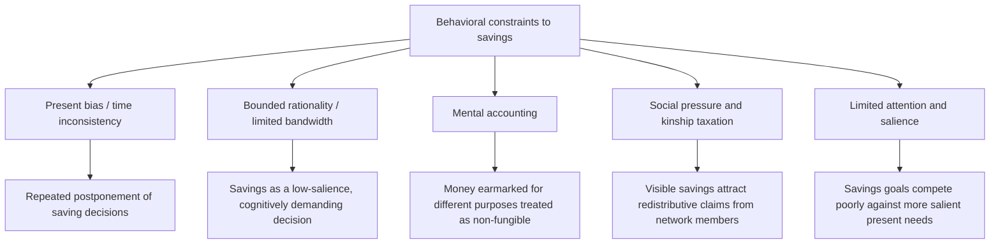
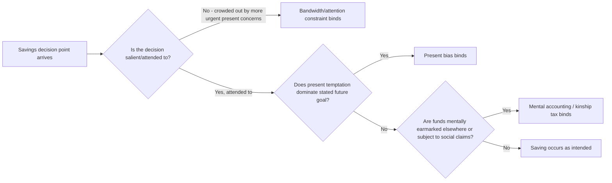

## Behavioral Constraints to Savings

### Definition and Scope

Behavioral constraints to savings examine the specific psychological and decision-making barriers — distinct from standard income and liquidity constraints — that prevent low-income households in developing countries from saving at levels consistent with their own stated goals and long-run interests. This topic synthesizes and applies the two preceding behavioral mechanisms in this chapter (bounded rationality/bandwidth limits and present bias/time inconsistency) specifically to the savings domain, while introducing additional savings-specific behavioral channels not fully covered in either prior topic.

**Key Points**

- The starting empirical puzzle motivating this literature is that savings rates among the poor are frequently found to be lower than would be predicted by pure income/liquidity-constraint models alone, and that many low-income individuals report a persistent gap between their savings intentions and realized savings behavior
- This topic distinguishes **behavioral** savings constraints (psychological/decision-making barriers) from **structural** savings constraints (lack of access to formal savings infrastructure, transaction costs, minimum balance requirements) — though in practice the two interact, and much of the applied literature examines behavioral responses to structural barriers rather than either category in isolation
- The chapter's two preceding topics — present bias and bounded rationality — are treated here as specific mechanisms feeding into this broader applied domain, alongside additional channels (mental accounting, social pressure, limited attention) introduced in this entry

### Theoretical Channels

#### Present Bias and Time Inconsistency

As developed in the prior topic, present-biased agents systematically postpone saving decisions in favor of present consumption, particularly when — as sophisticated agents may anticipate — they know their future selves will face the same temptation. This directly motivates demand for the commitment savings products discussed in that topic, evidenced by Ashraf, Karlan, and Yin's (2006) Philippines study.

#### Bounded Rationality and Bandwidth Constraints

As developed in the bounded rationality topic, saving requires sustained attention and computation (tracking balances, resisting competing demands, planning across time), which may be disproportionately difficult under scarcity conditions that consume cognitive bandwidth — potentially creating a self-reinforcing cycle in which the psychological experience of having little to save with makes the cognitively demanding act of saving even harder to sustain.

#### Mental Accounting

A savings-specific behavioral channel not covered in the prior two topics is **mental accounting** (Thaler's foundational concept): the tendency to treat money as non-fungible across different mentally labeled "accounts" (e.g., treating a windfall differently from regular income, or resisting drawing down savings earmarked for a specific purpose even when reallocating would be objectively welfare-improving). In development contexts, this has been examined as both a **barrier** (rigid mental categories preventing efficient reallocation) and a **tool** (labeled/goal-based savings accounts leveraging mental accounting to increase savings persistence).

$$\text{Standard model: money is fungible, } W = \sum_i w_i \text{ regardless of source/label}$$

$$\text{Mental accounting: } w_i \text{ treated as constrained to account } i\text{'s designated purpose, resisting reallocation}$$

#### Social Pressure and the "Kinship Tax"

A distinctive channel emphasized in the development-specific literature (not simply a translation of behavioral economics findings from wealthier-country contexts) is that visible savings and asset accumulation can attract redistributive claims from extended family and community members operating under strong sharing norms — sometimes termed a **"kinship tax"** — creating a specific incentive to keep savings hidden, illiquid, or otherwise shielded from network claims, even at some cost to the saver.

**Key Points**

- The kinship-tax channel connects directly to the informal insurance and risk-sharing networks topic from the prior chapter: the same reciprocal-sharing norms that provide valuable informal insurance can simultaneously function as a disincentive to visible savings accumulation, illustrating a genuine trade-off rather than a straightforward behavioral bias
- This channel has motivated interest in savings products offering a degree of **privacy or plausible deniability** from network claims (e.g., savings held in a formal account outside the home, or in a form less visible/divisible than cash or livestock) as a design response distinct from either present-bias or bandwidth-focused interventions

### Empirical Evidence: Savings Product Design Innovations

#### Commitment Devices

As established in the present bias topic, Ashraf, Karlan, and Yin's (2006) Philippine study found meaningful voluntary take-up of a restricted-access commitment savings account despite no financial return advantage, with take-up concentrated among individuals exhibiting present-biased survey responses — the foundational evidence base for treating present bias as a savings-relevant behavioral constraint.

#### Goal Labeling and Mental Accounting-Based Design

Separately, studies examining **labeled savings accounts** (e.g., accounts explicitly designated for a specific goal such as a health expense, agricultural input purchase, or child's school fees) have generally found that labeling increases savings persistence and goal-directed accumulation relative to unlabeled, general-purpose accounts, consistent with mental accounting operating as a behaviorally exploitable design lever rather than solely as a constraint to be overcome.

**Example**

A savings product might offer a farmer a labeled account explicitly for "next season's fertilizer," with a suggested target amount and a visual progress indicator, leveraging the same mental accounting tendency that, in an unlabeled savings context, might instead lead the farmer to treat the same funds as available for any competing present need.

#### Reminders and Salience Interventions

Karlan, McConnell, Mullainathan, and Zinman's (2016) study of SMS reminders for savings found that simple periodic reminder messages increased savings balances, with effects that were generally found to be larger when messages referenced a specific savings goal — interpreted as evidence consistent with limited attention/salience playing an independent role: savings goals compete poorly against more immediately salient present demands unless actively brought back into attention.

**Key Points**

- The relative effectiveness of goal-referencing reminders versus generic reminders is broadly consistent with the mental-accounting and salience channels operating jointly: a reminder that reactivates a specific mental account/goal appears to be a more effective attention-redirection mechanism than a generic prompt to save
- [Inference] The consistent finding that low-cost, low-touch interventions (SMS reminders, account labeling) can meaningfully move savings behavior — in contrast to the more modest and often decaying effects documented for comprehensive financial literacy training in the credit markets chapter — is broadly consistent with a bounded-rationality/limited-attention interpretation of the savings gap (a low-salience decision easily crowded out by more pressing present demands), rather than a primarily knowledge-based explanation, though this comparison across separate literatures should be treated as suggestive rather than a formal head-to-head test

#### Deposit Collection and Transaction Cost Reduction

Related studies examining **mobile/doorstep deposit collection** services (reducing the effort and time cost of making a deposit) have found positive effects on savings frequency and balances, illustrating that behavioral savings constraints often interact with structural/transaction-cost barriers rather than operating independently — a low but positive transaction cost can be sufficient to trigger present-bias-consistent postponement in a way that a truly zero-cost, automatic mechanism would not.

### Interaction Across Behavioral Channels

A key conceptual point for this topic is that the behavioral channels described above are not mutually exclusive alternative explanations, but frequently operate **simultaneously and interactively** in explaining any given savings shortfall:

**Key Points**

- This layered structure has practical implications for intervention design: a single-mechanism intervention (e.g., a reminder addressing only the attention/salience channel) may show limited effect if a different channel (e.g., present bias, or social pressure) remains the binding constraint for a given household or context, which may partly explain heterogeneous effect sizes across the savings intervention literature
- [Unverified] The relative prevalence of each channel as the *primary* binding constraint likely varies by population, savings goal type, and social context, and the literature does not establish a single generalizable ranking of which behavioral channel dominates across all developing-country savings contexts

### Distinguishing Behavioral from Structural Constraints

A methodologically important caution in this literature is that many field interventions cannot cleanly isolate a single behavioral mechanism from structural/access-based explanations, since improved product design (e.g., commitment accounts, labeled accounts, doorstep collection) simultaneously changes both the behavioral choice architecture and the underlying transaction costs or access conditions.

| Constraint Type | Example | Distinguishing Test Design |
| --- | --- | --- |
| Pure structural/access | High transaction costs to reach a bank branch | Should be resolved by proximity/mobile access alone, without requiring behavioral design features |
| Present bias | Repeated postponement despite stated savings goals | Demand for costly, no-return commitment restrictions signals present bias specifically |
| Bandwidth/attention | Savings goal forgotten or crowded out despite available access | Reminder-based interventions with minimal cost should show disproportionate effect if this channel binds |
| Mental accounting | Reluctance to reallocate labeled funds even when objectively suboptimal | Response to labeling/earmarking manipulations, holding access and returns constant |
| Social pressure (kinship tax) | Preference for illiquid, low-visibility savings forms despite lower returns | Response to privacy-enhancing product features, or differential savings behavior when transactions are more or less observable to network members |

**Key Points**

- Well-identified studies in this literature typically use randomized variation in a single design feature (e.g., adding a commitment restriction, or adding a label, holding all else constant) specifically to isolate one behavioral channel from the others and from structural access effects, which is why the empirical evidence base described above draws heavily on specific, narrowly targeted field experiments rather than broader observational savings-rate comparisons

### Policy and Product Design Implications

| Behavioral Channel Addressed | Design Response |
| --- | --- |
| Present bias | Commitment savings accounts with restricted withdrawal |
| Bounded rationality/limited attention | SMS reminders, simplified account structures, goal-based visual progress tracking |
| Mental accounting | Labeled/earmarked savings accounts tied to specific goals |
| Social pressure/kinship tax | Privacy-enhancing account features, formal institutional holding outside the home |
| Structural/transaction cost | Mobile money integration, doorstep deposit collection, reduced minimum balance requirements |

**Key Points**

- These design responses connect this topic to the broader intervention-design logic developed across the course: the "work with, rather than against, behavioral constraints" philosophy introduced in the bounded rationality topic and the interlinked-contract logic from the index-based weather insurance and present-bias topics both apply directly to savings product design
- [Inference] Because the evidence base suggests multiple behavioral channels often operate simultaneously, savings interventions combining several design features (e.g., a labeled, reminder-supported commitment account with reduced transaction costs) may plausibly outperform single-mechanism interventions, though rigorous head-to-head comparative testing of combined versus single-feature savings products across the same population remains more limited than the evidence base for each individual design feature in isolation

### Summary: Behavioral Savings Constraints and Evidence Base

| Channel | Key Study | Core Finding |
| --- | --- | --- |
| Present bias | Ashraf, Karlan, Yin (2006), Philippines | Demand for costly commitment savings among present-biased individuals |
| Limited attention/salience | Karlan, McConnell, Mullainathan, Zinman (2016) | SMS reminders, especially goal-referencing, increase savings |
| Mental accounting | Various labeled-account studies | Labeling/earmarking increases goal-directed savings persistence |
| Social pressure/kinship tax | Various qualitative and experimental studies | Visible savings attract redistributive claims; privacy features can increase savings |
| Transaction cost/structural | Doorstep/mobile deposit collection studies | Reduced access friction increases deposit frequency and balances |

**Next Steps**

- Present bias and time-inconsistent preferences (companion topic, this chapter)
- Bounded rationality among the poor (companion topic, this chapter)
- Nudges, defaults, and choice architecture in development policy
- Informal insurance and risk-sharing networks (kinship tax connection, prior chapter)
- Mobile money and digital financial services
- Mental accounting and labeled/goal-based product design
- Financial literacy interventions (comparative effect-size context, credit markets chapter)
- Risk-coping strategies of poor households (precautionary savings connection, prior chapter)