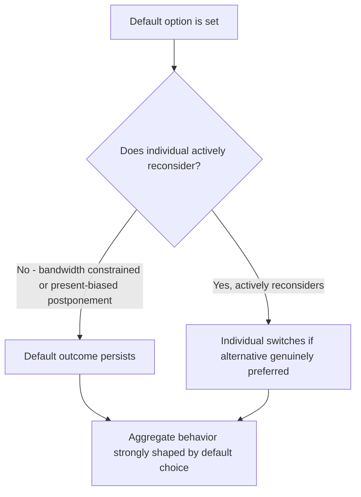
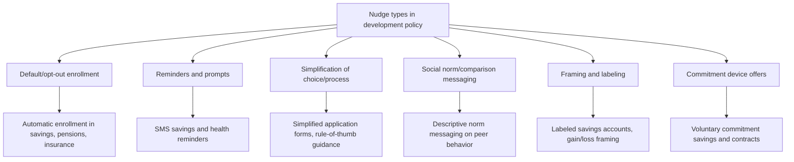

## Nudges and Default Effects in Development Policy

### Definition and Scope

Nudges and default effects examine choice-architecture interventions — changes to how options are presented or structured, without restricting the underlying choice set or altering economic incentives — as a distinct policy tool in development economics. This topic serves as a capstone to the Behavioral Development Economics chapter, formalizing the intervention-design logic that has been referenced throughout the three preceding topics (bounded rationality, present bias, and behavioral constraints to savings) into its own coherent framework, while introducing the specific mechanics of default-setting and choice architecture as tools in their own right.

**Key Points**

- A **nudge**, per Thaler and Sunstein's foundational definition, is any aspect of choice architecture that alters behavior in a predictable way without forbidding any option or significantly changing economic incentives — distinguishing nudges from both mandates/bans and from price-based (subsidy/tax) interventions
- This definitional boundary is important in development policy contexts specifically, since many low-cost behavioral interventions in this literature (SMS reminders, default enrollment, simplified forms) are explicitly designed to be lower-cost and less politically/administratively demanding than large-scale subsidies, mandates, or infrastructure investment
- This topic draws together and formalizes design patterns already introduced piecemeal across this chapter and the prior chapter: reminders (behavioral constraints to savings), interlinked/automatic-deduction contracts (present bias; index-based weather insurance), and simplification (bounded rationality; financial literacy interventions)

### Theoretical Foundation: Why Defaults and Framing Matter

#### Standard Rational Choice Prediction

Under the standard neoclassical benchmark, defaults and framing should be economically irrelevant: a rational agent with stable preferences and negligible transaction costs should reach the same choice regardless of how options are presented or what the default option is set to, since switching away from an undesired default is assumed to be costless.

$$\text{Standard prediction: } x^*_{\text{default A}} = x^*_{\text{default B}} \text{ for a fully rational agent}$$

#### Behavioral Rationale for Default Effects

The empirical prevalence of substantial default effects across many domains is explained through the same behavioral channels developed earlier in this chapter:

- **Bounded rationality/limited attention**: an unattended-to decision defaults to whatever the pre-set option is, particularly under bandwidth constraints that make active reconsideration costly
- **Present bias**: switching away from a default often requires taking an active present-cost action (filling a form, visiting an office) for a benefit realized later, generating the same postponement dynamic documented in the present bias topic
- **Status quo bias/loss aversion**: a more general behavioral finding (not unique to development contexts) that individuals often perceive switching away from a default as a loss relative to a reference point, generating inertia beyond what pure attention or present-bias channels alone would predict

**Key Points**

- The theoretical case for nudges rests directly on the behavioral mechanisms established earlier in this chapter — this topic should be read as an applied synthesis rather than an introduction of an entirely separate theoretical foundation
- [Inference] Because default effects are predicted to be *larger* precisely where bandwidth constraints or present bias are more binding, and since the scarcity/bandwidth literature discussed in the bounded rationality topic suggests poverty itself may amplify these constraints, nudges may plausibly have disproportionately large effects among low-income populations relative to wealthier populations facing the same choice architecture — though this comparative claim about differential nudge effectiveness by income level is not something the literature establishes as a uniformly quantified or universal finding across all nudge types and contexts

### Typology of Nudges Applied in Development Contexts

### Default/Opt-Out Enrollment

#### Mechanism

Setting a socially beneficial option (savings enrollment, insurance coverage, immunization) as the default, requiring active opt-out rather than active opt-in, is among the most extensively studied nudge categories, given its typically low marginal administrative cost once an enrollment infrastructure exists.

#### Evidence in Development Contexts

While much of the seminal default-effect evidence originates from retirement savings contexts in higher-income countries (Madrian and Shea's foundational 401(k) studies), development-context applications have examined default enrollment in mobile savings products and default settings within microinsurance and agricultural input bundling programs, generally finding that default-driven enrollment substantially exceeds opt-in enrollment rates for comparable products, consistent with the broader default-effect literature.

**Key Points**

- [Unverified] The precise magnitude of default effects specifically within developing-country field contexts (as opposed to the more extensively documented higher-income retirement savings literature) is an active area of ongoing research, and effect sizes reported across specific studies should not be assumed to generalize uniformly to all product types or populations without context-specific evidence
- A notable design tension in development contexts is that opt-out defaults still require some administrative and legal infrastructure (a mechanism for automatic enrollment and a process for opt-out) that may itself be constrained in lower-capacity institutional settings, distinguishing the feasibility of this nudge type from lower-infrastructure alternatives like reminders

### Reminders and Attention Prompts

As established in the behavioral constraints to savings topic, Karlan, McConnell, Mullainathan, and Zinman's (2016) study found SMS savings reminders increased balances, with goal-referencing reminders showing larger effects than generic prompts — directly illustrating the limited-attention/salience mechanism in a specific, well-identified field experiment.

**Key Points**

- Reminder-based nudges are a particularly low-cost intervention category (given the low marginal cost of SMS messaging relative to program administrative infrastructure), which has made them an attractive tool for the "low-cost, high-leverage" intervention design philosophy that has become influential in applied development economics more broadly
- The reminder literature extends beyond savings to health behavior (medication adherence, vaccination appointment reminders) and agricultural decision timing (as in the Duflo, Kremer, Robinson fertilizer study discussed in the present bias topic), representing a cross-cutting nudge type applicable across multiple substantive domains covered in this course

### Simplification

#### Mechanism

Reducing the cognitive or procedural complexity of a decision or application process — directly drawing on the bounded rationality framework from earlier in this chapter — is a distinct nudge category from reminders or defaults, targeting the computational/processing burden of a choice rather than its salience or the status quo point.

#### Evidence

The rule-of-thumb financial training evidence (Drexler, Fischer, and Schoar, 2014, discussed in the financial literacy interventions topic) can be understood as a simplification-based behavioral intervention: rather than changing the default or adding reminders, it directly reduced the computational complexity of the target financial decision-making process, and outperformed a more comprehensive but complex alternative.

**Key Points**

- Simplification interventions have also been documented in bureaucratic/administrative contexts — for instance, studies examining simplified tax filing or benefit application forms in developing-country administrative settings, generally finding that reduced form complexity and information requirements increase completion and take-up rates, particularly among less literate or numerate populations
- This connects directly to the mental-model established in the bounded rationality topic: simplification is presented there as a design principle in response to the scarcity/bandwidth framework, and this topic provides the fuller taxonomic and evidentiary grounding for that design principle as one specific nudge category among several

### Social Norms and Comparative Messaging

A nudge category not previously introduced in this chapter involves providing information about peer or community behavior (descriptive social norms) to influence individual choices, based on evidence that individuals' behavior is influenced by beliefs about what others in their reference group do.

**Example**

An agricultural extension program might inform farmers that "70% of farmers in your district used improved seed varieties last season" alongside standard technical information, leveraging descriptive norm information as a distinct behavioral lever from the underlying technical content itself.

**Key Points**

- [Unverified] Evidence on social norm messaging effectiveness in development contexts is more mixed and context-dependent than the reminder or default literature discussed above; norm messaging can backfire (a "boomerang effect") in some documented instances if the stated norm is worse than the target individual's current behavior, though the conditions under which this backfire risk is most pronounced are not fully established as a general rule across all development policy applications
- This nudge category interacts closely with the informal insurance and social network structure material from the prior chapter (Insurance, Risk, and Household Behavior), since the relevant "reference group" for norm messaging often overlaps with the same kinship/community networks examined there for their risk-sharing function

### Framing and Labeling

As established in the behavioral constraints to savings topic, labeled/goal-based savings accounts leverage mental accounting to increase savings persistence — a specific application of the broader framing/labeling nudge category, which also encompasses gain-versus-loss framing of the same underlying choice (e.g., framing an insurance premium as "protecting your harvest" versus a neutral cost description) and default framing of numeric information (e.g., presenting interest rates in cumulative versus per-period terms).

### Commitment Device Offers

As established in the present bias topic, offering — but not mandating — commitment mechanisms (restricted-access savings accounts, interlinked/automatic-deduction payment structures) represents a nudge category distinguished from the others by directly engaging with **sophisticated** present bias, since take-up requires the individual to recognize and proactively address their own anticipated future self-control problem, rather than passively benefiting from a changed default or a well-timed reminder.

### Comparative Evidence: Nudges vs. Traditional Policy Instruments

A recurring theme across this chapter's applied topics is that low-cost behavioral interventions have, in several well-identified studies, shown effects comparable to or exceeding those of more expensive traditional interventions (price subsidies, comprehensive training programs) on specific targeted margins.

| Comparison | Nudge-Type Intervention | Traditional Alternative | Relative Finding |
| --- | --- | --- | --- |
| Fertilizer adoption | Timing-shifted purchase decision (Duflo, Kremer, Robinson) | Standard input subsidy | Timing nudge increased adoption at lower fiscal cost |
| Financial behavior change | Rule-of-thumb simplified training | Comprehensive accounting-based curriculum | Simplified approach outperformed comprehensive curriculum |
| Savings accumulation | SMS reminders | Formal financial education programs | Reminders showed effects at a fraction of training program cost |

**Key Points**

- [Inference] This pattern of low-cost behavioral interventions performing comparably to or better than higher-cost traditional interventions on narrowly targeted behavioral margins has contributed to substantial policy and donor interest in "nudge-style" interventions within development programming, though this should not be over-generalized to a claim that nudges are a universal substitute for structural interventions (credit access, infrastructure, price subsidies) — the evidence base concerns specific, narrowly measured behavioral margins rather than broad welfare or income outcomes in most cases, and cost-effectiveness comparisons are sensitive to the specific outcome measured and time horizon considered
- The comparative cost-effectiveness case for nudges is most clearly established when comparing narrow behavioral outcome margins (e.g., specific product take-up, savings balance, input adoption) rather than broader income or poverty outcomes, where the evidence base (per the critiques and limits of microfinance and financial literacy interventions topics) is generally more modest for most intervention types

### Critiques and Limitations

- **Modest and sometimes context-specific effect sizes**: while individual nudge studies often report statistically significant effects, effect magnitudes on final welfare outcomes (rather than intermediate behavioral margins) are not always established, and some effects documented in specific pilot contexts have shown limited generalizability when tested at scale or in different settings
- **Ethical and paternalism concerns**: as raised in both the bounded rationality and present bias topics, nudges — even though they preserve formal choice freedom — involve a policymaker or institution making an implicit judgment about which direction of behavior change is welfare-improving, a normative judgment not required under either a pure information-provision or a pure incentive-based (price/subsidy) policy approach
- **Distributional and equity considerations**: because default and framing effects may operate more strongly on individuals with more binding bandwidth or present-bias constraints (plausibly correlated with poverty, per the scarcity framework), nudge-based policy design raises specific equity considerations about whose behavior is most affected by choice-architecture changes, distinct from the equity considerations raised by price-based or eligibility-based policy tools
- **Risk of substituting for structural investment**: given nudges' relatively low fiscal cost, a specific policy risk is that behavioral interventions could be used as a lower-cost substitute for necessary but more expensive structural investments (credit market development, insurance infrastructure, service delivery capacity) in contexts where structural constraints, not behavioral ones, are the primary binding limitation — echoing the "knowledge deficit vs. structural constraint" tension raised in the financial literacy interventions topic

### Summary: Nudge Types and Their Theoretical Grounding in This Course

| Nudge Type | Primary Behavioral Mechanism | Related Topic in This Course |
| --- | --- | --- |
| Default/opt-out enrollment | Status quo bias, limited attention | Bounded rationality among the poor |
| Reminders | Limited attention/salience | Behavioral constraints to savings |
| Simplification | Bounded rationality/computational limits | Financial literacy interventions |
| Social norm messaging | Reference-group influenced preferences | Informal insurance and risk-sharing networks (network overlap) |
| Framing/labeling | Mental accounting, reference dependence | Behavioral constraints to savings |
| Commitment device offers | Sophisticated present bias | Present bias and time-inconsistent preferences |

**Next Steps**

- Present bias and time-inconsistent preferences (commitment device theoretical foundation, this chapter)
- Bounded rationality among the poor (simplification and bandwidth foundation, this chapter)
- Behavioral constraints to savings (reminder and labeling evidence base, this chapter)
- Financial literacy interventions (comparative simplification evidence, credit markets chapter)
- Ethics and paternalism in behavioral policy design
- Social norms and network-based information diffusion
- Scaling behavioral interventions: external validity and replication challenges
- Cost-effectiveness comparisons across development policy instrument types