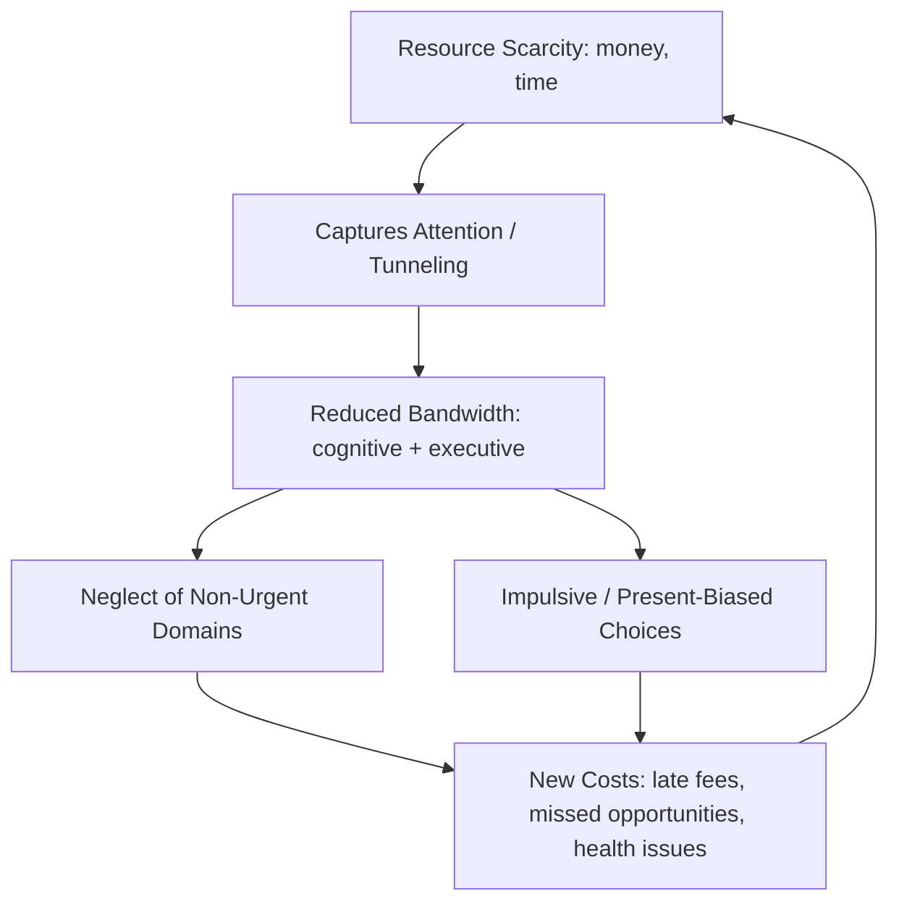

## Psychology of Poverty and Scarcity Mindset

### Overview

The psychology of poverty examines how the condition of being poor shapes cognition, decision-making, and behavior, independent of any pre-existing traits of poor individuals. The central theoretical contribution of this field is the **scarcity mindset** framework, which argues that scarcity itself—whether of money, time, or other resources—consumes mental resources (termed "bandwidth") and systematically alters judgment and choice. This reframes poverty from being solely a *result* of poor decisions to being partially a *cause* of decisions that appear poor from an outside perspective. This has significant implications for anti-poverty policy design, moving away from purely incentive-based models toward behaviorally-informed program design.

### Foundational Theory: Scarcity as a Cognitive Tax

The seminal framework, developed by Sendhil Mullainathan (economist) and Eldar Shafir (psychologist), is detailed in their book *Scarcity: Why Having Too Little Means So Much* (2013).

**Key Points**

- Scarcity is defined as having less than one feels one needs.
- Scarcity captures the mind, causing an involuntary focus on the scarce resource (the "focusing effect" or "tunneling").
- This tunneling produces short-term benefits (intense focus on the pressing problem) but imposes long-term costs by neglecting other important, non-urgent domains of life.
- Scarcity reduces "mental bandwidth"—the cognitive capacity available for fluid intelligence (problem-solving) and executive control (self-regulation, planning, impulse inhibition).

### The Bandwidth Tax

Mullainathan and Shafir's core empirical claim is that poverty reduces cognitive capacity by imposing a **bandwidth tax**. This is distinct from claims about innate intelligence differences.

- **Cognitive Load:** Persistent financial worry occupies working memory, similar to running a demanding background process on a computer that slows down all other applications.
- **Fluid Intelligence Effects:** Experiments measuring IQ-type tasks show that inducing financial worry in low-income individuals lowers performance on cognitive tests, while the same manipulation has little effect on wealthier individuals for whom the amounts at stake are trivial.
- **Executive Control Effects:** Reduced bandwidth impairs self-control, increasing susceptibility to impulsive choices, procrastination, and difficulty adhering to plans (e.g., medication schedules, savings plans).

A widely cited (and separately debated) study by Mani, Mullainathan, Shafir, and Zhao (2013), published in *Science*, found that experimentally-induced financial worries "immediately impede cognitive function" and that "this is not a manifestation of low intelligence, but a causal effect of the current financial condition." The same study additionally examined sugarcane farmers in India, comparing their cognitive performance before and after harvest, and found that "the same farmer shows diminished cognitive performance before harvest, when poor, compared with after harvest, when rich."

**[Inference]** The precise magnitude of the cognitive effect (often cited informally as "equivalent to 13-14 IQ points" from the original study) has been contested in the replication literature; later work, including reanalyses and preregistered replications, has produced mixed results regarding effect size and robustness, so this specific figure should be treated as an illustrative estimate from one study rather than a settled universal parameter.

### Tunneling

"Tunneling" describes the psychological state in which an individual's attention is captured almost exclusively by the scarce resource, analogous to viewing the world through a tunnel that focuses on the immediate scarcity and excludes peripheral concerns.

- **Tunneling Dividend:** In the short run, tunneling can increase efficiency at the task directly in view of the tunnel (e.g., a person with a looming deadline may become hyper-productive on that specific task).
- **Tunneling Tax:** Everything outside the tunnel is neglected. A person tunneling on making rent this month may neglect preventive healthcare, long-term career investments, or their children's homework, not because these are unimportant to them, but because the scarce resource has commandeered their attention.

### The Poverty-as-Context Model vs. Trait-Based Explanations

The scarcity framework directly challenges two older, competing explanations for the persistence of poverty.

**Key Points**

- **Trait-based (culture of poverty) explanations:** Historically influential views (e.g., Oscar Lewis's 1959 "culture of poverty" concept) suggested that poverty perpetuates itself through internalized values, attitudes, or a distinct subculture passed across generations.
- **Rational-actor explanations:** Standard neoclassical economics assumes poor individuals make the same quality of decisions as anyone else, simply under a tighter budget constraint.
- **Situational/scarcity explanations:** The behavioral economics view holds that the *situation* of scarcity itself—not fixed personal traits—produces behaviors (impulsivity, poor planning, high discounting of the future) that both resemble poor decision-making and, in a feedback loop, prolong poverty.

**[Speculation]** The strong policy implication—that placing anyone under sufficiently high scarcity conditions (of any resource) would induce similar bandwidth effects—is a generalization from the original studies (which focused on money and time) and is treated by some researchers as an extrapolation still requiring further domain-specific validation (e.g., for social isolation, food insecurity, or chronic stress independent of financial resources).

### The Scarcity Trap and Feedback Loops

A defining feature of the scarcity framework is that it explains why scarcity is self-perpetuating.

1. Scarcity occupies bandwidth and induces tunneling.
2. Tunneling causes neglect of non-urgent matters (bill due dates, appointment scheduling, long-term planning).
3. This neglect produces new problems (late fees, missed opportunities, health complications) which are costly.
4. These new costs deepen the scarcity, restarting the cycle at a worse baseline.

This is often termed the **scarcity trap**, distinguished from a simple lack-of-resources problem because it implies that even a temporary cash infusion may not resolve the trap if it does not also relieve the underlying bandwidth constraint or repay the "debts" (financial, temporal, or cognitive) accumulated during the tunneling episode.

### Related Concept: The "Bandwidth Tax" and Behavioral Poverty Traps

Economists distinguish two mechanisms by which psychology can trap individuals in poverty, both consistent with the scarcity model but analytically separable:

- **Aspiration failure / hopelessness:** Some models (e.g., work associated with Debraj Ray and later behavioral extensions) argue that poverty can suppress aspirations, reducing motivation to invest in the future because the poor may not perceive attainable pathways out of poverty. This differs from bandwidth depletion, as it concerns motivational beliefs rather than cognitive capacity.
- **Time and risk preferences under scarcity:** Experimental economics finds that poor individuals often exhibit steeper **present bias** (heavily discounting future rewards relative to immediate ones) and greater risk aversion in some domains, but greater risk-seeking in others (e.g., gambling as a rare route to a step-change in circumstances). Under the scarcity account, these are partly *induced* by the situation of poverty rather than fixed personality traits.

### Empirical Methods Used in This Field

**Key Points**

- **Lab-in-the-field experiments:** Cognitive tasks (e.g., Raven's Progressive Matrices for fluid intelligence, Stroop tests for executive control) administered to the same subjects under conditions of induced high vs. low financial salience.
- **Natural experiments exploiting income timing:** Comparing the same individuals before and after a predictable income shock (e.g., farmers before/after harvest, as in Mani et al. 2013).
- **Randomized Controlled Trials (RCTs) of cash transfers:** Measuring whether unconditional or conditional cash transfers change psychological wellbeing, stress hormones (e.g., cortisol), or decision quality, in addition to standard consumption/investment outcomes.
- **Biomarker studies:** Some research examines cortisol levels and other physiological stress markers as objective correlates of the subjective experience of scarcity.

### Practical Example: The "Sugarcane Farmer" Study Design

**Example**

A canonical natural experiment design used to study scarcity effects follows this structure:

1. Identify a population with a large, predictable, cyclical income shock (e.g., farmers paid once at harvest, who are relatively poor before harvest and relatively richer immediately after).
2. Administer identical cognitive tasks (IQ-style, Stroop task) to the *same individuals* at both time points.
3. Control for other seasonal confounders (nutrition, workload, stress unrelated to money) as far as possible.
4. Compare performance: the same farmer shows diminished cognitive performance before harvest, when poor, compared with after harvest, when rich.

**[Unverified]** Whether the observed effect in any single such study is driven purely by financial worry as opposed to correlated factors (e.g., differences in nutrition, sleep, or physical exertion before vs. after harvest season) is a standard methodological concern raised in the literature; well-designed studies attempt to control for these confounds, but perfect isolation of the financial-worry channel from field data alone is inherently difficult.

### Policy Implications: Behaviorally-Informed Program Design

The scarcity mindset framework has directly influenced the design of anti-poverty programs, shifting focus from purely providing resources to also reducing the bandwidth burden the recipient bears to access and use them.

**Key Points**

- **Reduce cognitive/administrative burden ("sludge"):** Simplify enrollment forms, reduce required paperwork, use pre-filled defaults, and minimize the number of separate decisions a beneficiary must make (e.g., simplified FAFSA-style aid applications, streamlined SNAP/benefits enrollment).
- **Timing of information and reminders:** Send SMS reminders for bill payments, medical appointments, or savings deposits at moments outside of the recipient's likely "tunnel," rather than assuming rational, self-initiated follow-through.
- **Design for bandwidth, not willpower:** Use structural defaults (e.g., automatic enrollment in savings plans, direct deposit into locked savings accounts) rather than programs that rely on sustained active self-control from a bandwidth-constrained population.
- **Cash transfer timing:** Structuring cash transfers to arrive with predictable regularity (rather than lump-sum, unpredictable disbursement) may reduce the anticipatory scarcity/tunneling cycle, though optimal timing (lump sum vs. frequent small payments) remains empirically debated depending on the goal (large asset purchases vs. smoothing daily consumption).

### Related Literature and Complementary Frameworks

- **Poverty and Decision-Making (Banerjee & Duflo):** In *Poor Economics* (2011), Abhijit Banerjee and Esther Duflo document numerous cases where the poor make decisions that appear locally rational given their information, risk exposure, and credit constraints, complementing the scarcity account by emphasizing structural (not just psychological) sources of apparently "poor" decision-making.
- **Present Bias and Hyperbolic Discounting:** Related but distinct behavioral economics concept describing a general tendency (not limited to the poor) to overweight immediate rewards relative to future ones; poverty research examines whether this bias is exacerbated under scarcity conditions.
- **Stress and the HPA Axis:** Physiological stress research examining chronic activation of the hypothalamic-pituitary-adrenal axis under conditions of material deprivation, and its downstream effects on decision-making circuitry in the prefrontal cortex.
- **Stereotype Threat:** A related but distinct psychological phenomenon (Steele & Aronson) in which awareness of a negative stereotype about one's group (including regarding poverty or class) can independently impair performance on evaluative tasks.

### Critiques and Debates

**Key Points**

- **Replication concerns:** As noted above, some specific quantitative claims from foundational studies have faced replication challenges, a normal part of scientific progress in experimental social science; this does not invalidate the general theoretical framework but does suggest caution in citing specific effect sizes as fixed constants.
- **Risk of "deficit framing":** Critics caution that the bandwidth/scarcity framework, if applied carelessly, risks pathologizing poor individuals ("the poor have less bandwidth") rather than emphasizing that the *situation* of scarcity produces the effect in anyone. Proponents of the framework explicitly designed it to counter, not reinforce, trait-based deficit narratives, but public communication of the research has sometimes blurred this distinction.
- **External validity:** Lab-induced scarcity manipulations (e.g., asking wealthy subjects to imagine a large unexpected expense) may not fully replicate the chronic, compounding nature of real-world material poverty, raising questions about the transferability of some experimental findings to lived poverty conditions.

### Diagram: Tunneling and Bandwidth Interaction (svg_diagram)

<svg xmlns="http://www.w3.org/2000/svg" viewBox="0 0 720 320">
<text x="360" y="24" text-anchor="middle" font-size="15" font-weight="bold" fill="#1a1a1a">Tunneling and Bandwidth Interaction (svg_diagram)</text>
<rect x="30" y="60" width="180" height="70" rx="8" fill="#e8f0fe" stroke="#3b5bdb" stroke-width="1.5" />
<text x="120" y="88" text-anchor="middle" font-size="12" fill="#1a1a1a">Scarce Resource</text>
<text x="120" y="106" text-anchor="middle" font-size="11" fill="#444">(money, time)</text>
<path d="M210 95 L270 95" stroke="#555" stroke-width="1.5" marker-end="url(#arrow)" />
<rect x="270" y="60" width="180" height="70" rx="8" fill="#fff3e0" stroke="#e8590c" stroke-width="1.5" />
<text x="360" y="88" text-anchor="middle" font-size="12" fill="#1a1a1a">Tunnel Vision</text>
<text x="360" y="106" text-anchor="middle" font-size="11" fill="#444">focus captured</text>
<path d="M450 95 L510 95" stroke="#555" stroke-width="1.5" marker-end="url(#arrow)" />
<rect x="510" y="60" width="180" height="70" rx="8" fill="#fce4ec" stroke="#c2255c" stroke-width="1.5" />
<text x="600" y="88" text-anchor="middle" font-size="12" fill="#1a1a1a">Bandwidth Depleted</text>
<text x="600" y="106" text-anchor="middle" font-size="11" fill="#444">cognitive + executive</text>
<path d="M600 130 L600 170 L360 170 L360 200" stroke="#555" stroke-width="1.5" fill="none" marker-end="url(#arrow)" />
<rect x="270" y="200" width="180" height="70" rx="8" fill="#e6fcf5" stroke="#0ca678" stroke-width="1.5" />
<text x="360" y="228" text-anchor="middle" font-size="12" fill="#1a1a1a">Neglected Domains</text>
<text x="360" y="246" text-anchor="middle" font-size="11" fill="#444">health, planning, bills</text>
<path d="M270 235 L210 235 L210 95" stroke="#555" stroke-width="1.5" fill="none" marker-end="url(#arrow)" />
<text x="140" y="180" font-size="11" fill="#c2255c" font-style="italic">feedback: new costs</text>
<text x="140" y="195" font-size="11" fill="#c2255c" font-style="italic">deepen scarcity</text>
</svg>

### Related Topics

- Present bias and hyperbolic discounting in intertemporal choice
- Cash transfer program design (conditional vs. unconditional)
- Behavioral nudges in development policy (defaults, reminders, commitment devices)
- Stereotype threat and identity-based performance effects
- Aspiration failure and the economics of hope (Debraj Ray)
- Microcredit, savings constraints, and behavioral barriers to saving
- Stress physiology (cortisol, HPA axis) and socioeconomic status
- *Poor Economics* framework: structural vs. psychological explanations of poverty traps