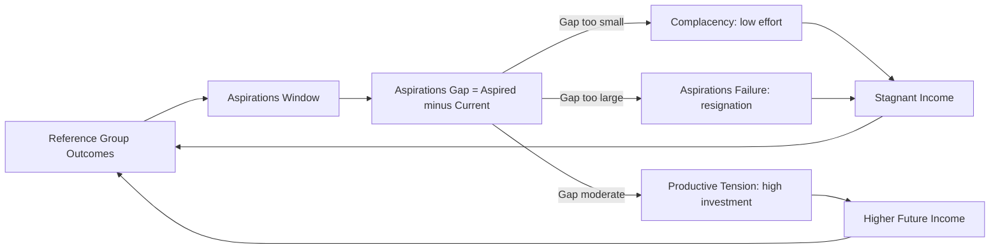

## Aspirations and Poverty Traps

### Overview

The aspirations-based approach to poverty traps examines how internally-held beliefs about one's own attainable future can independently perpetuate material poverty, separate from external constraints like credit access or physical capital. The central claim, most formally developed by economist Debraj Ray, is that poverty can suppress the *aspirations window*—the range of goals an individual perceives as achievable given their reference group—which in turn reduces investment, effort, and forward-looking behavior, thereby reproducing the very poverty that constrained aspirations in the first place. This complements (rather than replaces) standard poverty-trap models based on missing markets or physical capital thresholds.

### The Aspirations Window (Ray's Framework)

Debraj Ray's concept, introduced in "Aspirations, Poverty, and Economic Change" (2006), formalizes aspirations as a function of an individual's socially observed "cognitive world."

**Key Points**

- **Aspirations window:** The set of living standards and outcomes an individual can realistically envision for themselves, shaped primarily by the outcomes of people in their reference group (family, neighbors, similar socioeconomic peers) rather than the full range of theoretically possible outcomes in the wider economy.
- **Aspirations gap:** The distance between an individual's current situation and their aspired-to situation. This gap is the theorized driver of motivation and investment behavior.
- **Non-monotonic relationship:** Ray's model does not predict that a larger gap always produces more effort. Instead, the relationship is inverted-U shaped:
  - A gap that is **too small** provides insufficient motivation to change behavior (complacency).
  - A gap that is **moderate** produces the strongest incentive to invest, save, and work toward the aspired outcome ("productive tension").
  - A gap that is **too large** is perceived as unattainable, leading to frustration, resignation, or "aspirations failure"—a withdrawal of effort because the goal seems structurally out of reach.

$$\text{Effort}(g) = f(g), \quad f'(g) > 0 \text{ for } g < g^*, \quad f'(g) < 0 \text{ for } g > g^*$$

where $g$ is the aspirations gap and $g^*$ is the gap that maximizes investment effort.

### Aspirations Failure as a Poverty Trap Mechanism

**Key Points**

- Unlike standard poverty traps driven by physical thresholds (e.g., a minimum capital stock needed to escape subsistence), the aspirations-based trap is *psychological and self-reinforcing*: low aspirations lead to low investment, which produces low realized outcomes, which in turn confirms and further lowers the aspirations of the individual and their reference group's next generation.
- This creates an intergenerational transmission channel distinct from the transmission of physical or human capital: parents with a narrow aspirations window may under-invest in children's education not purely due to credit constraints, but because they do not perceive higher trajectories as realistically available to their family or community.
- The mechanism is consistent with, but analytically distinct from, the "culture of poverty" framing; Ray's model treats aspirations as an *equilibrium outcome* of social structure and observed reference points, not as a fixed cultural trait.

**[Inference]** The degree to which aspirations failure operates as an independent causal driver of poverty persistence—versus being primarily a rational, correct inference about genuinely blocked opportunity structures (i.e., "realistic pessimism" rather than a psychological bias)—remains a live theoretical and empirical question; this distinction matters significantly for policy design, since interventions aimed at "raising aspirations" alone will be ineffective if the underlying structural barriers (credit, markets, discrimination) are the true binding constraint.

### Empirical Evidence: The "Documentary/Video" Intervention Studies

A body of empirical work has tested whether exogenously exposing poor individuals to role models or aspirational content changes behavior and outcomes.

**Example**

Bernard, Dercon, Orkin, and Taffesse conducted a field experiment in rural Ethiopia (working paper and subsequent publications, circa 2014) in which households were shown documentary videos of local individuals from similar backgrounds who had achieved success through agriculture or small business, in contrast to a placebo group shown an entertainment video.

- Households exposed to the aspirations-raising video subsequently showed, six months later, increased savings, greater credit take-up, and higher investment in children's schooling relative to control households, without changes in reported income at the time of measurement.
- The mechanism operated through the reference group effect: villagers seeing *similar others* (not distant celebrities or urban elites) succeed increased their own perceived aspirations window, supporting Ray's theoretical claim that reference-group proximity matters for aspiration formation.

**[Unverified]** Longer-run follow-up on this specific study cohort (whether the increased investment translated into durable, multi-year income gains rather than a temporary behavioral shift) may not be conclusively established across all follow-up waves; readers should consult the most recent published version and any subsequent replications for updated longitudinal results.

### Related Empirical Literature

- **Genicot and Ray (2017), "Aspirations and Inequality":** Formalizes how the *distribution* of income/consumption in a reference group shapes individual aspirations, showing that moderate inequality (rather than perfect equality) can maximize aggregate investment incentives, while extreme inequality can suppress aspirations for those far below the top.
- **Macours and Vakis (2014), Nicaragua:** Examined a conditional cash transfer program with an added component of exposure to local leaders/role models, finding that beneficiaries with more contact with "success" role models in the community showed larger and more persistent gains in productive investment than those without such exposure, even controlling for the cash transfer itself.
- **Beaman, Duflo, Pande, and Topalova (2012), India (local political reservations for women):** Found that random exposure to female political leaders (via quota-based reservations) raised aspirations and educational outcomes for adolescent girls and their parents, narrowing the gender gap in aspirations—an application of the reference-group mechanism to gender rather than income.

### Distinguishing Aspirations Failure from Rational Response to Constraints

A key methodological challenge in this literature is separating genuine psychological "aspirations failure" from behavior that is simply a correct rational response to real structural barriers.

**Key Points**

- If credit markets are missing, a poor household's decision not to invest in a high-return but risky venture may be entirely rational risk-avoidance given no insurance, not a psychological aspirations problem.
- Distinguishing the two typically requires experimental designs that hold structural constraints constant (e.g., providing the same credit/cash access to both treatment and control groups) while varying only the aspirational/informational input, as in the Ethiopia documentary study above.
- **[Inference]** Because most real-world poverty traps likely involve *both* structural constraints and psychological aspiration effects simultaneously, isolating the pure aspirations channel is analytically useful for research purposes but caution is warranted before attributing observed poverty persistence in any specific real-world context primarily to psychological aspiration failure without also verifying that structural constraints have been adequately addressed or controlled for.

### Aspirations and Human Capital Investment

**Key Points**

- Parental aspirations for children's education are a widely studied application: parents with a narrower aspirations window for their children (shaped by the realized outcomes of others in their community) may set lower implicit targets for schooling investment, even when formal credit constraints to schooling are relaxed.
- Field experiments providing information about the *actual* returns to education (correcting downward-biased beliefs about returns) have been shown in several contexts (e.g., Jensen 2010, Dominican Republic) to increase schooling investment—this is related to, but distinct from, the aspirations-window mechanism, since it corrects a factual belief about returns rather than the perceived attainability of a goal.
- Self-perception and identity-based constraints (e.g., "people like me don't go to university") can function similarly to a narrow aspirations window, linking this literature to social identity and stereotype-based models of behavior.

### Policy Implications: Aspiration-Sensitive Program Design

**Key Points**

- **Role model exposure:** Programs that expose beneficiaries to relatable success stories from similar reference groups (not distant elites) may shift the aspirations window more effectively than abstract information campaigns.
- **Pairing psychological and structural interventions:** Given the difficulty of isolating pure aspirations effects, well-designed anti-poverty programs increasingly pair aspiration-raising components (mentoring, role models, goal-setting exercises) with concrete structural support (cash transfers, credit access, skills training)—the so-called "graduation model" pioneered by BRAC and studied extensively by Banerjee, Duflo, and co-authors combines both elements.
- **Goal-setting and psychosocial interventions:** Some programs incorporate structured goal-setting or psychosocial stimulation components (drawing on psychology) explicitly to widen the perceived aspirations window alongside asset transfers.
- **Risk of over-promising:** Policymakers should be cautious about interventions that raise aspirations without also expanding real structural opportunity, since this configuration risks reproducing the "gap too large" scenario in Ray's model, potentially increasing frustration rather than investment.

### Diagram: Aspirations Gap and Investment Effort (svg_diagram)

<svg xmlns="http://www.w3.org/2000/svg" viewBox="0 0 700 380">
<text x="350" y="24" text-anchor="middle" font-size="15" font-weight="bold" fill="#1a1a1a">Aspirations Gap and Investment Effort (svg_diagram)</text>
<line x1="70" y1="320" x2="650" y2="320" stroke="#333" stroke-width="1.5" />
<line x1="70" y1="320" x2="70" y2="60" stroke="#333" stroke-width="1.5" />
<text x="360" y="355" text-anchor="middle" font-size="12" fill="#333">Aspirations Gap (g)</text>
<text x="30" y="190" text-anchor="middle" font-size="12" fill="#333" transform="rotate(-90 30 190)">Investment Effort</text>
<path d="M90 300 Q 250 60 360 90 Q 470 120 630 290" fill="none" stroke="#3b5bdb" stroke-width="2.5" />
<line x1="360" y1="90" x2="360" y2="320" stroke="#c2255c" stroke-width="1" stroke-dasharray="4,4" />
<text x="360" y="335" text-anchor="middle" font-size="11" fill="#c2255c">g*</text>
<rect x="90" y="290" width="140" height="22" fill="#fff3e0" opacity="0.6" />
<text x="160" y="306" text-anchor="middle" font-size="10.5" fill="#a15c00">Complacency zone</text>
<rect x="290" y="290" width="140" height="22" fill="#e6fcf5" opacity="0.6" />
<text x="360" y="306" text-anchor="middle" font-size="10.5" fill="#087f5b">Productive tension</text>
<rect x="480" y="290" width="150" height="22" fill="#fce4ec" opacity="0.6" />
<text x="555" y="306" text-anchor="middle" font-size="10.5" fill="#a61e4d">Aspirations failure zone</text>
</svg>

### Related Topics

- Reference-dependent preferences and social comparison in economics
- Genicot and Ray (2017) inequality-aspirations models
- Graduation model / "big push" anti-poverty programs (BRAC, Banerjee & Duflo)
- Returns-to-education information experiments (Jensen 2010)
- Role models, quotas, and identity-based constraints (Beaman et al. 2012)
- Psychosocial stimulation interventions in early childhood development
- Poverty traps: physical capital thresholds vs. behavioral/psychological thresholds
- Present bias and scarcity mindset (complementary behavioral mechanisms)