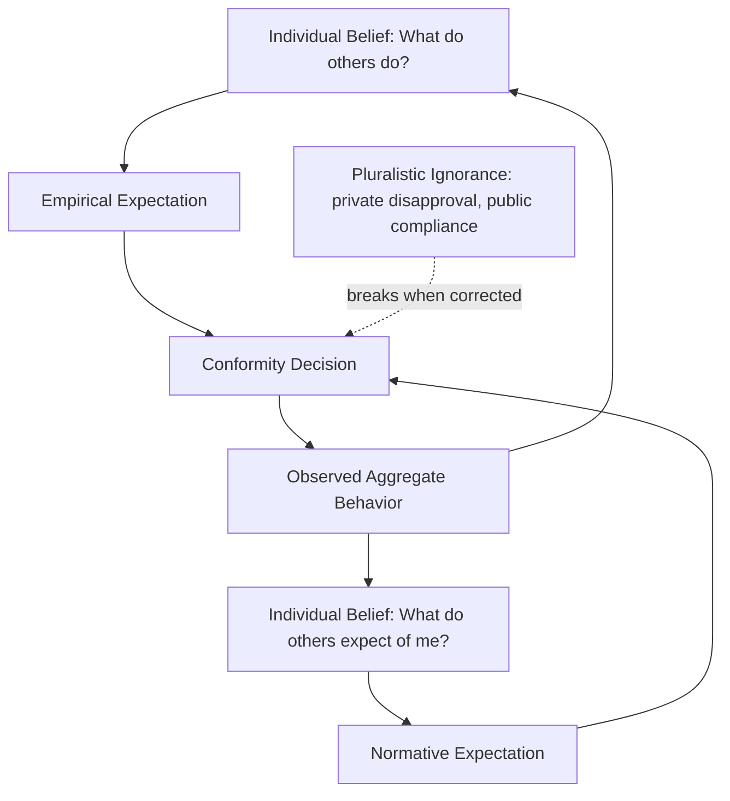

## Social Norms and Behavior Change

### Overview

Social norms are shared understandings of what behaviors are typical (descriptive norms) or approved of (injunctive norms) within a reference group. In development economics, social norms function as a distinct behavioral constraint on individual decision-making, separate from prices, credit constraints, or information gaps. Because many development-relevant behaviors—sanitation practices, fertility decisions, domestic violence, savings, and gender roles—are embedded in collective expectations, changing individual behavior often requires shifting the perceived or actual norm itself, not merely changing individual incentives or information. This has given rise to a distinct toolkit of norm-based interventions used alongside standard price- and information-based policy instruments.

### Conceptual Distinctions

**Key Points**

- **Descriptive norms:** Beliefs about what most people in a reference group actually do (e.g., "most households in my village practice open defecation").
- **Injunctive norms:** Beliefs about what behaviors are socially approved or disapproved of by the reference group, independent of what people actually do (e.g., "my community would disapprove if I let my daughter attend school past age twelve").
- **Empirical expectations:** An individual's beliefs about others' actual behavior (closely tied to descriptive norms, but at the level of individual belief rather than aggregate fact).
- **Normative expectations:** An individual's beliefs about what others *expect them* to do, and beliefs about likely social sanctions for non-compliance.
- Norms are distinguished from simple habits or individual preferences by their inherently *social* and *self-reinforcing* character: an individual's compliance is conditional on their belief about others' compliance and others' expectations, creating strategic interdependence.

### Game-Theoretic Framing: Norms as Coordination Equilibria

Many economic models of social norms, following work associated with Cristina Bicchieri, treat norms as one of multiple possible equilibria in a coordination game, rather than as fixed cultural constants.

**Key Points**

- A norm persists because each individual's best response is to conform, *given their belief that others will also conform*—this is a **self-fulfilling equilibrium**, not necessarily reflecting a majority's true underlying preference.
- This framing implies norms can be "**pluralistic ignorance**": a state where most individuals privately disapprove of a norm (e.g., a harmful practice) but each wrongly believes they are in the minority, and so continues to comply or enforce it publicly.
- Because norms are equilibria, they can in principle be shifted by publicly revealed information that corrects mistaken beliefs about what others actually think or do, without necessarily changing anyone's underlying private preferences.

$$U_i(\text{conform}) > U_i(\text{deviate}) \iff \beta_i \cdot P(\text{others conform}) > c_i$$

where $\beta_i$ represents individual $i$'s sensitivity to social sanction, $P(\text{others conform})$ is the perceived compliance rate, and $c_i$ is the private cost of conforming.

### Pluralistic Ignorance and Information Correction

**Key Points**

- Pluralistic ignorance is a well-documented mechanism in the social norms literature whereby individuals misjudge the true distribution of private attitudes in their community, often overestimating support for a harmful or costly practice.
- Correcting this misperception—by publicly revealing actual (often more progressive) attitudes—can shift behavior even without any change in underlying preferences, because it removes the false belief that non-compliance will be sanctioned.
- This mechanism underlies several field interventions targeting practices such as female genital cutting, early marriage, and open defecation, where organizers explicitly aim to make previously private disapproval common knowledge (e.g., through public declarations or community-wide discussions).

**[Inference]** The relative importance of pluralistic ignorance correction versus other mechanisms (e.g., new information about harms, changes in relative prices, legal change) in explaining norm change in any specific historical case (such as documented declines in certain practices following community-based programs) is difficult to cleanly attribute to a single mechanism using observational data alone; well-identified experimental evidence is comparatively sparse relative to the volume of programmatic activity in this space.

### Empirical Applications in Development Economics

**Example: Sanitation (Community-Led Total Sanitation, CLTS)**

CLTS is a program approach originating in Bangladesh (Kamal Kar, early 2000s) that aims to end open defecation through community-wide behavior change rather than individual toilet subsidies.

- The methodology uses facilitated public exercises (e.g., mapping where defecation occurs, calculating the aggregate amount of fecal matter produced by the community) designed to trigger collective disgust and shame at the community level, aiming to shift the descriptive norm ("everyone here defecates in the open") into a collectively unacceptable state.
- Because sanitation has strong externalities (one household's continued open defecation contaminates shared water sources regardless of neighbors' individual toilet use), CLTS explicitly targets *collective* rather than individual behavior change, consistent with the coordination-game framing of norms.
- **[Unverified]** Impact evaluations of CLTS report mixed results across contexts regarding sustained open-defecation-free status and health outcomes (e.g., child height/diarrhea incidence); the evidence base shows meaningful heterogeneity by implementation quality and context, so blanket claims about CLTS effectiveness should specify the particular study and setting referenced.

**Example: Fertility Norms and Family Size**

Field experiments and observational studies examine how social learning and norm change explain fertility declines, including work on "social multiplier" effects, where an individual's fertility choices are influenced by the fertility behavior and stated ideals of their peer network, distinct from any change in their own economic circumstances.

**Example: Gender Norms and Female Labor Force Participation**

Studies (e.g., in Saudi Arabia, India, and Zambia) have tested whether correcting men's mistaken beliefs about *other men's* actual attitudes toward female employment (which tend to be more permissive than commonly assumed) increases the men's own willingness to permit their wives or daughters to work outside the home—a direct application of the pluralistic-ignorance correction mechanism to gender norms.

### Social Norms Marketing and Public Health Applications

**Key Points**

- Originating largely in public health and later adapted to development contexts, "social norms marketing" interventions provide individuals with (accurate) information about the actual descriptive norm, on the theory that many harmful behaviors persist partly because individuals overestimate how common they are among peers (leading to a self-fulfilling justification: "everyone does it, so it's fine for me too").
- Conversely, protective or desired behaviors are sometimes underestimated in prevalence, and correcting this underestimation ("actually, most of your peers already do X") can increase adoption by reducing the perceived social cost of nonconformity.
- **[Inference]** Social norms marketing interventions carry a risk of backfiring if the true descriptive norm is *unfavorable* relative to the desired behavior (e.g., truthfully reporting that a harmful practice is very common may inadvertently reinforce it as normal); careful piloting of message framing is standard practice precisely because the direction of the effect depends on the underlying true prevalence, which requires accurate baseline measurement before intervention design.

### Interventions That Directly Target Norms

**Key Points**

- **Public commitment/declaration:** Community-wide events where members publicly commit to abandoning a practice (used in CLTS and in some FGC-abandonment programs), designed to make new behavior common knowledge and mutually verifiable, reducing the risk that any individual defector will be exploited by others' continued compliance.
- **Reference network interventions:** Deliberately structuring information dissemination through socially central or trusted individuals ("seeding" strategies informed by social network analysis) to accelerate the diffusion of a new norm, based on the idea that norm change spreads through social contagion rather than uniformly.
- **Edutainment/media interventions:** Radio dramas, soap operas, and similar media formats (e.g., Rwanda's radio programs addressing intergroup relations, or entertainment-education programs addressing HIV/AIDS stigma) designed to model alternative behaviors and normalize them through relatable characters, leveraging parasocial identification as a channel for norm shift.
- **Legal/policy signaling:** Formal legal change (e.g., banning a practice) can itself shift perceived norms even absent strict enforcement, by serving as a public signal about the state's (and by extension, society's) stance, though the causal effect of law alone on deeply-held norms is contested and likely context-dependent.

### Measurement Challenges

**Key Points**

- Self-reported norm beliefs are vulnerable to social desirability bias: respondents may state what they believe is the "correct" or expected answer rather than their true belief about prevalence or approval, particularly for sensitive topics.
- List experiments and randomized response techniques are methodological tools used to elicit more truthful responses on sensitive norm-related questions (e.g., attitudes toward domestic violence or FGC) by providing respondents with a degree of statistical anonymity.
- Distinguishing a genuine shift in underlying private preference from a shift in strategic behavior under an unchanged private preference (i.e., an individual complying with a newly-announced norm publicly while privately disagreeing) is a persistent measurement challenge, since durable behavior change arguably requires the former but many short-term program evaluations can only observe the latter.

### Policy Implications

**Key Points**

- Because norms are self-reinforcing equilibria, purely individual-level interventions (e.g., subsidizing one household's toilet) may fail to produce lasting change if the surrounding social equilibrium (the visible fact that neighbors still practice open defecation) remains unchanged—implying gains from **coordinated, community-scale** rather than purely individual-scale intervention design.
- Norm-based interventions are typically most cost-effective when the target behavior is (a) genuinely more prevalent in private preference than in public perception (i.e., a real pluralistic ignorance gap exists), and (b) subject to strong network/coordination externalities; interventions are less likely to succeed via norm-correction alone if the underlying constraint is structural (e.g., a genuine lack of affordable toilets, not merely a norm against toilet use).
- Combining norm-based messaging with complementary structural interventions (financing, infrastructure, legal enforcement) is standard practice, mirroring the aspirations-literature finding that psychological/social interventions are most effective paired with structural support rather than as standalone substitutes.

### Diagram: Norm Change Pathways (svg_diagram)

<svg xmlns="http://www.w3.org/2000/svg" viewBox="0 0 720 340">
<text x="360" y="24" text-anchor="middle" font-size="15" font-weight="bold" fill="#1a1a1a">Norm Change Pathways (svg_diagram)</text>
<rect x="30" y="60" width="200" height="60" rx="8" fill="#e8f0fe" stroke="#3b5bdb" stroke-width="1.5" />
<text x="130" y="95" text-anchor="middle" font-size="12" fill="#1a1a1a">Mistaken Belief</text>
<text x="130" y="110" text-anchor="middle" font-size="10.5" fill="#444">about others' behavior/attitude</text>
<rect x="30" y="160" width="200" height="60" rx="8" fill="#fff3e0" stroke="#e8590c" stroke-width="1.5" />
<text x="130" y="195" text-anchor="middle" font-size="12" fill="#1a1a1a">Public Correction</text>
<text x="130" y="210" text-anchor="middle" font-size="10.5" fill="#444">declarations, media, data</text>
<path d="M130 120 L130 160" stroke="#555" stroke-width="1.5" marker-end="url(#arrow2)" />
<path d="M230 190 L290 190" stroke="#555" stroke-width="1.5" marker-end="url(#arrow2)" />
<rect x="290" y="160" width="200" height="60" rx="8" fill="#e6fcf5" stroke="#0ca678" stroke-width="1.5" />
<text x="390" y="195" text-anchor="middle" font-size="12" fill="#1a1a1a">Updated Expectation</text>
<text x="390" y="210" text-anchor="middle" font-size="10.5" fill="#444">of others' behavior</text>
<path d="M490 190 L550 190" stroke="#555" stroke-width="1.5" marker-end="url(#arrow2)" />
<rect x="550" y="160" width="140" height="60" rx="8" fill="#fce4ec" stroke="#c2255c" stroke-width="1.5" />
<text x="620" y="195" text-anchor="middle" font-size="12" fill="#1a1a1a">New Equilibrium</text>
<text x="620" y="210" text-anchor="middle" font-size="10.5" fill="#444">behavior shift</text>
<path d="M620 220 L620 260 L130 260 L130 220" stroke="#888" stroke-width="1.2" fill="none" stroke-dasharray="5,3" marker-end="url(#arrow2)" />
<text x="380" y="280" text-anchor="middle" font-size="10.5" fill="#888" font-style="italic">reinforcement: new behavior becomes the observed norm</text>
</svg>

### Related Topics

- Coordination games and multiple equilibria in economic theory
- Community-Led Total Sanitation (CLTS): design and evidence
- Pluralistic ignorance and information-correction interventions
- Social networks and diffusion of innovations (Banerjee, Chandrasekhar, Duflo, Jackson)
- Edutainment and entertainment-education interventions
- Gender norms and female labor force participation
- List experiments and sensitive-question survey methodology
- Legal change as a signaling mechanism for norm shift