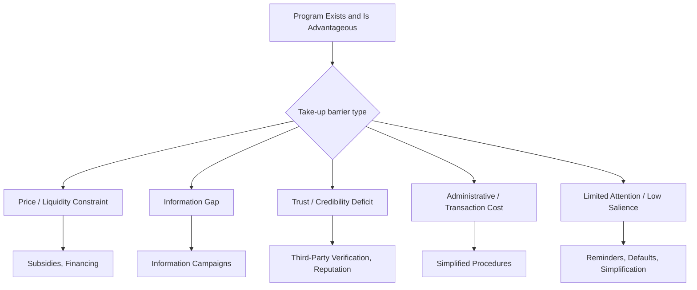

## Limited Attention and Take-Up of Programs

### Overview

A persistent puzzle in development economics is that many welfare-improving programs—subsidized health products, cash transfers, insurance, agricultural inputs—exhibit low take-up even when they are heavily subsidized, financially attractive, or even free. Limited attention models explain part of this gap by treating attention itself as a scarce cognitive resource that must be allocated across competing demands, rather than assuming individuals process all available information and options with equal, full rationality. This reframes "low take-up" from being solely a signal of low demand or hidden costs to potentially being a byproduct of inattention, salience failures, and complexity, with direct implications for program design (defaults, reminders, simplification) distinct from price-based policy levers.

### Theoretical Foundations: Attention as a Scarce Resource

**Key Points**

- Standard rational-choice models assume agents costlessly process all relevant information when making decisions. Limited-attention models relax this by positing that attention/processing information itself carries a cognitive cost, so agents rationally (or quasi-rationally) allocate attention selectively.
- **Rational inattention** (formalized by Christopher Sims and later Filip Matějka, among others) models attention allocation as an optimization problem where agents choose how precisely to observe/process different signals, subject to an information-processing cost, rather than either observing everything perfectly or nothing at all.
- **Salience theory** (Bordalo, Gennaioli, Shleifer) proposes that attention is disproportionately drawn to attributes of a choice that are unusual or stand out relative to a comparison set, which can distort decisions even when all relevant information is technically available.
- In development contexts specifically, limited attention interacts with scarcity/bandwidth effects (see the scarcity mindset literature): individuals managing acute resource constraints may have systematically less residual attention available for programs that are not immediately salient or urgent, even when those programs would be beneficial.

### Distinguishing Inattention from Other Take-Up Barriers

Low program take-up in development settings can result from several distinct mechanisms, which are important to disentangle for accurate diagnosis and policy design.

**Key Points**

- **Price/liquidity barriers:** The program requires an upfront cost the household cannot afford, even if net expected value is positive.
- **Information barriers:** The household does not know the program exists, or holds incorrect beliefs about its costs, benefits, or eligibility.
- **Trust/credibility barriers:** The household is aware of the program but doubts the provider's reliability (e.g., skepticism that an insurance payout will actually be made).
- **Administrative/transaction cost barriers:** Complex enrollment procedures, required documentation, or travel time impose a real (though often small in absolute terms) cost that is disproportionately burdensome.
- **Limited attention/salience barriers:** The household is generally aware the program exists and could benefit but does not act because the program never becomes sufficiently salient relative to competing, more urgent demands on their attention at the moment a decision or action is required.

Careful evaluation designs attempt to isolate the attention channel specifically by holding price and eligibility constant while varying only the *salience or timing* of information (e.g., reminders sent at different times, or default enrollment vs. active opt-in), since these manipulations should have no effect under a pure rational-agent model with no attention costs.

### Empirical Evidence on Attention-Based Take-Up Failures

**Example: Fertilizer Take-Up and Reminders (Duflo, Kremer, Robinson, Kenya)**

Field experiments on fertilizer adoption among smallholder farmers in Kenya found that offering farmers the option to pre-commit to purchasing fertilizer immediately after harvest (when cash is relatively available) substantially increased adoption relative to leaving the same purchase decision to the planting season, even though the financial terms offered were otherwise comparable or less generous.

- This result is interpreted as evidence that limited attention/present bias, not lack of access to fertilizer or lack of profitability information, was a binding constraint: farmers intended to buy fertilizer but their attention and resolve dissipated by the time the purchase decision arrived at planting season.
- **[Inference]** Because this study is also frequently cited as evidence of present bias/self-control problems rather than pure inattention, the precise decomposition between "forgot/wasn't attending to it" versus "remembered but discounted the future purchase too heavily" is not fully separable from this design alone; the two behavioral mechanisms are conceptually distinct but often co-occur and are difficult to disentangle with observational or single-treatment-arm data.

**Example: SMS Reminders for Savings**

Several RCTs (e.g., Karlan, McConnell, Mullainathan, Zinman, various contexts) test whether simple SMS reminders about savings goals increase account balances, without changing the underlying financial terms of the savings product.

- Reminder messages that referenced a specific savings goal (rather than a generic reminder) tended to produce larger effects, consistent with an attention/salience mechanism rather than a pure information-provision mechanism (since account holders already knew the account existed).
- Effects are generally modest in absolute magnitude but often cost-effective given the very low marginal cost of an SMS message relative to the size of the behavior change achieved.

**Example: Health Product Take-Up (Deworming, Chlorination, Bed Nets)**

Take-up of subsidized or free preventive health products in many contexts (e.g., deworming pills, water chlorination dispensers, insecticide-treated bed nets) has been found to be highly sensitive to small changes in the immediate convenience and salience of access, such as the physical distance to a distribution point or whether a product is available exactly at the moment of a routine activity (e.g., placing chlorine dispensers directly at a shared water source).

- **[Inference]** The precise share of variance in these documented take-up gaps attributable to attention/salience versus small implicit time or effort costs is contested in the literature; some researchers interpret dramatic drop-offs in usage at small distances as evidence of extremely high (and behaviorally puzzling) implicit costs of time, while others emphasize this as a signature of attention/procrastination effects rather than genuine time-cost valuation, since revealed time costs from this literature often appear far higher than plausible wage-based valuations of time.

### Mechanisms Linking Attention to Present Bias and Procrastination

**Key Points**

- Present-biased preferences (hyperbolic discounting) and limited attention are theoretically distinct but empirically intertwined: a present-biased agent may rationally choose to defer a beneficial action, and this deferred action becomes vulnerable to being "crowded out" by attention to more urgent, immediate demands when the deferred moment arrives (a dynamic sometimes termed the "procrastination-inattention" complex).
- Naive present bias (failing to anticipate one's own future procrastination) compounds the attention problem, since an agent who believes they will "remember and follow through later" has no reason to take low-cost commitment actions (e.g., setting a reminder, pre-committing funds) in the present.
- This theoretical linkage motivates the frequent pairing, in program design, of reminders (targeting the attention channel) with commitment devices (targeting the present-bias channel), since interventions targeting only one channel may be insufficient if both are simultaneously binding.

### Program Design Responses to Limited Attention

**Key Points**

- **Defaults and automatic enrollment:** Switching from an opt-in to an opt-out enrollment structure (where individuals are automatically enrolled unless they actively decline) shifts the attentional burden from the point of enrollment to the point of exit, and has been shown in multiple contexts (retirement savings, insurance) to substantially raise participation without changing underlying financial incentives.
- **Simplification of choice architecture:** Reducing the number of steps, forms, or decision points required to access a program lowers the attentional load required to complete take-up, distinct from lowering its monetary cost.
- **Well-timed reminders:** Sending reminders close to the moment of relevant action (e.g., just before a payment is due, or just after a harvest when cash is available) rather than far in advance, since attention/salience decays with the time elapsed between exposure to information and the decision point.
- **Physical/temporal bundling:** Co-locating a desired behavior with an already-salient, high-frequency activity (e.g., chlorine dispensers at water collection points, vaccination reminders bundled with other routine health visits) leverages existing attentional habits rather than requiring the creation of a new one.
- **Reducing the number of competing asks:** Because attention is a shared, scarce resource across multiple simultaneous programs or asks targeting the same population, coordinating the timing and volume of outreach (e.g., not sending multiple unrelated reminders in the same week) can improve the effectiveness of any single message.

### Measurement and Identification Challenges

**Key Points**

- Distinguishing a limited-attention effect from a pure information effect requires experimental variation that holds informational content constant while varying only salience, timing, or delivery format (e.g., identical information delivered as a one-time flyer vs. a repeated reminder).
- Observational declines in take-up over time following an initial announcement are consistent with both inattention (the household forgot) and genuine preference reassessment (the household reconsidered and decided against participation), and are difficult to distinguish without a randomized re-exposure or reminder arm.
- Because reminder and default effects are typically modest in percentage-point terms per unit, but very low-cost to implement, cost-effectiveness (rather than raw effect size) is the standard metric used to evaluate whether an attention-based intervention is worth scaling, following the broader emphasis in the "nudge"/behavioral public policy literature on comparing marginal cost per unit of behavior change across intervention types.

### Policy Implications

**Key Points**

- Persistently low take-up of a demonstrably beneficial, low-cost program should not automatically be interpreted as evidence of low true demand; program evaluators increasingly test low-cost attention-based interventions (reminders, defaults, simplification) before concluding that a program is simply undesired by the target population.
- Attention-based interventions are generally most effective as a complement to, not a substitute for, addressing genuine price, trust, or structural barriers; if take-up is low primarily due to a real affordability constraint, no amount of reminder messaging will resolve it.
- Given the low marginal cost of many attention-based interventions (SMS reminders, default enrollment rule changes, physical repositioning of a product), they are frequently highly cost-effective relative to price subsidies at the margin, making them attractive complements to standard program design.

### Diagram: Attention Decay and Reminder Timing (svg_diagram)

<svg xmlns="http://www.w3.org/2000/svg" viewBox="0 0 700 340">
<text x="350" y="24" text-anchor="middle" font-size="15" font-weight="bold" fill="#1a1a1a">Attention Decay and Reminder Timing (svg_diagram)</text>
<line x1="70" y1="290" x2="640" y2="290" stroke="#333" stroke-width="1.5" />
<line x1="70" y1="290" x2="70" y2="60" stroke="#333" stroke-width="1.5" />
<text x="355" y="320" text-anchor="middle" font-size="12" fill="#333">Time Since Information Exposure</text>
<text x="30" y="175" text-anchor="middle" font-size="12" fill="#333" transform="rotate(-90 30 175)">Salience / Attention</text>
<path d="M90 90 Q 200 260 330 280" fill="none" stroke="#3b5bdb" stroke-width="2.5" />
<text x="150" y="80" font-size="11" fill="#3b5bdb">Initial exposure decays</text>
<line x1="330" y1="280" x2="330" y2="180" stroke="#0ca678" stroke-width="1.5" stroke-dasharray="3,3" />
<path d="M330 180 Q 400 90 560 100" fill="none" stroke="#0ca678" stroke-width="2.5" />
<text x="400" y="70" font-size="11" fill="#0ca678">Reminder restores salience</text>
<circle cx="330" cy="180" r="4" fill="#0ca678" />
<text x="330" y="300" text-anchor="middle" font-size="10.5" fill="#087f5b">Reminder sent</text>
<line x1="560" y1="100" x2="560" y2="290" stroke="#c2255c" stroke-width="1.2" stroke-dasharray="3,3" />
<text x="560" y="305" text-anchor="middle" font-size="10.5" fill="#a61e4d">Decision point</text>
</svg>

### Related Topics

- Rational inattention models (Sims, Matějka)
- Present bias, naivete, and commitment devices
- Default effects and opt-out program design
- SMS/digital nudges in health and financial inclusion programs
- Scarcity mindset and bandwidth constraints (complementary mechanism)
- Cost-effectiveness analysis of behavioral vs. price-based interventions
- Take-up puzzles in health product distribution (deworming, chlorination, bed nets)
- Choice architecture and the nudge framework (Thaler & Sunstein)