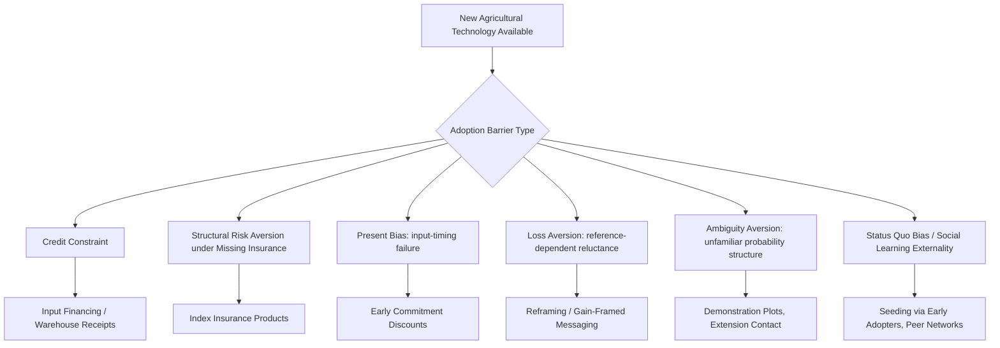

## Behavioral Biases in Agricultural Decision-Making

### Overview

Smallholder farmers in developing economies make complex, high-stakes, sequential decisions—input purchases, planting timing, crop choice, storage, and sale—under conditions of significant risk, incomplete markets, and thin buffers against shocks. Behavioral development economics documents systematic deviations from the standard expected-utility-maximizing farmer model in this setting, including present bias, loss aversion, limited attention, and status quo bias. These biases interact with structural constraints (missing insurance and credit markets) in ways that can jointly explain persistently low adoption of profitable technologies, a puzzle often termed the **agricultural technology adoption gap**.

### The Technology Adoption Puzzle

**Key Points**

- A substantial body of field-experimental evidence documents that many agricultural technologies with high estimated average returns (improved seed varieties, fertilizer, irrigation methods) exhibit surprisingly low and slow adoption rates among smallholder farmers, even after controlling for credit access and basic information provision.
- Standard explanations (credit constraints, risk aversion under missing insurance markets, learning frictions about a new technology's true return) explain part, but not all, of the observed gap in many studies.
- Behavioral explanations—present bias affecting input-timing decisions, limited attention to information or reminders, and loss aversion around experimentation with an unfamiliar technology—have been proposed and tested as complementary mechanisms.

### Present Bias in Input Timing

**Example: Fertilizer Adoption in Kenya (Duflo, Kremer, Robinson)**

A well-known field experiment offered farmers a small, time-limited discount on fertilizer delivered either immediately after harvest (when cash was relatively abundant) or closer to planting season (when cash was typically scarcer and other demands competed for funds).

- Farmers offered the option to commit to fertilizer purchase early, right after harvest, purchased fertilizer at significantly higher rates than farmers offered the same or better terms at planting time.
- This pattern is consistent with **present-biased preferences**: farmers intend to invest in fertilizer but repeatedly defer the decision as planting season approaches, at which point competing, more urgent demands on scarce cash crowd out the input purchase.
- The intervention—a small, time-limited discount offered early, functioning as a soft commitment device—produced adoption gains comparable in magnitude to a much larger price subsidy offered at planting time, suggesting behavioral timing frictions were a economically significant, previously under-appreciated barrier relative to price alone.

**[Inference]** As noted in the broader present-bias/attention literature, this study's design (a single behavioral commitment intervention) cannot fully separate a pure present-bias/self-control interpretation from a pure limited-attention/forgetting interpretation, since both predict similar patterns in this specific design; subsequent literature has generally treated the two mechanisms as related but conceptually distinct, often co-occurring in this domain.

### Loss Aversion and Reluctance to Adopt New Technology

**Key Points**

- Loss aversion (the tendency to weigh losses more heavily than equivalently-sized gains, per prospect theory) predicts that farmers may be disproportionately deterred from adopting a new technology by the *possibility* of a below-average harvest under the new method, even when the new technology's *expected* yield exceeds that of the traditional method.
- This can produce rational-seeming reluctance to switch away from a familiar technology with a known, narrower distribution of outcomes, even when a formal expected-value calculation favors switching—distinct from standard risk aversion, because loss aversion is defined specifically relative to a reference point (typically the status quo or an expected/customary yield), not simply the variance of outcomes.
- Framing experiments that present the same probabilistic yield information in "gain" terms (e.g., "typically produces X more than traditional seed") versus "loss" terms (e.g., "has a Y% chance of underperforming traditional seed in a bad year") have been used to test whether loss-averse framing effects influence stated willingness to adopt, independent of any change in the underlying statistical information provided.

**[Inference]** The magnitude and external validity of loss-aversion effects specifically (as opposed to standard risk aversion under missing insurance markets, which produces qualitatively similar predictions in many settings) in real-world technology adoption decisions is harder to cleanly identify than in controlled lab or framing experiments, because field settings rarely allow the reference point and the objective probability distribution to be manipulated independently of one another.

### Status Quo Bias and Default Effects in Input Choice

**Key Points**

- Farmers often continue using traditional seed varieties, planting dates, or techniques passed down through family or community practice, even when alternatives are available at comparable or subsidized cost, consistent with a status-quo bias mechanism (a general preference for the default or currently-held option, independent of a rational switching-cost calculation).
- Distinguishing status quo bias from *rational* persistence (e.g., justified skepticism based on the community's own limited or negative prior experience with a new technology, or genuine switching costs such as the need to relearn cultivation practices) requires careful experimental design; simply observing low adoption of an "objectively superior" input does not by itself establish behavioral bias, since the farmer may possess private information not captured by the researcher's yield data.
- Social learning models (e.g., Foster and Rosenzweig's classic work on ceiling learning-by-doing and social learning in the Green Revolution) provide a complementary, non-behavioral explanation: farmers rationally under-invest in experimentation with a new technology while awaiting information from early adopters' outcomes, since individual experimentation carries a private cost but generates a partly-public information good for neighbors (a natural experimentation externality).

### Risk Aversion, Missing Insurance, and Behavioral Amplification

**Key Points**

- In the absence of formal crop or weather insurance, standard (non-behavioral) risk aversion alone can rationally deter adoption of technologies with higher expected but more variable returns, since a bad realization could push a subsistence-level household below a critical consumption threshold.
- Behavioral biases (loss aversion, narrow framing/mental accounting of the agricultural investment as an isolated risky bet rather than integrated with the household's full portfolio of income sources) can amplify this structural risk-aversion effect beyond what standard expected-utility risk aversion alone would predict.
- **Example:** Index-based weather insurance products have been tested extensively (e.g., in India, Ghana, Kenya) as a structural remedy to the risk-aversion barrier; however, take-up of these products has itself often been surprisingly low, which researchers attribute to a combination of basis risk (the insurance payout may not match the individual farmer's actual loss), limited trust in unfamiliar financial products, complexity/limited attention, and ambiguity aversion (a distinct bias reflecting discomfort with poorly-understood probability structures, as opposed to known-probability risk).

### Ambiguity Aversion in Novel Technology Contexts

**Key Points**

- Ambiguity aversion describes a preference for known-probability risks (e.g., a familiar seed variety with a well-understood historical yield distribution) over unknown-probability or poorly-understood risks (e.g., a genuinely novel technology whose true risk profile the farmer cannot yet estimate with confidence)—distinct from standard risk aversion, which applies even to known probability distributions.
- Ambiguity aversion is theorized to be a particularly relevant barrier to the *initial* adoption of unfamiliar agricultural technologies (new hybrid seeds, unfamiliar mechanization, novel storage techniques), predicting that farmers may rationally wait for more information (from demonstration plots, extension agents, or observed neighbor outcomes) before committing meaningful land or capital, even beyond what standard risk-based models would predict.
- Extension programs and agricultural demonstration plots can be understood partly as tools for reducing ambiguity (converting an unknown-probability decision into a better-characterized, known-probability decision) in addition to their standard role as information-provision mechanisms.

### Storage, Sale Timing, and Present Bias

**Key Points**

- Many smallholder farmers sell a large share of their harvest immediately post-harvest, when prices are typically at their seasonal low, rather than storing grain for sale later in the season when prices are typically higher—a pattern partly explained by immediate liquidity needs (debt repayment, urgent consumption needs) but also studied as a potential present-bias/self-control phenomenon, since storing grain requires resisting the temptation to sell or consume it immediately.
- Storage itself can carry non-trivial risk (pest damage, spoilage, theft), meaning that observed "suboptimal" early selling may in some cases be a rational response to storage-related structural risk rather than a behavioral bias; disentangling the two again requires careful experimental variation (e.g., providing improved, low-cost storage technology and measuring whether sale-timing behavior changes).
- **Example:** Studies providing farmers with hermetic storage bags (which reduce pest/spoilage losses at low cost) in several African contexts have found increased storage duration and later, higher-price sales among farmers who received the technology relative to controls, supporting the interpretation that a meaningful share of early-selling behavior was driven by storage-risk constraints that the improved technology relaxed, though behavioral (self-control/present-bias) explanations for any residual early selling that persists even with reliable storage available are also discussed in this literature.

### Mental Accounting and Labeling of Agricultural Income

**Key Points**

- Mental accounting (Thaler)—the tendency to treat money differently depending on its source or intended use, rather than as fully fungible—has been studied in agricultural contexts where harvest income, off-farm wage income, and remittances may be mentally "earmarked" for different purposes (input purchases vs. consumption vs. savings), even though standard economic theory predicts money should be fungible across these uses.
- **Example:** Interventions that label a cash transfer or savings account specifically for agricultural inputs (a form of externally-imposed mental accounting) have in some studies been shown to increase the share of funds actually spent on inputs relative to unlabeled cash of equivalent value, consistent with the mental accounting framework providing a low-cost behavioral lever distinct from the pure income effect of the transfer.

### Policy and Program Design Implications

**Key Points**

- **Timing input-purchase commitments and discounts around harvest** (when farmers have cash on hand) rather than planting season, leveraging the present-bias/liquidity interaction documented in fertilizer adoption studies.
- **Pairing new technology introduction with risk-mitigation tools** (index insurance, buy-back guarantees, money-back trial periods) to address both structural risk aversion and behavioral loss/ambiguity aversion simultaneously.
- **Using demonstration plots and peer/early-adopter networks** to reduce ambiguity and leverage social learning, recognizing that pure information provision (e.g., a one-time lecture on expected yields) is often less effective than sustained, socially-embedded exposure to a technology's real-world performance.
- **Providing low-cost storage technology** as a complement to (not substitute for) price-timing behavioral nudges, since a meaningful share of early-selling behavior in several studied contexts appears to reflect genuine storage-risk constraints rather than pure impatience.
- **Labeling and earmarking transfers or savings for agricultural inputs**, leveraging mental accounting as a low-cost behavioral lever to increase the share of funds directed toward productive investment.

### Diagram: Present Bias in the Farming Cycle (svg_diagram)

<svg xmlns="http://www.w3.org/2000/svg" viewBox="0 0 720 300">
<text x="360" y="24" text-anchor="middle" font-size="15" font-weight="bold" fill="#1a1a1a">Present Bias in the Farming Cycle (svg_diagram)</text>
<line x1="60" y1="150" x2="660" y2="150" stroke="#333" stroke-width="1.5" marker-end="url(#arrow3)" />
<circle cx="120" cy="150" r="8" fill="#0ca678" />
<text x="120" y="180" text-anchor="middle" font-size="11" fill="#087f5b">Harvest</text>
<text x="120" y="130" text-anchor="middle" font-size="10.5" fill="#087f5b">Cash available</text>
<text x="120" y="115" text-anchor="middle" font-size="10.5" fill="#087f5b">Intends to buy fertilizer</text>
<circle cx="400" cy="150" r="8" fill="#e8590c" />
<text x="400" y="180" text-anchor="middle" font-size="11" fill="#a15c00">Lean Season</text>
<text x="400" y="130" text-anchor="middle" font-size="10.5" fill="#a15c00">Competing urgent needs</text>
<text x="400" y="115" text-anchor="middle" font-size="10.5" fill="#a15c00">Attention/funds diverted</text>
<circle cx="600" cy="150" r="8" fill="#c2255c" />
<text x="600" y="180" text-anchor="middle" font-size="11" fill="#a61e4d">Planting</text>
<text x="600" y="130" text-anchor="middle" font-size="10.5" fill="#a61e4d">No fertilizer purchased</text>
<path d="M120 150 Q 260 60 400 150" fill="none" stroke="#3b5bdb" stroke-width="1.5" stroke-dasharray="4,3" />
<text x="260" y="70" text-anchor="middle" font-size="10.5" fill="#3b5bdb">Early commitment discount intervenes here</text>
</svg>

### Related Topics

- Present bias, hyperbolic discounting, and commitment devices
- Loss aversion and prospect theory (Kahneman & Tversky)
- Ambiguity aversion and Ellsberg-type decision problems
- Index-based weather insurance: design and take-up puzzles
- Social learning and technology diffusion (Foster & Rosenzweig)
- Mental accounting and labeled cash transfers/savings
- Post-harvest loss reduction and storage technology adoption
- Limited attention and reminders in agricultural extension programs