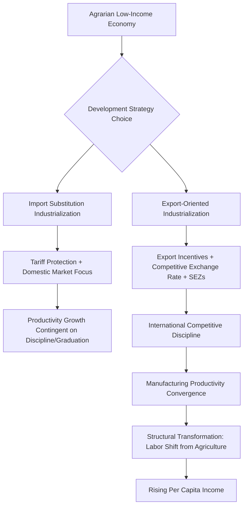

## Manufacturing-Led Development Strategies

### Overview

Manufacturing-led development strategies posit that a country's transition from low-income agrarian status to middle- and high-income status is driven primarily by the expansion of the manufacturing sector, which is theorized to possess distinctive structural properties—high productivity growth potential, strong linkages to other sectors, capacity for absorbing low-skilled labor at scale, and tradability enabling export-led growth—that other sectors (agriculture, traditional services) do not equally share. This framework underpins the historical development trajectories of East Asian economies (Japan, South Korea, Taiwan, and later China) and remains central to debates about growth strategy in low-income countries today, particularly amid concerns about "premature deindustrialization."

### Theoretical Rationale for Manufacturing's Special Role

**Key Points**

- **Unconditional convergence property:** Empirical work by Dani Rodrik and others has documented that manufacturing subsectors tend to exhibit labor productivity convergence toward the global frontier *regardless* of a country's broader institutional quality, human capital, or macroeconomic environment—a pattern not observed to the same degree in agriculture or services. This makes manufacturing an unusually reliable engine of productivity catch-up even in weak institutional settings.
- **Learning-by-doing and technology absorption:** Manufacturing processes, particularly in globally-integrated supply chains, provide structured opportunities for workers and firms to absorb codified technology and process knowledge from more advanced economies (e.g., via multinational subsidiaries, licensing agreements, or contract manufacturing arrangements).
- **Labor absorption capacity:** Manufacturing, especially in labor-intensive stages (garments, footwear, electronics assembly), can absorb large numbers of low-skilled workers transitioning out of low-productivity agriculture, a critical channel for structural transformation in labor-abundant developing economies.
- **Tradability and export discipline:** Manufactured goods are generally more tradable than most services, meaning firms are subject to international competitive discipline, which can accelerate productivity growth and prevent the domestic market-size constraints that limit growth in non-tradable sectors.
- **Backward and forward linkages:** Manufacturing sectors, particularly in sectors like machinery, electronics, and automobiles, tend to generate substantial input demand from upstream suppliers (backward linkages) and enable downstream productivity gains (forward linkages), consistent with the older structuralist emphasis (Hirschman) on linkage effects as a criterion for prioritizing sectors in development strategy.

### Historical Models: East Asian Export-Oriented Industrialization

**Key Points**

- **Japan (postwar) and the "flying geese" pattern:** A framework (originally articulated by Kaname Akamatsu) describing how industries migrate sequentially across a region as a lead economy moves up the value chain, vacating labor-intensive manufacturing niches that are then occupied by successively less-developed economies (Japan → South Korea/Taiwan → China/Southeast Asia).
- **South Korea and Taiwan:** Pursued a strategy combining selective industrial policy (directed credit, export subsidies, protection of targeted infant industries subject to export performance requirements) with aggressive integration into global export markets, a combination sometimes termed **export-oriented industrialization (EOI)**, distinguished from purely inward-looking import-substitution strategies.
- **China (post-1978 reform era):** Leveraged an enormous low-cost labor pool, special economic zones, foreign direct investment inflows, and integration into global manufacturing supply chains to become the world's largest manufacturing exporter, achieving historically unprecedented poverty reduction alongside this transformation.
- **[Inference]** The extent to which East Asian success is attributable primarily to *manufacturing-specific* industrial policy (as opposed to broader factors such as high savings/investment rates, strong human capital investment, favorable initial land distribution, and geopolitical circumstances of the Cold War era) remains actively debated in the development economics literature; the "East Asian Miracle" (World Bank, 1993) itself represented a contested synthesis of market-friendly and interventionist interpretations of this same historical experience.

### Import Substitution Industrialization (ISI) vs. Export-Oriented Industrialization (EOI)

**Key Points**

- **Import Substitution Industrialization (ISI):** A strategy, dominant in Latin America and parts of South Asia from the 1950s–1970s, involving high tariff and non-tariff protection for domestic manufacturers producing goods previously imported, justified partly by "infant industry" arguments (protecting nascent domestic firms until they achieve competitive scale) and partly by terms-of-trade pessimism regarding primary commodity exports (associated with the Prebisch-Singer hypothesis).
- **Export-Oriented Industrialization (EOI):** A strategy prioritizing production for external markets, often combined with policies to keep exchange rates competitive, provide export-linked incentives, and expose domestic firms to international competitive pressure as a discipline mechanism.
- **Comparative outcomes:** Cross-country comparisons, particularly contrasting Latin American ISI experiences with East Asian EOI experiences over the 1960s–1980s, generally find that ISI economies experienced slower productivity growth and periodic balance-of-payments crises, while EOI economies achieved more sustained rapid growth—though this comparison is complicated by numerous confounding factors (differing initial conditions, human capital levels, land reform history, and Cold War-era financial flows).
- **[Inference]** Whether ISI's comparatively weaker outcomes stemmed primarily from the strategy's core substitution logic itself, versus from specific implementation failures (excessive and permanent, rather than temporary and performance-linked, protection; overvalued exchange rates; weak fiscal discipline), is a matter of ongoing historical and theoretical debate rather than settled consensus, with some scholars (e.g., in the industrial policy revival literature) arguing that well-designed, performance-linked protection can be compatible with successful industrialization.

### Industrial Policy Tools Associated with Manufacturing-Led Strategies

**Key Points**

- **Directed credit:** State-directed or subsidized lending channeled toward targeted manufacturing sectors, often via development banks, as used extensively in South Korea's chaebol-led industrialization.
- **Export subsidies and performance requirements:** Financial or tax incentives conditioned on firms achieving specific export targets, intended to combine industrial support with market-discipline via international competition (a hallmark distinguishing East Asian industrial policy from unconditional ISI protection).
- **Special Economic Zones (SEZs):** Geographically bounded areas with distinct regulatory, tax, and infrastructure regimes designed to attract export-oriented manufacturing investment (e.g., Shenzhen in China, export processing zones in Bangladesh and Vietnam).
- **Exchange rate management:** Maintaining a competitive (often undervalued) real exchange rate to support export competitiveness, a policy lever associated with Dani Rodrik's empirical work linking undervaluation to faster growth in developing economies, though this tool carries its own macroeconomic tradeoffs (inflationary pressure, reserve accumulation costs).
- **Infrastructure and logistics investment:** Targeted investment in ports, power, and transport infrastructure to reduce the trade and production costs specific to manufacturing supply chains.

### The "Premature Deindustrialization" Debate

**Key Points**

- Dani Rodrik's concept of **premature deindustrialization** describes a pattern in which many contemporary developing economies see manufacturing's share of employment and GDP peak and decline at a much lower level of per capita income than was historically the case for early industrializers (UK, US, Japan, South Korea).
- Proposed explanatory factors include: globalization-driven competitive pressure from China's dominant low-cost manufacturing base; skill-biased and labor-saving automation reducing the labor-intensity of manufacturing even in developing countries; and a global shift in trade and technology patterns that has structurally altered manufacturing's traditional role as an easy entry point for labor-abundant economies.
- **Implication:** If premature deindustrialization is a durable structural phenomenon rather than a temporary cyclical pattern, it raises the question of whether contemporary low-income countries can still rely on manufacturing-led strategies to the same degree that East Asian economies did in the 20th century, motivating research and policy interest in alternative or complementary pathways (services-led growth, agricultural productivity-led transformation).
- **[Inference]** The extent to which premature deindustrialization is genuinely a barrier to development (as opposed to a relatively benign reflection of technology-driven productivity gains within manufacturing itself, which can raise output without proportionally raising employment shares) is contested; some economists argue that focusing on manufacturing's *output* share (which has not necessarily declined as sharply as its *employment* share in many cases) suggests the phenomenon may be less concerning for aggregate growth than its effect on labor absorption specifically.

### Services-Led Alternatives and Complementary Debates

**Key Points**

- Given premature deindustrialization concerns, some development economists (e.g., discussions associated with the work of Ejaz Ghani and others) have explored whether certain tradable services (business process outsourcing, IT services, as in India's software sector) can substitute for manufacturing's traditional role as an engine of productivity convergence and export-led growth.
- **[Inference]** Whether tradable services can replicate manufacturing's historical capacity to absorb *large numbers of low-skilled workers* at scale (as opposed to primarily generating employment for more skilled, often urban, workers) is a key point of skepticism in this debate; many high-productivity tradable services (software, finance) tend to be significantly more skill-intensive than labor-intensive manufacturing was during the East Asian take-off period, raising concerns about the inclusiveness of a services-led pathway relative to a manufacturing-led one.
- Agricultural productivity growth is also discussed as a complementary (not purely alternative) pathway, since historically, productivity gains in agriculture have often preceded and enabled labor release into manufacturing during structural transformation, meaning "manufacturing-led" strategies in practice have rarely operated in isolation from concurrent agricultural modernization.

### Risks and Critiques of Manufacturing-Led Strategy

**Key Points**

- **Middle-income trap risk:** Manufacturing-led growth strategies that rely primarily on low labor costs may plateau once wage levels rise, if the economy has not concurrently developed the human capital, innovation capacity, and institutional quality needed to move up the value chain into higher-skill manufacturing or services.
- **Environmental and labor standards concerns:** Rapid manufacturing-led growth has historically often been accompanied by significant environmental externalities and, in some contexts, labor condition concerns, raising normative questions about growth-strategy design beyond pure productivity metrics.
- **Political economy risks of industrial policy:** Directed credit and protection schemes carry a risk of capture by politically connected firms without the accompanying performance discipline (export requirements, sunset clauses) that distinguished the more successful East Asian cases from many less successful ISI experiences elsewhere.
- **Automation and reshoring pressures:** Increasing automation in manufacturing processes may reduce the labor-cost advantage that has historically attracted labor-intensive manufacturing investment to low-wage developing economies, a structural headwind relevant to premature deindustrialization discussions above.

### Policy Implications for Contemporary Low-Income Countries

**Key Points**

- Combining export orientation with performance-linked (rather than unconditional and indefinite) industrial support appears, based on the comparative historical record, more consistently associated with successful outcomes than purely protectionist, domestically-oriented approaches.
- Complementary investment in human capital, infrastructure, and institutional quality is broadly regarded as necessary for manufacturing-led growth to translate into sustained upgrading rather than a plateau at low-value-added assembly activities.
- Given premature deindustrialization risks, many contemporary development strategies increasingly emphasize a diversified structural transformation approach—simultaneously pursuing agricultural productivity gains, targeted manufacturing niches (particularly in labor-intensive segments still viable given a country's comparative advantage), and selected tradable services—rather than relying exclusively on a manufacturing-led model modeled strictly on the historical East Asian sequence.

### Diagram: Manufacturing's Structural Transformation Role (svg_diagram)

<svg xmlns="http://www.w3.org/2000/svg" viewBox="0 0 720 320">
<text x="360" y="24" text-anchor="middle" font-size="15" font-weight="bold" fill="#1a1a1a">Manufacturing's Structural Transformation Role (svg_diagram)</text>
<rect x="30" y="60" width="180" height="60" rx="8" fill="#e8f0fe" stroke="#3b5bdb" stroke-width="1.5" />
<text x="120" y="95" text-anchor="middle" font-size="12" fill="#1a1a1a">Low-Productivity Agriculture</text>
<path d="M210 90 L270 90" stroke="#555" stroke-width="1.5" marker-end="url(#arrow4)" />
<rect x="270" y="60" width="180" height="60" rx="8" fill="#fff3e0" stroke="#e8590c" stroke-width="1.5" />
<text x="360" y="85" text-anchor="middle" font-size="12" fill="#1a1a1a">Labor-Intensive</text>
<text x="360" y="102" text-anchor="middle" font-size="12" fill="#1a1a1a">Manufacturing</text>
<path d="M450 90 L510 90" stroke="#555" stroke-width="1.5" marker-end="url(#arrow4)" />
<rect x="510" y="60" width="180" height="60" rx="8" fill="#e6fcf5" stroke="#0ca678" stroke-width="1.5" />
<text x="600" y="85" text-anchor="middle" font-size="12" fill="#1a1a1a">Higher Value-Added</text>
<text x="600" y="102" text-anchor="middle" font-size="12" fill="#1a1a1a">Manufacturing / Services</text>

<text x="360" y="150" text-anchor="middle" font-size="11" fill="#555" font-style="italic">Convergence driven by: tradability, learning-by-doing, linkages</text>

<rect x="150" y="190" width="420" height="90" rx="8" fill="#fce4ec" stroke="#c2255c" stroke-width="1.5" />
<text x="360" y="215" text-anchor="middle" font-size="12" font-weight="bold" fill="#a61e4d">Risk: Premature Deindustrialization</text>
<text x="360" y="235" text-anchor="middle" font-size="10.5" fill="#a61e4d">Peak manufacturing share occurs at lower</text>
<text x="360" y="250" text-anchor="middle" font-size="10.5" fill="#a61e4d">income level than historical industrializers</text>
<text x="360" y="265" text-anchor="middle" font-size="10.5" fill="#a61e4d">(automation, China competition, trade shifts)</text>
</svg>

### Related Topics

- Structural transformation and the Lewis dual-economy model
- Unconditional convergence in manufacturing (Rodrik)
- Import substitution vs. export-oriented industrialization compared
- Special Economic Zones: design and evidence (Shenzhen, Bangladesh, Vietnam)
- Premature deindustrialization and the middle-income trap
- Infant industry protection and performance-linked industrial policy
- Flying geese paradigm and regional production networks
- Services-led growth as an alternative structural transformation pathway