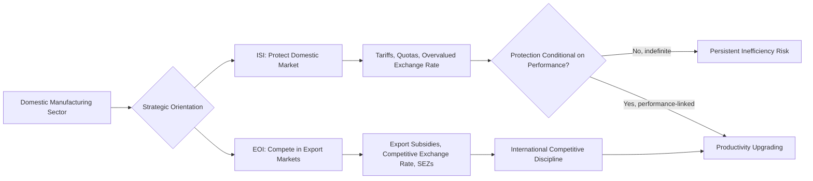

## Export-Oriented Industrialization versus Import Substitution

### Overview

Export-oriented industrialization (EOI) and import substitution industrialization (ISI) represent the two dominant, historically contrasted strategic orientations for structural transformation in developing economies during the mid-to-late 20th century. ISI seeks to build domestic manufacturing capacity by protecting it from foreign competition and substituting domestically produced goods for previously imported ones, while EOI seeks to build manufacturing capacity by orienting production toward external markets, typically combined with exposure to international competitive discipline. The comparative historical performance of these two strategies—broadly associated with Latin American ISI experiences versus East Asian EOI experiences—remains one of the most extensively studied natural experiments in development economics, though causal interpretation remains contested.

### Import Substitution Industrialization (ISI): Core Logic and Tools

**Key Points**

- **Theoretical justification:** ISI drew on two principal arguments: the **infant industry argument** (nascent domestic manufacturers require temporary protection to achieve competitive scale and productivity before facing international competition), and **terms-of-trade pessimism**, associated with the **Prebisch-Singer hypothesis**, which held that countries specializing in primary commodity exports would face a secular decline in their terms of trade relative to manufactured imports, making commodity-export dependence a poor long-run development strategy.
- **Policy instruments:** High tariff and non-tariff barriers (quotas, import licensing) on manufactured goods; multiple or overvalued exchange rates favoring imports of capital goods while discouraging primary-good exports; domestic content requirements; and state ownership or direct subsidization of targeted "strategic" industries (steel, automobiles, chemicals).
- **Geographic prevalence:** Dominant in Latin America (Argentina, Brazil, Mexico) from the 1930s–1980s, promoted institutionally by the UN Economic Commission for Latin America (ECLA/CEPAL) under Raúl Prebisch; also pursued to varying degrees in India, and in parts of Sub-Saharan Africa post-independence.

### Export-Oriented Industrialization (EOI): Core Logic and Tools

**Key Points**

- **Theoretical justification:** EOI is grounded in a comparative-advantage logic (specializing in labor-intensive manufacturing given labor abundance) combined with a market-discipline argument: exposure to international competition forces domestic firms toward continuous productivity improvement, in contrast to protected firms facing only domestic competitors.
- **Policy instruments:** Export subsidies and tax incentives conditioned on export performance; competitive (often managed, undervalued) exchange rates to support export price competitiveness; Special Economic Zones (SEZs) and export processing zones providing streamlined regulatory and tax treatment for export-oriented firms; targeted, performance-linked directed credit (e.g., South Korea's chaebol financing tied to export targets).
- **Geographic prevalence:** Associated with the "East Asian Tigers" (South Korea, Taiwan, Hong Kong, Singapore) from the 1960s onward, and later with China's post-1978 reform-era integration into global manufacturing supply chains, and with Southeast Asian economies (Malaysia, Thailand, Vietnam) in subsequent decades.

### A Critical Nuance: EOI Was Rarely Pure Free Trade

**Key Points**

- A common simplification treats EOI as synonymous with free-market, laissez-faire trade policy and ISI as synonymous with state intervention; this framing is widely regarded in the literature as an oversimplification.
- South Korea and Taiwan, the paradigmatic EOI success cases, employed extensive industrial policy—directed credit, sector-specific protection, and government-coordinated technology transfer—alongside their export orientation; the key distinguishing feature relative to ISI economies is often characterized not as *less* intervention, but as intervention that was **performance-linked and export-disciplined**, with protection or subsidy typically contingent on firms meeting internationally competitive export benchmarks, rather than indefinite and unconditional.
- This nuance is central to the "developmental state" literature (associated with scholars such as Alice Amsden and Robert Wade), which argues that the East Asian experience represents a distinct model of state-guided capitalism rather than a simple validation of neoclassical free-trade orthodoxy.

### Comparative Empirical Performance

**Key Points**

- Cross-country growth comparisons from the 1960s through the 1980s generally document that the East Asian EOI economies achieved substantially higher and more sustained GDP and export growth rates than the major Latin American ISI economies over the same period.
- Latin American ISI economies experienced recurring balance-of-payments crises, associated in part with persistent trade deficits from continued capital-goods imports (needed to sustain protected domestic industries) unmatched by export earnings, culminating for many countries in the debt crises of the early 1980s ("the Lost Decade").
- East Asian EOI economies, by contrast, generally maintained more disciplined macroeconomic management, avoided chronic overvaluation, and built substantial foreign exchange reserves through sustained export growth.
- **[Inference]** While this broad comparative pattern is well-documented, attributing the performance gap causally and exclusively to the ISI/EOI trade-strategy distinction (rather than to differences in land reform history, human capital investment, savings/investment rates, geopolitical Cold War-era financial support, or macroeconomic management quality more broadly) oversimplifies a genuinely contested empirical and historical debate; most serious scholarship treats trade orientation as one significant factor among several correlated and interacting causes rather than a single, isolated causal variable.

### The World Bank's "East Asian Miracle" Debate

**Key Points**

- The World Bank's influential 1993 report, *The East Asian Miracle*, attempted to synthesize the East Asian experience, and became a focal point for the broader ISI/EOI debate.
- One interpretive camp emphasized market-friendly, outward-oriented policies (competitive exchange rates, export discipline, limited price distortion) as the primary drivers of success, broadly consistent with neoclassical trade theory.
- A competing interpretive camp (associated with the developmental state literature) emphasized the centrality of selective industrial policy, directed credit, and state-guided sectoral targeting as equally or more important, arguing the World Bank report understated the role of interventionist policy in favor of a market-friendly narrative more aligned with the institution's broader policy orientation at the time.
- **[Inference]** This interpretive dispute has not been definitively resolved in the subsequent literature and continues to shape contemporary debates about the appropriate role of industrial policy in current developing-economy growth strategies; framing the "lesson" of East Asia as either purely "free trade works" or purely "state intervention works" is generally considered an oversimplification of a more nuanced, hybrid historical reality.

### Structural and Macroeconomic Tradeoffs

**Key Points**

- **ISI tradeoffs:** Protecting domestic industry can support initial capacity-building and employment in targeted sectors, but risks perpetuating inefficiency indefinitely if protection is not time-limited or performance-linked (the so-called "infant industry that never grows up" problem); persistent trade deficits from continued reliance on imported capital goods and intermediate inputs are a recurring structural vulnerability.
- **EOI tradeoffs:** Export orientation exposes the domestic economy to greater volatility from external demand shocks and global commodity/exchange-rate fluctuations; competitive exchange rate management can create domestic distributional tensions (e.g., between export-sector wage earners and import-consuming urban populations) and carries fiscal costs if pursued via reserve accumulation.
- **Exchange rate policy as a shared lever:** Both strategies interact heavily with exchange rate policy—ISI often required overvaluation to cheapen capital-goods imports, while EOI generally required undervaluation to maintain export competitiveness—making exchange rate management a central, contested policy variable across both models.

### Transition Experiences: From ISI to EOI

**Key Points**

- Several countries transitioned from ISI toward more export-oriented strategies over time, notably several Latin American economies (Chile from the 1970s, followed by broader regional liberalization in the 1980s–1990s) and India (post-1991 reforms), often under conditions of balance-of-payments crisis or structural adjustment program conditionality (frequently linked to IMF/World Bank lending).
- **[Inference]** The relative success of these transitions has varied considerably by country and time period, and the extent to which transition outcomes validate a general "ISI-to-EOI transition is beneficial" claim versus reflecting country-specific implementation and sequencing factors (speed of liberalization, accompanying social safety nets, quality of macroeconomic management during transition) remains a debated empirical question rather than a uniformly settled one.

### Contemporary Relevance and Critiques

**Key Points**

- The rise of "premature deindustrialization" (see related topic) has renewed debate over whether the classic EOI model remains fully replicable for contemporary low-income countries, given intensified competition from established manufacturing exporters (particularly China), automation reducing the labor-cost advantage central to labor-intensive EOI strategies, and a more complex global trade and geopolitical environment than existed during the mid-20th-century East Asian take-off.
- Some contemporary industrial-policy scholars advocate for a revived, selectively interventionist approach informed by the EOI experience—performance-linked support, export orientation where feasible, avoidance of indefinite protection—while cautioning against either uncritical free-trade orthodoxy or a simple return to classic ISI, given ISI's generally weaker historical comparative track record.
- The debate also intersects with contemporary industrial policy in advanced economies (e.g., renewed U.S. and EU interest in strategic manufacturing subsidies), raising the question of whether lessons from the ISI/EOI comparative history in developing countries are directly transferable to advanced-economy contexts with different institutional and market conditions.

### Diagram: Divergent Macroeconomic Trajectories (svg_diagram)

<svg xmlns="http://www.w3.org/2000/svg" viewBox="0 0 720 340">
<text x="360" y="24" text-anchor="middle" font-size="15" font-weight="bold" fill="#1a1a1a">Divergent Macroeconomic Trajectories (svg_diagram)</text>
<line x1="70" y1="290" x2="640" y2="290" stroke="#333" stroke-width="1.5" />
<line x1="70" y1="290" x2="70" y2="60" stroke="#333" stroke-width="1.5" />
<text x="355" y="320" text-anchor="middle" font-size="12" fill="#333">Time (1960s onward)</text>
<text x="30" y="175" text-anchor="middle" font-size="12" fill="#333" transform="rotate(-90 30 175)">GDP per Capita (illustrative)</text>
<path d="M90 260 Q 300 140 620 90" fill="none" stroke="#0ca678" stroke-width="2.5" />
<text x="500" y="80" font-size="11" fill="#0ca678" font-weight="bold">EOI (e.g., South Korea)</text>
<path d="M90 265 Q 300 240 460 210 Q 550 195 560 175" fill="none" stroke="#e8590c" stroke-width="2.5" />
<path d="M560 175 Q 590 220 620 250" fill="none" stroke="#e8590c" stroke-width="2.5" stroke-dasharray="4,3" />
<text x="420" y="230" font-size="11" fill="#a15c00" font-weight="bold">ISI (e.g., pre-reform Latin America)</text>
<text x="560" y="270" font-size="10.5" fill="#a15c00">Debt crisis / stagnation</text>
</svg>

### Related Topics

- Prebisch-Singer hypothesis and terms-of-trade theory
- Infant industry argument and performance-linked protection
- Developmental state theory (Amsden, Wade)
- The East Asian Miracle debate (World Bank, 1993)
- Special Economic Zones and export processing zones
- Latin American debt crisis and structural adjustment programs
- Exchange rate management and export competitiveness
- Premature deindustrialization and contemporary industrial policy