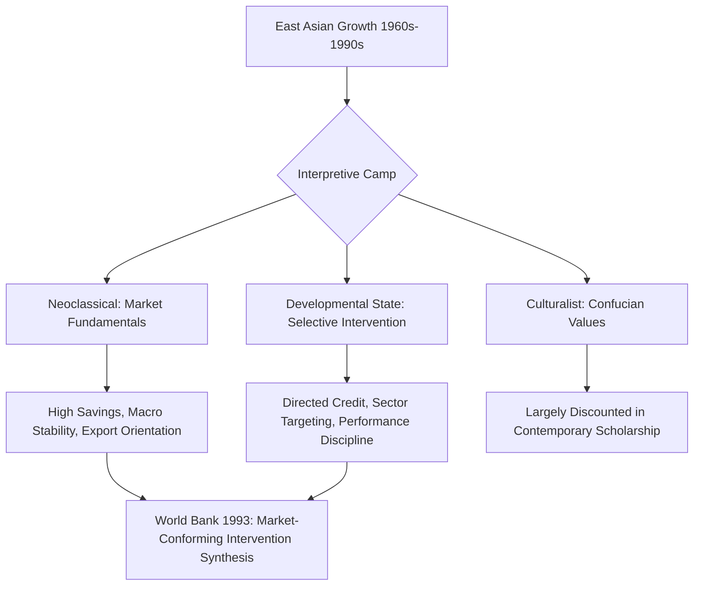

## East Asian Miracle: Policies and Debates

### Overview

The "East Asian Miracle" refers to the sustained, rapid economic growth achieved by a group of East and Southeast Asian economies—principally Japan, South Korea, Taiwan, Hong Kong, and Singapore (the "Four Tigers" plus Japan), and later Malaysia, Thailand, and Indonesia—between roughly the 1960s and the 1990s, during which per capita income growth rates and poverty reduction substantially outpaced most of the rest of the developing world. The term was popularized by the World Bank's 1993 report of the same name, which became the focal point of an enduring and unresolved debate about which specific policies—market-friendly fundamentals or selective state intervention—were principally responsible for this outcome.

### Headline Growth Facts

**Key Points**

- The core Four Tigers (South Korea, Taiwan, Hong Kong, Singapore) sustained average annual GDP growth rates in the range of roughly 6–9% for several consecutive decades, historically unprecedented at the time for economies starting from low-income status.
- This growth was accompanied by dramatic reductions in absolute poverty and substantial improvements in life expectancy, education, and other human development indicators, occurring faster than in almost any other region over a comparable period.
- Growth was also characterized by relatively low income inequality by developing-country standards during the primary growth period, a pattern often attributed partly to broad-based land reform (particularly in South Korea and Taiwan) conducted early in the postwar period, which reduced initial asset inequality before the industrialization take-off.

### The World Bank's 1993 Report: Framing and Findings

**Key Points**

- The 1993 report, produced under pressure from Japan (which had funded the study and favored a more interventionist interpretation), attempted to reconcile two competing explanatory camps within a single document, and is widely regarded as a diplomatically negotiated synthesis rather than a fully unified analytical framework.
- The report acknowledged that these economies pursued substantial government intervention (directed credit, export promotion, selective industrial targeting) but concluded that intervention was successful primarily where it was "market-conforming"—i.e., where it worked with, rather than against, underlying market signals, and was subject to performance-based discipline (particularly export performance requirements).
- The report emphasized several "fundamentals" as necessary conditions regardless of the intervention debate: high rates of physical and human capital investment, macroeconomic stability, export orientation, and relatively competent, technocratic public administration.

### Competing Interpretive Camps

**Key Points**

- **Neoclassical/market-friendly interpretation:** Emphasizes high savings and investment rates, sound macroeconomic management (low inflation, sustainable fiscal policy), export orientation and international competitive exposure, and relatively limited price distortion (moderate real exchange rates, positive real interest rates) as the primary drivers of success—broadly consistent with standard neoclassical growth and trade theory, with government intervention treated as a secondary or largely benign factor.
- **Developmental state/revisionist interpretation:** Associated with scholars such as Alice Amsden (*Asia's Next Giant*, on South Korea) and Robert Wade (*Governing the Market*, on Taiwan), this camp argues that selective, sector-specific industrial policy—directed credit at below-market rates to targeted industries, protection of strategic sectors, government-coordinated technology transfer, and active administrative guidance of investment allocation—was not merely compatible with success but was a central causal driver, deliberately used to "get prices wrong" in a strategic, temporary manner to accelerate industrial upgrading beyond what market signals alone would have produced.
- **Culturalist interpretations:** An older and now less influential body of explanation (popular especially in the 1980s) attributed East Asian success partly to Confucian cultural values (emphasis on education, hierarchy, savings discipline); this explanation is now widely regarded in the academic literature as insufficient on its own, given that similar cultural traditions did not produce comparable growth trajectories in China prior to its own post-1978 reforms, or explain the specific timing and mechanisms of the growth take-off.
- **[Inference]** No single interpretive camp is regarded as having definitively "won" this debate in the subsequent three decades of scholarship; most contemporary treatments acknowledge that both market-oriented fundamentals and selective state intervention were simultaneously present and likely mutually reinforcing, making a clean causal decomposition between the two difficult to establish with confidence using the available historical and econometric evidence.

### Key Country-Specific Policy Configurations

**Key Points**

- **South Korea:** Pursued aggressive, large-scale directed credit through state-controlled banks toward large conglomerates (chaebol) in targeted heavy and chemical industries (steel, shipbuilding, automobiles, electronics) from the 1960s–1970s, with credit access and protection explicitly conditioned on meeting export performance targets—a defining feature distinguishing this from unconditional ISI protection elsewhere.
- **Taiwan:** Combined a more decentralized industrial structure (relative to Korea's chaebol concentration), with a prominent role for small and medium enterprises, alongside significant state investment in infrastructure, technology transfer institutions (e.g., the Industrial Technology Research Institute), and export processing zones.
- **Singapore and Hong Kong:** Pursued distinctively different paths from South Korea and Taiwan—Singapore relying heavily on attracting multinational foreign direct investment into targeted sectors via state-linked enterprises and aggressive human capital and infrastructure investment, while Hong Kong pursued a comparatively laissez-faire approach with minimal sector-specific industrial policy, complicating any single unified "East Asian model" narrative given the meaningful policy variation even within the core group.
- **Japan:** Provided an earlier template (from the 1950s–1960s) for several of these policies, including the coordinating role of the Ministry of International Trade and Industry (MITI) in guiding investment toward targeted sectors, directed credit through the main bank system, and administrative guidance—though the precise causal contribution of MITI's coordination role relative to Japan's other postwar advantages (high savings, US Cold War-era support, an already substantial pre-war industrial and human capital base) is itself separately debated in the Japan-specific economic history literature.
- **[Inference]** The meaningful policy heterogeneity across these economies (particularly the contrast between Hong Kong's laissez-faire approach and South Korea's heavy-handed directed credit) is sometimes cited as evidence against any single unified "East Asian model," suggesting that multiple distinct policy configurations may be compatible with rapid growth under otherwise similar external and regional conditions.

### Land Reform as a Foundational (Often Underemphasized) Factor

**Key Points**

- South Korea and Taiwan both implemented substantial land redistribution programs in the immediate postwar/post-civil-war period (late 1940s–early 1950s), significantly reducing rural landholding inequality before the industrial take-off began.
- This is theorized to have contributed to growth in at least two ways: by improving agricultural productivity incentives for a broader base of smallholder farmers, and by reducing initial wealth inequality in a manner that some scholars argue supported more broad-based human capital investment and social cohesion during the subsequent industrialization phase.
- **[Inference]** The relative causal weight of land reform, compared to the industrial policy and macroeconomic factors more commonly emphasized in the ISI/EOI debate, is less extensively quantified in the growth-accounting literature, though it is frequently cited qualitatively as a plausible contributing factor to the region's relatively equitable growth pattern.

### Human Capital and Public Investment

**Key Points**

- All the core East Asian economies made substantial, sustained public investment in primary and secondary education well before their manufacturing take-off accelerated, producing a relatively well-educated labor force positioned to absorb technology transfer and move into higher-value manufacturing activity as the economies developed.
- This human capital investment is treated across virtually all interpretive camps (neoclassical, developmental-state, and hybrid) as a genuinely necessary, broadly agreed-upon precondition, in contrast to the more contested debate over the specific role of directed industrial credit and protection.

### Growth Accounting Debate: Krugman's "Myth" Critique

**Key Points**

- A separate and influential empirical critique, associated with Paul Krugman's 1994 *Foreign Affairs* article "The Myth of Asia's Miracle" (drawing on growth-accounting work by Alwyn Young), argued that East Asian growth was driven predominantly by rapid **factor accumulation** (large increases in labor force participation, physical capital investment, and educational attainment) rather than by extraordinary **total factor productivity (TFP) growth**, drawing an analogy to the Soviet Union's earlier, ultimately unsustainable, accumulation-driven growth phase.
- This critique implied that East Asian growth rates, being driven by accumulation subject to diminishing returns, should be expected to slow as these economies matured and accumulation opportunities were exhausted—a prediction that gained heightened attention following the 1997–98 Asian Financial Crisis.
- **[Inference]** Subsequent growth-accounting research has produced a range of TFP growth estimates for these economies, and the debate over whether East Asian growth was primarily "perspiration" (accumulation) or included meaningful "inspiration" (genuine productivity/technology-driven growth) has not been fully resolved, with estimates varying meaningfully by country, time period, and specific growth-accounting methodology employed; this remains an active area of empirical contestation rather than settled fact.

### The 1997–98 Asian Financial Crisis and Its Bearing on the Debate

**Key Points**

- The Asian Financial Crisis, beginning with the Thai baht's devaluation in July 1997 and spreading regionally (severely affecting Thailand, Indonesia, South Korea, and to a lesser extent Malaysia and the Philippines), was interpreted by different camps as supporting divergent lessons.
- Critics of the developmental-state model interpreted the crisis as exposing underlying weaknesses in the directed-credit, close government-business relationship model (sometimes termed "crony capitalism" in critical accounts), particularly regarding weak financial-sector regulation, connected lending, and excessive short-term foreign currency borrowing.
- Defenders of the broader developmental-state framework argued the crisis was primarily a financial-sector liberalization and capital-account management failure (i.e., premature and poorly-sequenced capital account opening in the early-to-mid 1990s, occurring after and somewhat independently of the earlier, more successful industrial policy period), rather than an indictment of the earlier industrial policy model itself.
- **[Inference]** The extent to which the 1997-98 crisis should be read as discrediting the developmental state model, versus reflecting a distinct and separable set of financial liberalization and capital account management failures occurring in a later policy period, remains a genuinely contested point of interpretation in the literature rather than a matter with clear consensus.

### Relevance to Contemporary Development Policy

**Key Points**

- The East Asian Miracle debate remains central to contemporary discussions of industrial policy's proper role in development strategy, cited by proponents of selective industrial policy revival as historical validation and by skeptics as a cautionary tale about capture risk, financial fragility, and the difficulty of replicating specific historical and geopolitical conditions (Cold War-era financial support, favorable initial land distribution, and access to open Western export markets) that may not be readily available to contemporary developing economies.
- The debate also directly informs the "premature deindustrialization" literature (see related chapter topic), since understanding what specifically drove the East Asian manufacturing-led take-off is a prerequisite for assessing whether similar strategies remain viable in a changed global trade and technology environment.

### Diagram: Contested Causal Pathways of the Miracle (svg_diagram)

<svg xmlns="http://www.w3.org/2000/svg" viewBox="0 0 720 340">
<text x="360" y="24" text-anchor="middle" font-size="15" font-weight="bold" fill="#1a1a1a">Contested Causal Pathways (svg_diagram)</text>
<rect x="30" y="60" width="180" height="55" rx="8" fill="#e8f0fe" stroke="#3b5bdb" stroke-width="1.5" />
<text x="120" y="92" text-anchor="middle" font-size="11.5" fill="#1a1a1a">Land Reform</text>
<rect x="30" y="135" width="180" height="55" rx="8" fill="#e8f0fe" stroke="#3b5bdb" stroke-width="1.5" />
<text x="120" y="167" text-anchor="middle" font-size="11.5" fill="#1a1a1a">Human Capital Investment</text>
<rect x="270" y="60" width="180" height="55" rx="8" fill="#fff3e0" stroke="#e8590c" stroke-width="1.5" />
<text x="360" y="92" text-anchor="middle" font-size="11.5" fill="#1a1a1a">Directed Credit / Sector Targeting</text>
<rect x="270" y="135" width="180" height="55" rx="8" fill="#fff3e0" stroke="#e8590c" stroke-width="1.5" />
<text x="360" y="167" text-anchor="middle" font-size="11.5" fill="#1a1a1a">Export Performance Discipline</text>
<rect x="510" y="97" width="180" height="55" rx="8" fill="#e6fcf5" stroke="#0ca678" stroke-width="1.5" />
<text x="600" y="122" text-anchor="middle" font-size="11.5" fill="#1a1a1a">Sustained Rapid Growth</text>
<text x="600" y="138" text-anchor="middle" font-size="10" fill="#087f5b">accumulation vs. TFP debate</text>
<path d="M210 87 L270 87" stroke="#555" stroke-width="1.3" marker-end="url(#arrow5)" />
<path d="M210 162 L270 162" stroke="#555" stroke-width="1.3" marker-end="url(#arrow5)" />
<path d="M450 87 L510 110" stroke="#555" stroke-width="1.3" marker-end="url(#arrow5)" />
<path d="M450 162 L510 140" stroke="#555" stroke-width="1.3" marker-end="url(#arrow5)" />
<rect x="150" y="230" width="420" height="80" rx="8" fill="#fce4ec" stroke="#c2255c" stroke-width="1.5" />
<text x="360" y="255" text-anchor="middle" font-size="12" font-weight="bold" fill="#a61e4d">Unresolved Question</text>
<text x="360" y="273" text-anchor="middle" font-size="10.5" fill="#a61e4d">Which pathway was necessary vs. sufficient?</text>
<text x="360" y="288" text-anchor="middle" font-size="10.5" fill="#a61e4d">Fundamentals, intervention, or both jointly?</text>
</svg>

### Related Topics

- Developmental state theory (Amsden, Wade, Johnson on Japan's MITI)
- Krugman's "Myth of Asia's Miracle" and growth accounting (Alwyn Young)
- 1997-98 Asian Financial Crisis: causes and interpretations
- Land reform and equitable growth (South Korea, Taiwan)
- Chaebol structure and directed credit in South Korea
- Export-oriented industrialization versus import substitution
- Premature deindustrialization and contemporary industrial policy debates
- Capital account liberalization sequencing and financial crisis risk