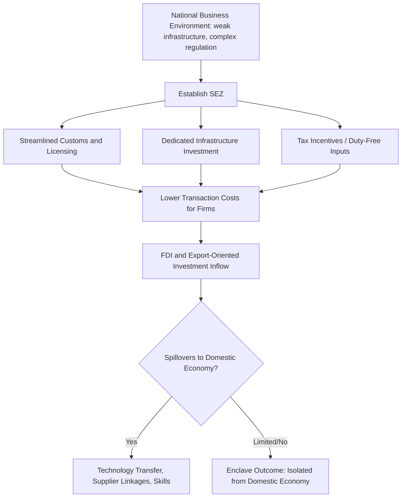

## Special Economic Zones and Industrial Policy

### Overview

Special Economic Zones (SEZs) are geographically delineated areas within a country that operate under a distinct regulatory, fiscal, and administrative regime designed to be more business- and investment-friendly than the national default, typically to attract export-oriented manufacturing, foreign direct investment (FDI), and associated technology transfer. SEZs function as a specific, spatially-bounded instrument of industrial policy, allowing governments to experiment with liberalized rules, streamlined bureaucracy, and targeted infrastructure investment without extending these changes nationwide, thereby limiting fiscal exposure and political resistance while testing reforms in a contained setting.

### Defining Features and Typology

**Key Points**

- **Common features across SEZ models:** Preferential tax treatment (corporate tax holidays or reduced rates), streamlined customs and import/export procedures (often duty-free import of inputs for re-export), simplified regulatory and licensing processes, dedicated infrastructure (power, transport, telecommunications) often superior to the national average, and in many cases relaxed labor or land-use regulations relative to the rest of the country.
- **Export Processing Zones (EPZs):** A subtype focused specifically on manufacturing for export, historically the most common SEZ form in labor-intensive garment and light manufacturing contexts (e.g., Bangladesh, various Central American and Caribbean nations).
- **Free Trade Zones (FTZs):** Focused primarily on trade and logistics functions (warehousing, re-export, light assembly) rather than full-scale manufacturing.
- **Comprehensive/multi-function SEZs:** Larger-scale zones combining manufacturing, services, residential, and commercial development, exemplified by China's original SEZs (Shenzhen, Zhuhai, Shantou, Xiamen, established 1980) and later by broader zone programs in India, Vietnam, and elsewhere.
- **Innovation/technology-focused zones:** A more recent variant (e.g., technology parks, innovation clusters) oriented toward attracting higher-value-added, knowledge-intensive investment rather than labor-intensive manufacturing alone.

### Theoretical Rationale

**Key Points**

- **Second-best policy instrument:** SEZs are often justified as a pragmatic "second-best" solution when comprehensive, nationwide institutional or regulatory reform is politically or administratively infeasible in the short run; a zone allows reform to be piloted in a contained geography, limiting the political and fiscal cost of failure and generating demonstrable proof-of-concept for broader reform.
- **Coordination failure resolution:** Zones can address a coordination failure in which no individual firm has an incentive to invest in a location lacking adequate infrastructure or reliable institutions, but a critical mass of firms co-located together (with public investment in shared infrastructure) can make the location viable for all, an argument closely related to the "big push" industrialization literature (Rosenstein-Rodan, Murphy-Shleifer-Vishny).
- **Signaling and credible commitment:** By legally codifying preferential treatment for a specific zone (often via dedicated legislation or an independent zone authority), governments can create a more credible, harder-to-reverse commitment to a stable investment climate than would be achievable through discretionary, nationwide policy alone, addressing investor concerns about policy reversal risk.
- **FDI and technology transfer channel:** Zones are frequently designed explicitly to attract foreign multinational investment as a vehicle for technology and managerial-practice transfer to the domestic economy, with spillovers to local suppliers and workers hypothesized (though not guaranteed) as zones mature.

### Case Study: China's Special Economic Zones (1980–present)

**Key Points**

- China's original four SEZs (Shenzhen, Zhuhai, Shantou, Xiamen), established in 1980 under Deng Xiaoping's reform program, are widely regarded as among the most successful examples of SEZ-driven industrial policy in modern economic history.
- Shenzhen, transformed from a small fishing town adjacent to Hong Kong into a major global manufacturing and, later, technology hub, is frequently cited as the paradigmatic SEZ success case, benefiting from proximity to Hong Kong's capital, logistics, and managerial expertise, combined with a large, low-cost labor pool from China's interior.
- China's zone program expanded substantially over subsequent decades (additional coastal open cities in the mid-1980s, and later a much larger network of national and provincial-level development zones), functioning as a central instrument of China's broader gradualist, experimentation-based reform strategy—famously described within Chinese policy discourse as "crossing the river by feeling the stones."
- **[Inference]** The extent to which Shenzhen's specific success is replicable in other contexts lacking its particular combination of advantages (proximity to an established financial/logistics hub in Hong Kong, China's exceptionally large internal labor reserve, and the scale of complementary national reform occurring simultaneously) is a frequently raised caveat in the comparative SEZ literature; treating Shenzhen as a directly transferable template risks overlooking these largely non-replicable contextual advantages.

### Case Studies: Variable Outcomes Elsewhere

**Example**

- **Bangladesh:** Export processing zones, combined with a broader liberal trade regime for the garment sector (Ready-Made Garment industry), contributed to Bangladesh's emergence as one of the world's largest garment exporters, demonstrating a labor-intensive EOI-zone model achieving substantial employment and export growth, though also associated with well-documented labor and workplace-safety concerns (e.g., the 2013 Rana Plaza collapse, though this occurred outside formal EPZ boundaries, in the broader garment sector).
- **India:** India's SEZ program, significantly expanded following the SEZ Act of 2005, has produced more mixed results than the Chinese case; evaluations have raised concerns about land acquisition conflicts, revenue loss from generous tax incentives relative to demonstrated additional investment attracted, and zones functioning as enclaves with limited linkage to the surrounding domestic economy in some instances.
- **Sub-Saharan Africa:** Various countries (e.g., Ethiopia's industrial parks, Kenya's EPZ program) have pursued SEZ-based industrialization strategies with variable results; some evaluations point to genuine employment and export gains in specific zones (e.g., Ethiopia's Hawassa Industrial Park in garment manufacturing), while others highlight limited domestic linkage development and continued heavy reliance on imported inputs and foreign management.

**[Inference]** Cross-country comparative evidence on SEZ effectiveness is heterogeneous, and rigorous causal evaluation (isolating the zone's specific contribution from confounding factors such as concurrent national trade liberalization, exchange rate policy, or global demand conditions) is more limited than the volume of SEZ activity worldwide would suggest; broad claims that SEZs "work" or "don't work" as a general policy instrument should be treated with caution given this heterogeneity and the comparatively thin rigorous causal evidence base relative to observational and descriptive case-study literature.

### The "Enclave" Critique

**Key Points**

- A recurring critique of SEZs is that they can function as economic **enclaves**—generating employment and export revenue within the zone boundary, but remaining largely disconnected from the surrounding domestic economy, with limited backward linkages to local suppliers, limited technology or managerial-practice spillovers to domestic firms, and profits substantially repatriated by foreign investors rather than reinvested locally.
- This risk is theorized to be higher when: zone firms rely heavily on imported inputs and re-export finished goods with minimal domestic value addition (a "screwdriver" or assembly-only operation); domestic firms face regulatory or capacity barriers preventing them from qualifying as zone-approved suppliers; and zone incentives are not conditioned on measurable local content, employment, or skills-transfer requirements.
- **[Inference]** Whether a given SEZ evolves from an enclave into a genuine linkage-generating hub for the broader domestic economy (as some interpretations suggest occurred with Shenzhen over multiple decades) versus remaining a persistent enclave (a criticism leveled at several less successful zone programs) appears to depend on zone-specific design features, complementary domestic industrial capacity, and time horizon, rather than being a fixed characteristic of the SEZ instrument itself.

### Fiscal Costs and Revenue Tradeoffs

**Key Points**

- SEZ tax incentives represent a fiscal cost in forgone revenue, which must be weighed against the additional investment, employment, and export activity plausibly attributable to the zone (as opposed to investment that would have occurred anyway even without the incentive—the standard "additionality" problem in tax incentive evaluation).
- Empirical assessment of additionality is methodologically challenging, since it requires estimating a counterfactual level of investment absent the zone incentive; several country-level fiscal reviews (e.g., of India's SEZ program) have raised concerns that a meaningful share of zone-based investment may have occurred without the incentive, implying a lower net fiscal return than headline investment figures suggest.
- Ongoing zone administration and infrastructure maintenance costs, along with the risk of tax competition between neighboring jurisdictions or countries (each escalating incentives to attract the same pool of mobile international investment), are additional standard fiscal policy considerations in SEZ program design.

### Labor Standards and Regulatory Considerations

**Key Points**

- Because SEZs sometimes involve relaxed labor regulation (restrictions on unionization, extended working hours, weaker enforcement of minimum wage or safety standards) relative to the national default, they have attracted sustained scrutiny from labor rights organizations and some academic researchers regarding worker welfare tradeoffs, particularly in labor-intensive garment and electronics assembly zones.
- Some contemporary zone programs have explicitly incorporated labor and environmental standards conditionality (partly in response to reputational and buyer-driven supply chain pressure from multinational retailers subject to consumer and regulatory scrutiny in destination markets) as a design evolution relative to earlier, more purely deregulatory zone models.

### Design Principles Associated with More Successful SEZ Outcomes

**Key Points**

- **Complementary infrastructure investment:** Zones paired with genuinely reliable power, transport, and logistics infrastructure (rather than tax incentives alone) appear more consistently associated with sustained investment attraction in the comparative literature.
- **Performance-linked incentives:** Following the broader EOI/developmental-state lesson (see related topics), conditioning zone benefits on export performance, employment generation, or local-content targets, rather than providing unconditional tax relief, is more consistent with successful historical precedents.
- **Deliberate linkage-promotion policy:** Explicit programs to develop domestic supplier capacity to meet zone-firm input standards (supplier development programs, local-content requirements phased in gradually) can reduce enclave risk, though overly aggressive or premature local-content mandates risk deterring the initial FDI the zone is meant to attract.
- **Realistic scale and sequencing:** Successful zones (Shenzhen, several Vietnamese industrial parks) are frequently associated with being embedded within a broader, coherent national reform and infrastructure strategy, rather than functioning as an isolated policy instrument expected to compensate for otherwise weak national economic fundamentals.

### Diagram: SEZ Outcome Pathways — Hub vs. Enclave (svg_diagram)

<svg xmlns="http://www.w3.org/2000/svg" viewBox="0 0 720 340">
<text x="360" y="24" text-anchor="middle" font-size="15" font-weight="bold" fill="#1a1a1a">SEZ Outcome Pathways: Hub vs. Enclave (svg_diagram)</text>
<rect x="270" y="55" width="180" height="55" rx="8" fill="#e8f0fe" stroke="#3b5bdb" stroke-width="1.5" />
<text x="360" y="87" text-anchor="middle" font-size="12" fill="#1a1a1a">SEZ Established</text>
<path d="M360 110 L360 145" stroke="#555" stroke-width="1.5" marker-end="url(#arrow6)" />
<rect x="150" y="145" width="180" height="55" rx="8" fill="#fff3e0" stroke="#e8590c" stroke-width="1.5" />
<text x="240" y="177" text-anchor="middle" font-size="11.5" fill="#1a1a1a">Import-Heavy Assembly Only</text>
<rect x="390" y="145" width="180" height="55" rx="8" fill="#e6fcf5" stroke="#0ca678" stroke-width="1.5" />
<text x="480" y="170" text-anchor="middle" font-size="11.5" fill="#1a1a1a">Local Content Rules,</text>
<text x="480" y="186" text-anchor="middle" font-size="11.5" fill="#1a1a1a">Supplier Development</text>
<path d="M300 145 L280 110" stroke="#555" stroke-width="1.2" fill="none" />
<path d="M420 145 L440 110" stroke="#555" stroke-width="1.2" fill="none" />
<path d="M240 200 L240 240" stroke="#555" stroke-width="1.5" marker-end="url(#arrow6)" />
<path d="M480 200 L480 240" stroke="#555" stroke-width="1.5" marker-end="url(#arrow6)" />
<rect x="120" y="240" width="240" height="60" rx="8" fill="#fce4ec" stroke="#c2255c" stroke-width="1.5" />
<text x="240" y="265" text-anchor="middle" font-size="12" font-weight="bold" fill="#a61e4d">Enclave Outcome</text>
<text x="240" y="282" text-anchor="middle" font-size="10.5" fill="#a61e4d">Limited domestic linkage</text>
<rect x="390" y="240" width="220" height="60" rx="8" fill="#e6fcf5" stroke="#0ca678" stroke-width="1.5" />
<text x="500" y="265" text-anchor="middle" font-size="12" font-weight="bold" fill="#087f5b">Hub Outcome</text>
<text x="500" y="282" text-anchor="middle" font-size="10.5" fill="#087f5b">Spillovers, upgrading</text>
</svg>

### Related Topics

- Coordination failures and the "big push" industrialization model
- Export-oriented industrialization versus import substitution
- China's gradualist reform strategy and Shenzhen case study
- Foreign direct investment and technology spillover channels
- Tax incentive additionality and fiscal cost-benefit evaluation
- Labor standards in global supply chains and garment manufacturing
- Local content requirements and supplier development programs
- Premature deindustrialization and manufacturing-led development strategies