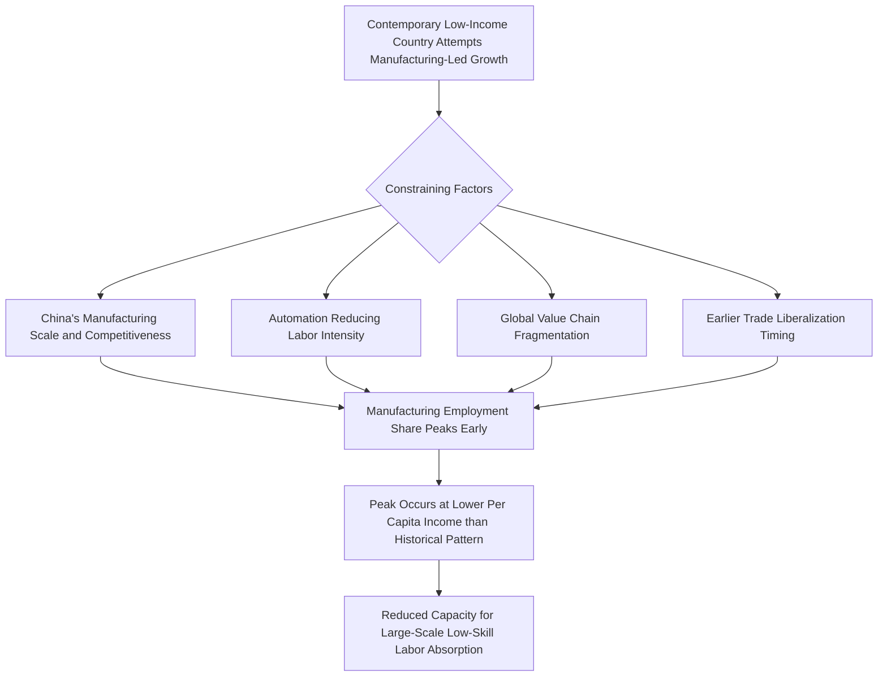

## Premature Deindustrialization

### Overview

Premature deindustrialization describes a pattern, primarily documented and named by Dani Rodrik, in which developing countries experience manufacturing's share of employment and GDP peaking and then declining at a substantially lower level of per capita income than was historically the case for early industrializers such as the United Kingdom, the United States, Germany, Japan, and South Korea. The concept challenges the assumption, embedded in classical structural transformation theory, that developing economies today can rely on the same manufacturing-led growth pathway that enabled earlier industrializers to achieve sustained income convergence, and has become central to contemporary debates about development strategy for low- and middle-income countries.

### Historical Baseline: The Classical Structural Transformation Pattern

**Key Points**

- Classical structural transformation theory (associated with Lewis, Kuznets, and Chenery) describes a predictable sequence in which economic activity shifts from low-productivity agriculture toward manufacturing as an economy develops, with manufacturing's share of employment and output rising to a peak before eventually giving way to a service-dominated economy at high income levels—a pattern broadly consistent with the historical experience of early industrializers.
- Historically, manufacturing employment shares in early industrializers peaked at substantially higher levels of per capita income, and often at higher absolute employment shares, than is now observed in many contemporary developing economies undergoing similar transitions.
- Rodrik's empirical analysis (notably in his 2016 paper "Premature Deindustrialization") documented that across a broad cross-section of developing countries, both the peak manufacturing employment share and the income level at which that peak occurs have been declining over successive cohorts of developing countries, a pattern he distinguishes from the normal, expected decline in manufacturing's share that occurs at very high income levels in already-industrialized economies.

### Proposed Explanatory Mechanisms

**Key Points**

- **Global competition from China:** China's emergence as a manufacturing exporter of unprecedented scale is theorized to have compressed the available "space" in global manufacturing markets for other developing countries attempting to follow a similar labor-intensive, export-oriented industrialization pathway, particularly in labor-intensive sectors where China achieved substantial economies of scale and infrastructure advantages.
- **Skill-biased and labor-saving technological change:** Automation and capital-intensive production technologies have reduced the labor intensity of manufacturing processes even in developing-country contexts, meaning that a given level of manufacturing output today generates fewer jobs than the same output would have generated in earlier decades, weakening manufacturing's traditional role as an easy entry point for large-scale absorption of low-skilled labor.
- **Shifting comparative advantage patterns:** Some analyses point to changes in global trade and production organization (the rise of global value chains, in which manufacturing is fragmented across multiple countries performing narrow specialized tasks) as altering the traditional pathway by which countries could build broad-based domestic manufacturing capacity, potentially locking some economies into low-value-added assembly stages rather than the fuller manufacturing base earlier industrializers developed.
- **Trade and macroeconomic policy differences:** Some explanations point to differences in exchange rate management, trade policy openness, and the relative timing of trade liberalization (contemporary developing countries generally liberalized trade earlier in their development process than historical industrializers did) as contributing factors, since earlier protection periods historically allowed nascent manufacturing sectors more time to build scale before facing full international competition.
- **[Inference]** The relative quantitative contribution of each of these proposed mechanisms is not fully settled in the empirical literature; most treatments regard them as plausible, likely interacting contributing factors rather than presenting a single decomposition with precise, agreed-upon weights attributable to each channel.

### Employment Share vs. Output Share: An Important Distinction

**Key Points**

- Premature deindustrialization is most consistently and strongly documented in terms of manufacturing's **employment share**; the pattern for manufacturing's **output/value-added share** of GDP is less uniformly severe across countries, and in some cases has declined less sharply or even remained relatively stable.
- This distinction matters for interpreting the phenomenon's severity: if manufacturing output continues to grow even as its employment share declines, this could reflect genuine labor-productivity-enhancing technological progress within manufacturing (a broadly positive development for aggregate output), rather than a wholesale failure of the manufacturing sector itself.
- **[Inference]** Whether policymakers should be most concerned with the employment-share pattern (given manufacturing's historical role in absorbing low-skilled labor and its implications for inclusive growth and job creation) or the output-share pattern (as a measure of the sector's overall economic weight) is a normative as much as an empirical question, and different scholars emphasize different metrics depending on their primary concern (aggregate growth versus employment/inclusion outcomes).

### Regional and Country Variation

**Key Points**

- The premature deindustrialization pattern is not uniform across all developing regions; Rodrik's original analysis and subsequent work document meaningful heterogeneity, with some Latin American and Sub-Saharan African economies showing particularly pronounced early manufacturing employment share peaks, while several East and Southeast Asian economies (including some that industrialized more recently, such as Vietnam and Cambodia) have shown a somewhat more resilient, though still generally more modest than historical, manufacturing employment trajectory.
- **[Inference]** The degree to which country-specific policy choices (trade policy, exchange rate management, targeted industrial policy) versus broader structural global factors (China's competitive dominance, automation trends common across all developing economies) account for this cross-country variation in the severity of premature deindustrialization is not fully disentangled in the current literature, and likely reflects some combination of both country-specific and globally common factors.

### Implications for Structural Transformation and Poverty Reduction

**Key Points**

- If manufacturing's traditional capacity to absorb large numbers of low-skilled workers transitioning out of agriculture is structurally diminished, this raises concerns about whether contemporary developing economies can replicate the poverty-reduction and income-convergence outcomes historically associated with manufacturing-led structural transformation, since alternative sectors (services, agriculture) may not offer an equivalent combination of productivity growth potential and labor absorption capacity at scale.
- This concern is central to debates about whether developing countries today face a fundamentally different, more constrained set of development pathway options than those available to 20th-century East Asian industrializers, motivating exploration of alternative or complementary strategies (agricultural productivity-led transformation, tradable services, urbanization-linked informal sector productivity growth).
- Some researchers have raised concern that premature deindustrialization, by limiting formal manufacturing employment growth, may contribute to persistently large informal sectors in developing economies, since displaced or never-absorbed agricultural labor may instead flow into low-productivity informal urban services and trade activities rather than formal manufacturing jobs.

### The Services-Led Alternative Debate

**Key Points**

- Given premature deindustrialization concerns, some economists have explored whether tradable services (business process outsourcing, IT services, as prominently exemplified by India's software and IT-enabled services sector) could serve as an alternative engine of productivity convergence and export-led growth, potentially substituting for some of manufacturing's traditional structural-transformation role.
- **Key limitation raised by skeptics:** Many high-productivity tradable services tend to be substantially more skill-intensive than labor-intensive manufacturing was during the classical East Asian take-off period, raising doubts about whether a services-led pathway can replicate manufacturing's historical capacity to absorb very large numbers of low-skilled workers at scale, a concern central to the inclusiveness dimension of the structural transformation debate.
- **[Inference]** Whether services-led growth pathways can be made more labor-absorptive through targeted skills investment and policy design, or whether the underlying skill-intensity of high-productivity services is a more fundamental structural constraint not easily addressed by policy alone, remains an open and actively researched question rather than one with an established consensus answer.

### Policy Responses and Adaptive Strategies

**Key Points**

- **Niche manufacturing specialization:** Rather than attempting broad-based manufacturing-led industrialization across the full range of sectors historically pursued by East Asian industrializers, some contemporary strategies emphasize identifying and supporting specific labor-intensive manufacturing niches where a country retains genuine comparative advantage (e.g., garment manufacturing in Bangladesh, Ethiopia, and Cambodia), while remaining realistic about the more limited scale of employment absorption likely achievable relative to the historical East Asian model.
- **Complementary agricultural productivity growth:** Given constraints on manufacturing's labor-absorption capacity, several development strategies place renewed emphasis on raising agricultural productivity directly (rather than treating manufacturing as the sole engine of labor release and income growth), recognizing agricultural transformation as a complementary rather than purely preparatory phase.
- **Investment in tradable services with labor-absorption potential:** Targeting services subsectors with greater potential for broader-based employment (e.g., tourism, logistics, certain business process outsourcing segments requiring more moderate skill levels) as a partial complement to, rather than full substitute for, manufacturing-led strategies.
- **Regional and global value chain positioning:** Given the fragmentation of manufacturing into global value chains, some strategies focus on securing a viable, upgradeable position within a specific value chain segment (e.g., final assembly, then progressively moving toward higher-value component production or design functions) rather than attempting to build a fully integrated domestic manufacturing base from the outset, as earlier industrializers were more able to do under different global trade conditions.

### Diagram: Manufacturing Employment Share Peak — Historical vs. Contemporary Pattern (svg_diagram)

<svg xmlns="http://www.w3.org/2000/svg" viewBox="0 0 720 360">
<text x="360" y="24" text-anchor="middle" font-size="15" font-weight="bold" fill="#1a1a1a">Manufacturing Employment Share Peak (svg_diagram)</text>
<line x1="80" y1="310" x2="650" y2="310" stroke="#333" stroke-width="1.5" />
<line x1="80" y1="310" x2="80" y2="60" stroke="#333" stroke-width="1.5" />
<text x="365" y="340" text-anchor="middle" font-size="12" fill="#333">Per Capita Income</text>
<text x="40" y="185" text-anchor="middle" font-size="12" fill="#333" transform="rotate(-90 40 185)">Manufacturing Employment Share</text>
<path d="M110 290 Q 280 90 400 100 Q 500 108 620 260" fill="none" stroke="#3b5bdb" stroke-width="2.5" />
<text x="230" y="80" font-size="11" fill="#3b5bdb" font-weight="bold">Historical (UK, Korea)</text>
<circle cx="400" cy="100" r="4" fill="#3b5bdb" />
<text x="400" y="90" text-anchor="middle" font-size="10" fill="#3b5bdb">Peak: higher income</text>
<path d="M110 295 Q 200 170 260 175 Q 330 182 600 285" fill="none" stroke="#e8590c" stroke-width="2.5" />
<text x="150" y="150" font-size="11" fill="#e8590c" font-weight="bold">Contemporary Developing Economy</text>
<circle cx="260" cy="175" r="4" fill="#e8590c" />
<text x="260" y="165" text-anchor="middle" font-size="10" fill="#e8590c">Peak: lower income</text>
<line x1="260" y1="175" x2="260" y2="310" stroke="#888" stroke-width="1" stroke-dasharray="3,3" />
<line x1="400" y1="100" x2="400" y2="310" stroke="#888" stroke-width="1" stroke-dasharray="3,3" />
</svg>

### Related Topics

- Manufacturing-led development strategies
- Structural transformation and the Lewis dual-economy model
- Global value chains and value-chain upgrading strategies
- China's competitive dominance in global manufacturing
- Automation and labor-saving technological change in developing economies
- Services-led growth as an alternative structural transformation pathway
- Informal sector persistence and urban labor absorption
- Unconditional convergence in manufacturing productivity (Rodrik)