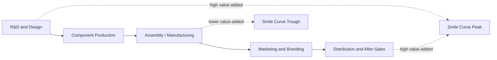

## Global Value Chains and Development

### Overview

Global value chains (GVCs) describe the fragmentation of production processes across multiple countries, in which different stages of manufacturing a single final good—design, component production, assembly, marketing, distribution—are performed in whichever locations offer the most efficient combination of cost, skill, and logistics for that specific stage, rather than a single country producing a good from start to finish. GVCs have fundamentally reshaped the pathways available for developing-country industrialization, allowing countries to specialize in narrow "tasks" or stages of production rather than requiring the buildup of a complete, vertically-integrated domestic manufacturing base, with significant implications for how development economists understand comparative advantage, industrial policy, and structural transformation in the contemporary global economy.

### Conceptual Shift: From Trade in Goods to Trade in Tasks

**Key Points**

- Traditional trade theory (Ricardian comparative advantage, Heckscher-Ohlin factor-proportions models) generally conceptualized trade as an exchange of finished goods between countries, each specializing in producing entire products according to comparative advantage.
- The GVC framework, associated substantially with the work of Gary Gereffi, Timothy Sturgeon, and later formalized in trade economics by scholars including Richard Baldwin, reconceptualizes international trade as increasingly involving the exchange of **intermediate inputs and tasks** rather than only finished goods—sometimes termed "trade in tasks" or the "second unbundling" of globalization (following Baldwin's terminology, distinguishing this from the "first unbundling," which separated production location from consumption location, while the "second unbundling" separates different stages of production from one another geographically).
- This shift means a country's comparative advantage today can operate at the level of a specific production stage or task (e.g., garment stitching, semiconductor testing, call-center services) rather than requiring comparative advantage across an entire product's full production process.

### Governance Structures in Global Value Chains

Gereffi's foundational GVC governance typology describes how power and coordination are distributed across a chain, which has direct implications for how much value developing-country participants can capture.

**Key Points**

- **Producer-driven chains:** Coordination is led by large, typically capital- and technology-intensive multinational manufacturers (e.g., automobiles, aircraft, semiconductors), where lead firms exercise significant control over suppliers' production specifications and technology.
- **Buyer-driven chains:** Coordination is led by large retailers, brand-name marketers, or trading companies (e.g., apparel, footwear, consumer electronics assembly) that typically do not own manufacturing facilities directly but exercise substantial control over design, branding, and specifications, sourcing production from a decentralized network of often developing-country contract manufacturers.
- **Governance implications for developing-country firms:** In buyer-driven chains, developing-country suppliers frequently occupy lower-value-added stages (assembly, basic manufacturing) with limited bargaining power relative to lead firms, while lead firms and their home-country economies retain the higher-value-added design, branding, and marketing functions—a pattern central to the "smile curve" concept described below.

### The "Smile Curve" and Value Capture

**Key Points**

- The smile curve is a widely used illustrative concept describing how value-added tends to be distributed across the stages of a value chain: pre-production stages (R&D, design) and post-production stages (branding, marketing, after-sales service) typically capture higher value-added shares, while the middle stage (physical manufacturing/assembly) typically captures comparatively lower value-added shares, producing a curve shaped like a smile when value-added is plotted against production stage.
- This pattern implies that a developing country specializing narrowly in assembly-stage manufacturing within a GVC may capture only a modest share of a finished product's total retail value, even while contributing substantially to the physical production process and generating meaningful export volume and employment.
- **Example:** Widely cited teardown analyses of consumer electronics products (e.g., smartphones) have found that final assembly, often performed in a developing-country location, captures a comparatively small percentage of the device's total retail value, with a much larger share attributable to design (often in the lead firm's home country) and to specialized high-value components sourced from a small number of technologically advanced component-producing countries.

### GVC Participation as a Development Pathway

**Key Points**

- GVC participation is theorized to offer developing countries a lower-barrier entry point into global manufacturing than the historical requirement of building complete, vertically-integrated domestic industries, since a country need only develop competitive capacity in a specific narrow task or stage to participate in global export markets.
- This has been particularly significant for smaller or lower-capacity economies (e.g., Cambodia, Vietnam, Bangladesh in garment manufacturing; several Central American and Southeast Asian economies in electronics assembly) that would likely have found it substantially more difficult to build a complete domestic manufacturing base from raw materials to finished export product under a pre-GVC-fragmentation trade structure.
- GVC integration is also associated with faster initial export growth and employment generation than would typically be achievable through purely domestic-market-oriented industrialization, given the immediate access to established lead-firm distribution networks and quality/technical standards that participation confers.

### The Upgrading Framework

A central concept in the GVC development literature (extensively developed by Gereffi and colleagues, and subsequently by scholars such as John Humphrey and Hubert Schmitz) is **economic upgrading**, describing the pathways by which firms and countries move to higher-value-added positions within or beyond a given value chain over time.

**Key Points**

- **Process upgrading:** Improving production efficiency within an existing production stage (e.g., adopting more efficient manufacturing techniques within garment assembly), without necessarily changing the stage or product itself.
- **Product upgrading:** Moving to more sophisticated, higher-value product lines within the same general production stage (e.g., shifting from basic t-shirt production to more technically demanding garment categories).
- **Functional upgrading:** Acquiring new, higher-value-added functions within the chain (e.g., moving from pure contract assembly toward design, branding, or full-package original brand manufacturing (OBM) capability), representing a shift toward the higher-value ends of the smile curve.
- **Chain (or inter-sectoral) upgrading:** Applying capabilities developed in one value chain to enter a different, generally higher-value chain altogether (e.g., a firm leveraging manufacturing competence developed in textiles to move into a more technologically sophisticated sector).
- **[Inference]** Functional upgrading in particular is widely regarded in the literature as the most difficult upgrading pathway to achieve, since it often requires developing capabilities (design, branding, direct market access) that lead firms in buyer-driven chains may have limited incentive to facilitate, given that successful supplier functional upgrading can create a potential future competitor; this tension between lead-firm interests and developing-country supplier upgrading ambitions is a recurring theme in case-study literature, though the degree to which lead firms actively obstruct upgrading (versus simply not actively facilitating it) varies by case and is not uniformly documented.

### Case Study: East Asian Value Chain Upgrading

**Example**

South Korea and Taiwan are frequently cited as historical examples of successful, sustained functional upgrading within global value chains—progressing over several decades from low-value-added contract assembly and Original Equipment Manufacturing (OEM, producing to a foreign buyer's exact specification) toward Original Design Manufacturing (ODM, contributing design input) and ultimately, in some sectors (e.g., Samsung, LG in electronics; Taiwan's semiconductor industry led by TSMC), toward substantial Original Brand Manufacturing (OBM) capability and globally competitive proprietary technology positions.

**[Inference]** The specific combination of factors that enabled this relatively rare successful functional upgrading trajectory (substantial and sustained state-directed technology policy, large domestic conglomerate structures capable of significant R&D investment, favorable historical trade access to major export markets during the Cold War period) may not be straightforwardly replicable by contemporary developing economies operating under different institutional, technological, and geopolitical conditions, a caveat frequently raised in comparative GVC upgrading case studies.

### GVC Participation Measurement: Value-Added Trade Statistics

**Key Points**

- Traditional gross export statistics can substantially overstate a country's genuine value contribution to a traded good, since a large share of gross export value in GVC-integrated sectors may reflect imported intermediate inputs re-exported after minor further processing, rather than domestically-generated value-added.
- **Trade in value-added (TiVA)** measurement frameworks, developed jointly by international organizations including the OECD and WTO, attempt to correct this by tracking the domestic value-added content embedded in gross exports, providing a more accurate picture of a country's genuine economic contribution and dependence within specific value chains.
- This distinction has significant policy relevance: bilateral trade balance figures calculated using gross export statistics (as commonly reported in trade policy and political discourse) can differ substantially from bilateral trade balances calculated on a value-added basis, since a portion of one country's gross exports to another may embody value-added originating in a third country.

### Risks and Vulnerabilities of GVC Integration

**Key Points**

- **Concentration and shock exposure:** Deep integration into a narrow segment of a specific GVC can expose a developing economy to significant vulnerability from demand shocks, lead-firm sourcing decisions, or supply chain disruptions originating elsewhere in the chain, as demonstrated notably during the COVID-19 pandemic's disruption of global manufacturing and logistics networks.
- **Lock-in at low-value-added stages:** Without deliberate upgrading strategies, GVC participation risks locking developing economies into persistently low-value-added assembly functions, generating employment and export volume without a corresponding trajectory toward higher domestic value capture over time—directly relevant to premature deindustrialization concerns, since GVC-based assembly-stage manufacturing may generate less durable domestic industrial capability than the more vertically-integrated manufacturing base historical industrializers developed.
- **Reshoring, nearshoring, and geopolitical fragmentation risk:** More recent trends including rising labor costs in traditional manufacturing hubs, automation reducing the labor-cost advantage of offshore production, and geopolitical tensions prompting some firms and governments to pursue supply chain diversification or reshoring, introduce a degree of uncertainty regarding the continued expansion (or potential partial reversal) of the GVC fragmentation trend that has characterized recent decades of globalization.

### Policy Implications for Developing Countries

**Key Points**

- **Entry-point strategy:** GVC participation can serve as a lower-barrier initial entry point into global manufacturing and export markets, particularly valuable for lower-capacity economies unable to immediately build complete, vertically-integrated domestic industries.
- **Deliberate upgrading strategy required:** Given the smile-curve pattern and the risk of low-value-added lock-in, successful long-run development strategy generally requires deliberate, sustained investment in the capabilities (technical skills, R&D capacity, design and branding competence) needed to pursue functional upgrading over time, rather than treating initial GVC entry as sufficient in itself.
- **Diversification and vulnerability management:** Given concentration and shock-exposure risks, some development strategies emphasize diversifying across multiple value chains or chain segments, and building domestic linkage capacity (local supplier development) to reduce dependence on any single lead firm's sourcing decisions.
- **Complementary infrastructure and trade facilitation:** Because GVC participation is highly sensitive to logistics efficiency and trade facilitation costs (given the need for reliable, low-cost movement of intermediate inputs across multiple borders), investment in ports, customs efficiency, and transport infrastructure is a particularly high-priority complementary policy area for GVC-oriented development strategies, relative to more purely domestically-oriented manufacturing strategies.

### Diagram: The Smile Curve (svg_diagram)

<svg viewBox="0 0 700 320" xmlns="http://www.w3.org/2000/svg">
<text x="350" y="24" text-anchor="middle" font-size="15" font-weight="bold" fill="#1a1a1a">The Smile Curve: Value-Added by Production Stage (svg_diagram)</text>
<line x1="70" y1="270" x2="640" y2="270" stroke="#333" stroke-width="1.5"/>
<line x1="70" y1="270" x2="70" y2="60" stroke="#333" stroke-width="1.5"/>
<text x="355" y="300" text-anchor="middle" font-size="12" fill="#333">Production Stage</text>
<text x="30" y="165" text-anchor="middle" font-size="12" fill="#333" transform="rotate(-90 30 165)">Value-Added Captured</text>
<path d="M100 100 Q 250 250 355 250 Q 460 250 610 100" fill="none" stroke="#3b5bdb" stroke-width="2.5"/>

<text x="100" y="90" text-anchor="middle" font-size="11" fill="`#3b5bdb`">R&D / Design</text>

<text x="355" y="270" text-anchor="middle" font-size="11" fill="`#e8590c`" dy="20">Assembly / Manufacturing</text>

<text x="610" y="90" text-anchor="middle" font-size="11" fill="`#0ca678`">Branding / Distribution</text>

<circle cx="100" cy="100" r="4" fill="#3b5bdb"/>
<circle cx="355" cy="250" r="4" fill="#e8590c"/>
<circle cx="610" cy="100" r="4" fill="#0ca678"/>

<text x="355" y="240" text-anchor="middle" font-size="10.5" fill="`#a15c00`">Common developing-country entry point</text>

</svg>

### Related Topics

- Gereffi's GVC governance typology (producer-driven vs. buyer-driven chains)
- Economic upgrading: process, product, functional, and chain upgrading
- Trade in value-added (TiVA) measurement frameworks
- Premature deindustrialization and value-chain lock-in
- Special economic zones as GVC entry-point instruments
- Reshoring, nearshoring, and supply chain diversification trends
- East Asian functional upgrading case studies (South Korea, Taiwan)
- Manufacturing-led development strategies