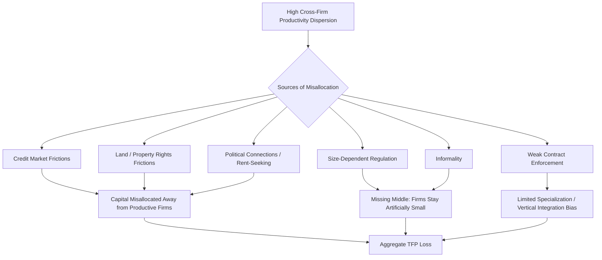

## Firm Dynamics and Productivity in Developing Countries

### Overview

Firm dynamics research in development economics examines how individual firms enter, grow, contract, and exit within an economy, and how the aggregate reallocation of resources across firms of differing productivity levels contributes to (or constrains) overall economic growth. A central empirical finding underpinning this field is that developing countries exhibit substantially larger and more persistent productivity dispersion across firms within the same narrowly-defined industry than is observed in advanced economies, implying that resources (labor and capital) are frequently allocated inefficiently—a phenomenon termed **resource misallocation**. Understanding the sources of this misallocation and the barriers to firm growth has become a central research agenda for explaining cross-country income differences, complementing (and in some analyses substituting for) explanations based on aggregate technology or factor-accumulation differences alone.

### The Productivity Dispersion Puzzle

**Key Points**

- Within a given narrowly-defined industry in a developing country, measured total factor productivity (TFP) across individual firms is typically far more dispersed than in comparable industries in advanced economies—meaning highly productive and highly unproductive firms coexist and persist side-by-side to a much greater degree.
- Under a standard neoclassical benchmark of efficient resource allocation, capital and labor would flow toward the most productive firms until marginal returns are equalized across firms within an industry; the observed persistent dispersion implies this equalization is not occurring, consistent with pervasive frictions preventing resources from moving toward their most productive use.
- Influential work by Chang-Tai Hsieh and Peter Klenow (2009), comparing manufacturing establishment-level data across China, India, and the United States, found that if capital and labor were reallocated within each industry to equalize marginal products (as would occur in a frictionless benchmark), manufacturing TFP could rise substantially—by magnitudes on the order of 30–50% in the countries studied, though precise estimates are sensitive to methodology and have been the subject of subsequent debate.

### Sources of Resource Misallocation

**Key Points**

- **Credit market frictions:** Collateral requirements, weak contract enforcement, and underdeveloped financial systems can prevent productive but capital-constrained firms (particularly small and young firms lacking established credit histories or physical collateral) from accessing the capital needed to expand, while allowing less productive but better-connected or asset-rich firms continued access to credit.
- **Size-dependent regulations and policies:** Regulations, tax enforcement, or subsidy eligibility rules that vary discontinuously with firm size (e.g., labor regulations or formal tax obligations that apply only above a specific employee-count threshold) can create incentives for firms to deliberately remain below the threshold, artificially constraining efficient scale and contributing to a "missing middle" in the firm size distribution.
- **Land and property rights frictions:** Insecure land tenure, complex land-titling processes, or restrictions on land transactions can prevent firms from acquiring the physical space needed for efficient scale expansion, particularly relevant in urban manufacturing contexts.
- **Contract enforcement and judicial quality:** Weak contract enforcement can deter firms from engaging in the specialized, arm's-length input-supplier relationships characteristic of more complex, higher-productivity production processes, encouraging instead vertically-integrated but potentially less efficient production structures.
- **Political connections and rent-seeking:** In some contexts, preferential access to credit, licenses, or government contracts based on political connections rather than productivity or merit can allow less productive but well-connected firms to persist or expand at the expense of more productive but unconnected competitors, a pattern documented in several country-specific studies of "crony capitalism."
- **Informality:** Firms operating informally (outside formal registration, tax, and regulatory systems) typically cannot access formal credit markets, cannot easily contract with larger formal firms requiring documentation, and may deliberately limit their scale to avoid detection, constraining productivity growth for a very large share of firms in many developing economies.

### Firm Size Distribution: The "Missing Middle"

**Key Points**

- Many developing economies exhibit a distinctive firm-size distribution characterized by a very large number of micro and informal enterprises, a comparatively small number of large formal firms, and a notably thin "middle" segment of medium-sized formal enterprises—a pattern termed the **"missing middle."**
- This pattern contrasts with the more continuous, smoothly-declining firm size distribution typically observed in advanced economies, and is theorized to reflect the size-dependent regulatory and credit-access frictions described above, which create disincentives or barriers to growing past specific size thresholds.
- **[Inference]** The precise causal contribution of size-dependent regulation specifically (as opposed to other factors such as managerial capacity constraints, market demand limitations, or credit access more broadly) to the missing-middle pattern varies by country context and specific regulatory environment studied; while size-dependent regulatory thresholds are frequently cited as a contributing mechanism, cross-country evidence on the magnitude of this specific channel relative to other constraints is mixed and context-dependent, and should not be treated as uniformly established across all developing-country contexts.

### The Role of Managerial Capacity and Practices

**Key Points**

- A distinct body of research, notably by Nicholas Bloom, John Van Reenen, and collaborators (the World Management Survey), has documented substantial cross-country and cross-firm variation in **management quality**—covering practices such as monitoring, target-setting, and incentive structures—and finds that developing-country firms on average score lower on standardized management-practice metrics than firms in advanced economies.
- Field experiments providing management consulting interventions to firms in developing-country contexts (e.g., a widely cited study among Indian textile firms by Bloom, Eifert, Mahajan, McKenzie, and Roberts, 2013) have found that improved management practices can produce economically significant productivity gains, suggesting that managerial capacity constraints—rather than purely external credit or regulatory frictions—may independently constrain firm-level productivity in some contexts.
- **[Inference]** The extent to which observed management-quality gaps reflect a genuine independent constraint on productivity (which could in principle be addressed through targeted management training) versus being an *endogenous response* to other underlying constraints (e.g., firms may rationally under-invest in sophisticated management practices if credit constraints or weak contract enforcement limit the returns to scaling up, making better management practices less valuable) is a subject of ongoing methodological debate, since observational correlations between management quality and firm size/productivity do not by themselves establish the direction of causality.

### Firm Entry, Exit, and Selection Dynamics ("Creative Destruction")

**Key Points**

- In well-functioning markets, a process of firm entry and exit (sometimes associated with the Schumpeterian concept of "creative destruction") continuously reallocates resources from less productive, exiting firms toward more productive, entering or expanding firms, contributing to aggregate productivity growth over time even without technological improvement at the level of any individual firm.
- Evidence from several developing-country contexts suggests this selection/reallocation process may be substantially weaker than in advanced economies—unproductive firms may persist longer (due to credit access maintained through connections, informal risk-sharing arrangements, or weak bankruptcy/exit mechanisms), while productive potential entrants may face higher barriers to entry (licensing requirements, credit access for startup capital, or incumbent political influence over regulatory approval processes).
- **[Inference]** Precisely quantifying the aggregate productivity growth "lost" due to weaker firm selection dynamics in developing countries, relative to advanced-economy benchmarks, depends heavily on the specific country, sector, and time period studied, and available estimates in the literature vary considerably; this should be understood as an active area of empirical measurement rather than one with a single settled magnitude applicable across all developing-country contexts.

### Trade Liberalization and Firm-Level Productivity Effects

**Key Points**

- A substantial empirical literature examines how trade liberalization episodes affect firm-level productivity and the broader firm size/productivity distribution within newly-exposed industries, generally finding that liberalization tends to disproportionately benefit and expand more productive firms (via increased export opportunities and competitive pressure) while accelerating the exit or contraction of less productive firms unable to compete with import competition.
- This pattern is broadly consistent with the "creative destruction" mechanism described above, suggesting that trade liberalization can serve as one channel for improving aggregate resource allocation and productivity by intensifying the competitive selection pressure operating on firms within a liberalized sector.
- **[Inference]** The distributional and transitional costs of this liberalization-driven reallocation process (job losses and adjustment costs for workers and firms in less competitive segments, at least in the short-to-medium run) are a well-documented, separate policy consideration from the aggregate productivity gains, and the net welfare evaluation of any specific liberalization episode depends on how these transitional costs are weighed and managed relative to the longer-run aggregate efficiency gains.

### Access to Finance and Credit Constraints

**Key Points**

- Numerous randomized controlled trials providing microenterprises with access to grants, loans, or in-kind capital (e.g., de Mel, McKenzie, and Woodruff's studies among Sri Lankan microenterprises) have found that capital infusions can generate substantial returns for at least a subset of recipient firms, consistent with the interpretation that credit constraints bind for at least some productive but capital-constrained microenterprises.
- However, this same body of research has also documented substantial heterogeneity in returns to capital across firms—with returns to capital for some firms (particularly those owned by individuals identified as having lower ex-ante entrepreneurial ability or operating in more saturated local markets) found to be low or negligible—suggesting that credit constraints alone do not uniformly explain the small-firm and low-productivity persistence pattern across the entire microenterprise population, and that a meaningful share of very small enterprises may be better characterized as subsistence activities with limited underlying growth potential regardless of capital access.

### Cross-Country Growth Accounting Implications

**Key Points**

- The misallocation literature has directly informed broader development-accounting debates about the sources of cross-country income differences: if a substantial share of the aggregate TFP gap between developing and advanced economies reflects *within-country misallocation* across existing firms (rather than a technology or human-capital gap operating uniformly across all firms), this implies that policies addressing specific frictions (credit access, size-dependent regulation, contract enforcement) could yield substantial aggregate productivity gains without requiring frontier technological advancement per se.
- **[Inference]** The relative importance of misallocation versus other explanations for cross-country income gaps (aggregate technology differences, human capital quality, institutional quality more broadly) remains a genuinely contested and actively researched question in development and growth economics; the Hsieh-Klenow-style misallocation estimates, while influential, have also been subject to methodological critiques (e.g., concerns about measurement error in firm-level data being mistaken for genuine misallocation), so these estimates should be treated as an important but not uncontested part of a broader, ongoing debate.

### Policy Implications

**Key Points**

- **Financial sector development:** Deepening credit markets, improving credit information systems (credit bureaus), and strengthening collateral and contract enforcement mechanisms to reduce the credit-access gap between productive and less productive firms.
- **Reforming size-dependent regulation:** Reviewing regulatory and tax thresholds that create discrete jumps in compliance burden at specific firm-size cutoffs, to reduce artificial incentives for firms to remain below efficient scale.
- **Strengthening contract enforcement and judicial capacity:** Improving the speed and reliability of commercial dispute resolution to support more complex, arm's-length supplier relationships and reduce reliance on costly vertical integration as a substitute for enforceable contracts.
- **Management capacity-building programs:** Given experimental evidence on management-practice interventions, some development programs have incorporated structured management training or consulting components alongside more traditional capital-access interventions, particularly for small and medium enterprises.
- **Facilitating orderly firm exit:** Reforming bankruptcy and firm-exit procedures to reduce the persistence of "zombie" unproductive firms occupying resources that could otherwise flow to more productive uses.

### Diagram: Productivity Dispersion and Reallocation Gains (svg_diagram)

<svg xmlns="http://www.w3.org/2000/svg" viewBox="0 0 700 340">
<text x="350" y="24" text-anchor="middle" font-size="15" font-weight="bold" fill="#1a1a1a">Productivity Dispersion and Reallocation Gains (svg_diagram)</text>
<line x1="70" y1="290" x2="640" y2="290" stroke="#333" stroke-width="1.5" />
<line x1="70" y1="290" x2="70" y2="60" stroke="#333" stroke-width="1.5" />
<text x="355" y="320" text-anchor="middle" font-size="12" fill="#333">Firm-Level TFP</text>
<text x="30" y="175" text-anchor="middle" font-size="12" fill="#333" transform="rotate(-90 30 175)">Number of Firms</text>
<path d="M100 280 Q 150 100 220 90 Q 280 100 320 280" fill="none" stroke="#e8590c" stroke-width="2.5" />
<text x="200" y="80" text-anchor="middle" font-size="11" fill="#e8590c" font-weight="bold">Developing Country: wide dispersion</text>
<path d="M400 280 Q 460 150 500 145 Q 540 150 560 280" fill="none" stroke="#3b5bdb" stroke-width="2.5" />
<text x="480" y="135" text-anchor="middle" font-size="11" fill="#3b5bdb" font-weight="bold">Advanced Economy: narrow dispersion</text>
<path d="M320 200 L400 200" stroke="#0ca678" stroke-width="1.5" stroke-dasharray="4,3" marker-end="url(#arrow7)" />
<text x="360" y="190" text-anchor="middle" font-size="10" fill="#087f5b">Reallocation gain if narrowed</text>
</svg>

### Related Topics

- Hsieh-Klenow misallocation framework and TFP dispersion
- Missing middle in firm size distributions
- World Management Survey and management practice interventions
- Credit constraints and returns to capital experiments (de Mel, McKenzie, Woodruff)
- Trade liberalization and firm-level selection effects
- Informality and formal-informal sector productivity gaps
- Development accounting: technology vs. misallocation debates
- Global value chains and firm-level upgrading