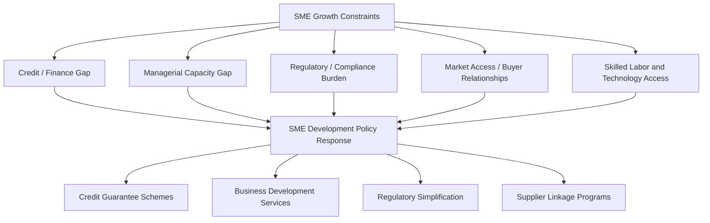

## Small and Medium Enterprise Development

### Overview

Small and medium enterprises (SMEs) constitute the large majority of firms and a substantial share of employment in most developing economies, yet they face a distinct set of growth constraints—credit access, managerial capacity, regulatory burden, and market access—that differ in character and severity from those facing either microenterprises or large formal firms. SME development policy occupies a specific niche in industrialization strategy: it addresses the "missing middle" phenomenon (see related firm dynamics topic) and aims to build a segment of firms capable of scaling toward productive, job-creating enterprises, positioned between subsistence-level microenterprises and large formal corporations or multinational subsidiaries.

### Defining SMEs: Classification Challenges

**Key Points**

- No single universally-agreed definition of "SME" exists across countries or institutions; classification typically relies on some combination of employee count, annual revenue/turnover, and total assets, with specific thresholds varying substantially by country and institution.
- The World Bank Group commonly references thresholds in the range of up to 300 employees for "medium" enterprises in some of its classifications, though thresholds used by national governments, development finance institutions, and other multilateral bodies vary considerably, and country-specific SME definitions embedded in national law (often relevant for regulatory or tax-incentive eligibility purposes) frequently differ from generic international benchmarks.
- **[Unverified]** Because SME size thresholds vary meaningfully across data sources, countries, and time periods, comparing SME statistics (e.g., "SME share of employment") across different reports or countries requires care to confirm a consistent underlying definition is being applied; headline cross-country SME statistics should be interpreted with attention to the specific definitional threshold used in the source.

### The Missing Middle Context

**Key Points**

- SME development policy is directly motivated by the empirically documented "missing middle" pattern in many developing-country firm-size distributions: a large mass of micro/informal enterprises, a small number of large formal firms, and a comparatively thin segment of medium-sized formal enterprises (see the Firm Dynamics and Productivity topic for full discussion of underlying causes).
- SMEs are frequently characterized as a policy priority because, in principle, this segment holds the greatest potential to absorb workers transitioning out of low-productivity microenterprise or informal activity while offering more formal employment protections, tax contribution, and productivity growth potential than the smallest informal enterprises typically provide.
- **[Inference]** The empirical evidence on whether SME-targeted policy interventions actually succeed in closing the missing-middle gap at scale (as opposed to simply providing support to firms that would have grown regardless, a version of the additionality problem discussed in the SEZ context) is mixed across specific program evaluations, and the aggregate employment and growth impact of SME development programs is a subject of continued empirical assessment rather than settled consensus.

### Core Constraints Facing SMEs

**Key Points**

- **Credit access ("the missing middle" in finance):** SMEs are frequently too large or formalized to access microfinance products designed for very small borrowers, yet too small, informationally opaque, or lacking sufficient collateral to access conventional commercial bank lending designed for large corporate clients—producing a specific financing gap sometimes termed the "SME finance gap."
- **Managerial and organizational capacity:** As firms grow beyond an owner-operator model, they typically require more formalized management systems (accounting, inventory control, human resource management, delegated decision-making); many SMEs in developing-country contexts lack access to affordable training or consulting to build these capabilities, a constraint studied extensively in the management-practices literature (see Firm Dynamics topic).
- **Regulatory and compliance burden:** Formal registration, tax compliance, and labor regulation requirements can impose a disproportionately high fixed cost relative to firm size for SMEs compared to large firms with dedicated compliance staff, sometimes creating disincentives to formalize or grow past specific regulatory thresholds.
- **Market access and buyer relationships:** SMEs, particularly in manufacturing, often face difficulty establishing reliable supply relationships with larger domestic or multinational buyers due to quality certification requirements, minimum order volumes, or lack of established reputation/track record, limiting their ability to integrate into higher-value domestic or global value chains.
- **Limited access to skilled labor and technology:** Smaller firms may have more limited capacity to attract skilled managerial or technical talent relative to larger firms offering more career stability and higher wages, and may lack the scale to justify investment in more advanced production technology.

### Policy Instruments: Access to Finance

**Key Points**

- **Credit guarantee schemes:** Government or development-finance-institution-backed guarantees that partially cover a commercial lender's losses in the event of SME borrower default, intended to reduce the perceived risk and collateral requirements that typically exclude SMEs from conventional bank lending.
- **Dedicated SME lending windows and development finance institutions:** State-owned or multilateral development banks (e.g., national development banks, International Finance Corporation SME finance programs) providing lending specifically targeted at the SME segment, sometimes on more favorable terms than commercial markets would independently offer.
- **Credit information systems (credit bureaus):** Improving the availability of borrower credit history and financial information to reduce information asymmetries that commercial lenders cite as a barrier to extending credit to SMEs lacking established banking relationships or formal financial records.
- **Alternative and fintech-based lending:** Emerging digital lending platforms using alternative data (mobile payment histories, e-commerce transaction records) to assess SME creditworthiness in contexts where traditional credit history and collateral documentation are limited—an active area of financial-sector innovation particularly relevant in markets with high mobile money penetration.
- **[Inference]** The effectiveness of credit guarantee schemes specifically in generating genuinely additional lending (as opposed to simply subsidizing loans that would have been extended anyway, or shifting risk without changing underlying credit-allocation decisions) varies across country evaluations, and the fiscal sustainability and additionality of these schemes remains a debated design question in the SME finance literature.

### Policy Instruments: Business Development Services (BDS)

**Key Points**

- **Business development services** encompass a range of non-financial support interventions—management training, accounting and bookkeeping assistance, technical/vocational skills training, marketing support, and business advisory/consulting services—intended to address managerial capacity constraints directly rather than through capital provision alone.
- Evidence on the effectiveness of standardized, classroom-based business training programs for existing SME owners has been mixed across rigorous evaluations, with some studies finding modest or statistically insignificant effects on business practices, revenue, or profit, while more intensive, personalized consulting-style interventions (such as the Indian textile management study referenced in the Firm Dynamics topic) have shown more consistently positive results, suggesting intervention design and intensity matter substantially for BDS effectiveness.
- **[Inference]** The generally more modest average effects found for standard classroom-style SME training programs relative to more intensive individualized consulting interventions is a fairly consistent pattern across the evaluation literature, though effect sizes and statistical significance vary by specific program design, target population, and outcome measured, so this should be read as a general pattern rather than a claim that all classroom-based training is ineffective in every context.

### Policy Instruments: Regulatory Simplification

**Key Points**

- **"Ease of doing business" reforms:** Streamlining business registration procedures, reducing the number of bureaucratic steps and time required for formal registration, and simplifying tax compliance procedures specifically for smaller firms, motivated by evidence that high formalization costs can deter SME formalization and growth.
- **Graduated/tiered regulatory regimes:** Designing regulatory and tax compliance requirements that scale gradually with firm size, rather than applying discrete "cliff-edge" thresholds that create strong disincentives to grow past a specific size (directly addressing one proposed driver of the missing-middle pattern discussed in the Firm Dynamics topic).
- **Formalization incentive programs:** Some countries have piloted programs offering simplified tax regimes, reduced compliance costs, or access to formal credit and government contracts specifically as an incentive for informal microenterprises to formalize, on the theory that formalization can unlock access to a broader range of growth-enabling resources.

### Policy Instruments: Value Chain and Market Linkage Programs

**Key Points**

- **Supplier development programs:** Structured programs connecting SMEs with larger domestic or multinational lead firms as suppliers, often including quality certification support, technical assistance to meet buyer specifications, and sometimes formal matchmaking platforms—relevant to reducing the "enclave" risk discussed in the SEZ and Global Value Chains topics, where SMEs can serve as the mechanism for building genuine domestic linkages to foreign investment.
- **Cluster development approaches:** Policies supporting geographically concentrated groups of SMEs in a related industry (industrial clusters), intended to generate agglomeration benefits (shared supplier networks, knowledge spillovers, labor pooling) that individual dispersed SMEs would not achieve independently—drawing on economic geography concepts related to Marshallian externalities.
- **Export promotion support:** Trade facilitation assistance, export market information services, and sometimes direct subsidies aimed at helping SMEs overcome the fixed costs (market research, compliance with destination-market standards, initial marketing investment) that often disproportionately deter smaller firms from entering export markets relative to larger firms with greater capacity to absorb these upfront costs.

### Measurement and Evaluation Challenges

**Key Points**

- Rigorous impact evaluation of SME development programs faces several persistent methodological challenges: selection bias (firms that self-select into voluntary SME support programs may differ systematically in unobserved ways—entrepreneurial ability, growth ambition—from non-participating firms, complicating causal inference from simple before-after or participant-nonparticipant comparisons); attribution difficulty in multi-component programs (when programs combine credit, training, and market-linkage support simultaneously, isolating which specific component drove any observed outcome is often not possible without a more complex, higher-cost multi-arm experimental design); and long measurement horizons (meaningful firm growth outcomes may take years to materialize, requiring longer and more expensive follow-up periods than many program evaluations are funded to support).
- Because of these challenges, the SME development literature contains a substantial volume of program activity and descriptive/observational evidence, but a comparatively smaller body of rigorous experimental or quasi-experimental causal evidence relative to some other areas of development economics (e.g., health and education RCTs); this pattern is itself noted by researchers in the field as a call for more rigorous evaluation infrastructure specifically in the SME policy space.

### Gender Dimensions of SME Development

**Key Points**

- Female-owned SMEs in many developing-country contexts face documented additional constraints beyond those facing SMEs generally, including more limited access to collateral (often linked to gender gaps in property and land ownership rights), potential discrimination in credit markets, and greater constraints on time and mobility due to disproportionate household and caregiving responsibilities.
- Some SME development programs have incorporated gender-targeted design features (women-specific credit products, mobile or flexible-timing training delivery, provision of childcare support during training sessions) in response to this evidence, though the comparative effectiveness of gender-targeted versus general SME support design remains an area of ongoing evaluation.

### Policy Design Synthesis

**Key Points**

- Given the multi-dimensional nature of SME constraints (finance, management capacity, regulation, market access), single-instrument interventions (e.g., credit access alone, without complementary managerial capacity support) have in several evaluated contexts shown more limited impact than integrated, multi-component support packages addressing several constraints simultaneously.
- Coordinating SME development policy with broader industrial policy and value-chain integration strategy (ensuring SME support connects meaningfully to actual downstream market demand, whether domestic or export-oriented, rather than functioning as an isolated support program) is increasingly emphasized as a design principle, reflecting lessons from the enclave-risk and additionality concerns discussed in adjacent industrial policy topics.

### Diagram: SME Financing Gap Position (svg_diagram)

<svg xmlns="http://www.w3.org/2000/svg" viewBox="0 0 720 300">
<text x="360" y="24" text-anchor="middle" font-size="15" font-weight="bold" fill="#1a1a1a">SME Financing Gap Position (svg_diagram)</text>
<line x1="60" y1="220" x2="660" y2="220" stroke="#333" stroke-width="1.5" />
<text x="360" y="250" text-anchor="middle" font-size="12" fill="#333">Firm Size</text>
<rect x="70" y="150" width="150" height="70" fill="#e8f0fe" stroke="#3b5bdb" stroke-width="1.5" />
<text x="145" y="180" text-anchor="middle" font-size="11.5" fill="#1a1a1a">Microenterprise</text>
<text x="145" y="197" text-anchor="middle" font-size="10" fill="#444">Microfinance access</text>
<rect x="285" y="150" width="150" height="70" fill="#fce4ec" stroke="#c2255c" stroke-width="1.5" stroke-dasharray="5,3" />
<text x="360" y="175" text-anchor="middle" font-size="11.5" fill="#a61e4d">SME</text>
<text x="360" y="192" text-anchor="middle" font-size="10" fill="#a61e4d">Financing Gap</text>
<text x="360" y="207" text-anchor="middle" font-size="10" fill="#a61e4d">"Missing Middle"</text>
<rect x="500" y="150" width="150" height="70" fill="#e6fcf5" stroke="#0ca678" stroke-width="1.5" />
<text x="575" y="180" text-anchor="middle" font-size="11.5" fill="#1a1a1a">Large Firm</text>
<text x="575" y="197" text-anchor="middle" font-size="10" fill="#444">Commercial bank access</text>
<path d="M220 185 L285 185" stroke="#555" stroke-width="1.2" stroke-dasharray="3,3" />
<path d="M435 185 L500 185" stroke="#555" stroke-width="1.2" stroke-dasharray="3,3" />
</svg>

### Related Topics

- Firm dynamics, resource misallocation, and the missing middle
- Credit guarantee schemes and SME finance instruments
- Business development services: design and evidence
- Value chain linkage and supplier development programs
- Ease of doing business and regulatory simplification reforms
- Gender gaps in entrepreneurship and access to finance
- Industrial clusters and agglomeration economies
- Informality and the costs and benefits of formalization