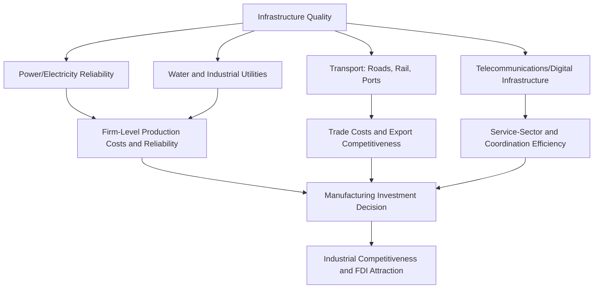

## Infrastructure and Industrial Competitiveness

### Overview

Infrastructure—encompassing power, transport, water, and telecommunications systems—functions as a foundational input to industrial production, and its adequacy or deficiency directly shapes a country's capacity to attract manufacturing investment, compete in export markets, and sustain productivity growth. Infrastructure deficits act as a distinct, often underappreciated barrier to industrialization, operating alongside (and interacting with) the trade policy, financial market, and firm-level constraints discussed elsewhere in this chapter. Because infrastructure investments are typically large-scale, capital-intensive, and characterized by network externalities and coordination problems, they are widely regarded as an area where market provision alone is often insufficient, motivating a substantial and continuing role for public investment and public-private partnership models in industrial development strategy.

### Infrastructure as a Component of the "Investment Climate"

**Key Points**

- Infrastructure quality is one of several components (alongside regulatory quality, macroeconomic stability, and governance) that constitute what development economists commonly term the **investment climate**—the overall set of location-specific conditions that determine a country's or region's attractiveness for productive private investment.
- Firm-level surveys conducted across developing countries (e.g., the World Bank Enterprise Surveys) consistently identify unreliable electricity supply, inadequate transport infrastructure, and costly or unreliable telecommunications as among the most frequently cited constraints to firm operation and growth, often ranking alongside or above access to finance and regulatory burden depending on the country and sector.
- Infrastructure deficiencies impose costs on firms through multiple channels: direct costs (self-generated backup power, private security for unreliable transport routes), indirect costs (lost production time during power outages, delayed shipments raising inventory-holding costs), and foregone investment (firms that would otherwise invest in infrastructure-dependent production processes choosing not to, or choosing alternative, less infrastructure-intensive technologies).

### Power/Electricity Infrastructure

**Key Points**

- Reliable and adequate electricity supply is a particularly critical infrastructure input for manufacturing, given the sector's generally higher and more continuous power requirements relative to agriculture or many services.
- Firms in many developing-country contexts, particularly in Sub-Saharan Africa and parts of South Asia, report frequent and prolonged power outages, leading to widespread reliance on costly self-generated backup power (diesel generators), which raises effective production costs substantially relative to firms operating in contexts with reliable grid electricity.
- **[Inference]** Quantitative estimates of the aggregate GDP or manufacturing output cost attributable to power outages vary considerably across country-specific studies and methodologies (contingent valuation surveys, firm-level production function estimates using outage frequency as a covariate); while there is broad consensus that power unreliability imposes economically meaningful costs in many affected countries, citing a single universal cost estimate (e.g., "X% of GDP") without specifying the country and study source risks overstating the precision of this literature.
- Electrification and grid-reliability investment has been a central component of several manufacturing-led development strategies, including targeted power infrastructure investment within Special Economic Zones specifically (see related SEZ topic), reflecting the recognition that zone-specific infrastructure guarantees can be a more fiscally feasible near-term strategy than achieving nationwide grid reliability.

### Transport Infrastructure and Trade Costs

**Key Points**

- Transport infrastructure quality—road networks, rail systems, and particularly port efficiency for internationally-traded manufactured goods—directly affects a country's **trade costs**, which function analogously to a tax on international trade competitiveness, reducing effective returns to export-oriented manufacturing investment.
- Landlocked developing countries face a structurally disadvantaged position in this regard, since they necessarily depend on transit infrastructure and trade facilitation arrangements in neighboring coastal countries to access maritime shipping routes, an additional layer of infrastructure and institutional coordination dependency not faced by coastal economies.
- Port efficiency specifically has been studied extensively as a trade-cost determinant; delays and inefficiencies in port clearance procedures can impose costs comparable to or exceeding formal tariff barriers in some contexts, motivating "trade facilitation" as a distinct policy agenda within infrastructure and trade policy discussions (including the WTO's Trade Facilitation Agreement, which entered into force in 2017 and addresses customs procedures and border infrastructure coordination).
- **Example:** Studies estimating the trade-cost impact of specific transport infrastructure investments (e.g., railway or highway corridor projects) generally find that reduced transport time and cost translate into measurable increases in trade volumes and, in some cases, firm entry and manufacturing activity along improved transport corridors, though magnitudes vary by specific project and context studied.

### Telecommunications and Digital Infrastructure

**Key Points**

- Reliable and affordable telecommunications and internet infrastructure have become increasingly central to industrial competitiveness, both directly (supporting logistics coordination, digital payment systems, and increasingly automated or digitally-monitored production processes) and indirectly (enabling participation in service-sector activities that can complement or, in some development strategies, partially substitute for manufacturing-led growth, as discussed in the premature deindustrialization debate).
- Mobile telecommunications infrastructure in particular has seen substantial expansion across developing regions over recent decades, in some cases allowing countries to partially bypass the fixed-line infrastructure stage that characterized earlier telecommunications development in advanced economies (a pattern sometimes termed "leapfrogging").
- **[Inference]** The extent to which improved digital infrastructure can substitute for, rather than merely complement, physical transport and power infrastructure in supporting industrial competitiveness is limited by the physical nature of manufacturing production itself (which requires reliable power and physical logistics regardless of digital connectivity); digital infrastructure investment is best understood as addressing a distinct, complementary set of constraints rather than as a substitute for physical infrastructure investment in a manufacturing-oriented development strategy.

### Financing Models: Public Investment, PPPs, and Blended Finance

**Key Points**

- **Public investment:** Direct government financing and provision of infrastructure remains the dominant model in many developing-country contexts, particularly for infrastructure with strong public-good characteristics (rural road networks, national grid extension) where private returns alone may not justify investment absent public funding or coordination.
- **Public-Private Partnerships (PPPs):** Contractual arrangements in which private firms finance, build, and/or operate infrastructure assets (toll roads, power plants, ports) under long-term concession agreements with government, intended to leverage private capital and operational efficiency while allowing government to retain oversight and, in some structures, eventual asset ownership.
- **[Inference]** The comparative track record of PPP models in developing-country infrastructure provision is decidedly mixed across the literature; some evaluations point to genuine efficiency gains and successful risk transfer, while others document significant renegotiation, cost overrun, and fiscal contingent-liability risks (where government ultimately bears financial risk despite the nominal private financing structure) in specific documented cases, suggesting that outcomes depend heavily on specific contract design, sector, and country institutional capacity to manage complex PPP arrangements, rather than PPPs being a uniformly successful or unsuccessful financing model in general.
- **Blended finance and multilateral development bank co-financing:** Increasing use of combined public, multilateral (World Bank, regional development banks), and private capital structures, often incorporating risk-mitigation instruments (partial credit guarantees, political risk insurance) intended to make otherwise commercially unattractive infrastructure projects viable for private investment participation, particularly relevant for large-scale power generation and transport corridor projects in lower-income countries.

### Infrastructure and Special Economic Zone Strategy

**Key Points**

- As discussed in the SEZ topic, a common practical strategy for addressing nationwide infrastructure deficits within fiscal and administrative constraints is to concentrate high-quality infrastructure investment within specific zones (SEZs, industrial parks, export corridors) rather than attempting simultaneous nationwide infrastructure upgrading, allowing governments to offer internationally competitive infrastructure conditions to export-oriented investors while managing the fiscal cost of infrastructure investment more narrowly.
- This zone-based infrastructure strategy carries the same enclave risk discussed in the SEZ topic: infrastructure improvements concentrated within a zone may not generate broader spillover benefits to the surrounding domestic economy unless deliberately extended or connected via complementary transport and utility linkage investment.

### Infrastructure Gaps and the Global Infrastructure Financing Estimate

**Key Points**

- Various international organizations (World Bank, McKinsey Global Institute, G20-affiliated bodies) have published estimates of the aggregate global infrastructure investment gap—the difference between current infrastructure investment levels and the levels estimated as necessary to support projected economic growth and development needs, particularly in low- and middle-income countries.
- **[Unverified]** Because these aggregate global or regional infrastructure-gap estimates depend heavily on assumed future growth rates, infrastructure-need methodologies, and time horizons that vary across the reports producing them, and because such estimates are periodically revised, any specific numerical figure cited (e.g., "$X trillion by 20XX") should be sourced to its specific originating report and date rather than treated as a single fixed, universally agreed figure; readers seeking a current estimate should consult the most recent relevant report directly given the potential for these figures to change substantially between publications.

### Complementarity with Other Structural Transformation Policies

**Key Points**

- Infrastructure investment is widely treated in the industrial policy literature as a **necessary but not sufficient** condition for successful manufacturing-led development: infrastructure investment absent complementary trade policy, financial-sector development, human capital investment, and firm-level support is unlikely to translate into sustained industrial competitiveness on its own, just as trade or financial-sector reforms are unlikely to succeed if infrastructure bottlenecks remain severely binding.
- Historical East Asian industrialization strategies (see related chapter topic on the East Asian Miracle) generally combined substantial, sustained infrastructure investment with other complementary industrial policy tools (directed credit, export incentives, human capital investment) rather than pursuing infrastructure investment as an isolated policy lever, a pattern frequently cited as a design lesson for contemporary infrastructure-focused development strategies.

### Diagram: Infrastructure as a Component of Industrial Investment Climate (svg_diagram)

<svg xmlns="http://www.w3.org/2000/svg" viewBox="0 0 720 320">
<text x="360" y="24" text-anchor="middle" font-size="15" font-weight="bold" fill="#1a1a1a">Infrastructure Within the Investment Climate (svg_diagram)</text>
<circle cx="360" cy="180" r="120" fill="#e8f0fe" stroke="#3b5bdb" stroke-width="1.5" opacity="0.5" />
<text x="360" y="80" text-anchor="middle" font-size="13" font-weight="bold" fill="#1a1a1a">Investment Climate</text>
<rect x="150" y="140" width="140" height="50" rx="8" fill="#fff3e0" stroke="#e8590c" stroke-width="1.5" />
<text x="220" y="170" text-anchor="middle" font-size="11" fill="#1a1a1a">Power / Electricity</text>
<rect x="430" y="140" width="140" height="50" rx="8" fill="#e6fcf5" stroke="#0ca678" stroke-width="1.5" />
<text x="500" y="170" text-anchor="middle" font-size="11" fill="#1a1a1a">Transport / Ports</text>
<rect x="290" y="220" width="140" height="50" rx="8" fill="#fce4ec" stroke="#c2255c" stroke-width="1.5" />
<text x="360" y="250" text-anchor="middle" font-size="11" fill="#1a1a1a">Telecom / Digital</text>
<rect x="290" y="70" width="140" height="50" rx="8" fill="#f3f0ff" stroke="#7048e8" stroke-width="1.5" />
<text x="360" y="100" text-anchor="middle" font-size="11" fill="#1a1a1a">Regulatory Quality</text>

<text x="360" y="300" text-anchor="middle" font-size="11" fill="#555" font-style="italic">Combined determinants of firm investment and location decisions</text>

</svg>

### Related Topics

- Special economic zones and industrial policy
- Trade facilitation and the WTO Trade Facilitation Agreement
- Public-private partnerships in infrastructure finance
- Firm-level investment climate surveys (World Bank Enterprise Surveys)
- Landlocked developing countries and transit trade dependencies
- Power sector reform and electrification strategies
- Manufacturing-led development strategies
- Global infrastructure financing gap estimates