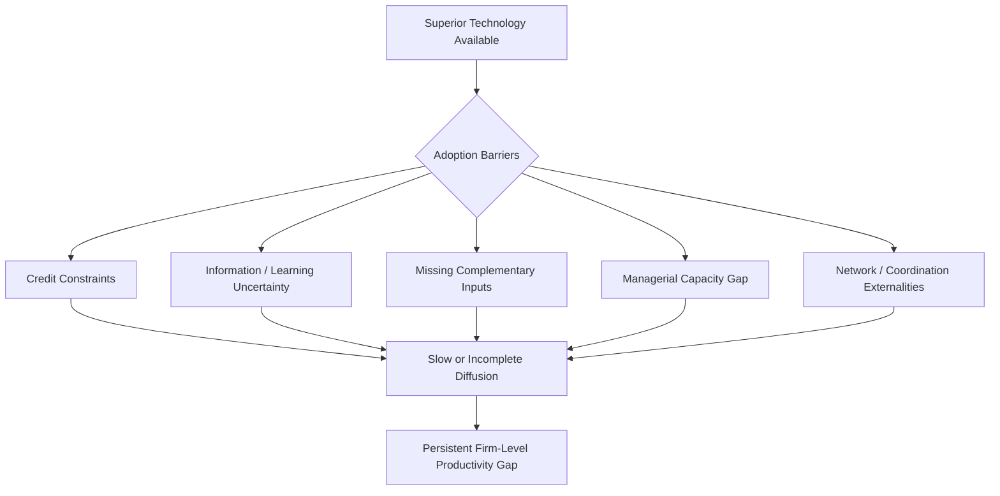

## Technology Adoption and Diffusion at the Firm Level

### Overview

Firm-level technology adoption and diffusion examines why productivity-enhancing technologies—new production techniques, machinery, digital tools, and managerial practices—often spread slowly and incompletely across firms within developing economies, even when a technology has been demonstrably profitable elsewhere or within the same country. This gap between the technological frontier and the technology actually in use by the typical firm ("technology diffusion lag") is a major proposed contributor to cross-country and within-country productivity dispersion, complementing the resource misallocation framework discussed in the Firm Dynamics topic. Unlike misallocation (which concerns the distribution of resources across firms using given technologies), the technology diffusion literature concerns why firms fail to adopt superior technologies or practices even when doing so appears, from an outside perspective, to be profitable.

### The Technology Diffusion Curve and Cross-Country Gaps

**Key Points**

- Technologies typically diffuse across firms and countries following an S-shaped adoption curve over time: slow initial adoption by a small number of early adopters, followed by accelerating adoption as the technology becomes more familiar, proven, and supported by complementary infrastructure or knowledge, before eventually plateauing as the addressable market of potential adopters is exhausted.
- Comparative studies (e.g., work by Diego Comin and Bart Hobijn constructing historical cross-country technology adoption datasets) document that developing countries typically both adopt new technologies with a substantial time lag relative to the technological frontier and achieve a lower eventual penetration rate (share of firms or the population using the technology) than advanced economies, for a wide range of technologies studied historically.
- **[Inference]** The relative contribution of technology adoption lags specifically (as opposed to misallocation of existing technologies across firms, human capital gaps affecting technology usage efficiency, or aggregate institutional quality) to cross-country income and productivity differences is an active area of growth-accounting research, and precise decomposition results vary by study methodology and specific country/technology sample, so this should be understood as one significant contributing factor among several rather than a single dominant explanation with a universally agreed quantitative weight.

### Barriers to Technology Adoption at the Firm Level

**Key Points**

- **Credit constraints:** Adopting new technology, particularly capital-intensive machinery or equipment, typically requires upfront investment that credit-constrained firms may be unable to finance, directly linking this literature to the credit-access constraints discussed in the Firm Dynamics and SME Development topics.
- **Information and learning barriers:** Firms may lack reliable information about a new technology's true expected returns, appropriate operating conditions, or maintenance requirements, particularly when the technology has not yet been widely tested locally; this uncertainty can rationally deter adoption even when the technology's average return, once well understood, would justify the investment (directly related to the ambiguity aversion mechanism discussed in the Behavioral Biases in Agricultural Decision-Making topic).
- **Complementary input and skill requirements:** New technologies often require complementary inputs (reliable electricity, specific raw material quality, skilled operators or technicians for maintenance) that may not be readily available in a given firm's local operating environment, meaning technology adoption barriers are frequently linked to the broader infrastructure and human capital constraints discussed elsewhere in this chapter.
- **Managerial capacity constraints:** Effectively integrating new technology into a firm's production process often requires organizational and managerial changes (new workflow design, quality control procedures, staff retraining) that firms with limited managerial capacity may struggle to implement even after acquiring the physical technology itself, connecting this topic to the management-practices literature discussed in the Firm Dynamics topic.
- **Network externalities and coordination:** For some technologies, individual adoption value depends on complementary adoption by suppliers, customers, or competitors (e.g., digital payment systems, certain quality-certification-linked technologies), creating a coordination problem in which no individual firm has sufficient incentive to adopt first, even if widespread adoption would benefit the sector as a whole.

### Social Learning and the Diffusion of Agricultural and Industrial Technology

**Key Points**

- A substantial experimental literature examines **social learning** as a mechanism explaining gradual technology diffusion: because individual experimentation with a new technology generates information valuable to the experimenting firm's neighbors or competitors (a partial public good), individual firms may rationally under-invest in costly early experimentation while waiting to observe others' outcomes, producing diffusion that is slower than would be socially optimal even though each individual firm's decision is privately rational.
- Foster and Rosenzweig's influential work on the Green Revolution in India found that farmers' technology adoption decisions were significantly influenced by observing the realized outcomes of both their own and their neighbors' prior experimentation, supporting the social learning framework as an explanation for gradual, spatially clustered diffusion patterns.
- **Example:** Field experiments testing whether providing information or demonstration about a new technology to a subset of farmers or firms in a network leads to diffusion beyond the directly-treated group (indirect/spillover effects) have found evidence of meaningful social learning spillovers in several agricultural contexts, though the magnitude of these spillover effects varies by the specific technology, network structure, and the credibility/social position of the initially-treated adopters (relevant to "seeding" strategies discussed in the Social Norms topic).

### Extension Services and Demonstration Effects

**Key Points**

- Agricultural and industrial extension services—government or NGO programs providing technical information, demonstration plots, or direct advisory support to firms and farmers—are a long-standing policy instrument aimed explicitly at accelerating technology diffusion by directly addressing the information and learning barriers described above.
- Evidence on extension program effectiveness is mixed across the literature: some evaluations find meaningful adoption and productivity gains from well-designed, sufficiently intensive extension contact, while others find modest or short-lived effects, particularly for lower-intensity, less personalized extension models (a pattern paralleling the business development services evidence discussed in the SME Development topic, where more intensive, personalized interventions tend to outperform generic training).
- **[Inference]** The specific design features associated with more effective extension and demonstration programs (contact frequency, degree of personalization, use of local/peer demonstrators versus external experts, complementary provision of credit or inputs alongside information) are identified in the literature as important moderating factors, though the precise combination of features producing the largest and most cost-effective diffusion gains likely varies by context and technology type rather than following a single universally optimal template.

### Digital and Mobile Technology Diffusion

**Key Points**

- Mobile phone and mobile-money technology diffusion across developing economies over the past two decades represents one of the most extensively studied and rapid firm- and household-level technology diffusion episodes in the development economics literature, with substantial evidence on downstream productivity, risk-sharing, and market-access effects (e.g., studies of M-Pesa's effects on Kenyan households and businesses).
- **[Inference]** The relatively rapid and widespread diffusion of mobile technology, compared to the slower diffusion patterns documented for many earlier industrial and agricultural technologies, is generally attributed to specific factors including relatively low complementary infrastructure requirements (compared to, e.g., capital-intensive machinery requiring reliable power and specialized maintenance), strong network externality effects driving rapid uptake once a critical mass of users was reached, and often supportive telecommunications regulatory environments; whether this diffusion pattern offers a generalizable template for accelerating diffusion of other technology types, or reflects characteristics somewhat specific to mobile/digital technology, is a point on which the literature does not offer a fully settled answer.
- More recent research has extended into the diffusion of digital financial services, e-commerce platforms, and, increasingly, artificial intelligence and automation tools among developing-country firms; because this is a rapidly evolving area, current evidence on adoption patterns and productivity effects should be treated as an active and ongoing research frontier rather than a settled body of findings.

### Reducing Information Barriers: Experimental Evidence

**Example**

Several field experiments have directly tested interventions designed to reduce information barriers to technology adoption:

- Providing objective, third-party-verified information about a new technology's expected returns (rather than relying on potentially self-interested sales information from technology vendors) has in some studies increased adoption rates relative to control groups receiving no additional information, though effect sizes vary by context and the credibility of the information source used.
- Providing farmers or firm owners with the opportunity for small-scale, low-risk trial use of a technology before committing to full adoption (sometimes structured as subsidized trial periods or small-plot demonstration trials) has been found in several agricultural technology studies to increase eventual full adoption rates relative to requiring an immediate full-commitment adoption decision, consistent with the interpretation that uncertainty/ambiguity aversion regarding an unfamiliar technology's true performance is a meaningful, addressable barrier.

### Firm Heterogeneity in Adoption Capacity

**Key Points**

- Not all firms within an economy face identical technology adoption barriers or possess identical capacity to benefit from a given technology; firm size, existing managerial quality, access to skilled labor, and prior technology exposure all appear, across various studies, to be associated with differential propensity to adopt and successfully integrate new technology.
- This heterogeneity implies that technology diffusion policy interventions targeting a broad, undifferentiated population of firms may achieve lower average effectiveness than interventions specifically targeting firms more likely to successfully adopt and benefit (though targeting approaches raise their own equity and program-design tradeoffs, since firms most likely to benefit from targeted support may also be those closer to the technology frontier already, potentially exacerbating rather than narrowing within-country productivity dispersion if not carefully designed).

### Policy Implications

**Key Points**

- **Combining information and financial support:** Given that credit constraints and information/uncertainty barriers frequently co-occur and interact, technology diffusion programs that combine financing access with credible information and demonstration components have generally shown more consistent results than single-instrument interventions addressing only one barrier in isolation.
- **Leveraging social networks and credible local demonstrators:** Given the evidence on social learning and peer-network effects, extension and diffusion programs increasingly emphasize identifying and working through trusted local demonstrators or early adopters rather than relying solely on external expert-delivered information, paralleling similar "seeding" strategy lessons from the social norms literature.
- **Addressing complementary constraints:** Because technology adoption often depends on complementary infrastructure (reliable power), skills (technical training), and managerial capacity, technology-specific diffusion programs are more likely to succeed when coordinated with broader infrastructure and human capital investment strategy rather than treated as a wholly separate, isolated policy lever.
- **Allowing low-risk trial mechanisms:** Given evidence on the effectiveness of trial/demonstration approaches in reducing adoption uncertainty, structuring technology introduction programs to allow reversible, low-commitment initial trial periods (rather than requiring full upfront commitment) appears to be a generally effective, relatively low-cost design feature across multiple studied contexts.

### Diagram: S-Curve of Technology Diffusion — Frontier vs. Developing Economy (svg_diagram)

<svg xmlns="http://www.w3.org/2000/svg" viewBox="0 0 700 340">
<text x="350" y="24" text-anchor="middle" font-size="15" font-weight="bold" fill="#1a1a1a">Technology Diffusion S-Curves (svg_diagram)</text>
<line x1="70" y1="290" x2="640" y2="290" stroke="#333" stroke-width="1.5" />
<line x1="70" y1="290" x2="70" y2="60" stroke="#333" stroke-width="1.5" />
<text x="355" y="320" text-anchor="middle" font-size="12" fill="#333">Time</text>
<text x="30" y="175" text-anchor="middle" font-size="12" fill="#333" transform="rotate(-90 30 175)">Adoption / Penetration Rate</text>
<path d="M100 280 Q 200 270 260 200 Q 320 100 420 80 Q 480 75 600 72" fill="none" stroke="#3b5bdb" stroke-width="2.5" />
<text x="450" y="60" text-anchor="middle" font-size="11" fill="#3b5bdb" font-weight="bold">Frontier / Advanced Economy</text>
<path d="M180 285 Q 280 280 340 260 Q 420 220 500 200 Q 560 190 610 185" fill="none" stroke="#e8590c" stroke-width="2.5" />
<text x="470" y="215" text-anchor="middle" font-size="11" fill="#e8590c" font-weight="bold">Developing Economy: lag + lower plateau</text>
<line x1="180" y1="60" x2="180" y2="290" stroke="#888" stroke-width="1" stroke-dasharray="3,3" />
<text x="180" y="55" text-anchor="middle" font-size="10" fill="#888">Adoption lag</text>
</svg>

### Related Topics

- Firm dynamics, productivity dispersion, and resource misallocation
- Social learning and the Green Revolution (Foster and Rosenzweig)
- Agricultural extension services: design and evidence
- Mobile money and digital financial services diffusion (M-Pesa)
- Ambiguity aversion and trial-based adoption mechanisms
- Management practices and organizational capacity (World Management Survey)
- SME development and business development services
- Comin-Hobijn cross-country technology adoption datasets