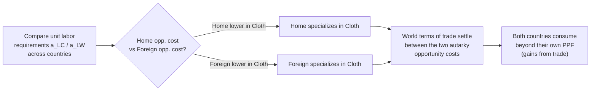

## Comparative Advantage and Trade Theory Applications

### Overview

Comparative advantage is the foundational principle explaining why nations gain from trade even when one country is more efficient than another at producing everything. Development economics applies this theory to explain trade patterns, structural transformation, and the debated pathways developing countries take to industrialize and grow.

### Absolute Advantage vs. Comparative Advantage

**Key Points**

- **Absolute advantage** (Adam Smith): a country can produce a good using fewer resources (lower absolute cost) than another country.
- **Comparative advantage** (David Ricardo): a country should specialize in producing goods for which it has the lowest *opportunity cost*, even if it has no absolute advantage in anything.
- Mutually beneficial trade is possible whenever opportunity costs differ between countries, regardless of absolute productivity levels.

**Example**

Consider two countries producing cloth and wine with fixed labor hours:

| Country | Cloth (units/hour) | Wine (units/hour) |
| --- | --- | --- |
| Portugal | 4 | 5 |
| England | 2 | 1 |

Portugal is absolutely more efficient at both. But opportunity costs differ:

- Portugal's opportunity cost of 1 cloth = $5/4 = 1.25$ wine
- England's opportunity cost of 1 cloth = $1/2 = 0.5$ wine

England has the *lower* opportunity cost in cloth, so England should specialize in cloth and Portugal in wine, despite Portugal's absolute superiority in both goods.

### The Ricardian Model — Formal Structure

**Key Points**

- Single factor of production (labor), constant returns to scale, perfect competition.
- Production possibility frontier (PPF) is a straight line reflecting constant opportunity cost.
- Trade pattern is determined entirely by relative labor productivity differences (technology), not factor endowments.

Let $a_{LC}$ and $a_{LW}$ be the unit labor requirements (hours needed per unit) for cloth and wine respectively in a given country. The opportunity cost of cloth in terms of wine is:

$$OC_{cloth} = \frac{a_{LC}}{a_{LW}}$$

A country has comparative advantage in cloth if:

$$\frac{a_{LC}}{a_{LW}} < \frac{a_{LC}^*}{a_{LW}^*}$$

where the starred terms denote the foreign country's unit labor requirements.

**Relative Wage and Terms of Trade**

For trade to be mutually beneficial, the international relative price of cloth to wine, $P_C/P_W$, must lie between the two countries' autarky (pre-trade) opportunity costs:

$$\left(\frac{a_{LC}}{a_{LW}}\right)_{Home} < \frac{P_C}{P_W} < \left(\frac{a_{LC}}{a_{LW}}\right)_{Foreign}$$

Below shows the relationship between relative productivity, specialization, and the range of viable terms of trade.

### The Heckscher-Ohlin (H-O) Model

**Key Points**

- Extends comparative advantage theory by explaining *why* opportunity costs differ: differences in relative factor endowments (labor vs. capital vs. land), not technology.
- **H-O Theorem**: a country will export the good that uses its abundant factor intensively, and import the good that uses its scarce factor intensively.
- Two factors, two goods, two countries (2x2x2 framework); identical technology and preferences across countries; differing factor endowments.

**Core Theorems Building on H-O**

1. **Factor Price Equalization Theorem**: free trade in goods tends to equalize relative and absolute factor returns (wages, rental rates) across countries, acting as an indirect substitute for factor mobility. [Inference: strict equalization requires restrictive assumptions — identical technology, no transport costs, incomplete specialization — rarely fully met in practice]
2. **Stolper-Samuelson Theorem**: trade liberalization raises the real return to a country's abundant factor and lowers the real return to its scarce factor. In a labor-abundant developing country, trade should raise wages relative to capital returns.
3. **Rybczynski Theorem**: at constant relative goods prices, an increase in the endowment of one factor increases the output of the good that uses it intensively and decreases the output of the other good.

**Development Implication**

For a labor-abundant developing economy, the Stolper-Samuelson logic predicts trade openness should benefit unskilled labor relative to capital, potentially reducing inequality. This prediction has been empirically contested — the "wage inequality puzzle" observed in several developing countries following trade liberalization shows wage gaps widening, not narrowing. [Inference: attributed by various researchers to skill-biased technological change, informal sector segmentation, or trade in intermediate/vertically specialized goods rather than the simple H-O prediction — this remains a debated empirical question]

### The New Trade Theory and Gravity Model

Classical and H-O theories struggle to explain the large volume of trade between similar, capital-abundant countries (intra-industry trade, e.g., Germany exporting and importing cars simultaneously). New Trade Theory (Krugman) addresses this via:

- **Increasing returns to scale**: larger production runs lower average costs, giving early movers an advantage independent of factor endowments.
- **Monopolistic competition and product differentiation**: consumers value variety, so countries trade differentiated versions of similar goods.
- **Gravity model**: empirically, bilateral trade flows are well approximated by:

$$T_{ij} = G \cdot \frac{Y_i^{\beta_1} Y_j^{\beta_2}}{D_{ij}^{\beta_3}}$$

where $T_{ij}$ is trade flow between countries $i$ and $j$, $Y_i, Y_j$ are their GDPs, $D_{ij}$ is distance (a proxy for trade costs), and $G$ is a constant. This model consistently fits observed trade data well across empirical studies, though it is descriptive/statistical rather than a full structural welfare theory on its own. [Inference: modern structural gravity models derive this relationship from underlying trade-cost and preference assumptions, but the basic specification above is primarily an empirical regularity]

### Applications to Development Strategy

**Key Points**

- **Export-led growth**: East Asian economies (South Korea, Taiwan, later China) leveraged comparative advantage in labor-intensive manufacturing to industrialize, using export orientation rather than domestic-only production.
- **Import substitution industrialization (ISI)**: an alternative strategy (dominant in Latin America 1950s–1980s) that deliberately works *against* short-run comparative advantage — protecting domestic infant industries via tariffs/quotas to build up capital-intensive sectors over time.
- **Infant industry argument**: temporary protection can be justified if a sector would eventually achieve comparative advantage once it matures (learning-by-doing, scale economies), but protection risks entrenching inefficiency if not time-limited or tied to performance benchmarks.
- **Dutch Disease and resource-based comparative advantage**: a resource boom (e.g., oil, minerals) can appreciate the real exchange rate, undermining comparative advantage in manufacturing and agriculture — a key concern for resource-rich developing economies.
- **Dynamic comparative advantage**: comparative advantage is not fixed; it can be shaped by investment in human capital, infrastructure, and institutions, shifting a country's position over time (contrasted with the static Ricardian view).

### Terms of Trade and the Prebisch-Singer Hypothesis

A significant critique from development economics of naive free-trade optimism:

- The **Prebisch-Singer hypothesis** argues that the terms of trade for primary commodity exporters (common among developing countries) tend to decline over the long run relative to manufactured goods exporters, due to lower income elasticity of demand for primary goods and market structure differences (competitive commodity markets vs. oligopolistic manufacturing markets).
- Implication: countries relying on comparative advantage in raw commodities may face secularly worsening terms of trade, motivating industrial policy and diversification strategies rather than pure specialization. [Inference: empirical support for a persistent secular decline is mixed and depends heavily on time period and commodity basket studied; this remains a contested hypothesis rather than settled consensus]

### Diagram: Production Possibility Frontier and Gains from Trade

The SVG below illustrates how trade allows a country to consume beyond its autarky PPF by specializing according to comparative advantage.

<svg xmlns="http://www.w3.org/2000/svg" viewBox="0 0 520 420" font-family="sans-serif">
<text x="260" y="24" text-anchor="middle" font-size="15" font-weight="bold" fill="#1a1a1a">PPF and Gains from Trade (svg_diagram)</text>
<line x1="60" y1="370" x2="60" y2="50" stroke="#333" stroke-width="1.5" />
<line x1="60" y1="370" x2="470" y2="370" stroke="#333" stroke-width="1.5" />
<text x="30" y="60" font-size="12" fill="#333">Wine</text>
<text x="450" y="392" font-size="12" fill="#333">Cloth</text>
<path d="M 60 90 L 420 370" stroke="#2b6cb0" stroke-width="2.5" fill="none" />
<text x="220" y="245" font-size="11" fill="#2b6cb0" transform="rotate(-32 220 245)">Autarky PPF</text>
<path d="M 60 60 L 470 350" stroke="#2f855a" stroke-width="2.5" stroke-dasharray="6,4" fill="none" />
<text x="330" y="245" font-size="11" fill="#2f855a" transform="rotate(-28 330 245)">Consumption possibility line (with trade)</text>
<circle cx="240" cy="230" r="5" fill="#c53030" />
<text x="248" y="222" font-size="11" fill="#c53030">Autarky consumption (A)</text>
<circle cx="320" cy="180" r="5" fill="#d69e2e" />
<text x="328" y="172" font-size="11" fill="#d69e2e">Post-trade consumption (B)</text>
<line x1="240" y1="230" x2="320" y2="180" stroke="#718096" stroke-width="1" stroke-dasharray="3,3" />
<text x="235" y="260" font-size="10" fill="#718096">Gains from trade</text>
</svg>

### Empirical Testing and Limitations

**Key Points**

- Empirical tests of the Ricardian model (e.g., MacDougall's 1951 study of US-UK trade) generally found a positive relationship between relative labor productivity and relative export shares, supporting the theory's basic prediction.
- **Leontief Paradox**: Wassily Leontief's 1953 empirical test found the capital-abundant United States was exporting relatively labor-intensive goods and importing capital-intensive goods — the opposite of the H-O prediction. This spurred refinements involving human capital, natural resources, and factor-intensity reversals. [Unverified: the precise magnitude and modern-day robustness of the original paradox across different data vintages is debated in the literature]
- Modern trade models increasingly incorporate global value chains (GVCs), where comparative advantage applies to *tasks* or production *stages* rather than whole finished goods — highly relevant to how developing countries integrate into manufacturing (e.g., assembly stages of electronics) without needing comparative advantage in the full product.

### Trade Policy Tools and Their Effects on Comparative Advantage Realization

| Policy Tool | Mechanism | Typical Development Rationale |
| --- | --- | --- |
| Tariffs | Raises domestic price of imports | Protect infant industries, revenue generation |
| Export subsidies | Lowers effective cost for exporters | Promote export-led growth in target sectors |
| Quotas | Quantity restriction on imports | Protect specific domestic industries |
| Special Economic Zones (SEZs) | Reduced trade/regulatory barriers in defined zones | Attract FDI, build export capacity incrementally |
| Currency undervaluation | Effectively subsidizes tradables sector | Support export competitiveness (contested, WTO-sensitive) |

**Related Topics**

- Heckscher-Ohlin model — factor price equalization in depth
- Global value chains (GVCs) and task-based trade
- Export-led growth vs. import substitution industrialization (case studies: South Korea vs. Argentina)
- Prebisch-Singer hypothesis and commodity dependence
- Dutch Disease and the resource curse
- Trade liberalization and wage inequality in developing economies
- WTO rules and special/differential treatment for developing countries
- Regional trade agreements and South-South trade