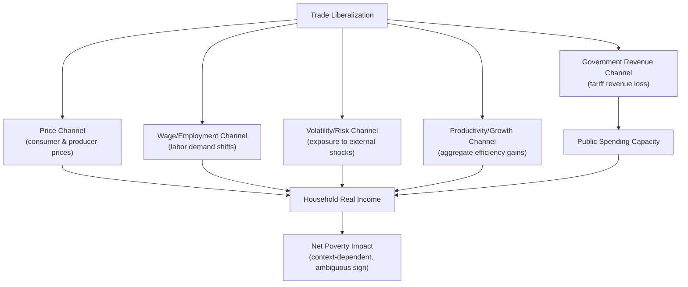

## Trade Liberalization and Poverty Impacts

### Overview

Trade liberalization — the reduction of tariffs, quotas, and other barriers to cross-border exchange — is one of the most contested policy areas in development economics. Its effects on poverty are theoretically ambiguous and empirically heterogeneous, depending on a country's factor endowments, initial institutions, labor market flexibility, and the specific channels through which liberalization transmits to households.

### Theoretical Channels Linking Trade to Poverty

**Key Points**

- Trade affects poverty through multiple, sometimes offsetting, channels rather than a single mechanism.
- The net poverty effect depends on which channel dominates in a given context.

1. **Price channel**: liberalization changes the relative prices of tradable goods (both consumer prices and producer prices for farmers/firms).
2. **Wage/employment channel**: changes in labor demand across sectors as trade shifts production toward comparative-advantage sectors.
3. **Government revenue channel**: many developing countries rely heavily on tariff revenue; its loss can affect public spending on health, education, and safety nets.
4. **Volatility/risk channel**: openness can expose households to external price and demand shocks (terms-of-trade volatility).
5. **Productivity/growth channel**: trade can raise aggregate productivity and long-run growth, with indirect effects on poverty via general equilibrium income growth.

### The Stolper-Samuelson Prediction and Its Limits

**Key Points**

- Standard H-O trade theory predicts that in a labor-abundant developing country, trade liberalization should raise returns to unskilled labor relative to capital — implying poverty reduction, since the poor typically supply unskilled labor.
- This prediction rests on assumptions frequently violated in developing-country contexts: perfect factor mobility across sectors, full employment, no trade in intermediate inputs, and homogeneous "unskilled labor."

**Why the Prediction Often Fails in Practice**

- **Labor market rigidities**: workers cannot costlessly move from a contracting import-competing sector (e.g., protected manufacturing) to an expanding export sector (e.g., agriculture or a different manufacturing niche), especially in the short-to-medium run. This creates transitional unemployment and localized poverty spikes even when long-run aggregate effects are positive.
- **Informality**: a large share of the labor force in many developing countries works in the informal sector, which does not adjust to trade shocks the way formal-sector theory predicts. Segmented labor markets mean formal-sector wage gains may not reach informal workers.
- **Skill-biased effects**: liberalization often coincides with technology adoption and imported capital goods that are complementary to skilled labor, raising the skill premium and widening inequality even in labor-abundant countries — a pattern documented across multiple Latin American trade liberalization episodes in the 1980s–1990s.
- **Trade in intermediates and GVC integration**: when a country imports intermediate inputs and exports finished or semi-finished goods, factor-content-based predictions from the simple H-O framework do not map cleanly onto observed wage outcomes.

### Empirical Evidence: Notable Case Studies

**India (1991 liberalization)**

- India's abrupt 1991 tariff liberalization is one of the most-studied cases due to sharp cross-district and cross-industry variation in tariff exposure, permitting a quasi-experimental research design.
- Findings from the influential Topalova (2010) study: districts more exposed to tariff declines (i.e., those specialized in industries with larger tariff cuts) experienced slower poverty reduction and slower consumption growth relative to less-exposed districts, at least in the years immediately following liberalization. [Unverified: specific coefficient magnitudes are study-dependent; broadly cited as evidence that trade liberalization's poverty effects can be regionally uneven and slow to materialize, not that liberalization increased poverty in absolute terms]
- Interpretation centers on limited inter-district labor mobility in India, meaning workers in negatively affected districts could not easily relocate to benefit from growth elsewhere.

**Vietnam (US-Vietnam Bilateral Trade Agreement, 2001)**

- Vietnam's trade liberalization with the US, which sharply lowered US tariffs on Vietnamese exports, is frequently cited as a case where poverty reduction and export growth moved together.
- Provinces more exposed to the export opportunity (via pre-existing industry specialization) saw faster poverty reduction and wage growth, plausibly aided by relatively flexible labor reallocation into the expanding export-oriented manufacturing sector. [Inference: the more favorable outcome relative to India's case is often attributed to Vietnam's more mobile labor force and complementary domestic reforms accompanying trade opening, though isolating trade's independent causal contribution from simultaneous reforms remains methodologically challenging]

**Mexico (NAFTA, 1994)**

- NAFTA led to significant tariff reductions and increased US-Mexico trade integration.
- Regions near the US border and those specializing in export-oriented manufacturing (maquiladoras) saw employment and wage gains, while some traditional agricultural regions (notably maize-producing areas) faced import competition from heavily subsidized US corn, with mixed to negative effects on smallholder farmer incomes. [Inference: net national poverty effects of NAFTA are difficult to disentangle from concurrent macroeconomic crises (the 1994–95 peso crisis) and other reforms occurring simultaneously]

### Household-Level Transmission: The Role of Net Buyer/Seller Status

**Key Points**

- For agricultural households, whether liberalization helps or hurts often hinges on whether the household is a **net buyer** or **net seller** of the affected commodity.
- Trade liberalization that raises the domestic price of an exportable food crop benefits net-seller (typically larger, better-off) farming households but can hurt net-buyer (often poorer, land-constrained) households who purchase food in the market.
- Conversely, liberalization that lowers the price of an importable staple (e.g., cheaper imported rice or wheat) helps poor net-buyer households but can hurt local producers.

$$\Delta \text{Welfare}_i \approx (\text{Net Sales Position}_i) \times \Delta P + \text{Wage/Employment Effects}_i$$

This simple framework underlies much of the household-level poverty analysis of price-shock transmission and clarifies why the same policy can have opposite poverty effects across different household types within the same country.

### Transmission and Pass-Through: Why Border Prices Don't Always Reach Households

**Key Points**

- The poverty impact of trade liberalization depends critically on **price pass-through**: the extent to which changes in border (world) prices are transmitted to domestic producer and consumer prices.
- Pass-through is often incomplete, especially for remote or poorly integrated rural markets, due to:
  - High transport and transaction costs
  - Weak market infrastructure and information asymmetries
  - Concentrated or non-competitive marketing chains (middlemen, monopsonistic buyers)
  - Exchange rate pass-through frictions
- **Implication**: liberalization's theoretical poverty benefits (or harms) may be substantially muted for rural poor households far from ports and major markets, effectively insulating — but also excluding — them from both gains and losses.

### Government Revenue and Fiscal Channel

**Key Points**

- Tariffs historically constitute a significant share of government revenue in many low-income countries, given administrative ease of collection at the border relative to domestic income or VAT systems.
- Liberalization-driven tariff revenue loss can squeeze fiscal space for pro-poor spending (health, education, safety nets) unless offset by:
  - Domestic tax reform (VAT expansion, improved income tax administration)
  - Donor/IFI compensatory financing
  - Efficiency gains from a broader tax base as the economy grows
- [Inference: the net fiscal-to-poverty effect depends heavily on whether replacement revenue sources are successfully implemented — a design and implementation-capacity question specific to each country, not a fixed feature of liberalization itself]

### Volatility, Risk, and Poverty Traps

**Key Points**

- Openness increases exposure to global commodity price swings and external demand shocks, which can be particularly damaging for poor households with limited ability to smooth consumption (limited savings, credit access, or insurance).
- A poor household hit by a negative terms-of-trade shock may be forced into harmful coping strategies: selling productive assets, withdrawing children from school, or reducing food consumption — mechanisms associated with entrenching poverty across generations (a poverty trap dynamic).
- This has motivated calls for complementary social protection systems (cash transfers, unemployment insurance, agricultural insurance) to accompany trade liberalization, rather than treating openness as a stand-alone policy.

### Complementary Policies for Pro-Poor Liberalization

| Complementary Policy | Purpose |
| --- | --- |
| Active labor market programs | Facilitate worker reallocation between contracting and expanding sectors |
| Social safety nets / cash transfers | Cushion transitional income losses for vulnerable households |
| Rural infrastructure investment | Improve price pass-through and market access for remote poor households |
| Domestic tax reform | Replace lost tariff revenue without regressive incidence |
| Trade adjustment assistance | Targeted support for import-competing sectors and displaced workers |
| Financial inclusion / credit access | Enable poor households to smooth consumption against trade-induced volatility |

### Aggregation Problem: Average Gains vs. Distributional Effects

**Key Points**

- A recurring theme in the empirical literature: trade liberalization frequently raises *aggregate* welfare and *average* income, consistent with standard trade theory, while simultaneously producing losers among specific subgroups — a tension between efficiency and distribution.
- Poverty headcount measures can mask this heterogeneity if only national averages are examined; disaggregated analysis by region, sector, and net-buyer/seller status is necessary to identify who bears adjustment costs.
- This has led to broader debate in the field over whether trade liberalization is a sufficient condition for poverty reduction, or merely a necessary but insufficient one requiring complementary domestic institutions and policies. [Speculation: some researchers frame this as evidence that "first-generation" reforms (trade opening) require "second-generation" reforms (labor markets, safety nets, institutions) to translate into consistent poverty reduction — this framing is a common heuristic in the literature rather than a strict empirical law]

### Diagram: Distributional Effects of Liberalization by Household Type

<svg xmlns="http://www.w3.org/2000/svg" viewBox="0 0 560 340" font-family="sans-serif">
<text x="280" y="24" text-anchor="middle" font-size="15" font-weight="bold" fill="#1a1a1a">Distributional Effects by Household Type (svg_diagram)</text>
<line x1="70" y1="290" x2="70" y2="50" stroke="#333" stroke-width="1.5" />
<line x1="70" y1="290" x2="520" y2="290" stroke="#333" stroke-width="1.5" />
<text x="20" y="60" font-size="11" fill="#333">Welfare</text>
<text x="490" y="312" font-size="11" fill="#333">Household Type</text>
<line x1="70" y1="180" x2="520" y2="180" stroke="#999" stroke-width="1" stroke-dasharray="4,4" />
<text x="480" y="175" font-size="10" fill="#999">baseline</text>
<rect x="110" y="90" width="55" height="90" fill="#2f855a" />
<text x="100" y="200" font-size="10" fill="#1a1a1a">Net-seller </text>
<text x="95" y="212" font-size="10" fill="#1a1a1a">farmer (export</text>
<text x="95" y="224" font-size="10" fill="#1a1a1a">crop price ↑)</text>
<rect x="210" y="140" width="55" height="40" fill="#c53030" />
<text x="200" y="200" font-size="10" fill="#1a1a1a">Net-buyer</text>
<text x="200" y="212" font-size="10" fill="#1a1a1a">rural poor</text>
<text x="200" y="224" font-size="10" fill="#1a1a1a">(food price ↑)</text>
<rect x="310" y="100" width="55" height="80" fill="#2f855a" />
<text x="300" y="200" font-size="10" fill="#1a1a1a">Export-sector</text>
<text x="300" y="212" font-size="10" fill="#1a1a1a">formal worker</text>
<rect x="410" y="150" width="55" height="30" fill="#c53030" />
<text x="400" y="200" font-size="10" fill="#1a1a1a">Import-competing</text>
<text x="400" y="212" font-size="10" fill="#1a1a1a">sector worker</text>
</svg>

### Related Topics

- Household net buyer/seller analysis and food price shock incidence
- Labor mobility frictions and trade adjustment costs
- Special and Differential Treatment (SDT) for developing countries under WTO
- Trade adjustment assistance program design
- Terms-of-trade volatility and commodity export dependence
- Global value chains and poverty outcomes
- Social protection systems as complements to trade openness
- Regional trade agreements and rules of origin effects on poor producers