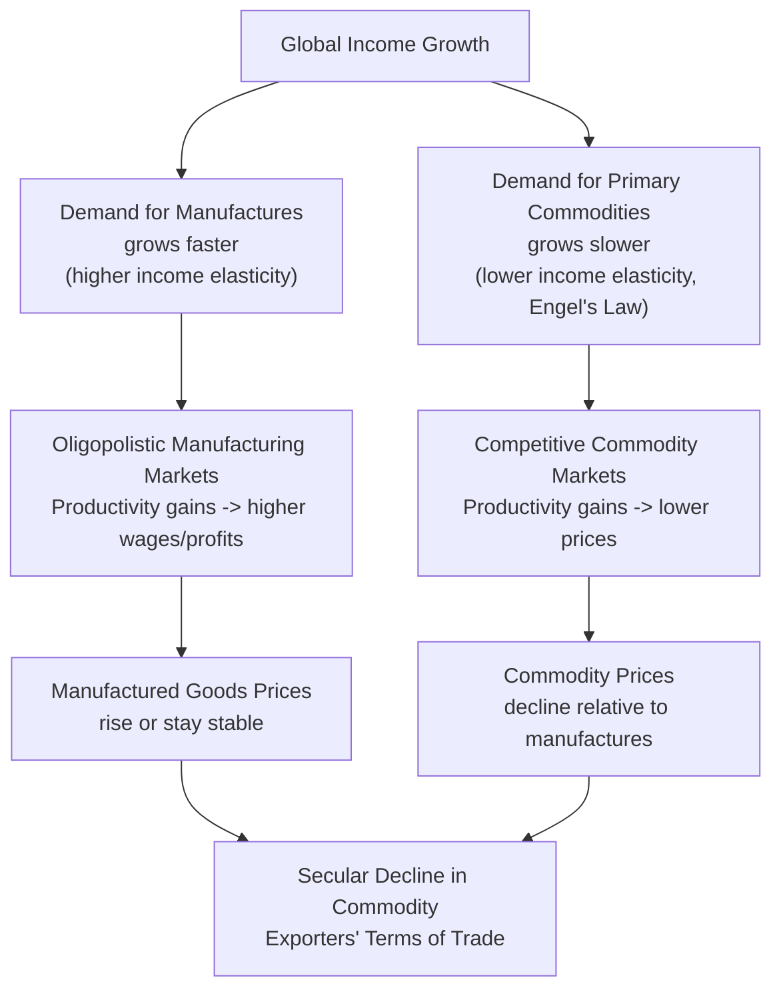

## Terms of Trade for Commodity Exporters

### Overview

Terms of trade (ToT) measure the ratio of export prices to import prices, capturing how much a country can import per unit of what it exports. For commodity-exporting developing countries, ToT dynamics are central to development outcomes because they determine real income, fiscal capacity, and macroeconomic stability independent of any domestic productivity change.

### Definition and Measurement

**Key Points**

- The **net barter terms of trade (NBTT)** is the standard measure:

$$NBTT = \frac{P_X}{P_M} \times 100$$

where $P_X$ is an index of export prices and $P_M$ is an index of import prices, typically normalized to 100 in a base year.

- A rising NBTT means a country can buy more imports per unit of exports — an improvement in welfare, all else equal.
- Related measures used in the literature:
  - **Income terms of trade**: $ITT = \frac{P_X}{P_M} \times Q_X$, where $Q_X$ is export volume — captures total import purchasing power, accounting for volume growth alongside price changes.
  - **Single factoral terms of trade**: adjusts NBTT for productivity changes in the export sector, capturing real income per unit of factor input rather than per unit of output.

### The Prebisch-Singer Hypothesis

**Key Points**

- Formulated independently by Raúl Prebisch and Hans Singer in 1950, this hypothesis argues that the terms of trade for primary commodity exporters exhibit a long-run secular decline relative to manufactured goods exporters.

**Underlying Mechanisms**

1. **Income elasticity asymmetry (Engel's Law)**: as global income rises, demand for primary commodities (especially food) grows more slowly than demand for manufactured goods, because the income elasticity of demand for primary goods is lower than for manufactures.
2. **Market structure asymmetry**: primary commodity markets tend to be competitive with many small producers and flexible prices, while manufacturing markets in industrialized countries are more oligopolistic with administered pricing and strong labor unions — meaning productivity gains in manufacturing translate into higher wages/profits rather than lower prices, while productivity gains in commodities are passed through as lower prices.
3. **Technological substitution**: synthetic substitutes for natural raw materials (e.g., synthetic rubber, fibers) have historically reduced demand growth for certain primary commodities.
4. **Low price and income elasticities together**: commodity price volatility is amplified because both supply and demand for many primary commodities respond sluggishly to price changes in the short run.

### Empirical Status of the Hypothesis

**Key Points**

- Empirical testing has produced mixed and time-period-dependent results since Prebisch and Singer's original observations.
- Studies covering the late 19th century through mid-20th century found some support for declining relative commodity prices, though methodological critiques (choice of base year, index construction, quality/composition changes in traded manufactures) have long been raised. [Unverified: the magnitude and statistical robustness of the secular trend vary substantially by the specific time window, commodity basket, and econometric method used across different studies]
- More recent research using longer time series and unit-root/structural-break econometric techniques has found evidence more consistent with intermittent structural breaks and high volatility around a roughly flat or mildly declining trend, rather than a smooth continuous decline. [Inference: the debate has partly shifted from "is there a trend" to "how should breaks and supercycles be modeled," reflecting an active and unsettled area of research]
- The commodity "super-cycle" of the 2000s (driven substantially by Chinese industrialization and demand for metals, energy, and food) is frequently cited as a case where ToT for commodity exporters improved sharply for over a decade, complicating any claim of a monotonic secular decline. [Inference: whether such cycles represent a permanent regime shift or a temporary deviation around a still-declining long-run trend remains debated]

### Terms of Trade Volatility

**Key Points**

- Beyond the *level* or *trend* of ToT, commodity exporters face substantially higher **ToT volatility** than diversified manufacturing exporters, due to:
  - Inelastic short-run supply (production cycles, especially in agriculture and extractives, cannot adjust quickly)
  - Inelastic short-run demand (many commodities are inputs with few immediate substitutes)
  - Speculative financial flows into commodity futures markets amplifying price swings
  - Weather, geopolitical, and supply-disruption shocks concentrated in a narrow set of exportable goods
- High ToT volatility has been empirically associated with:
  - Slower and more volatile GDP growth
  - Boom-bust fiscal cycles (procyclical government spending during price booms, followed by painful fiscal contraction during busts)
  - Exchange rate instability
  - Higher investment risk and underinvestment due to income uncertainty

### Macroeconomic and Development Consequences

**1. Dutch Disease**

A ToT boom driven by a commodity price surge can cause real exchange rate appreciation, which:

- Raises the relative cost of non-resource tradable sectors (manufacturing, agriculture), undermining their international competitiveness
- Shifts labor and capital toward the booming resource sector and non-tradable services
- Can leave the economy structurally worse off once the commodity boom ends, having "de-industrialized" during the boom period

**2. Procyclical Fiscal Policy**

- Governments in commodity-exporting countries often increase spending during ToT booms (higher resource revenues) and are forced into painful cuts during busts, amplifying rather than smoothing the business cycle — the opposite of textbook countercyclical fiscal policy.
- This pattern has motivated the widespread adoption of **sovereign wealth funds** and **fiscal rules** (e.g., structural balance rules, resource revenue smoothing formulas) designed to save windfall revenue during booms for use during busts.

**3. Debt Sustainability**

- Countries often borrow against expected future commodity revenue during ToT upswings; when prices fall, debt service burdens rise relative to (now lower) export earnings, contributing to historical debt crises among commodity-dependent economies. [Inference: this dynamic is frequently cited as a contributing factor in various developing-country debt episodes, though each crisis typically involves multiple compounding causes beyond ToT alone]

**4. Investment and Growth Uncertainty**

- Persistent ToT volatility raises the risk premium demanded by investors, potentially depressing long-run investment rates in physical and human capital — a channel through which volatility (not just the trend level) directly affects long-run development outcomes.

### Diagram: Terms of Trade Volatility and Fiscal Cycle

<svg xmlns="http://www.w3.org/2000/svg" viewBox="0 0 560 320" font-family="sans-serif">
<text x="280" y="24" text-anchor="middle" font-size="15" font-weight="bold" fill="#1a1a1a">Commodity Price Cycle and Procyclical Fiscal Policy (svg_diagram)</text>
<line x1="60" y1="270" x2="60" y2="50" stroke="#333" stroke-width="1.5" />
<line x1="60" y1="270" x2="520" y2="270" stroke="#333" stroke-width="1.5" />
<text x="10" y="60" font-size="11" fill="#333">Value</text>
<text x="490" y="292" font-size="11" fill="#333">Time</text>
<path d="M 60 220 Q 150 100 240 150 T 420 230 T 500 190" stroke="#c53030" stroke-width="2.5" fill="none" />
<text x="330" y="120" font-size="11" fill="#c53030">Commodity Price / ToT</text>
<path d="M 60 230 Q 150 150 240 190 T 420 250 T 500 220" stroke="#2b6cb0" stroke-width="2.5" stroke-dasharray="6,3" fill="none" />
<text x="320" y="255" font-size="11" fill="#2b6cb0">Government Spending</text>
<line x1="150" y1="270" x2="150" y2="105" stroke="#999" stroke-dasharray="2,2" />
<text x="110" y="290" font-size="10" fill="#666">Boom: spend up</text>
<line x1="420" y1="270" x2="420" y2="235" stroke="#999" stroke-dasharray="2,2" />
<text x="390" y="300" font-size="10" fill="#666">Bust: forced cuts</text>
</svg>

### Policy Responses for Commodity Exporters

| Policy Instrument | Objective | Mechanism |
| --- | --- | --- |
| Sovereign wealth funds | Smooth spending across the price cycle | Save windfall revenue during booms, draw down during busts |
| Fiscal rules (structural balance) | Prevent procyclical spending | Budget against a smoothed/reference commodity price, not spot price |
| Export diversification | Reduce ToT volatility exposure | Shift toward manufactured goods/services with more stable relative prices |
| Commodity price hedging | Manage short-run revenue risk | Futures, options, or swap contracts on key export commodities |
| Local content and value addition | Capture more value per unit exported | Move up the value chain (e.g., refining, processing) rather than exporting raw materials |
| Countercyclical monetary/exchange rate policy | Mitigate Dutch Disease effects | Sterilization of foreign exchange inflows, flexible exchange rate regimes |

### Diversification as a Structural Response

**Key Points**

- Because both the secular-decline concern (Prebisch-Singer) and the volatility concern point toward the same policy conclusion, **export diversification** away from primary commodity dependence has long been a central prescription in development economics.
- Diversification strategies include:
  - Horizontal diversification (adding new primary commodities to reduce single-commodity exposure)
  - Vertical diversification / value addition (processing raw commodities domestically before export)
  - Structural diversification (building manufacturing or services export capacity)
- [Speculation: some researchers argue that natural resource abundance itself can crowd out diversification incentives via exchange rate effects and rent-seeking political economy dynamics — this "resource curse" framing is influential but contested, with counterexamples such as Botswana and Norway frequently cited as resource-abundant countries that avoided the classic resource curse pattern]

### Related Topics

- Dutch Disease and the resource curse
- Sovereign wealth funds and fiscal rule design
- Commodity price volatility and macroeconomic stabilization
- Export diversification strategies for resource-dependent economies
- Comparative advantage and trade theory applications
- Debt sustainability in commodity-exporting economies
- Global value chains and value addition in extractive industries