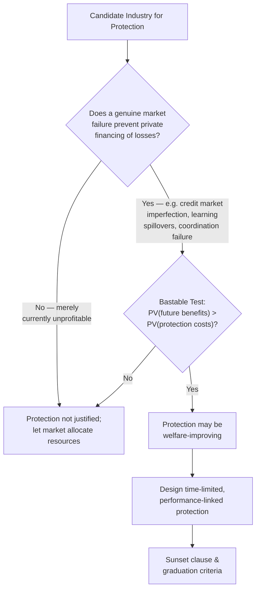

## Trade Policy and Infant Industry Protection

### Overview

Infant industry protection is a trade policy strategy in which a government temporarily shields a nascent domestic industry from foreign competition — typically via tariffs, quotas, or subsidies — on the premise that the industry will eventually become internationally competitive once it matures. It represents a major theoretical and historical counterpoint to free-trade prescriptions rooted in static comparative advantage.

### Theoretical Foundations

**Key Points**

- The infant industry argument was articulated by Alexander Hamilton (1791) and later formalized by Friedrich List (1841), and remains one of the oldest justifications for deviating from free trade in development economics.
- Core logic: a country may have *latent* or *dynamic* comparative advantage in a sector it does not yet possess *static* (current) comparative advantage in, due to:
  - **Learning-by-doing**: production costs fall with cumulative output/experience (dynamic scale economies), but new entrants cannot survive initial competition against established, already-experienced foreign firms.
  - **External economies of scale**: benefits from industry clustering (skilled labor pools, specialized suppliers, knowledge spillovers) that take time to develop and won't emerge without a critical mass of initial domestic production.
  - **Capital market imperfections**: nascent firms may be unable to borrow against future profits to cover initial losses, especially in developing countries with underdeveloped financial markets — a market failure protection is meant to substitute for.
  - **Coordination failures**: upstream and downstream industries may need to develop simultaneously, but no single firm has the incentive to invest first without assurance others will follow.

### Formal Conditions for a Valid Infant Industry Case

**Key Points**

- Not every case of temporary industry losses justifies protection. The economic literature (building on the **Bastable test** and later refinements) specifies conditions under which protection is genuinely welfare-improving:

1. **Bastable Test**: the discounted future gains from the industry (once mature) must exceed the discounted costs of protection incurred during the infancy period.

$$\sum_{t=0}^{T} \frac{B_t}{(1+r)^t} > \sum_{t=0}^{T} \frac{C_t}{(1+r)^t}$$

where $B_t$ represents future benefits (post-maturity profits/surplus net of any subsidy needed) and $C_t$ represents the costs of protection (consumer surplus loss, misallocation) during the protected period, discounted at rate $r$.

2. **Mill test / market failure test**: protection is justified only if a genuine market failure (not merely private unprofitability) prevents the industry from financing its own learning period — otherwise, private capital markets *should* fund the initial losses if the eventual returns are truly there. This is significant because it implies infant industry protection is only a second-best solution to an *underlying* market failure (e.g., in credit markets), not a first-best case for permanent trade intervention. [Inference: this distinction between "private unprofitability" and "genuine market failure" is central in the literature's critique of overuse of the infant industry argument, though identifying which case applies to any specific real-world industry is empirically difficult]

### Instruments of Infant Industry Protection

| Instrument | Mechanism | Typical Use |
| --- | --- | --- |
| Tariffs | Raise import price, protect domestic price floor | Classic instrument; direct but distorts consumer prices |
| Import quotas | Physically limit import volume | Guarantees market share but no revenue for government |
| Production subsidies | Directly lower domestic production costs | Avoids raising consumer prices, but requires fiscal capacity |
| Export subsidies | Support competitiveness in foreign markets while the industry matures | WTO-restricted for most countries under current rules |
| Directed/subsidized credit | Address capital market imperfections directly | Targets the underlying market failure rather than trade itself |
| Local content requirements | Mandate domestic sourcing of inputs | Builds upstream supplier base and linkages |
| Government procurement preferences | Guarantee demand for domestic infant industry output | Common in early-stage industrial policy |

### Historical Applications

**Key Points**

- **United States (19th century)**: used substantial tariff protection for manufacturing during its own industrialization, a historical fact frequently invoked in debates over whether industrialized countries are prescribing free trade to developing countries that they themselves did not practice during their own development phase ("kicking away the ladder" critique, associated with economist Ha-Joon Chang).
- **East Asian industrializers (South Korea, Taiwan, Japan)**: employed selective, time-limited protection and directed credit for targeted industries (steel, automobiles, electronics, shipbuilding) from roughly the 1960s–1980s, combined with export-performance requirements that forced protected firms to eventually compete internationally — a model often described as **performance-linked protection**.
- **Latin America (1950s–1980s)**: pursued broader, less time-limited **import substitution industrialization (ISI)** across many sectors simultaneously, generally without the same performance/export discipline mechanisms.

**Comparative Outcomes**

- The East Asian and Latin American experiences are commonly contrasted in the development economics literature to illustrate that infant industry protection's success appears to hinge heavily on *design features* rather than the mere presence or absence of protection:
  - **Selectivity**: targeting a limited number of sectors versus economy-wide protection.
  - **Time limits and sunset clauses**: whether protection was explicitly temporary versus effectively permanent.
  - **Performance requirements**: whether firms had to meet export or efficiency benchmarks to retain support (reciprocal control mechanisms).
  - **Export orientation**: whether protected firms were eventually pushed to compete in international markets (disciplining device) versus remaining permanently reliant on protected domestic markets.
- [Inference: while this contrast is widely cited, attributing East Asian industrial success purely to industrial policy design versus other concurrent factors (land reform, high savings/investment rates, human capital investment, favorable Cold War-era market access) remains an active area of scholarly debate rather than a settled causal finding]

### Risks and Critiques of Infant Industry Protection

**Key Points**

- **Failure to "graduate"**: protected industries often fail to become internationally competitive and instead become permanently dependent on protection — sometimes termed "infant industries that never grow up." Without genuine sunset clauses or performance discipline, protection can persist indefinitely.
- **Rent-seeking and political economy capture**: once an industry receives protection, it has strong incentives to lobby for its continuation regardless of its actual competitiveness trajectory, making protection politically difficult to remove even after any legitimate infancy period has passed.
- **Consumer welfare costs**: protection raises domestic prices for the protected good, functioning as an implicit tax on consumers (often including poorer households) and on downstream industries that use the protected good as an input.
- **Resource misallocation**: capital and labor directed toward a protected sector may have higher-value uses elsewhere in the economy, particularly if the infant industry case was weak to begin with.
- **Retaliation and trade agreement constraints**: protection can invite retaliatory tariffs from trading partners, and under WTO commitments, many traditional protection tools (tariff bindings, prohibited subsidies) are now legally constrained for member countries, narrowing the policy space historically available to earlier industrializers. [Fact, though the degree of remaining policy space varies by WTO commitment level and country-specific agreements]

### Alternative and Complementary Approaches

**Key Points**

- Given the risks of protection, development economists have proposed alternative instruments that address the underlying market failures more directly:
  - **Direct subsidies rather than tariffs**: subsidies are generally considered more transparent and less distortionary to consumer prices than tariffs, though they carry direct fiscal costs.
  - **Public investment in complementary infrastructure**: ports, power, and logistics that reduce the "learning cost" burden industries must otherwise bear alone.
  - **Human capital and R&D investment**: addressing skill and technology gaps directly rather than only shielding output prices.
  - **Special Economic Zones (SEZs)**: provide a geographically bounded testing ground for infant industries with reduced regulatory and infrastructure barriers, without extending protection economy-wide.
  - **Time-bound and performance-linked support**: explicit sunset clauses tied to measurable competitiveness benchmarks (export share targets, cost-reduction milestones) rather than open-ended protection.

### Diagram: Cost-Benefit Profile Over the Protection Period

<svg xmlns="http://www.w3.org/2000/svg" viewBox="0 0 540 340" font-family="sans-serif">
<text x="270" y="24" text-anchor="middle" font-size="15" font-weight="bold" fill="#1a1a1a">Infant Industry: Cost/Benefit Over Time (svg_diagram)</text>
<line x1="60" y1="290" x2="60" y2="50" stroke="#333" stroke-width="1.5" />
<line x1="60" y1="290" x2="500" y2="290" stroke="#333" stroke-width="1.5" />
<text x="15" y="60" font-size="11" fill="#333">Net Surplus</text>
<text x="470" y="312" font-size="11" fill="#333">Time</text>
<line x1="60" y1="180" x2="500" y2="180" stroke="#999" stroke-dasharray="3,3" />
<text x="470" y="175" font-size="10" fill="#999">break-even</text>
<path d="M 60 180 L 250 260 L 320 180 L 500 90" stroke="#2b6cb0" stroke-width="2.5" fill="none" />
<text x="120" y="245" font-size="10" fill="#c53030">Protection cost period</text>
<text x="380" y="120" font-size="10" fill="#2f855a">Mature competitive gains</text>
<line x1="320" y1="290" x2="320" y2="180" stroke="#666" stroke-dasharray="2,2" />
<text x="290" y="305" font-size="10" fill="#666">"Graduation" point</text>
<rect x="140" y="200" width="120" height="55" fill="#c53030" opacity="0.15" />
<text x="145" y="230" font-size="9" fill="#c53030">Area = discounted costs</text>
<rect x="330" y="95" width="150" height="80" fill="#2f855a" opacity="0.15" />
<text x="335" y="130" font-size="9" fill="#2f855a">Area = discounted benefits</text>
</svg>

### WTO Constraints on Modern Infant Industry Policy

**Key Points**

- The WTO's **Agreement on Subsidies and Countervailing Measures (SCM)** restricts certain subsidy types (notably export subsidies for most economies above defined income thresholds), limiting one traditional infant industry tool.
- **Special and Differential Treatment (SDT)** provisions grant developing and least-developed countries longer implementation timelines and some flexibility in tariff bindings, though the scope has narrowed compared to the policy space available to earlier industrializers (e.g., South Korea in the 1960s-70s operated under looser multilateral trade rules than exist today). [Fact regarding the general trend of narrowing SDT scope, though specific entitlements vary by country classification and negotiated commitments]
- This has shifted contemporary infant-industry-style policy toward tools less constrained by WTO rules: domestic subsidies not tied to export performance, public R&D investment, SEZs, and non-tariff regulatory support.

### Related Topics

- Import substitution industrialization vs. export-led growth
- Special Economic Zones (SEZs) as industrial policy tools
- WTO Agreement on Subsidies and Countervailing Measures
- Credit market imperfections and industrial policy rationale
- East Asian developmental state model
- Comparative advantage and trade theory applications
- Political economy of trade protection and rent-seeking