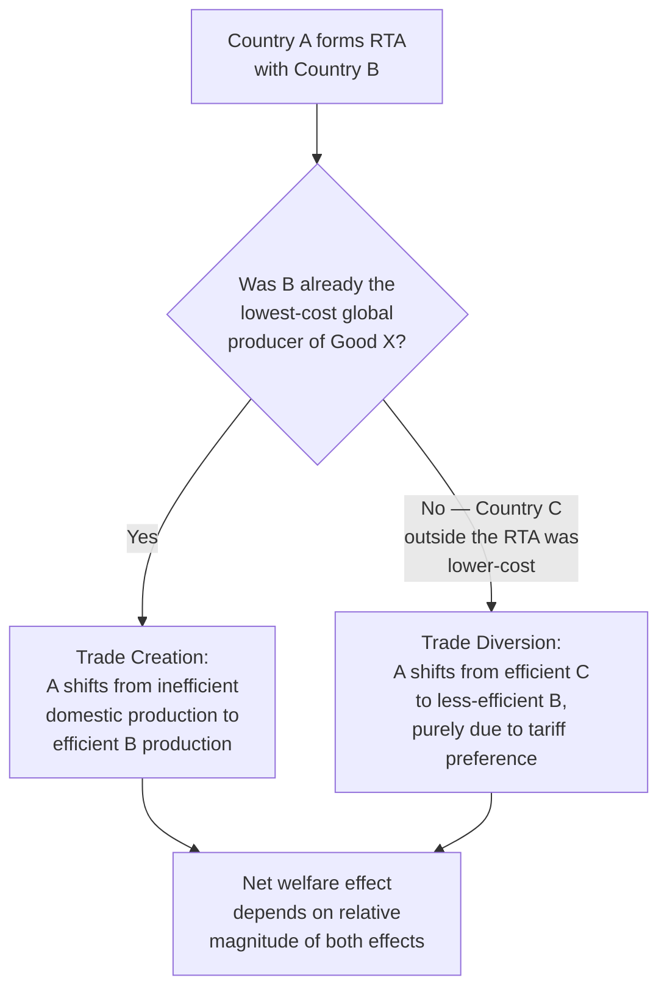

## Regional Trade Agreements and Developing Countries

### Overview

Regional trade agreements (RTAs) — encompassing free trade areas, customs unions, and deeper integration arrangements — have proliferated since the 1990s and represent a major channel through which developing countries pursue trade liberalization outside the multilateral WTO framework. Their development impact depends heavily on design, partner selection, and complementary domestic policy.

### Typology of Regional Integration Arrangements

**Key Points**

- Regional integration exists on a spectrum of increasing depth, following the classic Balassa (1961) stages of economic integration:

| Stage | Defining Feature | Example |
| --- | --- | --- |
| Preferential Trade Area (PTA) | Reduced (not eliminated) tariffs among members | Early ASEAN arrangements |
| Free Trade Area (FTA) | Zero tariffs among members; independent external tariffs | NAFTA/USMCA, AfCFTA (goods) |
| Customs Union | FTA + common external tariff | MERCOSUR, East African Community |
| Common Market | Customs union + free factor mobility (labor, capital) | COMESA (partial) |
| Economic Union | Common market + harmonized macroeconomic/fiscal policy | European Union |
| Monetary Union | Economic union + shared currency | Eurozone, CFA franc zone |

- Deeper integration generally requires greater sovereignty pooling and institutional capacity — a key constraint for many developing-country groupings that struggle to move beyond FTA-level commitments.

### Trade Creation vs. Trade Diversion

**Key Points**

- The foundational analytical framework for evaluating RTAs, developed by Jacob Viner (1950), distinguishes two opposing welfare effects:

1. **Trade creation**: an RTA member shifts consumption from a less efficient domestic producer to a more efficient producer within the trade bloc, made possible because the tariff is removed for a producer who is *genuinely* more efficient than the domestic alternative. This is welfare-improving.
2. **Trade diversion**: an RTA member shifts import demand away from a more efficient non-member producer toward a less efficient member producer, purely because the tariff is removed for the member but retained against the outside world. This is welfare-reducing, since resources are reallocated toward higher-cost production.

$$\Delta W = \underbrace{(\text{Trade Creation Gain})}_{\text{efficiency gain}} - \underbrace{(\text{Trade Diversion Loss})}_{\text{efficiency loss}}$$

The net welfare effect of an RTA is ambiguous in general and depends on the relative magnitude of these two effects — a country's own economic theory does not guarantee that regional liberalization improves welfare relative to non-discriminatory (most-favored-nation) liberalization.

### Determinants of Trade Diversion Risk

**Key Points**

- The likelihood that an RTA produces net trade diversion (harmful for the member and for excluded efficient producers) is higher when:
  - The RTA's external tariff against non-members remains high (larger price wedge to divert trade).
  - Member countries have similar factor endowments and cost structures (little genuine comparative advantage to exploit within the bloc — less scope for trade creation).
  - The bloc excludes highly efficient global producers who would otherwise supply the market absent preferential treatment.
- Diversion risk is generally lower when RTA partners have highly complementary economies (large opportunity for genuine trade creation) and low external tariffs (small preference margin to distort trade patterns).

### South-South vs. North-South RTAs

**Key Points**

- **South-South RTAs** (between developing countries, e.g., MERCOSUR, ASEAN, SADC, ECOWAS): often involve partners with relatively similar factor endowments and underdeveloped complementary production structures, which several studies suggest may raise the relative risk of trade diversion — since there may be less pre-existing comparative-advantage-based trade to "create," while diverting sourcing away from efficient extra-bloc suppliers (often industrialized countries). [Inference: this is a commonly cited theoretical concern in the literature rather than a universally observed empirical outcome; actual trade creation/diversion balance varies significantly by specific agreement and sector]
- **North-South RTAs** (between a developing and developed country, e.g., NAFTA/USMCA, EU-Africa Economic Partnership Agreements): typically involve more complementary factor endowments (labor-abundant South, capital/technology-abundant North), theoretically offering greater scope for genuine trade creation and technology transfer, but also raising concerns about:
  - Asymmetric bargaining power in negotiating agreement terms
  - Deeper provisions (intellectual property, investment protection, regulatory standards) that may constrain developing-country policy space beyond simple tariff matters
  - Adjustment costs falling disproportionately on the less diversified, lower-capacity developing-country partner

### Deep vs. Shallow Integration

**Key Points**

- Modern RTAs increasingly extend beyond tariff reduction ("shallow" integration) into **"deep" integration**: harmonized regulatory standards, intellectual property rules, investment protections, services liberalization, competition policy, and dispute settlement mechanisms.
- Deep provisions can generate additional development benefits (regulatory credibility, investor confidence, technology transfer) but also raise concerns:
  - **Policy space constraints**: developing-country governments may face reduced ability to use industrial policy tools (subsidies, local content requirements, capital controls) once locked into deep-integration commitments.
  - **Implementation capacity gaps**: harmonizing to developed-country regulatory standards (sanitary/phytosanitary rules, intellectual property enforcement) can impose significant administrative and compliance costs on lower-capacity states.
  - **"WTO-plus" and "WTO-extra" provisions**: many modern RTAs include commitments that go beyond (WTO-plus) or entirely outside (WTO-extra) existing multilateral obligations, effectively creating a parallel and sometimes more restrictive rules framework for signatories.

### Rules of Origin

**Key Points**

- **Rules of origin (RoO)** determine which goods qualify for preferential tariff treatment within an RTA, typically requiring a minimum threshold of value-added or substantial transformation occurring within member territory.
- RoO are economically significant for developing countries because:
  - Restrictive RoO can prevent developing-country exporters from benefiting from preferences if their production relies heavily on imported inputs from outside the bloc (common in early-stage manufacturing, e.g., textile assembly using imported fabric).
  - Complex, differentiated RoO across multiple overlapping RTAs create a "spaghetti bowl" of administrative complexity, raising compliance costs disproportionately for smaller firms with limited customs/legal capacity — a burden that falls more heavily on developing-country exporters than large multinational firms.
  - Cumulation provisions (allowing inputs from other specified countries to count toward origin requirements) can mitigate this problem when included, particularly relevant for regional value chain development.

### Case Study: African Continental Free Trade Area (AfCFTA)

**Key Points**

- AfCFTA, which entered into force in 2019 with trading operationally commencing in 2021, is among the largest RTAs by number of member states, aiming to create a single continental market covering the African Union's members.
- Rationale reflects classic South-South integration goals: boosting historically low intra-African trade shares (long cited as far below intra-regional trade shares in other continents), encouraging manufacturing value chains, and improving negotiating leverage in global trade forums.
- Key implementation challenges commonly discussed in the literature include: infrastructure and logistics gaps limiting the practical ability to trade across borders even with tariffs removed, revenue-dependent governments' concerns over tariff revenue loss, harmonizing rules of origin across diverse economies, and phased tariff liberalization schedules. [Unverified: given AfCFTA's relatively recent and still-phasing implementation, robust ex-post empirical impact studies remain limited relative to older RTAs like NAFTA or MERCOSUR — a search for current implementation status would be advisable for time-sensitive specifics]

### RTA Proliferation and the "Spaghetti Bowl" Problem

**Key Points**

- The rapid growth in overlapping bilateral and regional agreements (a phenomenon economist Jagdish Bhagwati termed the "spaghetti bowl effect") creates several development-relevant complications:
  - Multiple, differing RoO and tariff schedules for the same product depending on export destination increase compliance costs.
  - Smaller and lower-capacity developing-country trade ministries and customs agencies face disproportionate administrative burden negotiating and implementing numerous overlapping agreements simultaneously.
  - Preference erosion: as more countries gain preferential access to a given market through separate agreements, the relative value of any single country's preferential margin shrinks over time.

### Diagram: Trade Creation and Diversion Effects

<svg xmlns="http://www.w3.org/2000/svg" viewBox="0 0 540 340" font-family="sans-serif">
<text x="270" y="24" text-anchor="middle" font-size="15" font-weight="bold" fill="#1a1a1a">RTA Sourcing Shift: Creation vs. Diversion (svg_diagram)</text>
<rect x="60" y="70" width="140" height="60" fill="#e2e8f0" stroke="#333" />
<text x="80" y="105" font-size="12" fill="#1a1a1a">Country A</text>
<text x="70" y="122" font-size="10" fill="#666">(importer, forms RTA)</text>
<rect x="60" y="220" width="140" height="60" fill="#c6f6d5" stroke="#2f855a" />
<text x="80" y="255" font-size="12" fill="#1a1a1a">Domestic Producer</text>
<text x="85" y="272" font-size="10" fill="#666">(least efficient)</text>
<rect x="340" y="70" width="140" height="60" fill="#bee3f8" stroke="#2b6cb0" />
<text x="365" y="105" font-size="12" fill="#1a1a1a">RTA Partner B</text>
<text x="360" y="122" font-size="10" fill="#666">(mid-cost producer)</text>
<rect x="340" y="220" width="140" height="60" fill="#fed7d7" stroke="#c53030" />
<text x="365" y="255" font-size="12" fill="#1a1a1a">Efficient Non-Member C</text>
<text x="365" y="272" font-size="10" fill="#666">(lowest global cost)</text>
<line x1="200" y1="100" x2="340" y2="100" stroke="#2f855a" stroke-width="2.5" marker-end="url(#arrow1)" />
<text x="215" y="90" font-size="10" fill="#2f855a">Trade Creation (if B cheaper than A domestic)</text>
<line x1="340" y1="250" x2="200" y2="250" stroke="#c53030" stroke-width="2.5" stroke-dasharray="5,3" marker-end="url(#arrow2)" />
<text x="215" y="300" font-size="10" fill="#c53030">Trade Diversion: A shifts away from cheaper C toward B</text>
</svg>

### RTAs and Multilateralism: Building Blocks or Stumbling Blocks?

**Key Points**

- A long-standing debate (associated with economists such as Jagdish Bhagwati) concerns whether RTA proliferation ultimately supports or undermines progress toward broader multilateral trade liberalization:
  - **"Building blocks" view**: RTAs create momentum, political constituencies for openness, and precedent for deeper liberalization that eventually generalizes to multilateral agreements.
  - **"Stumbling blocks" view**: RTAs create vested interests in preferential access that reduce incentives to support further multilateral liberalization (since preference-holders would lose their relative advantage if tariffs fell for everyone), and divert negotiating resources and political capital away from WTO-level processes.
- [Speculation: empirical resolution of this debate remains contested and is likely context-dependent on the specific agreements, sequencing, and political economy conditions involved, rather than resolvable as a general universal rule]

### Related Topics

- Trade creation and trade diversion analysis (Viner framework)
- African Continental Free Trade Area (AfCFTA) implementation
- Rules of origin and preference utilization rates
- WTO multilateralism vs. regionalism debate
- Global value chains and regional production networks
- Comparative advantage and trade theory applications
- Special and Differential Treatment provisions in trade agreements