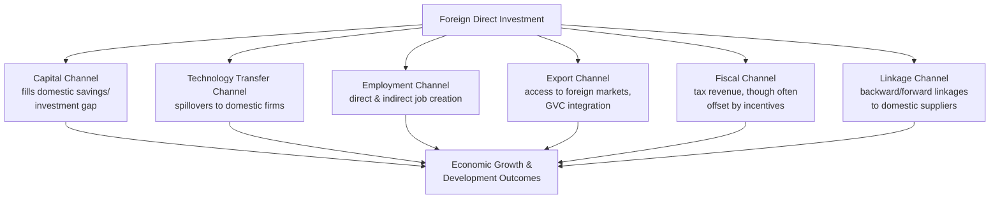

## Foreign Direct Investment and Development

### Overview

Foreign direct investment (FDI) — cross-border investment involving a lasting interest and significant control in an enterprise (conventionally defined as ownership of 10% or more of voting stock) — is a central channel through which developing countries seek capital, technology, and managerial know-how. Its development effects are theoretically plausible but empirically heterogeneous, depending heavily on FDI type, sector, and host-country absorptive capacity.

### Definitions and Measurement

**Key Points**

- **FDI** is distinguished from **foreign portfolio investment (FPI)** by the presence of lasting interest and managerial control, versus purely financial holdings without control rights.
- Standard measurement categories:
  - **FDI inflows/outflows**: financial flow in a given period.
  - **FDI stock**: cumulative value of foreign-owned assets at a point in time.
  - **Greenfield investment**: building new facilities/operations from scratch.
  - **Brownfield investment / Mergers & Acquisitions (M&A)**: acquiring existing domestic firms or assets.
- This distinction matters for development impact: greenfield investment directly adds new productive capacity and often new jobs, while M&A primarily transfers ownership of existing assets and may not expand capacity, though it can still bring technology, management practices, or capital for reinvestment.

### Theoretical Channels of FDI's Development Impact

**Key Points**

- FDI is theorized to benefit developing host economies through several distinct channels, each with a corresponding potential limitation:

1. **Capital channel**: FDI supplements scarce domestic savings, financing investment beyond what domestic capital markets alone could support — theoretically most valuable in capital-scarce, low-income economies.
2. **Technology transfer / spillover channel**: presence of foreign firms with superior technology and management practices can spill over to domestic firms via labor mobility (workers trained by foreign firms later join domestic firms), demonstration effects, and competitive pressure forcing domestic firm upgrading.
3. **Employment channel**: direct job creation at foreign-owned facilities, plus indirect employment through supplier and service linkages.
4. **Export channel**: FDI, particularly export-oriented FDI, can integrate host economies into global value chains (GVCs) and provide access to foreign markets and distribution networks the domestic economy previously lacked.
5. **Linkage channel**: backward linkages (foreign firms sourcing inputs from domestic suppliers) and forward linkages (domestic firms using foreign-firm outputs as inputs) can diffuse benefits beyond the foreign enterprise itself.

### Absorptive Capacity: Why Spillovers Are Conditional

**Key Points**

- A central finding across the empirical literature is that FDI spillover benefits are not automatic — they depend on host-country **absorptive capacity**, meaning the domestic economy's ability to actually utilize and adapt the technology and knowledge FDI brings.
- Key absorptive capacity determinants identified in the literature:
  - **Human capital levels**: a workforce with sufficient baseline education/skill to learn from and eventually replicate foreign techniques.
  - **Technological gap size**: if the gap between foreign and domestic firm technology is too large, domestic firms may be unable to absorb the spillover (sometimes framed as an inverted-U relationship between technology gap and spillover magnitude).
  - **Domestic firm competitiveness and market structure**: whether domestic firms have the capacity and incentive to compete/adapt rather than simply being crowded out.
  - **Financial market development**: domestic firms' ability to finance the investments needed to adopt spillover knowledge.
- [Inference: the empirical literature on FDI spillovers has produced notably mixed results across studies — some find robust positive horizontal (same-industry) spillovers, others find them weak, negative, or present only in vertical (supplier/buyer) linkages rather than horizontal ones. This heterogeneity is generally attributed to the absorptive capacity factors above rather than indicating spillovers are illusory, but the literature has not converged on a single generalizable magnitude]

### Types of FDI Relevant to Development

| FDI Type | Motivation | Development Relevance |
| --- | --- | --- |
| Resource-seeking | Access to natural resources (oil, minerals, agricultural land) | High capital inflow but often low linkages/spillovers to broader economy (enclave effect) |
| Market-seeking | Access to a growing domestic consumer market | Depends on local content and reinvestment; may substitute for rather than complement domestic firms |
| Efficiency-seeking | Access to lower-cost labor for export-oriented production | Central to GVC integration and export-led manufacturing strategies (e.g., garment/electronics assembly) |
| Strategic asset-seeking | Access to technology, brands, or strategic positioning | Less common as inbound FDI to developing countries; more typical of developed-to-developed flows |

### The "Enclave Economy" Problem

**Key Points**

- **Resource-seeking FDI** in extractive sectors (oil, mining) is frequently associated with weak broader development spillovers, a pattern termed the **enclave economy** problem:
  - Extractive operations are often capital-intensive with limited direct employment relative to capital invested.
  - Specialized equipment and inputs are frequently imported rather than sourced domestically, limiting backward linkages.
  - Profits may be substantially repatriated rather than reinvested locally, especially where transfer pricing and profit-shifting reduce the effective host-country tax take.
  - Physical infrastructure built for extraction (rail lines, ports) is often single-purpose, serving the resource export function without broader economic connectivity benefits.
- This dynamic connects to the broader **resource curse** literature and reinforces why FDI type/sector matters more for development outcomes than aggregate FDI volume alone.

### FDI, Global Value Chains, and Export-Led Growth

**Key Points**

- **Efficiency-seeking FDI** integrated into global value chains has historically been central to East Asian export-led industrialization, where multinational firms established assembly and manufacturing operations to leverage lower-cost labor while exporting to global markets.
- GVC-linked FDI can offer a pathway to industrialization that bypasses the need to build entire domestic supply chains from scratch — a country can specialize in a single stage (e.g., garment assembly, electronics assembly) without possessing comparative advantage in the full finished product.
- **Upgrading trajectories** commonly discussed in the literature describe how countries can move along the value chain over time:
  1. **Process upgrading**: more efficient production of the same task.
  2. **Product upgrading**: moving to higher-value products within the same value chain.
  3. **Functional upgrading**: moving into higher-value-added functions (design, branding, R&D) beyond assembly.
  4. **Chain/inter-sectoral upgrading**: applying competencies gained in one value chain to enter a different, higher-value chain.
- [Inference: whether a given country successfully progresses through these upgrading stages, versus becoming "stuck" in low-value assembly functions, is heavily debated and appears contingent on complementary domestic policies — education investment, infrastructure, and industrial policy — rather than an automatic consequence of FDI inflow alone]

### Investment Incentives and the "Race to the Bottom" Concern

**Key Points**

- Many developing (and developed) countries offer investment incentives to attract FDI: tax holidays, reduced corporate tax rates, import duty exemptions, and streamlined regulatory processes (often within Special Economic Zones).
- A long-standing concern in the literature is a potential **"race to the bottom"**: competitive incentive-offering across countries competing for the same mobile FDI can erode the host-country's effective tax take and regulatory standards without necessarily increasing aggregate global (or even national) FDI volume, since firms may have invested regardless of the incentive ("water" — incentives that did not actually change the investment decision). [Inference: empirical estimates of the share of incentivized FDI that would have occurred anyway ("redundant" incentives) vary substantially by study and country context; this remains a genuinely disputed empirical question rather than a settled fact]
- Evaluating whether an incentive is worthwhile requires comparing the foregone tax revenue against the *counterfactual* — i.e., whether the investment would have happened at a lower or zero incentive level, a genuinely difficult empirical exercise.

### FDI Determinants: What Attracts Investment to Developing Countries

**Key Points**

- Empirical FDI location-choice literature commonly identifies:
  - Market size and growth prospects (particularly for market-seeking FDI)
  - Labor cost and labor market flexibility (particularly for efficiency-seeking FDI)
  - Infrastructure quality (ports, power reliability, telecommunications)
  - Political and macroeconomic stability (exchange rate stability, low expropriation risk)
  - Institutional quality (rule of law, contract enforcement, corruption levels)
  - Trade openness and regional market access (an FDI destination can serve as an export platform to a larger regional or global market)
  - Natural resource endowments (for resource-seeking FDI specifically)
- [Fact regarding the general consensus that these factors matter, though their relative weighting differs substantially across country contexts and FDI motivation types — no single ranking applies universally]

### Diagram: FDI Impact Pathway Conditional on Absorptive Capacity

<svg xmlns="http://www.w3.org/2000/svg" viewBox="0 0 560 320" font-family="sans-serif">
<text x="280" y="24" text-anchor="middle" font-size="15" font-weight="bold" fill="#1a1a1a">FDI Spillovers Conditional on Absorptive Capacity (svg_diagram)</text>
<rect x="40" y="60" width="140" height="55" fill="#bee3f8" stroke="#2b6cb0" />
<text x="55" y="92" font-size="12" fill="#1a1a1a">FDI Inflow</text>
<path d="M180 87 L 260 87" stroke="#333" stroke-width="2" marker-end="url(#a3)" />
<rect x="260" y="60" width="150" height="55" fill="#e2e8f0" stroke="#333" />
<text x="270" y="85" font-size="11" fill="#1a1a1a">Potential Spillovers</text>
<text x="270" y="100" font-size="10" fill="#666">(tech, skills, linkages)</text>
<path d="M335 115 L 335 160" stroke="#333" stroke-width="2" marker-end="url(#a3)" />
<rect x="230" y="160" width="210" height="60" fill="#fefcbf" stroke="#b7791f" />
<text x="245" y="185" font-size="11" fill="#1a1a1a">Absorptive Capacity Filter</text>
<text x="245" y="200" font-size="9" fill="#666">Human capital, tech gap,</text>
<text x="245" y="212" font-size="9" fill="#666">domestic firm competitiveness</text>
<path d="M280 220 L 200 265" stroke="#c53030" stroke-width="2" marker-end="url(#a4)" />
<text x="80" y="290" font-size="10" fill="#c53030">Low capacity: enclave effect,</text>
<text x="80" y="302" font-size="10" fill="#c53030">weak diffusion</text>
<path d="M390 220 L 460 265" stroke="#2f855a" stroke-width="2" marker-end="url(#a5)" />
<text x="400" y="290" font-size="10" fill="#2f855a">High capacity: broad</text>
<text x="400" y="302" font-size="10" fill="#2f855a">diffusion, upgrading</text>
</svg>

### Policy Framework for Maximizing FDI Development Benefits

| Policy Area | Objective |
| --- | --- |
| Investment screening/targeting | Prioritize FDI types with strong linkage/spillover potential (e.g., over pure enclave resource extraction) |
| Local content requirements | Encourage backward linkages to domestic suppliers (subject to WTO TRIMs Agreement constraints on certain measures) |
| Skills and vocational training | Build absorptive capacity to capture technology spillovers |
| Supplier development programs | Actively connect domestic SMEs with foreign investors' supply chain needs |
| Transfer pricing/tax enforcement | Limit profit-shifting that erodes fiscal benefits of FDI |
| Infrastructure investment | Reduce a key structural barrier to attracting non-resource FDI |
| Investor protection with policy space | Balance credible legal protections against retaining regulatory flexibility |

### Related Topics

- Global value chains and functional upgrading
- Special Economic Zones as FDI attraction mechanisms
- Resource curse and enclave economy dynamics
- Transfer pricing and international tax avoidance in developing countries
- Technology transfer and absorptive capacity
- Comparative advantage and trade theory applications
- Trade policy and infant industry protection