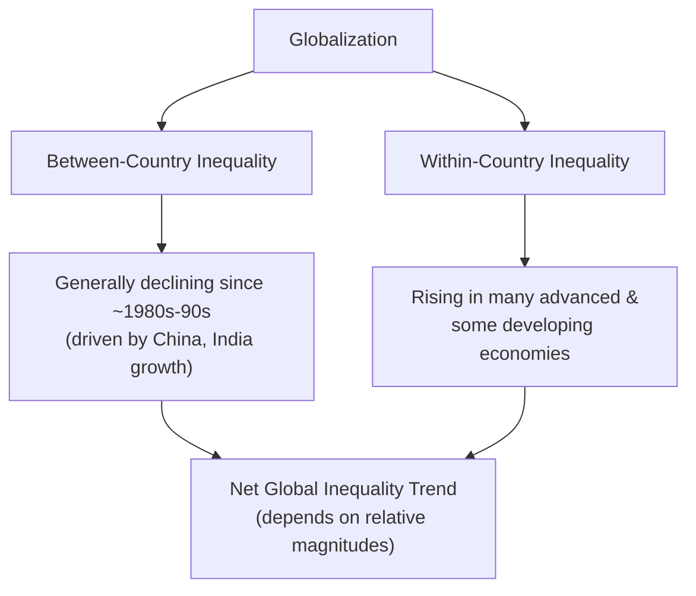

## Globalization and Inequality Debates

### Overview

The relationship between globalization — the increasing economic integration of trade, capital, labor, and ideas across borders — and inequality is among the most contested empirical and theoretical questions in development economics. Findings diverge sharply depending on whether inequality is measured *between* countries, *within* countries, or across the *global* population as a whole, and this distinction is essential to interpreting the debate coherently.

### Three Distinct Inequality Concepts

**Key Points**

- Confusion in public debate often stems from conflating three analytically distinct measures:

1. **Between-country inequality**: differences in average income across countries (e.g., comparing GDP per capita of the US vs. Ethiopia), unweighted by population.
2. **Within-country inequality**: income/wealth dispersion among individuals or households inside a single country (e.g., the Gini coefficient of the United States or China).
3. **Global inequality**: dispersion across *all individuals worldwide*, treating the world as a single population regardless of national borders — mathematically decomposable into a combination of between-country and within-country components.

$$Global\ Inequality = f(\text{Between-Country Inequality}, \text{Within-Country Inequality}, \text{Population Weights})$$

- A key empirical finding widely discussed in the literature: since roughly the 1980s-1990s, **between-country inequality has generally declined** (driven substantially by rapid growth in populous countries, especially China and later India), while **within-country inequality has risen in many — though not all — countries** over a similar period. The **net global inequality trend** depends on the relative magnitude of these offsetting forces. [Inference: while this general pattern of divergent between/within trends is well-documented across multiple studies (e.g., work by Branko Milanović and others), precise global inequality trend estimates vary by dataset, time period, and methodology — this is an active area of ongoing empirical research rather than a single settled number]

### The Elephant Curve

**Key Points**

- A widely referenced visualization in this literature is the **"elephant curve"** (associated with Branko Milanović's global income growth incidence analysis), which plots cumulative real income growth by global income percentile over a multi-decade period (commonly the 1988–2008 period in the original analysis).
- The stylized pattern commonly described:
  - Strong income growth for the global **middle deciles** (much of this reflecting the rising middle class in China and other fast-growing emerging economies).
  - Weaker or stagnant income growth for a segment around the **75th-90th global percentile** (commonly associated with lower-middle and working classes in advanced economies exposed to import competition and manufacturing job displacement).
  - Strong income growth again at the **very top** (global top 1%, associated with high earners in advanced economies and elites globally).
- [Unverified: the elephant curve's specific shape, magnitudes, and the robustness of the "stagnant" segment have been subject to methodological critique and revision in subsequent research (adjustments for population-weighting, survey vs. national accounts data, and time period selection have altered the depicted pattern in various re-analyses) — it should be understood as an influential but debated stylized illustration rather than an uncontested empirical fact]

### Trade-Based Explanations for Rising Within-Country Inequality

**Key Points**

- Several theoretical channels connect trade/globalization to observed within-country inequality trends, though economists disagree on their relative importance:

1. **Stolper-Samuelson channel**: standard trade theory predicts that in *advanced, capital/skill-abundant* economies, trade with labor-abundant developing countries should reduce the relative return to unskilled labor — a mechanism frequently cited for rising skill premiums and wage polarization in industrialized countries.
2. **Skill-biased technological change (SBTC)**: many economists argue that technology (automation, computerization), not trade per se, is the dominant driver of rising skill premiums globally, with globalization acting as a complementary or reinforcing force rather than the primary cause. [Inference: the relative contribution of trade vs. technology to rising inequality remains a genuinely disputed empirical question across the literature, with most researchers now favoring a view that both factors interact rather than either being solely responsible]
3. **China trade shock literature**: influential empirical work (notably by Autor, Dorn, and Hanson) analyzing US local labor markets found that regions more exposed to import competition from China's manufacturing rise experienced concentrated, persistent negative effects on manufacturing employment and wages, with limited offsetting reallocation to other sectors in the same local labor market. [Fact regarding the existence and general findings of this influential body of research; specific magnitudes are study-year-dependent and the subject of ongoing extensions]
4. **Capital mobility and bargaining power**: increased capital mobility (including FDI and offshoring capacity) may shift bargaining power from labor to capital within countries, as the credible threat of relocating production constrains labor's wage demands — a mechanism distinct from pure trade-in-goods effects.

### Globalization's Role in Developing-Country Within-Country Inequality

**Key Points**

- The Stolper-Samuelson prediction for labor-abundant *developing* countries is the reverse of the advanced-economy case: trade openness should theoretically *reduce* inequality by raising the relative return to abundant unskilled labor.
- Empirically, this prediction has often not held cleanly in practice (as covered in trade liberalization poverty literature), with several developing countries experiencing *rising* wage inequality following liberalization episodes. Commonly cited explanations include:
  - Skill-biased effects of imported capital goods and technology adoption accompanying trade opening
  - Segmented and informal labor markets that prevent standard factor-price adjustment mechanisms from operating as the simple theory predicts
  - Trade in intermediate inputs and GVC participation altering the effective factor content of trade in ways the simple 2x2x2 H-O framework does not capture
- [Inference: this divergence between theoretical prediction and empirical observation in developing countries is one of the most cited puzzles motivating refinements to standard trade-and-inequality theory]

### Capital Market Globalization and Inequality

**Key Points**

- Beyond trade in goods, globalization encompasses cross-border capital flows (FDI, portfolio investment, remittances), each with distinct inequality implications:
  - **FDI**: as discussed in FDI-development literature, effects depend on absorptive capacity, sector, and whether benefits diffuse broadly or remain concentrated among a narrow set of connected firms/workers.
  - **Remittances**: generally found to reduce poverty and can reduce within-country inequality when they flow disproportionately to lower-income households, though effects vary depending on which income groups have members able to migrate (migration often requires upfront resources, potentially limiting remittance access for the very poorest).
  - **Portfolio capital flows**: volatile "hot money" flows can generate boom-bust cycles that disproportionately harm lower-income, less financially insulated households during sudden reversals (capital flight episodes).

### Measurement Challenges in the Inequality-Globalization Debate

**Key Points**

- Several methodological issues complicate cross-study comparison and contribute to the persistence of disagreement in this literature:
  - **Income vs. consumption-based measures**: developing-country household surveys often measure consumption rather than income, which typically shows lower inequality than income-based measures due to consumption smoothing.
  - **Survey vs. national accounts data**: household surveys often under-capture top-income concentration relative to tax record-based estimates (a significant issue for measuring top-1% income shares).
  - **PPP vs. market exchange rate comparisons**: cross-country income comparisons differ substantially depending on whether purchasing power parity or market exchange rates are used, affecting between-country inequality estimates.
  - **Time period and country coverage sensitivity**: conclusions about whether globalization "increased" or "decreased" inequality are often highly sensitive to the specific years and country sample chosen, given uneven timing of globalization episodes across regions (e.g., China's opening in the 1980s-90s vs. Eastern Europe's post-1989 transition vs. Sub-Saharan Africa's more recent and partial integration).

### Diagram: Decomposing Global Inequality Trends

<svg xmlns="http://www.w3.org/2000/svg" viewBox="0 0 560 340" font-family="sans-serif">
<text x="280" y="24" text-anchor="middle" font-size="15" font-weight="bold" fill="#1a1a1a">Between vs. Within-Country Inequality Trends (svg_diagram)</text>
<line x1="60" y1="290" x2="60" y2="50" stroke="#333" stroke-width="1.5" />
<line x1="60" y1="290" x2="510" y2="290" stroke="#333" stroke-width="1.5" />
<text x="15" y="60" font-size="11" fill="#333">Inequality Index</text>
<text x="470" y="312" font-size="11" fill="#333">Time (approx. 1980–present)</text>
<path d="M 80 100 Q 200 150 300 200 T 480 250" stroke="#c53030" stroke-width="2.5" fill="none" />
<text x="370" y="230" font-size="10" fill="#c53030">Between-country inequality (declining)</text>
<path d="M 80 230 Q 200 220 300 190 T 480 130" stroke="#2b6cb0" stroke-width="2.5" stroke-dasharray="6,3" fill="none" />
<text x="360" y="120" font-size="10" fill="#2b6cb0">Within-country inequality (rising, many economies)</text>
<text x="80" y="270" font-size="9" fill="#666">1980s</text>
<text x="470" y="270" font-size="9" fill="#666">Present</text>
</svg>

### Policy Responses Debated in the Literature

| Policy Approach | Rationale |
| --- | --- |
| Trade adjustment assistance | Compensate displaced workers in import-competing sectors within advanced or developing economies |
| Progressive taxation and redistribution | Address within-country inequality regardless of its precise causal source (trade, technology, or capital mobility) |
| Universal basic education/skills investment | Address skill-premium-driven inequality by expanding the supply of skilled labor over time |
| International tax cooperation (BEPS-type frameworks) | Limit capital's ability to escape taxation via cross-border profit shifting, preserving redistributive fiscal capacity |
| Labor standards harmonization | Reduce "race to the bottom" pressure on labor's bargaining position from globally mobile capital |
| Social protection floors | Cushion households against globalization-linked volatility and transitional adjustment costs |

### Ongoing Points of Debate

**Key Points**

- Whether globalization is a net "cause" of rising within-country inequality, a "contributing factor" alongside technology and domestic policy choices, or largely incidental to inequality trends driven primarily by domestic factors (tax policy changes, declining unionization, domestic technology adoption) remains genuinely unresolved and appears to differ by country case. [Speculation: given the strong role of country-specific domestic policy choices in mediating outcomes even from similar globalization exposure — for example, Nordic economies maintaining relatively lower inequality despite high trade openness through strong redistribution and labor market institutions — many researchers now emphasize that domestic institutional and policy responses may matter as much as, or more than, globalization exposure itself in determining inequality outcomes. This framing, however, remains a matter of ongoing scholarly interpretation rather than definitive consensus]

### Related Topics

- Elephant curve and global income growth incidence analysis
- Trade liberalization and poverty impacts
- Skill-biased technological change and the skill premium
- China trade shock literature (Autor, Dorn, Hanson)
- Remittances and household welfare in developing countries
- Progressive taxation and redistribution policy design
- Measuring inequality: Gini coefficients, top income shares, and survey limitations