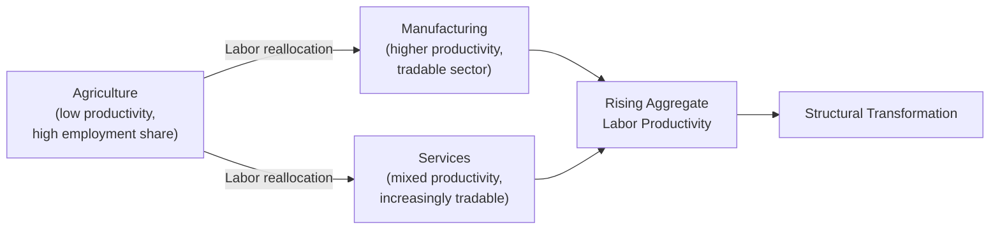

## Trade and Structural Transformation Linkages

### Overview

Structural transformation — the reallocation of labor and capital from low-productivity agriculture toward higher-productivity manufacturing and services — is a central process in economic development. Trade openness interacts with this process in complex ways: it can accelerate transformation by expanding market access for emerging sectors, or it can retard or redirect transformation depending on a country's comparative advantage position and the type of goods it trades.

### Structural Transformation: Core Concept

**Key Points**

- Structural transformation, as classically described in the development economics literature (building on Lewis, Kuznets, and later formalized by researchers such as Dani Rodrik and Margaret McMillan), involves three interrelated shifts:
  1. **Sectoral labor reallocation**: workers move from agriculture (typically low productivity, high labor share) to manufacturing and services (typically higher productivity).
  2. **Rising average labor productivity**: as labor moves toward higher-productivity sectors, aggregate productivity rises even without productivity growth *within* any single sector — termed the **structural change (or reallocation) component** of growth, distinct from **within-sector productivity growth**.
  3. **Urbanization**: labor reallocation is typically accompanied by rural-to-urban migration as manufacturing and services concentrate in urban areas.

$$\Delta \bar{P} = \underbrace{\sum_i s_i \Delta P_i}_{\text{within-sector growth}} + \underbrace{\sum_i P_i \Delta s_i}_{\text{structural change (reallocation)}}$$

where $\bar{P}$ is aggregate labor productivity, $s_i$ is sector $i$'s employment share, and $P_i$ is sector $i$'s productivity level. This shift-share decomposition is the standard empirical tool for separating "growth from doing existing activities better" from "growth from moving labor to more productive activities."

### How Trade Openness Can Accelerate Structural Transformation

**Key Points**

- **Market expansion for manufacturing exports**: trade access allows a developing country's manufacturing sector to sell beyond the limits of domestic demand, supporting economies of scale that a purely domestic-market-oriented industry could not achieve — historically central to East Asian export-led industrialization.
- **Learning-by-exporting**: exposure to international competition and foreign buyer quality/technical requirements can drive productivity improvements within exporting firms beyond what pure scale effects alone would generate — an empirically documented (though not universal) channel in firm-level trade literature. [Inference: the "learning-by-exporting" effect versus "self-selection" (already more productive firms choose to export, rather than exporting causing the productivity gain) remains a genuinely debated identification question in the empirical trade literature, with results varying by country, industry, and study design]
- **Technology and intermediate input access**: trade openness provides access to imported machinery, intermediate inputs, and embodied technology that can be a prerequisite for establishing internationally competitive manufacturing capacity domestically.
- **GVC participation as an entry point**: as covered in FDI/MNC-related material, global value chain integration allows countries to specialize in production *stages* rather than requiring full domestic supply chain development — potentially accelerating manufacturing sector emergence relative to a closed-economy industrialization path.

### How Trade Openness Can Retard or Redirect Structural Transformation

**Key Points**

- This is a central and more contested strand of the literature, associated significantly with Dani Rodrik's work on **premature deindustrialization**:
  - Standard comparative advantage logic predicts that a *labor-abundant, resource-poor* developing country should specialize in labor-intensive manufacturing — supporting transformation toward manufacturing as theory would suggest.
  - However, a *labor-abundant, resource-rich* developing country may find its comparative advantage lies in primary commodity exports (agriculture, minerals, oil) rather than manufacturing — in which case openness to trade can actually *reinforce* specialization in low-transformation-potential primary sectors rather than promoting the shift toward manufacturing.
  - Furthermore, some researchers argue that increased global manufacturing competition (particularly from established manufacturing exporters, notably China) has made it more difficult for *later* developing countries to replicate the manufacturing-led transformation pathway that earlier industrializers (South Korea, Taiwan) followed — a phenomenon termed **"premature deindustrialization,"** where manufacturing employment shares in developing countries peak at lower income levels and lower peak employment shares than occurred historically in earlier industrializers. [Inference: the premature deindustrialization thesis, while influential, is actively debated regarding its causes (attributed variously to global competition, domestic policy, capital-intensive technology change in manufacturing itself, and services sector productivity catch-up) and its universality across different developing regions — not all researchers agree on the relative weight of trade-related versus technology-related explanations]

### Dutch Disease as a Structural Transformation Obstacle

**Key Points**

- As discussed under terms-of-trade and FDI topics, a resource-driven trade boom can cause real exchange rate appreciation, making the country's non-resource tradable sector (particularly labor-intensive manufacturing) less competitive internationally.
- This connects directly to structural transformation: Dutch Disease can *reverse or prevent* the shift toward manufacturing, effectively locking a labor-abundant, resource-rich economy into a primary-commodity export specialization pattern even where manufacturing might otherwise offer a more transformation-conducive growth path.
- Because manufacturing is often considered to have higher potential for productivity catch-up, learning-by-doing, and absorption of unskilled labor relative to capital-intensive extractive sectors, this channel has motivated significant policy interest in sequencing trade and exchange rate policy to protect structural transformation prospects during resource booms.

### Services-Led Structural Transformation

**Key Points**

- A more recent development in the literature examines whether developing countries can achieve structural transformation via **tradable services** (business process outsourcing, IT services, tourism) rather than the traditional manufacturing-led pathway.
- India's IT and business-process-outsourcing sector growth is frequently cited as an example of transformation driven substantially by tradable service exports rather than manufacturing.
- Debate persists over whether services-led transformation can deliver the same broad-based labor absorption and productivity catch-up benefits historically associated with manufacturing-led transformation, given that many high-productivity tradable services (e.g., specialized IT services) tend to be relatively skill-intensive and may absorb less unskilled labor than labor-intensive manufacturing historically did. [Speculation: whether services can serve as a full substitute development pathway for manufacturing-led transformation, particularly for labor absorption of large low-skill workforces, remains an open and actively researched question rather than a settled matter]

### Firm-Level Trade and Productivity: Self-Selection vs. Learning Effects

**Key Points**

- A substantial body of empirical trade literature examines whether exporting firms are more productive because:
  1. **Self-selection**: more productive firms choose to enter export markets (sunk costs of exporting — meeting foreign quality standards, establishing distribution — are more easily borne by already-productive firms), or
  2. **Learning-by-exporting**: firms become more productive *as a result of* exporting (exposure to foreign competition, buyer feedback, technology embodied in imported inputs used for export production).
- Empirical consensus generally finds strong evidence for self-selection (exporters are more productive than non-exporters even before they begin exporting), with more mixed and context-dependent evidence for a genuine causal learning-by-exporting effect on top of selection. [Inference: this remains an active empirical research area, with the relative magnitude of learning effects varying by country, industry, and firm size in the studies conducted]

### Diagram: Two Divergent Trade-Transformation Pathways

<svg xmlns="http://www.w3.org/2000/svg" viewBox="0 0 560 360" font-family="sans-serif">
<text x="280" y="24" text-anchor="middle" font-size="15" font-weight="bold" fill="#1a1a1a">Divergent Trade-Transformation Pathways (svg_diagram)</text>
<rect x="40" y="60" width="200" height="50" fill="#e2e8f0" stroke="#333" />
<text x="55" y="90" font-size="11" fill="#1a1a1a">Labor-abundant, resource-poor country</text>
<path d="M140 110 L 140 150" stroke="#2f855a" stroke-width="2" marker-end="url(#b1)" />
<rect x="40" y="150" width="200" height="50" fill="#c6f6d5" stroke="#2f855a" />
<text x="60" y="180" font-size="11" fill="#1a1a1a">Comparative advantage in</text>
<text x="60" y="193" font-size="11" fill="#1a1a1a">labor-intensive manufacturing</text>
<path d="M140 200 L 140 240" stroke="#2f855a" stroke-width="2" marker-end="url(#b1)" />
<rect x="40" y="240" width="200" height="50" fill="#c6f6d5" stroke="#2f855a" />
<text x="70" y="270" font-size="11" fill="#1a1a1a">Trade-driven manufacturing-</text>
<text x="80" y="283" font-size="11" fill="#1a1a1a">led transformation</text>
<rect x="320" y="60" width="200" height="50" fill="#e2e8f0" stroke="#333" />
<text x="335" y="90" font-size="11" fill="#1a1a1a">Labor-abundant, resource-rich country</text>
<path d="M420 110 L 420 150" stroke="#c53030" stroke-width="2" marker-end="url(#b2)" />
<rect x="320" y="150" width="200" height="50" fill="#fed7d7" stroke="#c53030" />
<text x="335" y="180" font-size="11" fill="#1a1a1a">Comparative advantage in</text>
<text x="335" y="193" font-size="11" fill="#1a1a1a">primary commodity exports</text>
<path d="M420 200 L 420 240" stroke="#c53030" stroke-width="2" marker-end="url(#b2)" />
<rect x="320" y="240" width="200" height="50" fill="#fed7d7" stroke="#c53030" />
<text x="335" y="263" font-size="11" fill="#1a1a1a">Dutch Disease risk;</text>
<text x="335" y="276" font-size="11" fill="#1a1a1a">delayed/reversed transformation</text>
</svg>

### Policy Considerations for Trade-Compatible Structural Transformation

| Policy Approach | Rationale |
| --- | --- |
| Real exchange rate management | Prevent resource-driven appreciation from undermining manufacturing competitiveness (Dutch Disease mitigation) |
| Selective, time-limited industrial policy | Support emerging manufacturing sectors during the learning period, consistent with the infant industry framework |
| Export diversification strategy | Reduce dependence on primary commodities to preserve manufacturing transformation potential |
| Investment in tradable services capacity | Explore complementary or alternative transformation pathways via IT/BPO and other tradable services |
| Trade facilitation and logistics investment | Reduce the transaction cost barrier to manufacturing export competitiveness |
| Skills development aligned with GVC entry points | Prepare workforce for available manufacturing/services entry points into global value chains |

### Related Topics

- Premature deindustrialization (Rodrik)
- Dutch Disease and the resource curse
- Structural change decomposition methodology (shift-share analysis)
- Global value chains and functional upgrading
- Services-led development pathways (India IT/BPO case)
- Trade policy and infant industry protection
- Comparative advantage and trade theory applications