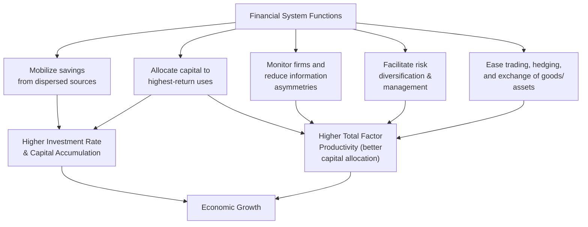

## Financial Deepening and Economic Growth

### Overview

Financial deepening refers to the increasing size, sophistication, and accessibility of a country's financial system relative to its real economy — encompassing growth in credit provision, financial market development, and the breadth of financial services available to households and firms. Its relationship with economic growth is one of the most extensively studied questions in development finance, with theory predicting clear positive channels but empirical findings suggesting the relationship is nonlinear and context-dependent.

### Defining and Measuring Financial Deepening

**Key Points**

- Financial deepening is commonly measured using several standard indicators:
  - **Private credit to GDP ratio**: domestic credit extended to the private sector as a share of GDP — the most widely used proxy for financial depth in cross-country growth studies.
  - **Broad money (M2/M3) to GDP ratio**: measures monetization of the economy and the scale of the banking sector's liabilities.
  - **Stock market capitalization to GDP**: measures equity market development, relevant primarily for middle-income and advanced economies with functioning exchanges.
  - **Financial institutions depth/access/efficiency indices**: composite indices (such as those compiled by the IMF's Financial Development Index) combining multiple dimensions of banking sector and capital market development.
- These measures capture *depth* (size relative to the economy) but are distinct from **financial inclusion** (breadth of access across the population) and **financial stability** (resilience to shocks) — three related but conceptually separate dimensions of financial sector development.

### Theoretical Channels: How Finance Promotes Growth

**Key Points**

- The foundational theoretical case for finance-growth linkages (associated with early work by Schumpeter, and later formalized by Goldsmith, McKinnon, Shaw, and King & Levine) identifies several functions a well-developed financial system performs:

1. **Savings mobilization**: financial intermediaries pool small, dispersed household savings into larger sums available for investment — a function individual savers/investors could not achieve independently.
2. **Capital allocation efficiency**: banks and capital markets channel funds toward projects with the highest expected risk-adjusted returns, rather than leaving investment decisions to autarkic self-financing, which tends to be less efficient at the economy-wide level.
3. **Information production and monitoring**: financial intermediaries specialize in evaluating borrower creditworthiness and monitoring project performance, reducing the information asymmetries and moral hazard problems that would otherwise constrain lending.
4. **Risk diversification and management**: financial systems (insurance, diversified portfolios, derivatives) allow individuals and firms to pool and hedge risk, encouraging investment in higher-return but higher-risk projects that would otherwise be avoided under pure self-insurance.
5. **Facilitating exchange**: payment systems and financial market liquidity reduce transaction costs, supporting specialization and trade.

### The McKinnon-Shaw Financial Repression Thesis

**Key Points**

- **Financial repression** refers to a set of policies — interest rate ceilings, high reserve requirements, directed/subsidized credit allocation, capital controls — historically common in many developing countries, often justified as tools for channeling cheap credit to priority sectors or financing government deficits.
- McKinnon (1973) and Shaw (1973) independently argued that financial repression, particularly artificially low (often negative real) interest rate ceilings, **reduces** financial deepening and growth by:
  - Discouraging savings mobilization (savers earn below-market or negative real returns, reducing incentive to save through the formal financial system).
  - Distorting capital allocation toward politically favored borrowers rather than the highest-return projects (credit rationing under price ceilings requires non-price allocation mechanisms, often political).
  - Encouraging capital flight and disintermediation into informal or foreign financial channels, further shrinking the formal financial sector's role.
- This thesis provided the theoretical foundation for **financial liberalization** reform packages widely implemented from the 1980s onward: removing interest rate ceilings, reducing directed credit programs, and liberalizing capital accounts.

### Financial Liberalization: Promise and Peril

**Key Points**

- While financial liberalization was theoretically expected to unambiguously improve financial deepening and growth, empirical experience — particularly a series of banking and currency crises in liberalizing economies from the 1980s through the 1997-98 Asian Financial Crisis — revealed significant risks:
  - **Premature capital account liberalization**: opening to volatile short-term capital flows before domestic financial institutions and regulatory frameworks were sufficiently developed has been widely cited as a contributing factor in several emerging market financial crises. [Inference: while widely discussed as a contributing factor, each historical crisis (Latin American debt crisis, Asian Financial Crisis) involved multiple compounding causes — exchange rate regime choices, current account deficits, corporate governance weaknesses — and attributing crisis causation to capital account liberalization alone oversimplifies a genuinely multi-causal literature]
  - **Weak prudential regulation**: rapid credit growth following liberalization, without adequate bank supervision and capital adequacy requirements, has been associated with asset price bubbles and subsequent banking sector fragility in multiple documented episodes.
  - **Sequencing concerns**: this experience gave rise to a now-influential view in the literature that financial liberalization sequencing matters significantly — domestic financial sector and regulatory reform should generally precede full capital account liberalization, rather than proceeding simultaneously or in reverse order.

### The Finance-Growth Nexus: Empirical Findings

**Key Points**

- A large empirical cross-country literature, notably associated with Robert King and Ross Levine's influential 1990s studies, generally found a robust positive association between financial depth indicators (private credit/GDP) and subsequent economic growth, capital accumulation, and productivity growth across broad country panels.
- However, later research has substantially qualified this relationship:
  - **Nonlinearity / "too much finance"**: subsequent studies (notably work associated with the IMF and BIS in the years following the 2008 global financial crisis) found evidence that the finance-growth relationship may be **non-monotonic** — financial deepening supports growth up to a point, but very high levels of financial sector size (particularly relative to GDP, and particularly driven by household or non-productive lending) may be associated with diminishing or even negative growth effects, plausibly through resource misallocation toward the financial sector itself or excessive risk-taking. [Inference: the precise threshold at which finance shifts from growth-enhancing to growth-neutral or growth-harmful, and its universality across different country income levels, remains actively debated in the literature — most relevant to middle and high-income economies with already-substantial financial sectors, rather than clearly established for low-income, financially shallow economies]
  - **Causality direction**: while King and Levine's work argued financial depth *causally* promotes growth (using lagged financial indicators to predict future growth), the direction of causality remains debated — financial deepening might partly reflect growing demand for financial services *from* a growing real economy (reverse causality / "finance follows growth" view) rather than purely driving growth independently.
  - **Type of credit matters**: more recent research distinguishes between credit extended to firms/enterprises (generally more robustly linked to productive investment and growth) versus household credit (particularly mortgage and consumption credit), with some studies finding weaker or even negative growth associations for rapid household credit expansion specifically. [Inference: this distinction is an active and evolving area of the literature rather than a fully settled finding]

### Diagram: The Non-Monotonic Finance-Growth Relationship

<svg xmlns="http://www.w3.org/2000/svg" viewBox="0 0 540 320" font-family="sans-serif">
<text x="270" y="24" text-anchor="middle" font-size="15" font-weight="bold" fill="#1a1a1a">Stylized Finance-Growth Relationship (svg_diagram)</text>
<line x1="60" y1="270" x2="60" y2="50" stroke="#333" stroke-width="1.5" />
<line x1="60" y1="270" x2="500" y2="270" stroke="#333" stroke-width="1.5" />
<text x="10" y="60" font-size="11" fill="#333">Growth Effect</text>
<text x="450" y="292" font-size="11" fill="#333">Financial Depth (Credit/GDP)</text>
<path d="M 70 250 Q 200 100 320 100 T 480 200" stroke="#2b6cb0" stroke-width="2.5" fill="none" />
<text x="100" y="200" font-size="10" fill="#2f855a">Positive marginal effect</text>
<text x="360" y="150" font-size="10" fill="#c53030">Diminishing / possible negative effect</text>
<line x1="320" y1="270" x2="320" y2="100" stroke="#999" stroke-dasharray="3,3" />
<text x="290" y="290" font-size="10" fill="#666">Hypothesized inflection zone</text>
</svg>

### Financial Deepening and Poverty: The Access Dimension

**Key Points**

- Financial deepening's growth effects are conceptually distinct from, but related to, **financial inclusion's** direct poverty-reduction channels:
  - Access to savings instruments allows poor households to smooth consumption against income shocks.
  - Access to credit can finance productive investment (small business capital, agricultural inputs) that would otherwise be foregone due to liquidity constraints.
  - Access to insurance products (including index-based agricultural insurance in some developing-country contexts) can reduce vulnerability to shocks and encourage higher-return but higher-risk productive activities.
- A deep financial sector concentrated among large firms and wealthy households (common in early-stage financial development) may generate aggregate growth benefits via the capital-allocation channel while providing limited direct benefit to poor households who remain excluded — meaning depth and inclusion can diverge, particularly in early stages of financial sector development.

### Institutional Prerequisites for Effective Financial Deepening

**Key Points**

- Cross-country research consistently emphasizes that financial deepening's growth benefits are conditional on complementary institutional quality, including:
  - **Contract enforcement and creditor rights**: legal systems that allow lenders to reliably enforce loan contracts and recover collateral, reducing the risk premium required for lending.
  - **Credit information infrastructure**: credit registries/bureaus that reduce information asymmetries between lenders and borrowers.
  - **Prudential regulation and supervision capacity**: bank supervisory agencies capable of monitoring capital adequacy, asset quality, and risk-taking to prevent the fragility risks associated with rapid, poorly supervised credit growth.
  - **Macroeconomic stability**: low and stable inflation and sustainable fiscal policy, since financial deepening (particularly long-term lending) is difficult to sustain in high-inflation, macroeconomically volatile environments.
- [Fact regarding general consensus on the importance of these institutional prerequisites, though their relative priority and sequencing remains a country-specific policy design question rather than one with a universal formula]

### Related Topics

- Financial repression and the McKinnon-Shaw thesis
- Financial inclusion and access to credit
- Capital account liberalization sequencing
- Banking crises and prudential regulation
- Microfinance and informal financial systems
- Credit constraints and firm-level investment in developing countries
- Foreign direct investment and development