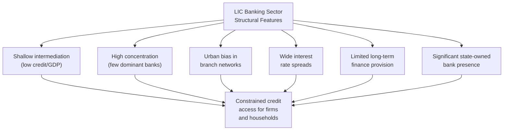

## Banking Sector Development in Low-Income Countries

### Overview

Banking sector development in low-income countries (LICs) encompasses the structural evolution of formal financial intermediation — deposit-taking, credit provision, and payment systems — under conditions of low income, weak institutional capacity, and often limited infrastructure. LIC banking sectors typically exhibit distinctive structural features relative to middle- and high-income economies that shape both the constraints and available policy levers.

### Structural Characteristics of LIC Banking Sectors

**Key Points**

- Cross-country comparative studies commonly identify several recurring structural features of LIC banking systems relative to more developed financial systems:
  - **Shallow intermediation**: low private credit-to-GDP ratios relative to income level, reflecting limited savings mobilization and constrained lending capacity.
  - **High concentration**: banking sectors often dominated by a small number of banks (sometimes state-owned, sometimes foreign-owned subsidiaries), with limited competitive pressure on pricing and service quality.
  - **Urban-rural and formal-informal divides**: bank branch networks concentrated in urban centers, leaving rural populations reliant on informal finance (moneylenders, savings groups, family networks) or increasingly on mobile money.
  - **High interest rate spreads**: the gap between lending and deposit rates tends to be wider than in developed financial systems, commonly attributed to higher operating costs, weaker credit information infrastructure, higher perceived credit risk, and less competitive market structure.
  - **Limited long-term finance**: LIC banks often concentrate on short-term, working-capital lending rather than long-term investment finance, partly reflecting funding structures (short-term deposits) and difficulty pricing long-horizon risk.
  - **Significant government/state bank presence**: many LICs retain state-owned banks originally established for development lending or rural outreach purposes, with mixed track records regarding financial sustainability and lending discipline.

### Core Constraints on Banking Sector Development

**Key Points**

1. **Information asymmetries and weak credit infrastructure**: absence or immaturity of credit bureaus/registries makes it difficult for banks to assess borrower creditworthiness, particularly for small firms and individuals without formal credit histories — leading to credit rationing or reliance on collateral-based lending that excludes asset-poor borrowers.
2. **Weak contract enforcement and collateral recovery**: slow, costly, or unreliable judicial systems for enforcing loan contracts and recovering collateral raise the effective cost and risk of lending, particularly for secured lending against land or property where formal title registration systems may also be weak or incomplete.
3. **Macroeconomic volatility**: high or volatile inflation, exchange rate instability, and fiscal instability common in many LICs raise the risk premium demanded by banks and shorten the feasible lending horizon, discouraging long-term credit provision.
4. **Limited financial infrastructure**: underdeveloped payment systems, limited physical branch/ATM networks (though increasingly bypassed by mobile money — see below), and in some cases limited electricity/connectivity infrastructure needed for modern banking operations.
5. **Weak prudential regulatory and supervisory capacity**: central banks and financial regulators in LICs often face capacity constraints in effectively supervising bank capital adequacy, asset quality, and risk management practices, raising the risk of undetected fragility.
6. **Small market size and high fixed costs**: serving low-income, geographically dispersed populations with small individual transaction sizes involves high fixed costs relative to transaction value, discouraging traditional branch-based bank expansion into rural and low-income market segments.

### Mobile Money and Digital Financial Services: A Structural Break

**Key Points**

- Mobile money — financial services (deposits, transfers, sometimes credit and savings products) accessed via mobile phone rather than traditional bank branches — represents one of the most significant recent developments in LIC financial sector evolution, effectively allowing many countries to substantially bypass the traditional branch-based banking expansion model.
- **M-Pesa (Kenya, launched 2007)** is the most widely cited example, having achieved very high adoption rates and being credited in a substantial body of research with improving financial inclusion, consumption smoothing, and in some studies, poverty reduction among adopting households. [Fact regarding M-Pesa's widely documented scale and adoption; specific quantitative welfare impact estimates vary by study, time period, and methodology, so a search for current figures would be needed for precise up-to-date statistics]
- Mobile money's key structural advantages for LIC banking development:
  - Dramatically lower fixed costs of reaching rural and low-income customers relative to physical bank branches (leveraging existing mobile network agent infrastructure).
  - Enables savings, remittance transfer, and increasingly credit and insurance products for previously unbanked populations.
  - Generates transaction data that can potentially support alternative credit-scoring mechanisms, partially substituting for traditional credit bureau infrastructure.
- **Regulatory considerations**: mobile money's development has generally required tailored regulatory frameworks distinct from traditional banking regulation, particularly regarding e-money issuer licensing, agent network regulation, and interoperability requirements between different mobile money providers and traditional banks. [Inference: the specific regulatory model (bank-led vs. telecom-led vs. hybrid models) and its implications for competition and consumer protection remain an active area of policy debate and country-specific variation]

### State-Owned Banks and Development Banking

**Key Points**

- Many LICs maintain **state-owned development banks** or state-owned commercial banks originally established to address market failures in reaching underserved sectors (agriculture, small enterprises, rural populations) that private commercial banks were unwilling or unable to serve profitably.
- **Historical track record concerns**: a substantial body of literature has documented recurring problems with state-owned bank lending in developing countries, including:
  - Politically directed lending disconnected from creditworthiness assessment ("directed credit" problems).
  - High non-performing loan ratios and recurring need for government recapitalization.
  - Crowding out of private bank development in served market segments.
- **Ongoing debate**: despite this historical record, some researchers and policymakers continue to argue for a targeted role for well-governed development finance institutions in addressing genuine market failures (e.g., agricultural lending given weather-related covariate risk that private banks may be unwilling to bear without public risk-sharing mechanisms), provided governance safeguards (arm's-length lending decisions, professional management, transparent reporting) are in place. [Speculation: whether such safeguards can be reliably implemented and sustained in practice, particularly in weaker-governance environments, versus reform proposals simply repeating a historically troubled model, remains a genuinely contested question in the development finance literature]

### Microfinance as a Complementary Model

**Key Points**

- **Microfinance institutions (MFIs)** — specialized lenders providing small loans, often without traditional collateral, frequently using group-lending or joint-liability mechanisms to substitute for formal collateral and credit history requirements — emerged significantly as a response to LIC banking sector gaps in serving low-income and small-enterprise borrowers.
- Group lending mechanisms (as pioneered by institutions such as Grameen Bank) theoretically address information asymmetry and enforcement problems through peer monitoring and social collateral rather than physical collateral.
- **Impact evidence**: rigorous randomized evaluations of microcredit access conducted over the past two decades have generally found more modest average impacts on household income and business outcomes than earlier, less rigorously evaluated claims suggested, though effects vary meaningfully across studies, borrower types, and loan use cases. [Inference: the "microfinance revolution" narrative of the 1990s-2000s has been substantially tempered by more recent rigorous impact evaluation evidence, though this remains an active research area rather than a fully settled conclusion, and effects appear more consistently positive for certain subpopulations (e.g., existing business owners) than for the average borrower]
- Microfinance and mobile money increasingly overlap and integrate, with many MFIs adopting digital channels and some mobile money providers extending into micro-credit and micro-savings products.

### Basel Standards and Regulatory Capacity Constraints

**Key Points**

- International banking regulatory standards (the Basel Accords — Basel I, II, III) were developed primarily by and for advanced-economy banking systems, creating implementation challenges for LIC regulators:
  - Full Basel III implementation requires substantial supervisory capacity, data infrastructure, and risk-modeling sophistication that many LIC central banks and regulators may not yet possess.
  - Many LICs adopt simplified or phased versions of Basel standards, or rely on earlier Basel I/II frameworks, reflecting a genuine capacity-appropriate calibration rather than non-compliance per se.
  - A tension exists in the literature between encouraging LICs to adopt internationally recognized prudential standards (supporting cross-border bank confidence and potential access to international capital markets) versus the risk of imposing frameworks poorly calibrated to local banking sector structure and risk profiles (e.g., standards calibrated for large, diversified banks may be poorly suited to small, concentrated LIC banking sectors).

### Diagram: Pathways to LIC Banking Sector Development

<svg xmlns="http://www.w3.org/2000/svg" viewBox="0 0 560 340" font-family="sans-serif">
<text x="280" y="24" text-anchor="middle" font-size="15" font-weight="bold" fill="#1a1a1a">Pathways to Expanding Financial Access (svg_diagram)</text>
<rect x="30" y="60" width="150" height="55" fill="#bee3f8" stroke="#2b6cb0" />
<text x="45" y="85" font-size="11" fill="#1a1a1a">Traditional Branch</text>
<text x="45" y="100" font-size="11" fill="#1a1a1a">Banking Expansion</text>
<text x="40" y="130" font-size="9" fill="#666">High fixed cost, slow reach</text>
<rect x="205" y="60" width="150" height="55" fill="#c6f6d5" stroke="#2f855a" />
<text x="220" y="85" font-size="11" fill="#1a1a1a">Mobile Money /</text>
<text x="220" y="100" font-size="11" fill="#1a1a1a">Digital Financial Services</text>
<text x="215" y="130" font-size="9" fill="#666">Low fixed cost, rapid reach</text>
<rect x="380" y="60" width="150" height="55" fill="#fefcbf" stroke="#b7791f" />
<text x="395" y="85" font-size="11" fill="#1a1a1a">Microfinance /</text>
<text x="395" y="100" font-size="11" fill="#1a1a1a">Group Lending Models</text>
<text x="390" y="130" font-size="9" fill="#666">Social collateral substitute</text>
<path d="M105 115 L 105 200" stroke="#333" stroke-width="1.5" marker-end="url(#c1)" />
<path d="M280 115 L 280 200" stroke="#333" stroke-width="1.5" marker-end="url(#c1)" />
<path d="M455 115 L 455 200" stroke="#333" stroke-width="1.5" marker-end="url(#c1)" />
<rect x="130" y="200" width="300" height="70" fill="#e2e8f0" stroke="#333" />
<text x="145" y="225" font-size="11" fill="#1a1a1a">Expanded Financial Inclusion &amp;</text>
<text x="145" y="240" font-size="11" fill="#1a1a1a">Deepening — Conditional on Credit</text>
<text x="145" y="255" font-size="11" fill="#1a1a1a">Infrastructure &amp; Regulatory Capacity</text>
</svg>

### Policy Priorities for LIC Banking Sector Development

| Policy Area | Objective |
| --- | --- |
| Credit bureau/registry development | Reduce information asymmetry constraining lending decisions |
| Mobile money regulatory frameworks | Enable digital financial inclusion while managing consumer protection and systemic risk |
| Prudential supervisory capacity building | Strengthen bank oversight appropriate to sector structure and risk profile |
| Land titling and collateral registry reform | Improve usability of physical assets as loan collateral |
| Interoperability mandates | Ensure mobile money and banking systems can interoperate, avoiding fragmented walled-garden ecosystems |
| Reformed state bank governance | Where development banks persist, insulate lending decisions from political direction |
| Macroeconomic stabilization | Support the low-inflation, stable environment needed for longer-term credit market development |

### Related Topics

- Financial deepening and economic growth
- Mobile money and digital financial inclusion (M-Pesa case study)
- Microfinance impact evaluation evidence
- Credit information systems and collateral registries
- Basel Accords implementation in developing economies
- Financial repression and the McKinnon-Shaw thesis
- State-owned development banks and directed credit