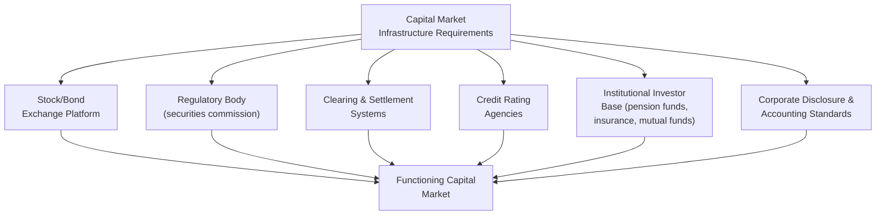

## Capital Markets in Developing Economies

### Overview

Capital markets — the institutions and mechanisms through which equity, bonds, and other long-term financial instruments are issued and traded — remain considerably less developed in most developing economies than their banking sectors, which typically dominate financial intermediation. Understanding why capital markets lag, and what development they can realistically achieve, is central to the broader finance-and-development literature.

### Bank-Based vs. Market-Based Financial Systems

**Key Points**

- Financial systems are conventionally classified along a spectrum between **bank-based** systems (where banks are the dominant channel for savings mobilization and credit allocation) and **market-based** systems (where equity and bond markets play a comparably significant role alongside banks).
- Virtually all developing economies, and particularly low-income countries, are strongly bank-based, with capital markets — where they exist at all — playing a distinctly secondary role in overall financial intermediation.
- The theoretical debate over which system structure better promotes growth (associated with a substantial comparative finance literature) has generally concluded that the *bank-based vs. market-based* distinction matters less for growth outcomes than the **overall quality and depth of financial services provided**, regardless of institutional form — a view sometimes termed the **"financial services view."** [Inference: while this has become an influential synthesis position in the literature, debate continues regarding whether market-based finance offers specific advantages for certain firm types (e.g., innovative, high-risk ventures better suited to equity finance than debt) that bank-based systems structurally underserve]

### Components of Capital Market Infrastructure

**Key Points**

- A functioning capital market requires several interlocking institutional components, each of which tends to be underdeveloped or partial in most developing economies:

1. **Exchange infrastructure**: physical or electronic trading platforms for equities and bonds.
2. **Securities regulation**: a regulatory body overseeing disclosure requirements, market conduct, insider trading rules, and investor protection.
3. **Clearing and settlement systems**: reliable mechanisms to finalize trades and transfer ownership, increasingly requiring modern electronic infrastructure.
4. **Credit rating agencies**: independent assessment of bond issuer creditworthiness, essential for bond market development but often limited to a handful of large issuers in developing markets.
5. **Institutional investor base**: pension funds, insurance companies, and mutual funds that provide the deep, patient capital pools needed for liquid secondary markets — frequently underdeveloped in economies with limited formal pension coverage and low insurance penetration.
6. **Corporate governance and disclosure standards**: reliable financial reporting and governance practices needed to give outside investors confidence in firm-level information, often weaker in developing-economy corporate sectors dominated by family-owned or state-owned enterprises with limited external disclosure history.

### Why Equity Markets Remain Shallow in Most Developing Economies

**Key Points**

- **Small market capitalization and low liquidity**: most developing-country stock exchanges have a small number of listed companies, often dominated by a handful of large firms (frequently banks, telecoms, or state-privatized utilities), resulting in thin trading volumes and high price volatility from even modest trade sizes.
- **Concentrated corporate ownership structures**: many developing-economy firms remain family-owned or state-controlled, with limited willingness to dilute ownership through public equity issuance — reducing the potential supply of listable firms.
- **Weak minority shareholder protections**: where legal protections for minority shareholders against expropriation by controlling owners or managers are weak, outside investors demand a higher risk premium or avoid equity investment altogether, a mechanism extensively documented in the **law and finance literature** (La Porta, Lopez-de-Silanes, Shleifer, and Vishny) linking legal origin and investor protection to capital market depth. [Fact regarding the general finding that stronger investor protection is associated with deeper capital markets across country studies; the precise causal mechanism and the specific "legal origin" framework linking common law vs. civil law traditions to protection quality has faced methodological critique and remains debated in subsequent literature]
- **Limited institutional investor demand**: without well-developed pension systems and insurance sectors generating a domestic investor base seeking long-duration assets, demand-side capital for equity markets remains constrained.
- **Macroeconomic volatility**: exchange rate instability and inflation volatility raise the required risk premium for long-duration equity investment and can discourage both domestic and foreign portfolio investment.

### Bond Market Development: Sovereign and Corporate Segments

**Key Points**

- **Sovereign (government) bond markets** are typically the first capital market segment to develop in emerging economies, as governments have a natural, recurring financing need and can establish a "risk-free" domestic yield curve benchmark against which other instruments can subsequently be priced.
- **Corporate bond markets** typically develop later and remain considerably shallower, constrained by:
  - The need for a reliable sovereign yield curve as a pricing benchmark (chicken-and-egg problem where corporate bond development depends on prior sovereign market maturity).
  - Limited credit rating infrastructure to assess corporate default risk.
  - Small typical issuance sizes relative to the fixed costs of a bond issuance process, making bank lending relatively more cost-effective for all but the largest firms.
  - Underdeveloped institutional investor base to absorb longer-duration corporate debt.
- **Local currency vs. foreign currency-denominated debt**: developing-country governments and corporations have historically often needed to issue debt in foreign currency (dollars, euros) due to limited domestic investor demand for long-duration local-currency instruments — a phenomenon termed **"original sin"** in the international finance literature (Eichengreen and Hausmann). This exposes issuers to currency mismatch risk: revenue is typically earned in local currency, but debt service obligations are denominated in foreign currency, creating vulnerability to exchange rate depreciation. [Inference: the "original sin" phenomenon has been documented as diminishing somewhat for larger emerging markets that have successfully developed local-currency bond markets over the past two decades, though it remains a live constraint for many smaller and lower-income economies — a search for current country-specific local-currency market development would be needed for up-to-date specifics]

### Diagram: The "Original Sin" Currency Mismatch Problem

<svg xmlns="http://www.w3.org/2000/svg" viewBox="0 0 540 300" font-family="sans-serif">
<text x="270" y="24" text-anchor="middle" font-size="15" font-weight="bold" fill="#1a1a1a">Currency Mismatch from Foreign-Currency Debt (svg_diagram)</text>
<rect x="50" y="60" width="180" height="60" fill="#e2e8f0" stroke="#333" />
<text x="65" y="85" font-size="11" fill="#1a1a1a">Government/Firm Revenue</text>
<text x="65" y="100" font-size="11" fill="#1a1a1a">(earned in local currency)</text>
<rect x="310" y="60" width="180" height="60" fill="#fed7d7" stroke="#c53030" />
<text x="325" y="85" font-size="11" fill="#1a1a1a">Debt Service Obligation</text>
<text x="325" y="100" font-size="11" fill="#1a1a1a">(denominated in USD/EUR)</text>
<path d="M230 90 L 310 90" stroke="#c53030" stroke-width="2" stroke-dasharray="5,3" marker-end="url(#d1)" />
<text x="235" y="80" font-size="9" fill="#c53030">Currency mismatch</text>
<path d="M140 120 L 140 200" stroke="#333" stroke-width="1.5" marker-end="url(#d1)" />
<path d="M400 120 L 400 200" stroke="#333" stroke-width="1.5" marker-end="url(#d1)" />
<rect x="120" y="200" width="320" height="60" fill="#fefcbf" stroke="#b7791f" />
<text x="140" y="225" font-size="11" fill="#1a1a1a">Local currency depreciation raises</text>
<text x="140" y="240" font-size="11" fill="#1a1a1a">real debt burden -&gt; debt sustainability risk</text>
</svg>

### Foreign Portfolio Investment and Emerging Market Integration

**Key Points**

- Developing-economy capital markets increasingly interact with global capital flows through **foreign portfolio investment (FPI)** — cross-border purchases of equity and bonds without the controlling-interest threshold that defines FDI.
- **Benefits commonly cited**: FPI can provide additional liquidity, price discovery discipline, and lower cost of capital for domestic firms and governments able to access international investor pools.
- **Risks commonly cited**: portfolio flows are typically more volatile and reversible ("hot money") than FDI, and can generate boom-bust cycles in domestic asset prices and exchange rates as global investor risk sentiment shifts (a phenomenon linked to "sudden stop" episodes in the international finance literature, associated with researchers such as Guillermo Calvo).
- **Emerging market index inclusion**: inclusion in major benchmark indices (e.g., MSCI Emerging Markets Index) can generate significant passive capital inflows as index-tracking funds rebalance, representing a notable channel through which capital market institutional development (meeting index inclusion criteria around market size, liquidity, and accessibility) has tangible financial consequences. [Unverified: specific current index compositions and country classification statuses change periodically; a search would be needed for present-day specifics on any particular country's index status]

### Capital Market Development and SME Financing Gaps

**Key Points**

- Capital markets in developing economies, even where reasonably developed, typically serve only the largest firms capable of meeting listing/disclosure requirements and achieving sufficient issuance scale to justify fixed transaction costs.
- This leaves small and medium enterprises (SMEs) — often the largest source of employment in developing economies — reliant primarily on bank lending or informal finance, contributing to a widely documented **"SME financing gap"** in developing economies.
- Policy responses to bridge this gap include:
  - **SME-specific exchange boards or "growth markets"** with reduced listing requirements relative to main boards.
  - **Credit guarantee schemes** that share default risk with banks to encourage SME lending.
  - **Venture capital and private equity ecosystem development**, though this remains nascent in most low-income countries and concentrated in a small number of larger emerging markets and specific sectors (e.g., fintech, agritech).

### Regional Capital Market Integration

**Key Points**

- Given the small scale of many individual developing-country capital markets, **regional integration** of exchanges and regulatory frameworks has been pursued in several regions as a strategy to achieve the scale, liquidity, and diversification benefits that isolated small national markets cannot achieve alone.
- Examples of regional capital market integration efforts include the West African regional exchange framework (BRVM, serving multiple West African Economic and Monetary Union member states through a single shared exchange) and various East African Community capital market harmonization initiatives.
- [Inference: the depth of practical integration achieved (cross-border trading ease, regulatory harmonization, actual liquidity gains) varies considerably across these regional initiatives and would require current searches for up-to-date assessment of any specific regional market's integration progress]

### Sequencing Considerations: Capital Market Development Policy

| Development Stage | Typical Priority |
| --- | --- |
| Early stage (most LICs) | Strengthen banking sector, basic securities regulator, sovereign bond market foundation |
| Intermediate stage | Develop institutional investor base (pension reform, insurance sector), corporate disclosure standards |
| Advanced emerging market stage | Deepen corporate bond markets, local-currency long-duration instruments, SME growth boards |
| Cross-cutting priority (all stages) | Macroeconomic stability as precondition for long-duration instrument demand |

### Related Topics

- Financial deepening and economic growth
- Banking sector development in low-income countries
- "Original sin" and local-currency bond market development
- Law and finance literature (investor protection and legal origin)
- Sudden stops and portfolio capital flow volatility
- SME financing gaps and credit guarantee schemes
- Regional capital market integration (BRVM, EAC initiatives)