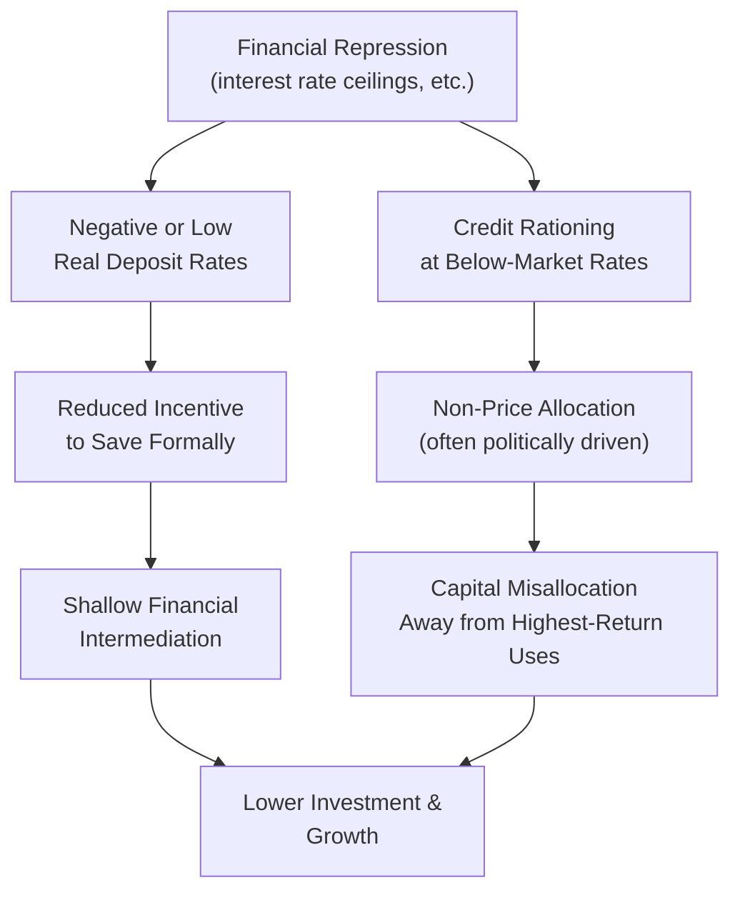

## Financial Repression and Liberalization Debates

### Overview

Financial repression refers to a set of government policies that constrain financial market prices and allocation mechanisms — typically interest rate ceilings, high reserve requirements, directed credit, and capital controls — often justified as tools for cheap government financing or channeling credit to priority sectors. The debate over whether to maintain, reform, or fully liberalize such policies has been one of the most consequential and contested policy discussions in development finance since the 1970s.

### Defining Financial Repression

**Key Points**

- The concept was formalized independently by Ronald McKinnon (1973) and Edward Shaw (1973), who argued that many developing-country governments deliberately suppressed financial market prices below their market-clearing levels for fiscal and allocative purposes.
- Common instruments of financial repression include:

| Instrument | Mechanism |
| --- | --- |
| Interest rate ceilings | Legal caps on deposit and/or lending rates, often below inflation (negative real rates) |
| High reserve/liquidity requirements | Banks required to hold a large share of deposits in low- or non-interest-bearing central bank reserves or government securities |
| Directed credit programs | Government mandates that a minimum share of bank lending go to designated priority sectors (agriculture, SMEs, state enterprises) |
| Capital controls | Restrictions on cross-border capital flows, limiting alternative investment/savings options for domestic residents |
| Captive domestic debt markets | Regulations requiring domestic banks/pension funds to hold government bonds, ensuring low-cost government financing |
| Public ownership of banks | State control over a significant share of banking sector assets, enabling direct allocation of credit |

### The McKinnon-Shaw Critique

**Key Points**

- McKinnon and Shaw argued that financial repression, rather than serving development goals, actively undermines financial deepening and growth through several mechanisms:

1. **Savings mobilization channel**: interest rate ceilings, particularly when they result in negative real interest rates during inflationary periods, discourage households from holding formal financial savings, reducing the pool of loanable funds available for investment.
2. **Capital allocation channel**: when interest rates are held below market-clearing levels, credit must be rationed through non-price mechanisms — commonly political connections, relationship banking, or directed lending quotas — rather than being allocated to projects with the highest expected returns.
3. **Disintermediation and capital flight**: savers facing negative real returns in the formal banking system have incentive to move savings into informal financial channels, physical assets (real estate, precious metals), or foreign currency/offshore accounts, further shrinking the formal financial sector's role.
4. **Government revenue extraction (financial repression as implicit taxation)**: captive domestic debt markets and reserve requirements allow governments to finance deficits at below-market interest rates, effectively taxing the banking sector and its depositors — sometimes termed **"seigniorage"-adjacent revenue extraction** through financial channels rather than pure money creation. [Fact regarding the general mechanism; the magnitude of this implicit taxation varies substantially by country and the specific repression instruments used, making cross-country generalization about the scale of revenue extraction difficult without country-specific analysis]

### The Case For Financial Liberalization

**Key Points**

- Building on the McKinnon-Shaw critique, the standard liberalization prescription — implemented in various sequences and degrees across many developing countries from the late 1970s through the 1990s — typically involved:
  - Removing interest rate ceilings, allowing rates to reflect market conditions.
  - Reducing or eliminating directed credit quotas.
  - Privatizing state-owned banks.
  - Lowering reserve requirements.
  - Liberalizing capital account restrictions to allow freer cross-border capital flows.
- The theoretical expectation was that liberalization would raise real interest rates toward market-clearing levels, increase savings mobilization, improve capital allocation efficiency, and thereby accelerate financial deepening and growth.

### The Case Against Rapid/Complete Liberalization

**Key Points**

- Financial liberalization's empirical record, particularly from the 1980s-1990s, revealed significant risks that complicated the straightforward McKinnon-Shaw prescription, giving rise to a substantial "cautionary" literature:

1. **Stiglitz-Weiss information asymmetry critique**: Joseph Stiglitz and Andrew Weiss's influential 1981 theoretical work argued that even in a fully liberalized, market-clearing interest rate environment, credit rationing can persist as a rational lender response to adverse selection and moral hazard — raising interest rates can attract riskier borrowers (adverse selection) and encourage existing borrowers to undertake riskier projects (moral hazard), meaning banks may rationally limit lending below the market-clearing rate even without any government-imposed ceiling. This challenged the assumption that removing repression alone would necessarily produce efficient market-clearing credit allocation.
2. **Financial fragility and banking crises**: rapid credit expansion following liberalization, particularly when unaccompanied by adequate prudential regulation and supervision, has been associated with asset price bubbles and subsequent banking crises in multiple documented episodes — the Latin American debt crisis of the early 1980s and the 1997-98 Asian Financial Crisis are the most frequently cited cases in this literature. [Inference: as with capital account liberalization more broadly, these crises involved multiple compounding causes beyond financial liberalization alone (exchange rate regime choices, macroeconomic policy, corporate governance weaknesses), and attributing crisis causation to liberalization in isolation oversimplifies a genuinely multi-causal literature]
3. **Sequencing problem**: this experience gave rise to an influential view (associated significantly with researchers such as Ronald McKinnon himself in later work, somewhat revising his earlier position) that liberalization **sequencing** matters critically:
   - Domestic financial sector reform (interest rate liberalization, prudential regulatory strengthening) should generally precede full capital account liberalization.
   - Fiscal and macroeconomic stabilization should generally precede financial liberalization, since liberalizing under high inflation or large fiscal deficits raises the risk that liberalized real interest rates spike to very high, destabilizing levels.
   - Prudential regulatory capacity building should ideally accompany or precede liberalization, rather than being addressed reactively after a crisis has already occurred.

### Diagram: The Contested Liberalization Sequencing Debate

<svg xmlns="http://www.w3.org/2000/svg" viewBox="0 0 560 320" font-family="sans-serif">
<text x="280" y="24" text-anchor="middle" font-size="15" font-weight="bold" fill="#1a1a1a">Recommended vs. Risky Liberalization Sequencing (svg_diagram)</text>
<text x="60" y="55" font-size="12" font-weight="bold" fill="#2f855a">Lower-Risk Sequence</text>
<rect x="40" y="65" width="150" height="40" fill="#c6f6d5" stroke="#2f855a" />
<text x="50" y="88" font-size="10" fill="#1a1a1a">1. Macro stabilization</text>
<path d="M115 105 L 115 130" stroke="#2f855a" stroke-width="1.5" marker-end="url(#e1)" />
<rect x="40" y="130" width="150" height="40" fill="#c6f6d5" stroke="#2f855a" />
<text x="50" y="153" font-size="10" fill="#1a1a1a">2. Prudential regulation build-up</text>
<path d="M115 170 L 115 195" stroke="#2f855a" stroke-width="1.5" marker-end="url(#e1)" />
<rect x="40" y="195" width="150" height="40" fill="#c6f6d5" stroke="#2f855a" />
<text x="50" y="218" font-size="10" fill="#1a1a1a">3. Domestic rate liberalization</text>
<path d="M115 235 L 115 260" stroke="#2f855a" stroke-width="1.5" marker-end="url(#e1)" />
<rect x="40" y="260" width="150" height="40" fill="#c6f6d5" stroke="#2f855a" />
<text x="50" y="283" font-size="10" fill="#1a1a1a">4. Capital account opening</text>

<text x="360" y="55" font-size="12" font-weight="bold" fill="`#c53030`">Higher-Risk Sequence</text>

<rect x="340" y="65" width="180" height="40" fill="`#fed7d7`" stroke="`#c53030`" />

<text x="350" y="88" font-size="10" fill="`#1a1a1a`">Simultaneous rapid liberalization</text>

<path d="M430 105 L 430 130" stroke="`#c53030`" stroke-width="1.5" marker-end="url(#e2)" />

<rect x="340" y="130" width="180" height="40" fill="`#fed7d7`" stroke="`#c53030`" />

<text x="350" y="153" font-size="10" fill="`#1a1a1a`">Weak supervisory oversight</text>

<path d="M430 170 L 430 195" stroke="`#c53030`" stroke-width="1.5" marker-end="url(#e2)" />

<rect x="340" y="195" width="180" height="40" fill="`#fed7d7`" stroke="`#c53030`" />

<text x="350" y="218" font-size="10" fill="`#1a1a1a`">Rapid credit expansion</text>

<path d="M430 235 L 430 260" stroke="`#c53030`" stroke-width="1.5" marker-end="url(#e2)" />

<rect x="340" y="260" width="180" height="40" fill="`#fed7d7`" stroke="`#c53030`" />

<text x="350" y="283" font-size="10" fill="`#1a1a1a`">Elevated banking crisis risk</text>

</svg>

### The Nuanced Contemporary View: "Repression" Is Not Monolithic

**Key Points**

- Contemporary development finance scholarship has moved away from treating "repression vs. liberalization" as a simple binary, recognizing that specific repression instruments carry different costs and potential (limited) justifications:
  - **Interest rate ceilings** are now widely viewed in mainstream literature as generally costly and poorly targeted, given the Stiglitz-Weiss critique's demonstration that they are not even necessary to explain observed credit rationing.
  - **Prudential-purpose reserve/capital requirements** (distinct from purely fiscal-revenue-extraction reserve requirements) are recognized as legitimate and even liberalization-*compatible* tools for financial stability, not properly classified as "repression" in the pejorative sense.
  - **Capital controls**, particularly on short-term speculative "hot money" flows (as opposed to FDI or long-term portfolio investment), have received renewed and more sympathetic academic attention following the 2008 global financial crisis and subsequent IMF policy evolution, which now explicitly recognizes **capital flow management measures (CFMs)** as potentially appropriate tools in specific circumstances (particularly to manage large, volatile short-term inflows) rather than viewing all capital controls as inherently distortionary. [Fact regarding the IMF's documented institutional view evolution on this topic since around 2012, though the specific circumstances and design principles considered appropriate continue to be refined — a search would be useful for the most current IMF institutional position]
  - **Some directed credit programs**, when well-designed with genuine market-failure justification (e.g., addressing agricultural lending's covariate weather risk) and subject to strong governance safeguards, continue to receive qualified support from some researchers, though this remains a genuinely contested position given the historically poor track record of directed lending programs in many countries.

### Financial Repression as Fiscal Policy: The Debt Reduction Channel

**Key Points**

- A distinct strand of literature examines financial repression's historical role in **public debt reduction**, particularly in the aftermath of major debt buildups.
- Research (notably by Carmen Reinhart and colleagues) has documented that many advanced economies used financial repression-like tools (captive domestic bond markets, interest rate ceilings, capital controls) to reduce the real value of public debt following World War II, a mechanism sometimes framed as a form of "hidden" or gradual sovereign debt restructuring via negative real interest rates on government debt held domestically. [Fact regarding this historical documentation; whether this specific *debt-reduction* application of repression tools is separable from, or should be evaluated using the same welfare framework as, repression's growth-retarding effects on private credit allocation is a matter of ongoing scholarly discussion, since the fiscal benefit and the private-sector cost identified by McKinnon-Shaw can occur simultaneously from the same policy instrument]

### Related Topics

- Financial deepening and economic growth
- Stiglitz-Weiss credit rationing model
- Capital account liberalization sequencing
- Banking crises and prudential regulation (Asian Financial Crisis, Latin American debt crisis)
- Capital flow management measures and the IMF institutional view
- Public debt reduction via financial repression (post-WWII advanced economy experience)
- Directed credit programs and state-owned banks