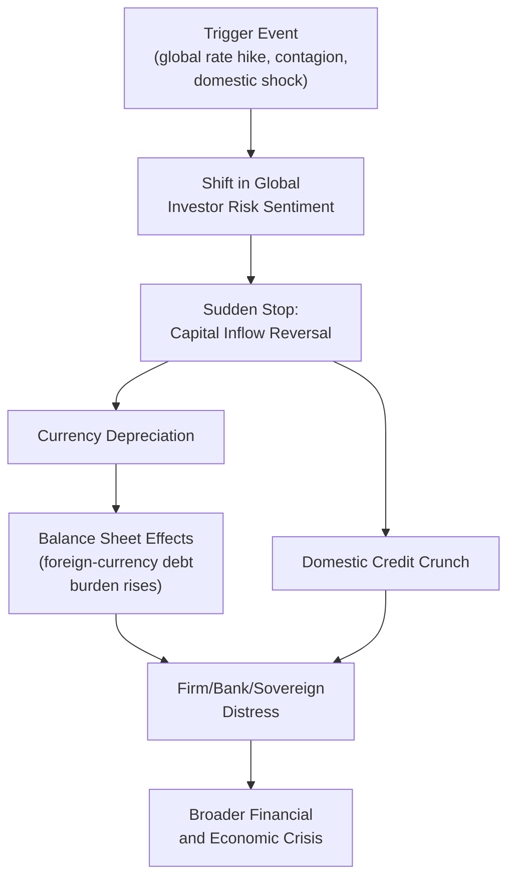

## Capital Flows and Financial Crises

### Overview

Cross-border capital flows — encompassing FDI, portfolio investment, bank lending, and short-term speculative flows — have been both a critical development finance channel and a recurring source of macroeconomic instability in emerging and developing economies. Understanding the composition, drivers, and reversal risk of capital flows is essential to explaining a succession of financial crises since the 1980s.

### Taxonomy of Capital Flows

**Key Points**

- Capital flows are generally classified by type, each carrying distinct volatility and crisis-risk characteristics:

| Flow Type | Characteristics | Relative Volatility/Reversal Risk |
| --- | --- | --- |
| Foreign Direct Investment (FDI) | Long-term, control-seeking, tied to physical assets | Low — considered the most stable flow category |
| Portfolio equity investment | Tradable equity holdings without control | Moderate to high |
| Portfolio debt investment | Tradable bonds, often short-to-medium maturity | High, particularly for short-maturity instruments |
| Cross-border bank lending | Interbank and bank-to-corporate lending | High — historically a major crisis transmission channel |
| Short-term speculative flows ("hot money") | Highly liquid, rapidly reversible positions | Very high — most associated with "sudden stop" episodes |

- This ranking of relative stability (FDI generally most stable, short-term debt/bank flows generally least stable) is a widely cited empirical regularity in the international finance literature, informing the common policy recommendation to encourage FDI while managing short-term flow volatility more cautiously. [Inference: while this general ranking is broadly supported, exceptions exist (e.g., certain FDI can be more footloose than assumed, particularly in some services sectors with lower fixed capital requirements), so it should be treated as a strong empirical tendency rather than an absolute rule]

### The "Sudden Stop" Phenomenon

**Key Points**

- **Sudden stops**, a concept substantially developed by economist Guillermo Calvo, describe episodes where capital inflows to an emerging economy abruptly and sharply reverse, typically triggering a currency crisis, credit crunch, and often a broader financial and economic crisis.
- Common triggering and amplifying mechanisms:
  - **Shifts in global investor risk sentiment**: often triggered by events unrelated to the specific country's fundamentals (e.g., US monetary policy tightening raising global interest rates and reducing the relative attractiveness of emerging market assets, or crisis contagion from another country).
  - **Balance sheet mismatches**: firms, banks, or governments that borrowed in foreign currency while earning revenue in local currency face rapidly rising real debt burdens when the sudden stop triggers currency depreciation — a mechanism termed the **"original sin"** and currency mismatch problem, closely linked to underdeveloped local-currency capital markets.
  - **Self-fulfilling dynamics**: capital flight itself can trigger the currency depreciation and asset price declines that justify the initial flight, creating a potentially self-reinforcing crisis dynamic distinct from a crisis driven purely by weakening fundamentals.

### Historical Crisis Episodes and Capital Flow Dynamics

**Key Points**

1. **Latin American Debt Crisis (1982 onward)**: preceded by a large buildup of foreign currency (predominantly dollar-denominated) sovereign borrowing during the 1970s, facilitated by recycled petrodollar deposits in international banks. The US Federal Reserve's sharp interest rate increases in the early 1980s (the Volcker disinflation) raised debt service costs on floating-rate loans and contributed to a wave of sovereign defaults and debt restructuring across the region, ushering in what is often termed Latin America's "lost decade."
2. **Mexican Peso Crisis (1994-95)**: involved a sudden stop of portfolio capital inflows following a combination of political instability, a widening current account deficit, and a fixed exchange rate regime perceived as increasingly unsustainable, triggering a sharp peso devaluation and requiring a substantial US/IMF financial support package.
3. **Asian Financial Crisis (1997-98)**: widely analyzed as involving several compounding capital flow-related vulnerabilities:
   - Substantial short-term foreign currency bank borrowing by domestic financial institutions, often channeled into speculative real estate and equity investments rather than productive long-term investment.
   - Pegged or heavily managed exchange rate regimes that had encouraged unhedged foreign currency borrowing (implicit belief in exchange rate stability reduced perceived currency risk).
   - Weak prudential bank regulation failing to constrain risky lending practices during the preceding capital inflow boom.
   - Contagion effects, where crisis in one economy (originating in Thailand) rapidly spread to other regional economies (Indonesia, South Korea, Malaysia) with structurally similar vulnerabilities, illustrating capital flow-driven crisis contagion beyond purely country-specific fundamentals.
4. **Global Financial Crisis spillovers to emerging markets (2008-09)**: while originating in advanced-economy (particularly US) financial markets, the crisis transmitted to emerging markets substantially through capital flow channels — a sharp global "flight to safety" caused significant portfolio capital outflows from emerging markets, compounding trade-channel effects from collapsing global demand.

### Push vs. Pull Factors in Capital Flow Determination

**Key Points**

- The academic literature on capital flow drivers distinguishes between two categories of determinants:
  - **"Push" factors**: global conditions independent of any specific recipient country — global interest rates (particularly US monetary policy), global risk appetite/investor sentiment, and global liquidity conditions.
  - **"Pull" factors**: recipient country-specific characteristics — growth prospects, institutional quality, macroeconomic stability, and expected returns relative to risk.
- A substantial body of empirical research has found that **push factors often explain a large share of the variation** in aggregate capital flows to emerging markets, particularly during periods of extreme global monetary conditions (e.g., quantitative easing episodes), implying that even well-managed emerging economies with strong fundamentals can experience significant capital flow volatility driven by factors entirely outside their domestic policy control. [Inference: the relative weight of push versus pull factors varies by capital flow type, country, and time period across different studies; while push factors are widely found to matter significantly, pull factors (domestic fundamentals) generally still matter for determining which specific countries receive a larger or smaller share of a given global flow wave, so the two categories should be understood as complementary rather than one fully dominating the other]

### Policy Responses: The Impossible Trinity Constraint

**Key Points**

- Emerging economy capital flow management is fundamentally constrained by the **Mundell-Fleming "impossible trinity"** (or trilemma): a country cannot simultaneously maintain (1) a fixed exchange rate, (2) free capital mobility, and (3) independent monetary policy — at most two of the three are achievable simultaneously.

$$\text{Fixed Exchange Rate} + \text{Free Capital Mobility} + \text{Independent Monetary Policy} = \text{Impossible}$$

- This constraint directly shapes available policy responses to capital flow volatility:
  - **Choosing exchange rate flexibility**: allows independent monetary policy and open capital accounts, but exposes the economy to currency volatility that can be severe during sudden stops (though flexible rates can also act as a shock absorber, adjusting gradually rather than requiring a sudden discrete devaluation).
  - **Choosing capital controls**: allows a fixed/managed exchange rate alongside independent monetary policy, but sacrifices free capital mobility — this is the theoretical justification for using **capital flow management measures (CFMs)**, now more explicitly endorsed by the IMF's post-2012 institutional view under specific circumstances.
  - **Choosing a fixed exchange rate with open capital account**: sacrifices independent monetary policy (interest rates must track the anchor currency's rates), a common choice for very small, highly trade-dependent economies or currency board/dollarized regimes.

### Diagram: The Impossible Trinity

<svg xmlns="http://www.w3.org/2000/svg" viewBox="0 0 480 420" font-family="sans-serif">
<text x="240" y="24" text-anchor="middle" font-size="15" font-weight="bold" fill="#1a1a1a">The Impossible Trinity (svg_diagram)</text>
<polygon points="240,60 420,340 60,340" fill="none" stroke="#333" stroke-width="2" />
<text x="220" y="50" font-size="12" fill="#1a1a1a" text-anchor="middle">Fixed Exchange Rate</text>
<text x="60" y="365" font-size="12" fill="#1a1a1a" text-anchor="middle">Free Capital Mobility</text>
<text x="420" y="365" font-size="12" fill="#1a1a1a" text-anchor="middle">Independent Monetary Policy</text>
<text x="150" y="185" font-size="10" fill="#2b6cb0" text-anchor="middle" transform="rotate(-58 150 185)">Fixed rate + open capital</text>
<text x="150" y="205" font-size="10" fill="#2b6cb0" text-anchor="middle" transform="rotate(-58 150 205)">= no independent policy</text>
<text x="330" y="185" font-size="10" fill="#2f855a" text-anchor="middle" transform="rotate(58 330 185)">Open capital + policy</text>
<text x="330" y="205" font-size="10" fill="#2f855a" text-anchor="middle" transform="rotate(58 330 205)">independence = float</text>
<text x="240" y="330" font-size="10" fill="#c53030" text-anchor="middle">Fixed rate + policy independence = capital controls</text>
</svg>

### Macroprudential Policy as a Complementary Tool

**Key Points**

- Beyond the trilemma's exchange rate/capital control/monetary policy trade-off, a distinct policy toolkit — **macroprudential regulation** — has gained prominence since the 2008 crisis as a complementary approach to managing capital flow-related financial stability risk:
  - **Countercyclical capital buffers**: requiring banks to hold additional capital during credit booms, building resilience before a potential sudden stop-triggered downturn.
  - **Foreign currency exposure limits**: restricting banks' and sometimes corporates' unhedged foreign currency borrowing, directly targeting the currency mismatch vulnerability central to many historical crises.
  - **Loan-to-value and debt-to-income limits**: constraining credit-fueled asset price bubbles that capital inflow surges can generate, particularly in real estate markets.
- [Fact regarding the general post-2008 trend toward greater macroprudential policy emphasis across both advanced and emerging economies; the empirical effectiveness of specific macroprudential tools in preventing or mitigating crises remains an active area of ongoing research with results varying by tool, country, and implementation quality]

### International Financial Architecture and Crisis Response

**Key Points**

- The **International Monetary Fund (IMF)** serves as the primary multilateral crisis-response institution, providing emergency financing (often conditional on policy reform commitments) during balance-of-payments crises triggered by capital flow reversals.
- **IMF conditionality** — policy commitments (fiscal austerity, monetary tightening, structural reforms) attached to IMF lending programs — has been historically controversial, with debate over whether standard conditionality packages appropriately address crisis-specific circumstances or impose excessively uniform, procyclical austerity that can deepen a crisis-induced recession. [Inference: this remains a genuinely contested area, with IMF program design having evolved somewhat over successive crisis episodes in response to earlier criticism, though views on the adequacy of that evolution differ among researchers and policymakers]
- **Regional financial safety nets** (e.g., the Chiang Mai Initiative among ASEAN+3 countries, established partly in response to dissatisfaction with the IMF's Asian Financial Crisis response) represent an alternative or complementary layer of crisis-response financing developed by regional groupings.

### Related Topics

- The Mundell-Fleming impossible trinity
- Sudden stops and the Calvo cycle
- "Original sin" and currency mismatch in emerging market debt
- Macroprudential regulation and countercyclical capital buffers
- IMF conditionality and balance-of-payments crisis lending
- Capital markets in developing economies
- Financial repression and liberalization debates