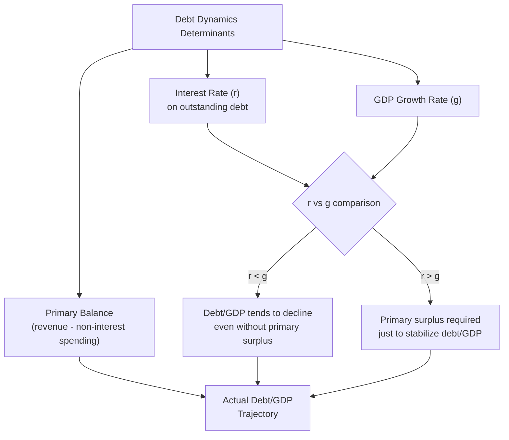

## Sovereign Debt and Debt Sustainability

### Overview

Sovereign debt sustainability concerns whether a government can service its debt obligations over time without requiring an unsustainable adjustment in fiscal policy, restructuring, or default. This is a central and recurring concern in development economics given the historical prevalence of debt crises among low- and middle-income countries, and it involves both technical accounting frameworks and genuinely contested judgments about future economic conditions.

### Defining Debt Sustainability

**Key Points**

- A country's public debt is generally considered sustainable if the government can meet its current and future debt service obligations without exceptional financing assistance, a major fiscal adjustment, or restructuring — though operationalizing this definition requires forward-looking assumptions that are inherently uncertain.
- The most widely used analytical framework is the **debt dynamics equation**, which relates the change in the debt-to-GDP ratio to the interest rate, growth rate, and primary fiscal balance:

$$\Delta d_t = \frac{r - g}{1+g} d_{t-1} - pb_t$$

where $d_t$ is the debt-to-GDP ratio, $r$ is the effective (real) interest rate on debt, $g$ is the real GDP growth rate, and $pb_t$ is the primary balance (revenue minus non-interest expenditure) as a share of GDP.

- **The interest rate-growth differential ($r - g$)** is the central determinant of whether debt dynamics are inherently stabilizing or destabilizing:
  - If $r < g$ (growth exceeds the interest rate on debt), the debt-to-GDP ratio tends to decline automatically even with a zero primary balance — a historically common condition in many advanced economies during low-interest-rate periods, though less reliably present in many developing economies facing higher borrowing costs.
  - If $r > g$, the government must run a primary *surplus* merely to stabilize (not reduce) the debt-to-GDP ratio, creating a more demanding fiscal adjustment requirement.

### Composition of Sovereign Debt

**Key Points**

- Sovereign debt sustainability analysis distinguishes debt along several dimensions, each with distinct risk implications:
  - **Domestic vs. external debt**: external debt (owed to foreign creditors, often in foreign currency) typically carries greater exchange rate risk and can be harder to restructure given the more fragmented and internationally dispersed creditor base compared to domestic debt.
  - **Currency denomination**: foreign-currency-denominated debt exposes the sovereign to the currency mismatch/"original sin" problem discussed under capital markets and capital flows topics — depreciation directly raises the local-currency cost of debt service.
  - **Maturity structure**: short-maturity debt requires more frequent refinancing (rollover), exposing the sovereign to **rollover risk** if market access deteriorates or interest rates rise sharply between refinancing dates.
  - **Fixed vs. floating rate**: floating-rate debt exposes the sovereign to interest rate risk if global rates rise, as occurred dramatically during the early-1980s Volcker disinflation that triggered the Latin American debt crisis.
  - **Creditor composition**: official bilateral creditors (governments), multilateral creditors (IMF, World Bank, regional development banks), and private creditors (bondholders, commercial banks) each have different negotiating incentives and legal frameworks governing potential restructuring.

### Debt Sustainability Analysis (DSA) Framework

**Key Points**

- The **IMF-World Bank Debt Sustainability Framework (DSF)** is the standard institutional tool used to assess sovereign debt sustainability, particularly for low-income countries, combining:
  - **Baseline projections**: forecasting debt trajectory under central macroeconomic assumptions (growth, interest rates, exchange rates, fiscal balance).
  - **Stress tests / sensitivity analysis**: examining how debt trajectories would evolve under adverse shocks (growth shortfalls, exchange rate depreciation, commodity price declines, interest rate increases) to assess resilience beyond the baseline scenario.
  - **Debt distress risk ratings**: categorizing countries (for low-income countries specifically) into risk categories (low, moderate, high risk of debt distress, or already in debt distress) based on DSA results relative to indicative policy-dependent thresholds. [Fact regarding the existence and general structure of this framework; the specific threshold values and classification methodology have been periodically revised, so a search would be advisable for the current framework version's precise parameters]
- **Critiques of DSA frameworks**: some researchers and civil society organizations have argued that standard DSA growth and revenue assumptions are sometimes overly optimistic, understating genuine debt distress risk, and that the frameworks may not adequately account for climate-related contingent liabilities or other emerging risk categories in some country contexts. [Speculation: the degree to which any specific DSA has been "too optimistic" in retrospect is necessarily a case-by-case empirical judgment rather than a general critique applicable uniformly across all DSA exercises]

### Historical Sovereign Debt Crisis Episodes

**Key Points**

1. **Latin American Debt Crisis (1982-1989)**: triggered by a combination of large 1970s foreign currency borrowing (recycled petrodollar deposits), the Volcker-era interest rate shock raising floating-rate debt service costs, and declining commodity export revenues. Led to a prolonged period of serial restructuring and the eventual **Brady Plan (1989)**, which converted defaulted bank loans into tradable "Brady bonds" with partial principal reduction and US Treasury collateral backing — widely regarded as a template for subsequent debt restructuring approaches.
2. **Heavily Indebted Poor Countries (HIPC) Initiative (launched 1996, enhanced 1999)**: a coordinated multilateral debt relief program for the poorest, most heavily indebted countries (predominantly in Sub-Saharan Africa), providing debt reduction from multilateral, bilateral, and some commercial creditors conditional on poverty-reduction policy commitments (subsequently linked to Poverty Reduction Strategy Papers). Followed by the **Multilateral Debt Relief Initiative (MDRI, 2005)**, which provided additional full cancellation of eligible multilateral debt for qualifying HIPC-completion-point countries.
3. **Argentine Debt Crisis and Default (2001-02, with subsequent restructuring disputes extending to 2016+)**: notable for prolonged litigation with "holdout" creditors who refused to accept restructuring terms accepted by the majority of bondholders, highlighting the **collective action problem** in sovereign debt restructuring absent a formal international bankruptcy-like mechanism for sovereigns.
4. **Recent debt distress concerns (2020s)**: a combination of the COVID-19 pandemic's fiscal and growth shocks, subsequent global interest rate increases, and a shift in developing-country creditor composition toward a more diverse set of official and private creditors (including a substantially increased role for China as a bilateral creditor) has generated renewed debt sustainability concerns across a number of low- and middle-income countries. [Unverified: given the fast-moving nature of debt distress developments, specific current country debt distress classifications and the status of ongoing restructuring negotiations would require a search for up-to-date information]

### The Collective Action Problem in Sovereign Debt Restructuring

**Key Points**

- Unlike corporate bankruptcy, there is no binding international legal framework compelling all creditors to accept a sovereign debt restructuring agreed to by a majority — this absence of a sovereign bankruptcy mechanism creates a **collective action problem**:
  - Individual creditors may have incentive to "hold out" from a restructuring accepted by the majority of creditors, hoping to be repaid in full (or receive more favorable terms) through litigation, since a partial restructuring by other creditors can improve the debtor's capacity to fully repay holdouts.
  - This dynamic was prominently illustrated in Argentina's prolonged litigation with holdout creditors (notably in US courts under the "pari passu" clause interpretation), which delayed Argentina's return to international capital markets for over a decade.
- **Collective Action Clauses (CACs)**: increasingly standard provisions in sovereign bond contracts allowing a qualified supermajority of bondholders to approve restructuring terms that then become binding on all bondholders (including dissenting holdouts), substantially developed and promoted as standard practice in the years following the Argentine litigation experience specifically to mitigate the holdout problem.
- **Common Framework for Debt Treatment (established 2020, G20/Paris Club initiative)**: a coordination mechanism intended to bring together the more diverse modern creditor landscape (including non-Paris-Club official bilateral creditors such as China) for debt treatment negotiations, though implementation has faced documented delays and coordination challenges in early cases. [Inference: assessment of the Common Framework's effectiveness remains contested and evolving, given its relatively recent establishment and the limited number of cases processed through it to date — a search would be needed for the current status of specific country cases]

### Diagram: Sovereign Debt Restructuring Collective Action Problem

<svg xmlns="http://www.w3.org/2000/svg" viewBox="0 0 540 300" font-family="sans-serif">
<text x="270" y="24" text-anchor="middle" font-size="15" font-weight="bold" fill="#1a1a1a">Holdout Creditor Problem (svg_diagram)</text>
<rect x="40" y="60" width="180" height="50" fill="#c6f6d5" stroke="#2f855a" />
<text x="55" y="90" font-size="11" fill="#1a1a1a">Majority Creditors Accept</text>
<text x="55" y="103" font-size="11" fill="#1a1a1a">Restructuring (haircut)</text>
<rect x="320" y="60" width="180" height="50" fill="#fed7d7" stroke="#c53030" />
<text x="335" y="90" font-size="11" fill="#1a1a1a">Holdout Creditors Refuse,</text>
<text x="335" y="103" font-size="11" fill="#1a1a1a">Pursue Litigation</text>
<path d="M130 110 L 130 160" stroke="#333" stroke-width="1.5" marker-end="url(#f1)" />
<path d="M410 110 L 410 160" stroke="#333" stroke-width="1.5" marker-end="url(#f1)" />
<rect x="100" y="160" width="360" height="70" fill="#fefcbf" stroke="#b7791f" />
<text x="115" y="185" font-size="11" fill="#1a1a1a">Improved debtor capacity (from majority</text>
<text x="115" y="200" font-size="11" fill="#1a1a1a">restructuring) increases incentive for holdouts</text>
<text x="115" y="215" font-size="11" fill="#1a1a1a">to seek full repayment via litigation</text>
</svg>

### Debt Overhang and Growth Effects

**Key Points**

- **Debt overhang theory** (developed significantly in the context of 1980s developing-country debt crises, associated with economists including Paul Krugman and Jeffrey Sachs) argues that very high debt levels can themselves *depress* growth and investment, independent of the immediate liquidity/rollover risk:
  - Expected future taxation to service high debt levels acts as an implicit tax on future returns to current investment, discouraging both domestic and foreign private investment.
  - This creates a situation where partial debt *reduction* (not merely rescheduling) may be in creditors' collective interest, since it can raise the expected value of debt actually recovered by increasing growth and repayment capacity — a rationale underlying debt reduction elements of both the Brady Plan and HIPC initiative.
- [Inference: while debt overhang theory is influential and provides a coherent rationale for debt reduction (as opposed to pure rescheduling) in sufficiently distressed cases, empirically identifying the specific debt threshold beyond which overhang effects become significant, and cleanly separating overhang effects from other growth-depressing factors correlated with high debt (weak institutions, macroeconomic instability), remains a genuinely difficult empirical exercise without a single settled consensus threshold]

### Debt Sustainability and Contingent Liabilities

**Key Points**

- Beyond explicit government debt, sustainability analysis increasingly considers **contingent liabilities** — obligations that may materialize under certain conditions but are not part of headline explicit debt figures:
  - State-owned enterprise debt with implicit or explicit government guarantees.
  - Public-private partnership (PPP) contractual obligations, including minimum revenue guarantees.
  - Banking sector contingent liabilities (potential need for government-funded bank recapitalization following a financial crisis).
  - Climate-related contingent liabilities, an increasingly discussed category particularly for climate-vulnerable developing economies facing potential large-scale disaster response and reconstruction financing needs.
- Failure to account for contingent liabilities has been cited in several historical cases as a factor in debt sustainability assessments understating true fiscal risk, since realized contingent liabilities (e.g., a banking crisis bailout) can cause a sudden, large jump in headline government debt not anticipated by baseline DSA projections.

### Related Topics

- Debt Sustainability Analysis (DSA) framework and low-income country risk ratings
- Heavily Indebted Poor Countries (HIPC) Initiative and Multilateral Debt Relief Initiative
- Collective Action Clauses and sovereign debt contract design
- Common Framework for Debt Treatment (G20/Paris Club)
- Debt overhang theory and the Brady Plan
- Capital flows and financial crises
- Terms of trade for commodity exporters (fiscal revenue volatility linkage)