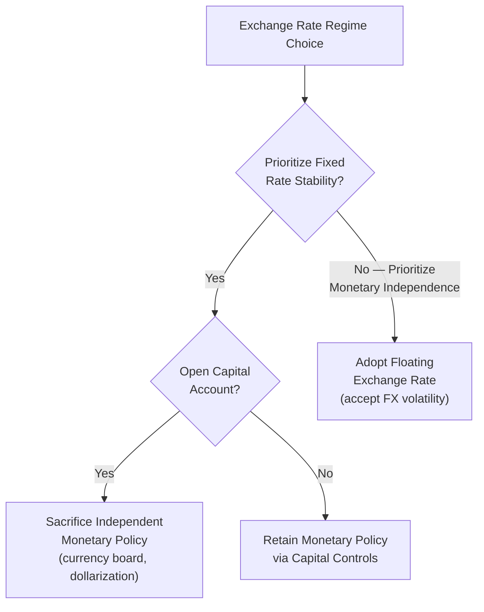

## Exchange Rate Regimes for Developing Countries

### Overview

The choice of exchange rate regime — how a country's currency value is determined relative to other currencies — is a foundational macroeconomic policy decision with significant implications for trade competitiveness, inflation control, monetary policy autonomy, and vulnerability to external shocks. Developing countries face this choice under conditions of typically thinner financial markets, greater exposure to external shocks, and weaker policy credibility than advanced economies, shaping a distinct set of trade-offs.

### The Spectrum of Exchange Rate Regimes

**Key Points**

- Exchange rate regimes exist along a spectrum from fully fixed to fully floating, with numerous intermediate arrangements:

| Regime Type | Description | Degree of Flexibility |
| --- | --- | --- |
| Full dollarization / currency union | Adopts another country's currency entirely, or shares a common currency with other states | None (no independent currency) |
| Currency board | Domestic currency issuance fully backed by foreign reserves at a fixed rate, with legally constrained discretion | Minimal |
| Conventional fixed peg | Currency pegged to a single currency or basket at a fixed rate, with limited-margin adjustment | Very low |
| Crawling peg | Fixed rate adjusted periodically according to a pre-announced formula (often to accommodate inflation differentials) | Low |
| Managed float (dirty float) | Central bank intervenes to influence the exchange rate without a fixed target | Moderate |
| Free float | Exchange rate determined entirely by market forces with no official intervention | High |

- This spectrum forms the basis of the IMF's official exchange rate regime classification, used to compare country practices and, more importantly, to assess the connection between regime choice and macroeconomic outcomes across countries. [Fact regarding the general existence of this classification framework; specific country regime classifications change over time and would require a search for current status of any particular country]

### The Impossible Trinity as the Central Constraint

**Key Points**

- As discussed under capital flows, the **Mundell-Fleming impossible trinity (trilemma)** establishes that a country cannot simultaneously maintain (1) a fixed exchange rate, (2) free capital mobility, and (3) independent monetary policy.
- This constraint directly frames the exchange rate regime choice for developing countries:
  - Countries choosing fixed rates with open capital accounts (e.g., currency boards, dollarization) sacrifice independent monetary policy — interest rates must track the anchor currency.
  - Countries choosing floating rates retain independent monetary policy even with open capital accounts, but accept exchange rate volatility.
  - Countries wishing to retain both a managed exchange rate and independent monetary policy must restrict capital mobility through capital controls.

### Case for Fixed Exchange Rate Regimes in Developing Countries

**Key Points**

- **Nominal anchor for inflation control**: a credible fixed peg to a low-inflation currency can import monetary discipline, particularly valuable for countries with a history of high inflation or weak central bank credibility where announcing an independent inflation target might not be believed by markets and the public.
- **Reduced exchange rate risk for trade and investment**: fixed rates eliminate exchange rate uncertainty for trade invoicing and cross-border investment decisions, potentially encouraging trade and FDI, particularly valuable for small, highly trade-dependent economies where exchange rate volatility could have outsized effects relative to economy size.
- **Suitability for small, open economies with limited independent monetary policy value**: very small economies with limited scope for countercyclical monetary policy to meaningfully affect their own business cycle (due to being price-takers in most markets, or having economies highly synchronized with a large trading partner) may have less to lose from sacrificing monetary independence.
- **Historical inflation-fighting successes**: several countries have used credible currency board or fixed peg arrangements to break entrenched high-inflation expectations (e.g., Argentina's currency board in the 1990s achieved substantial disinflation, though it later ended in the 2001-02 crisis, illustrating both the potential benefits and risks of rigid fixed regimes discussed further below).

### Case for Floating Exchange Rate Regimes in Developing Countries

**Key Points**

- **Automatic shock absorption**: a floating rate can adjust gradually to absorb external shocks (terms-of-trade changes, capital flow reversals) rather than requiring the economy to adjust entirely through domestic prices, wages, and output — particularly valuable for commodity-exporting developing economies facing significant terms-of-trade volatility, as discussed under terms-of-trade topics.
- **Retained monetary policy independence**: allows the central bank to set interest rates according to domestic conditions (countercyclical policy during downturns) rather than being bound to match the anchor currency's monetary stance, which may be entirely inappropriate for the domestic business cycle.
- **Avoids the risk of costly peg abandonment**: fixed pegs that eventually prove unsustainable (due to accumulated real exchange rate misalignment, unsustainable current account deficits, or speculative attack) tend to collapse in a sudden, often crisis-inducing devaluation — a floating rate avoids this specific "peg collapse" crisis dynamic, since the rate adjusts continuously rather than accumulating pressure toward a discrete break.
- **Reduced incentive for unhedged foreign currency borrowing**: under a credible float, firms and banks face a more visible incentive to hedge foreign currency exposure (since currency risk is continuously priced), potentially reducing the currency mismatch vulnerabilities that fixed-rate regimes can mask by creating an illusion of exchange rate stability that discourages hedging — a dynamic frequently cited as a contributing factor in the Asian Financial Crisis.

### The "Fear of Floating" Phenomenon

**Key Points**

- A substantial body of empirical research (notably associated with economists Guillermo Calvo and Carmen Reinhart) has documented that many developing countries officially classified as having floating exchange rate regimes exhibit exchange rate volatility significantly lower than would be expected under a genuinely free float, alongside evidence of frequent central bank intervention — a phenomenon termed **"fear of floating."**
- Commonly cited explanations for fear of floating:
  - **Balance sheet currency mismatches**: where significant foreign-currency-denominated debt exists in the corporate, banking, or government sector, large depreciations can trigger severe balance sheet distress, giving policymakers strong incentive to resist depreciation even under an officially floating regime.
  - **Pass-through to domestic inflation**: in economies with significant import dependence and less-anchored inflation expectations, exchange rate depreciation can pass through more quickly and completely to domestic inflation than in advanced economies, creating strong incentive to limit currency movements to preserve price stability.
  - **Reduced central bank credibility**: markets and the public may not fully believe an officially announced floating regime commitment, particularly where a country has a history of pegging, leading to speculative behavior that central banks then feel compelled to counter through intervention.
- [Inference: the "fear of floating" finding is well-documented empirically across the studied country samples and time periods, though the degree to which any specific contemporary developing country continues to exhibit this pattern would require current data and a search for up-to-date regime classification and behavior]

### Real Exchange Rate and Competitiveness

**Key Points**

- Beyond the nominal exchange rate regime choice, the **real exchange rate** (nominal rate adjusted for relative price levels between countries) is the economically relevant measure for trade competitiveness:

$$RER = \frac{E \times P^*}{P}$$

where $E$ is the nominal exchange rate (domestic currency per unit of foreign currency), $P^*$ is the foreign price level, and $P$ is the domestic price level.

- A real exchange rate that becomes significantly overvalued (whether due to a fixed nominal peg combined with domestic inflation exceeding the anchor country's inflation, or due to Dutch Disease-type appreciation from a resource boom) erodes export competitiveness and can widen current account deficits, creating pressure that eventually may force a costly nominal adjustment if the regime is fixed.
- This connects directly to the structural transformation and Dutch Disease material discussed under trade topics: exchange rate regime and real exchange rate management are central tools (and risks) in preserving or undermining a developing country's manufacturing/tradable sector competitiveness.

### Diagram: Real Exchange Rate Overvaluation Dynamics

<svg xmlns="http://www.w3.org/2000/svg" viewBox="0 0 540 300" font-family="sans-serif">
<text x="270" y="24" text-anchor="middle" font-size="15" font-weight="bold" fill="#1a1a1a">Fixed Peg Overvaluation Buildup (svg_diagram)</text>
<line x1="60" y1="250" x2="60" y2="50" stroke="#333" stroke-width="1.5" />
<line x1="60" y1="250" x2="500" y2="250" stroke="#333" stroke-width="1.5" />
<text x="10" y="60" font-size="11" fill="#333">Real Exch. Rate</text>
<text x="460" y="272" font-size="11" fill="#333">Time</text>
<line x1="60" y1="150" x2="500" y2="150" stroke="#2b6cb0" stroke-width="2" stroke-dasharray="6,3" />
<text x="460" y="145" font-size="10" fill="#2b6cb0">Nominal peg (fixed)</text>
<path d="M 60 150 Q 200 130 300 90 T 460 60" stroke="#c53030" stroke-width="2.5" fill="none" />
<text x="260" y="80" font-size="10" fill="#c53030">Real appreciation (domestic inflation &gt; anchor)</text>
<line x1="460" y1="60" x2="460" y2="250" stroke="#999" stroke-dasharray="2,2" />
<text x="380" y="270" font-size="10" fill="#666">Growing misalignment risks eventual crisis break</text>
</svg>

### Intermediate Regimes and the "Bipolar View" Debate

**Key Points**

- A significant debate in international macroeconomics, prominent particularly in the late 1990s and early 2000s following the Asian and other emerging market crises, concerned the **"bipolar view"** (or "corner solutions hypothesis") — the argument that intermediate exchange rate regimes (adjustable pegs, narrow bands) are inherently crisis-prone and unsustainable in a world of high capital mobility, and that countries should instead choose one of the two "corner" solutions: a hard fixed regime (currency board, dollarization) or a genuinely free float.
- This view gained influence following the collapse of several intermediate-regime pegs during the 1990s crises but was later substantially qualified:
  - Many countries have continued to successfully operate various intermediate/managed regimes for extended periods without crisis, suggesting the bipolar view's strong prediction was not universally validated.
  - Subsequent research and IMF institutional thinking has generally moved toward a more nuanced position acknowledging that regime sustainability depends heavily on complementary policies (fiscal discipline, prudential regulation, capital flow management) rather than the nominal regime choice being a sufficient determinant on its own. [Inference: the bipolar view is now generally regarded in the literature as having been somewhat overstated in its strongest form, though the underlying logic connecting capital mobility and peg fragility retains continued relevance as one input among several into regime choice, rather than a fully deterministic rule]

### Regime Choice and Monetary Policy Frameworks

**Key Points**

- Exchange rate regime choice interacts closely with the broader monetary policy framework:
  - **Inflation targeting** frameworks (increasingly adopted by a substantial number of middle-income developing economies since the 1990s-2000s) are generally paired with floating or managed-float exchange rate regimes, since a fixed exchange rate commitment would conflict with using interest rates to target domestic inflation directly.
  - **Exchange-rate-based stabilization** programs, historically common (particularly in Latin America during high-inflation episodes), use a fixed or pre-announced crawling peg as the primary nominal anchor for disinflation rather than a direct inflation target, with mixed historical success and, in several documented cases, eventual crisis-ending collapse once the peg's credibility could no longer be sustained against accumulated real overvaluation.

### Related Topics

- The Mundell-Fleming impossible trinity
- Capital flows and financial crises (sudden stops, currency mismatch)
- Dutch Disease and real exchange rate management
- Inflation targeting frameworks in emerging markets
- Fear of floating (Calvo-Reinhart)
- Currency boards and dollarization case studies
- Terms of trade for commodity exporters