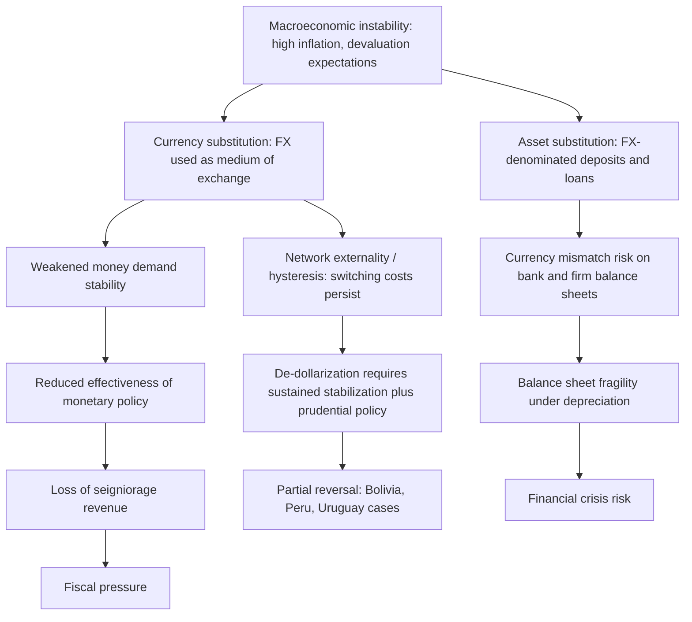

## Dollarization and Currency Substitution

### Definitions and Conceptual Distinctions

**Currency substitution** refers to the use of a foreign currency to perform the medium-of-exchange function of money, replacing the domestic currency in transactions. **Asset substitution** (sometimes distinguished separately) refers to residents holding foreign-currency-denominated assets (bonds, deposits) as a store of value, even while the domestic currency continues to be used for daily transactions. **Dollarization** is the broader umbrella term commonly used to describe both phenomena, and in popular and policy usage often collapses the distinction, referring generally to an economy's reliance on a foreign currency (historically and disproportionately the US dollar, though the euro, and regionally other currencies, play the same role) to fulfill some or all of money's three classic functions: unit of account, medium of exchange, and store of value.

A standard taxonomy distinguishes:

- **Official (de jure) dollarization**: A country legally adopts a foreign currency as its official legal tender, either fully replacing the domestic currency (e.g., Ecuador, El Salvador, Panama, Zimbabwe at various points) or adopting it alongside a domestic currency with limited circulation.
- **Semi-official dollarization**: The foreign currency is legal tender and widely used, but a domestic currency also circulates and is used for at least some transactions, often government-related (wages, taxes).
- **Unofficial (de facto) dollarization**: The foreign currency has no legal tender status, but residents use it voluntarily for savings, contracts, or (in extreme cases) daily transactions, typically because of a loss of confidence in the domestic currency.

### Theoretical Framework: Why Dollarization Occurs

**Currency substitution** and **asset substitution** are typically modeled as endogenous responses to macroeconomic instability rather than exogenous policy choices, at least in their unofficial form.

**Portfolio approach**: Households and firms hold a portfolio of currencies to manage risk. This can be modeled similarly to standard portfolio theory: agents allocate wealth across domestic-currency assets and foreign-currency assets to minimize the variance of real portfolio returns, given expected inflation differentials and exchange rate volatility. Formally, if $\pi_d$ is expected domestic inflation and $\sigma_d^2$ is its variance, an increase in $\sigma_d^2$ relative to the volatility of foreign-currency-denominated returns pushes optimal portfolio share $\theta$ (share held in domestic currency) downward.

**Currency substitution as a network/hysteresis phenomenon**: A key theoretical result (associated with work by Guillermo Calvo and Carlos Vegh, among others) is that currency substitution exhibits **ratchet effects** or **hysteresis**: once agents switch to using a foreign currency for transactions during a period of high inflation, they often do not switch back fully even after domestic inflation is stabilized. This occurs because of network externalities in currency use — the convenience of using a currency depends on how many other agents also use it, creating a coordination problem with multiple equilibria. This has significant policy implications: dollarization, once established, can be difficult and costly to reverse even after the underlying inflationary cause is addressed.

**Money demand implications**: In a currency substitution economy, the standard money demand function is modified because agents' demand for real domestic money balances depends not only on the domestic interest rate and income, but also on the expected depreciation of the domestic currency (which represents the opportunity cost of holding domestic currency versus foreign currency). This weakens the traditional transmission mechanism between money supply and price levels, and can make domestic monetary policy less effective or produce unstable money demand estimates.

### Determinants and Drivers

The academic literature identifies several categories of drivers:

**Macroeconomic instability drivers**

- High and volatile inflation, particularly hyperinflation episodes (classic cases: Bolivia 1980s, Argentina, Zimbabwe 2000s)
- History of exchange rate depreciation and devaluation expectations
- Fiscal dominance, where persistent deficits are perceived as likely to be monetized

**Institutional and legal drivers**

- Legal permissiveness for holding foreign-currency deposits (this is a strong empirical predictor — countries that allow FX deposits in the domestic banking system see much higher deposit dollarization)
- Capital account openness
- Weak central bank credibility and independence

**Structural/trade drivers**

- High trade openness and proximity to a large, stable-currency trading partner
- Remittance inflows denominated in foreign currency
- Tourism-dependent economies where foreign currency circulates naturally

### Measurement

Since currency substitution (cash held/used) is inherently difficult to observe directly, empirical work typically relies on proxies:

- **Deposit dollarization ratio**: Foreign-currency deposits / Total deposits in the domestic banking system. This is the most commonly used and most reliably measurable indicator, though it strictly measures asset substitution rather than currency (transactional) substitution.
- **Credit dollarization ratio**: Foreign-currency loans / Total loans.
- Currency-in-circulation-based estimates (e.g., inferring dollar cash holdings abroad from US currency shipment/repatriation data — this method has been used by researchers, including at the US Federal Reserve, to estimate the share of US dollar cash held outside the United States).
- Survey-based estimates of transaction currency use.

### Macroeconomic Consequences

**Loss of independent monetary policy**: Under high currency substitution, the central bank's ability to influence aggregate demand through interest rate policy weakens because domestic-currency assets are poor substitutes for the foreign currency that dominates portfolios; interest rate changes on domestic-currency instruments do less to affect overall liquidity conditions.

**Loss of seigniorage**: Seigniorage — revenue a government earns from money creation (the difference between the face value of money and its cost of production, or more generally the resources a government commands through money issuance) — is lost or reduced when residents use foreign currency instead of the domestic currency, since seigniorage accrues to the issuer of the currency actually in circulation. Under official (full) dollarization, this loss is complete and permanent.

**Financial fragility and currency mismatch**: Widespread credit dollarization creates balance-sheet currency mismatches: if borrowers earn income in domestic currency but owe debt in foreign currency, a depreciation of the domestic currency increases the real burden of debt service, potentially triggering a **balance sheet crisis** even absent any change in the borrower's underlying business fundamentals. This mechanism was central to the analysis of several emerging-market crises (e.g., aspects of the 1994–95 Mexican peso crisis and 1997–98 Asian financial crisis) and is formalized in models of "original sin" (a term from Barry Eichengreen, Ricardo Hausmann, and Ugo Panizza) — the inability of many developing countries to borrow internationally, or sometimes even domestically long-term, in their own currency.

**Loss of lender-of-last-resort capacity**: A central bank cannot print foreign currency. Under full dollarization or high deposit dollarization, the central bank's capacity to act as lender of last resort to the banking system during a liquidity crisis is constrained, since it cannot costlessly create the currency depositors demand.

**Elimination of the exchange rate as a shock absorber**: Under official dollarization, the nominal exchange rate ceases to exist as a policy instrument, removing the option to use nominal depreciation to restore competitiveness after a negative terms-of-trade or external shock (a classic optimal currency area concern — see Robert Mundell's framework). Real adjustment must instead occur through wage and price flexibility, or through fiscal policy and factor mobility.

**Potential benefits (the case for dollarization)**

- Elimination of exchange rate risk and volatility, potentially lowering risk premia and borrowing costs
- Imported monetary policy credibility, particularly valuable for countries with a history of hyperinflation or unable to establish independent central bank credibility
- Reduced transaction costs in trade and finance with the anchor-currency economy
- Removal of the temptation for the government to use the inflation tax, imposing fiscal discipline

### Case Studies

**Ecuador (2000)**: Adopted the US dollar as official legal tender following a severe banking and currency crisis in 1998–99, in which the sucre lost roughly two-thirds of its value against the dollar and the banking system experienced a systemic collapse. Dollarization succeeded in stabilizing inflation but eliminated Ecuador's capacity for independent monetary policy and devaluation-based adjustment, a constraint frequently cited in subsequent analyses of Ecuador's fiscal and external adjustment episodes (including during the 2014–16 oil price shock).

**El Salvador (2001)**: Officially dollarized as part of a broader package of financial liberalization; more recently notable for adopting Bitcoin as legal tender alongside the US dollar in 2021, an unusual case of a dollarized economy introducing a second, non-sovereign currency into its official monetary framework. [This Bitcoin element remains a distinctive and closely watched policy experiment; its long-run macroeconomic consequences are still debated in the literature.] [Inference]

**Zimbabwe**: A frequently cited extreme case of unofficial/de facto currency substitution, following hyperinflation that peaked in 2008 (with month-on-month inflation rates that made the Zimbabwean dollar functionally unusable). Zimbabwe adopted a multi-currency system (primarily US dollar, later joined by other currencies) in 2009, then attempted to reintroduce sovereign currency instruments multiple times in subsequent years, with mixed and at times reversed success, illustrating both the acute case for dollarization under hyperinflation and the hysteresis difficulty of "de-dollarizing" afterward.

**Panama**: Often cited as the longest-standing officially dollarized economy (dollarized since 1904 as part of its founding arrangements), used as a benchmark case for studying the very long-run costs and benefits of full dollarization absent an independent central bank.

**Bolivia, Peru, Uruguay**: Frequently studied cases of high *unofficial* dollarization (particularly deposit and credit dollarization) that later achieved substantial **de-dollarization** through a combination of macroeconomic stabilization, prudential regulation (e.g., differential reserve requirements on FX deposits), and administrative measures — offering an important counter-narrative to the hysteresis thesis, showing that de-dollarization is possible under the right policy mix, if slow.

### Policy Responses and De-dollarization Strategies

Standard policy toolkit for reducing unofficial dollarization, drawn from IMF and central bank practice:

- **Macroeconomic stabilization**: Sustained low and stable inflation is considered a necessary (though empirically not always sufficient, given hysteresis) condition for de-dollarization.
- **Prudential and regulatory measures**: Differentiated reserve requirements (higher reserve requirements on FX-denominated deposits/loans), capital requirements that penalize currency mismatch on bank balance sheets, and limits on unhedged FX lending to unhedged borrowers.
- **Developing domestic-currency capital markets**: Issuing inflation-indexed or domestic-currency-denominated government debt to create a liquid, safe domestic-currency asset class.
- **Administrative and mandatory measures**: Requiring domestic-currency invoicing/pricing for certain transaction categories, converting FX deposits/loans to domestic currency (a more coercive approach, as used at various points in Bolivia and Peru, carrying risks of capital flight or bank disintermediation if implemented without complementary confidence-building measures).
- **Financial dollarization taxes**: Explicit taxes or asymmetric deposit insurance coverage that disadvantage foreign-currency accounts relative to domestic-currency accounts.

### Relationship to Optimal Currency Area Theory

Dollarization can be understood as a limiting case of Robert Mundell's Optimal Currency Area (OCA) theory, in which a country unilaterally joins a "currency area" anchored by a large partner (typically the US) without any of the labor mobility, fiscal transfer mechanisms, or reciprocal policy coordination that characterize a genuine OCA like the eurozone. This asymmetry — bearing OCA costs (loss of the exchange rate and monetary policy) without OCA benefits (coordinated fiscal transfers, shared central bank governance) — is a central critique raised against unilateral official dollarization as a long-run development strategy, as distinct from a multilateral currency union.

### Illustrative Diagram: Channels from Instability to Dollarization and Back

### Simple Formal Illustration: Portfolio Share Model

A minimal representation of the portfolio-choice logic underlying currency substitution: an agent allocates share $\theta$ of real money balances to domestic currency and $(1-\theta)$ to foreign currency, minimizing portfolio variance subject to expected real return equality at the optimum:

$$\theta^* = \frac{\sigma_f^2 - \text{Cov}(r_d, r_f)}{\sigma_d^2 + \sigma_f^2 - 2\,\text{Cov}(r_d, r_f)}$$

where $\sigma_d^2$ and $\sigma_f^2$ are the variances of real domestic- and foreign-currency returns respectively. As domestic inflation volatility $\sigma_d^2$ rises relative to $\sigma_f^2$, $\theta^*$ falls, formalizing the shift toward the foreign currency. [This is a stylized textbook-style portfolio formulation used to illustrate the underlying logic; actual empirical currency-substitution models used in central bank research incorporate richer dynamics, including habit persistence and network effects, not captured by this static formula.] [Inference]

### Key Points

- Dollarization spans a spectrum from official (full legal tender replacement) to unofficial (voluntary use of FX absent legal status)
- Currency substitution (transactional use) and asset substitution (store-of-value use) are conceptually distinct but often move together
- Hysteresis/network effects mean dollarization is easier to enter than to exit
- Core costs: loss of seigniorage, weakened monetary policy transmission, loss of exchange-rate shock absorber, loss of lender-of-last-resort capacity, currency mismatch risk
- Core benefits: reduced exchange rate risk, imported credibility, potential lower borrowing costs, fiscal discipline
- De-dollarization is achievable (Bolivia, Peru, Uruguay) but requires sustained macro stability plus targeted prudential regulation, not stabilization alone

### Related Topics

- Optimal Currency Area theory and the economics of monetary unions (e.g., the eurozone)
- "Original sin" and the inability of developing countries to borrow in domestic currency
- Balance sheet effects and the "sudden stop" literature in emerging-market crises
- Central bank credibility, inflation targeting, and time-inconsistency in monetary policy
- Seigniorage and the inflation tax as a fiscal financing mechanism
- Capital controls and macroprudential regulation of foreign-currency exposure
- Case study extension: El Salvador's Bitcoin legal tender experiment and its interaction with pre-existing dollarization
- Exchange rate regimes: fixed vs. floating vs. currency board arrangements (e.g., Hong Kong, historical Argentina convertibility)