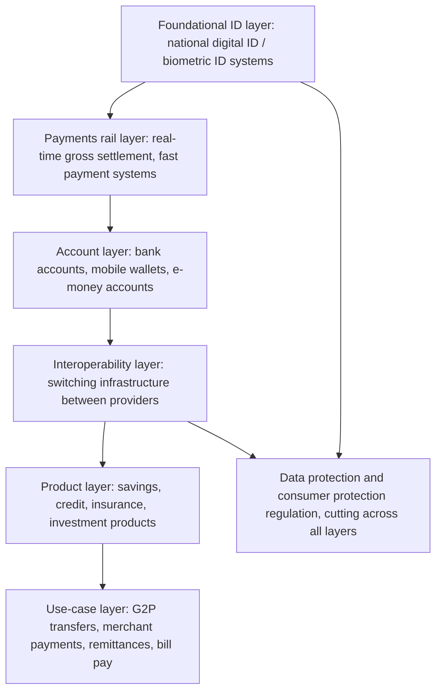

## Financial Inclusion Beyond Microfinance

### Definitions and Conceptual Scope

**Financial inclusion** is defined by the World Bank as individuals and businesses having access to useful and affordable financial products and services — transactions, payments, savings, credit, and insurance — delivered responsibly and sustainably. The phrase "beyond microfinance" signals a deliberate broadening of the development finance agenda away from the narrow, credit-centric model that dominated policy and donor attention from roughly the 1980s through the mid-2000s (typified by group-lending microcredit institutions such as Grameen Bank) toward a fuller suite of financial services and delivery channels.

This shift reflects several critical reassessments within the field:

- **The "microcredit disappointment"**: A series of randomized controlled trials (RCTs) conducted in the late 2000s and 2010s (including studies in India, Mexico, Morocco, Bosnia, Mongolia, and the Philippines, several published together in a special issue of the *American Economic Journal: Applied Economics* in 2015) found that access to microcredit produced, at best, modest effects on household income, consumption, or business profits at the population level, contradicting earlier, more optimistic claims about microcredit as a transformative poverty-reduction tool.
- **Diversification of needs**: Poor households, as documented extensively in *Portfolios of the Poor* (Collins, Morduch, Rutherford, Ruthven, 2009), manage complex and irregular cash flows using a wide range of financial instruments simultaneously — informal savings groups, insurance substitutes, remittances — indicating that credit alone addresses only one facet of a broader liquidity and risk-management problem.
- **Technology-enabled expansion of access**: The rise of mobile money and digital financial services demonstrated that the constraint on inclusion was often infrastructure and delivery cost, not solely lack of appropriate credit products.

### The Four Pillars of Financial Inclusion (Beyond Credit)

**1. Savings**

Access to safe, formal savings instruments is now considered by many researchers to be at least as important as credit access, and in several RCT settings shows more robust welfare effects.

- **Commitment savings devices**: Products that impose a cost or barrier on early withdrawal, addressing self-control and social-pressure problems in accumulating savings. A landmark RCT (Ashraf, Karlan, Wolfram, 2006, "Tying Odysseus to the Mast," Philippines) found significant increases in savings balances among clients randomly offered a commitment savings product versus a standard account.
- **Barriers to savings account uptake**: Field experiments in Kenya, Malawi, and elsewhere identify fixed costs (transportation, minimum balance requirements, documentation) as key deterrents, distinct from a lack of demand for savings per se.

**2. Payments (Digital and Mobile Money)**

This is the pillar most transformed by technology and is frequently treated as the primary infrastructure layer for broader financial inclusion.

- **M-Pesa (Kenya, launched 2007 by Safaricom)**: The canonical case study. A mobile-money system allowing users to store value on a SIM-linked account and transfer funds via basic SMS/USSD technology, requiring no smartphone or bank branch. A widely cited study by Suri and Jack (Science, 2016) estimated that M-Pesa access lifted approximately 2% of Kenyan households out of extreme poverty, with effects concentrated among female-headed households, operating primarily through improved risk-sharing and consumption-smoothing (enabling households to receive remittances quickly during shocks) rather than through savings or credit channels directly.
- **Agent banking networks**: Mobile money and digital payment systems typically rely on a distributed network of local agents (shopkeepers, kiosk operators) who handle cash-in/cash-out conversion, substituting for costly physical bank branch infrastructure — a key reason digital payments can reach rural and low-density populations that formal banking historically could not.
- **Interoperability**: A major current policy focus is achieving interoperability between mobile money providers, banks, and government payment systems, so that funds can move seamlessly between platforms rather than being locked within a single provider's "walled garden," which fragments liquidity and limits network effects.

**3. Insurance**

- **Index (parametric) insurance**: A product design intended to solve the acute information asymmetry and verification cost problems that plague indemnity-based agricultural insurance in low-income settings. Payouts are triggered automatically by an observable, third-party-verified index (e.g., rainfall levels measured at a weather station, or satellite-derived vegetation indices) rather than by assessed individual losses, eliminating moral hazard and adjustment costs but introducing **basis risk** — the risk that the index does not accurately reflect a given individual's actual loss.
- **Demand puzzle**: A substantial empirical literature (e.g., Cole, Giné, Tobacman, Townsend, Topalova, Vickery, 2013; Cai, 2016 in China) documents persistently low voluntary uptake of index insurance even when heavily subsidized, attributed to factors including basis risk, liquidity constraints preventing premium payment, limited trust in the insurer, and low financial literacy regarding probabilistic products.
- **Health microinsurance**: Community-based health insurance schemes, often facing adverse selection and sustainability challenges absent government subsidy or mandatory enrollment.

**4. Credit (Reframed)**

Rather than being abandoned, credit provision within the "beyond microfinance" framework is reframed around product design refinements responding to the RCT evidence:

- **Flexible repayment schedules**: Studies (e.g., Field, Pande, Papp, Rigol, 2013, India) find that standard rigid weekly repayment schedules in group microcredit may induce excessive caution and limit investment in risky, higher-return business activities; grace periods before repayment begins are associated with higher business investment (and correspondingly higher default risk), highlighting a design trade-off.
- **Individual liability vs. joint liability lending**: A shift away from the classic Grameen-style joint-liability group lending model (which uses peer monitoring and social collateral to substitute for formal collateral) toward individual liability models in more mature microfinance markets, trading reduced peer-pressure repayment enforcement for reduced social costs of default and better retention of successful, low-risk borrowers.
- **Digital credit / algorithmic microlending**: Products such as M-Shwari (Kenya, a partnership between Safaricom's M-Pesa and Commercial Bank of Africa) use mobile phone usage and mobile money transaction histories as alternative data for automated credit scoring, extending small, short-term loans instantly via mobile phone absent traditional collateral or credit bureau history. This raises distinct policy concerns around over-indebtedness, data privacy, and predatory algorithmic pricing that are active areas of regulatory attention.

### Digital Financial Infrastructure and Enabling Architecture

**Layered infrastructure stack** (a framework commonly used by the World Bank, CGAP — Consultative Group to Assist the Poor — and the Bill & Melinda Gates Foundation in digital financial inclusion policy work):

- **Foundational digital ID**: India's Aadhaar system (a biometric national ID covering the vast majority of the population) is the most-studied example of how a foundational ID layer can reduce the cost of Know-Your-Customer (KYC) compliance for opening financial accounts, a major historical barrier to formal account ownership for undocumented or rural populations. The associated "India Stack" concept (layering Aadhaar authentication, the Unified Payments Interface (UPI) for real-time payments, and consent-based data-sharing frameworks) is frequently cited as a template being examined or adapted by other countries' digital public infrastructure (DPI) initiatives.
- **Fast/real-time payment systems**: Systems like India's UPI, Brazil's Pix, and Kenya's mobile-money-centric payment ecosystem enable near-instant, low-cost person-to-person and person-to-merchant transfers, which is considered a key driver of formal account usage intensity (not just account ownership) in recent Global Findex data.
- **Government-to-person (G2P) digital payments**: Direct digital disbursement of social transfers, subsidies, and public sector wages is frequently used as a deliberate policy lever to drive first-time account opening, since it provides a mandatory, recurring reason to hold and use a formal account. India's Direct Benefit Transfer (DBT) program and Jan Dhan Yojana financial inclusion drive are widely cited examples.

### Measurement Frameworks

**World Bank Global Findex Database**: The primary cross-country data source for financial inclusion measurement, based on nationally representative surveys conducted roughly every three years (rounds in 2011, 2014, 2017, 2021, 2025). Core indicators include:

- Account ownership (at a bank, other financial institution, or mobile money provider)
- Usage intensity (frequency of deposits/withdrawals, digital payment usage)
- Borrowing and saving behavior (formal vs. informal sources)
- Gender and rural/urban gaps in the above

**Alliance for Financial Inclusion (AFI) Core Set**: A set of indicators developed by a network of central banks and financial regulators from developing and emerging economies, used for national financial inclusion strategy monitoring, covering access (points of service per population), usage, and quality dimensions.

**Multidimensional frameworks**: Some literature and policy frameworks (e.g., work associated with CGAP) explicitly separate three distinct dimensions that are often conflated in casual usage:

- **Access**: Availability/proximity of financial infrastructure
- **Usage**: Actual utilization of available services
- **Quality**: Whether products genuinely meet needs (appropriate design, affordability, consumer protection, absence of over-indebtedness risk)

### Regulatory and Policy Considerations

- **Tiered KYC (know-your-customer) regimes**: A widely adopted regulatory innovation allowing simplified, lower-documentation account opening for low-value accounts (with transaction and balance caps), balancing financial inclusion goals against anti-money-laundering/countering-the-financing-of-terrorism (AML/CFT) requirements. This is frequently cited as a key enabling regulatory reform behind mobile money expansion in Sub-Saharan Africa.
- **Proportionate regulation for non-bank e-money issuers**: Regulatory frameworks permitting telecom companies or fintech firms to issue e-money without full banking licenses (subject to safeguarding requirements, such as holding client funds in ring-fenced, prudentially regulated trust accounts) were a prerequisite for mobile-money-led models like M-Pesa's early growth, in contrast to bank-led models required in some other jurisdictions.
- **Consumer protection and over-indebtedness risk**: The rapid growth of digital credit (instant mobile loans) has generated documented concerns about over-indebtedness, non-transparent pricing, and aggressive debt-collection practices (including, in some markets, blacklisting borrowers on credit reference bureaus for very small missed payments), prompting a growing regulatory focus on digital credit-specific consumer protection rules distinct from traditional banking regulation.
- **Data privacy and algorithmic credit scoring**: The use of mobile phone metadata and transaction histories for alternative credit scoring raises unresolved regulatory questions around data ownership, consent, and algorithmic bias that many developing-country regulatory frameworks are still developing capacity to address. [The regulatory frameworks in this specific area are evolving rapidly across jurisdictions, so the current state in any given country should be independently verified against that country's most recent central bank or financial regulator guidance.] [Unverified]

### Gender Dimensions

Financial inclusion literature places specific emphasis on the persistent **gender gap** in account ownership and usage, which Global Findex data has consistently documented across multiple survey rounds, particularly in South Asia and parts of Sub-Saharan Africa and the Middle East and North Africa (MENA). Mechanisms studied include:

- Social norms restricting women's independent financial decision-making or mobility to bank branches
- Documentation requirements (national ID, proof of address) that disproportionately burden women in contexts with lower female ID coverage
- Evidence that women's account ownership and control over mobile money specifically (as opposed to a household-shared account) is associated in several RCTs with shifts in intra-household bargaining power and expenditure patterns (e.g., a widely cited study on Kenyan M-Pesa and household risk-sharing referenced above found gender-differentiated effects)

### Illustrative Comparison: Traditional Microfinance vs. Broader Financial Inclusion Paradigm

| Dimension | Classic Microfinance Model | Financial Inclusion Paradigm |
| --- | --- | --- |
| Primary product | Group-liability microcredit | Full suite: savings, payments, insurance, credit |
| Delivery channel | Physical branch, loan officer visits | Mobile money, agent networks, digital platforms |
| Repayment structure | Rigid, frequent (often weekly) | Flexible, product-differentiated |
| Evidence base | Case studies, early non-experimental evaluation | Extensive RCT evidence base (2009–present) |
| Underlying theory of change | Credit constraint relaxation drives entrepreneurship | Liquidity management, risk-smoothing, and reduced transaction costs across a portfolio of needs |
| Infrastructure dependency | Loan officer/branch network | Digital ID, interoperable payment rails, agent networks |

### Key Points

- The field shifted from a credit-centric microfinance model toward a "four pillars" framework (savings, payments, insurance, credit) following mixed RCT evidence on microcredit's income effects
- Mobile money (M-Pesa as the canonical case) demonstrated that reducing transaction/delivery costs, rather than solely relaxing credit constraints, can meaningfully expand financial access and improve risk-sharing
- Digital infrastructure layers — foundational ID, fast payment rails, interoperability — are now treated as prerequisites for scalable inclusion, not just individual product design
- Index insurance solves moral hazard/verification problems in agricultural insurance but faces a persistent low-uptake puzzle even when subsidized
- Digital credit introduces new consumer protection and over-indebtedness risks requiring regulatory frameworks distinct from traditional lending
- Global Findex is the standard cross-country measurement tool; access, usage, and quality are analytically distinct dimensions

### Related Topics

- Randomized controlled trials in development economics: methodology and external validity debates
- Mobile money regulatory models: bank-led vs. telecom-led approaches
- Digital public infrastructure (DPI) and the "India Stack" model
- Behavioral economics of savings: commitment devices and present bias
- Index/parametric insurance design and the basis risk problem
- Intra-household bargaining models and gender and development
- Fintech and alternative credit scoring using mobile/transaction data
- Financial literacy interventions and their measured effects on financial behavior