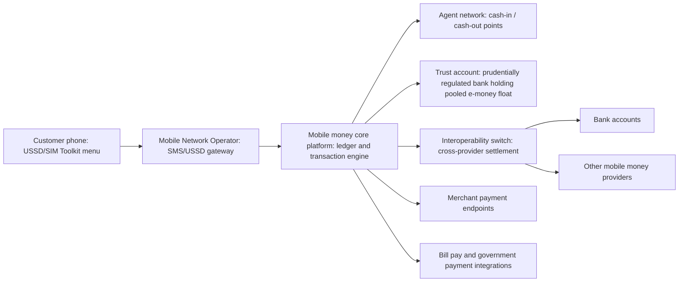

## Fintech and Mobile Money Innovations

### Definitions and Scope

**Fintech** (financial technology) refers to the use of digital technology — mobile applications, cloud computing, application programming interfaces (APIs), artificial intelligence, distributed ledgers — to deliver, improve, or disintermediate traditional financial services. **Mobile money** is a specific and, in the development context, historically the most consequential fintech innovation: a service allowing users to store, send, and receive monetary value using a mobile phone, typically via a SIM-linked account operated by a mobile network operator (MNO) or a licensed e-money issuer, independent of a traditional bank account. This topic extends beyond the "Financial inclusion beyond microfinance" pillar framework to focus specifically on the technical architecture, business models, and innovation trajectory of the underlying platforms.

### Mobile Money: Core Technical Architecture

**Basic transaction architecture** (the model pioneered by M-Pesa in Kenya, 2007):

Key architectural components:

- **USSD (Unstructured Supplementary Service Data) and SIM Toolkit (STK)**: The dominant access channels in early and still many current mobile money deployments, chosen specifically because they function on basic feature phones without requiring internet data connectivity or a smartphone — a critical design choice for reaching low-income, rural populations in markets with limited 3G/4G coverage. USSD sessions are short-lived, menu-driven interactions (dialing a shortcode like `*150#`) rather than persistent app-based sessions.
- **E-money ledger / core platform**: The central system of record tracking individual account balances. Architecturally distinct from a bank's core banking system in that balances represent e-money liabilities against a pooled trust account rather than fractional-reserve bank deposits; regulatory frameworks in most mobile-money-permissive jurisdictions require the issuer to hold 100% of outstanding e-money value in a segregated, prudentially safeguarded trust account at a licensed bank, precisely to prevent the e-money issuer from using customer float for its own lending or investment activities.
- **Agent network layer**: A distributed network of small businesses (often existing retail shops) that perform cash-in (converting physical cash to e-money) and cash-out (converting e-money back to cash) transactions on behalf of customers, earning a commission per transaction. This layer substitutes for the branch/ATM network that traditional banking would require, and is generally considered the single most important cost-reduction innovation enabling mobile money's reach into low-density and rural markets.
- **Interoperability and switching infrastructure**: Middleware that allows transactions to cross between different mobile money providers or between mobile money and bank accounts. Historically, many mobile money ecosystems were "walled gardens" (e.g., early M-Pesa transactions could only move between M-Pesa accounts), limiting network effects; national payment switches (such as Kenya's Pesalink or various national interoperability mandates) and standards efforts have progressively pushed toward cross-provider interoperability.

### Business Models and Revenue Structures

- **Transaction fee model**: The historically dominant model — fees charged per transaction (deposit, withdrawal, transfer, bill payment), typically on a tiered schedule based on transaction size. This has drawn regulatory scrutiny in markets where mobile money fees are perceived as regressive relative to income, prompting periodic fee caps or fee-reduction mandates by regulators (as has occurred at various points in Kenya and other East African markets).
- **Float-based interest / interchange revenue**: Some models generate additional revenue from interest earned on the pooled trust account float (subject to regulatory limits on how such interest can be used, often mandated to partly accrue to customers or to a national financial inclusion fund) and interchange fees on merchant transactions.
- **Bundled ecosystem monetization**: More mature mobile money platforms (M-Pesa in Kenya being the leading example) have evolved from a single payments product into a platform business, layering on savings and credit products (via bank partnerships), merchant payment services, international remittance corridors, and increasingly, developer APIs allowing third-party businesses to build on top of the platform (analogous to a "super-app" model).

### Digital Credit and Algorithmic Lending

- **Alternative data credit scoring**: Products such as M-Shwari (Kenya) and Tala and Branch (operating across multiple emerging markets) use mobile phone usage patterns, mobile money transaction history, and in some cases smartphone metadata (call logs, app usage, contact list size, subject to jurisdiction-specific data protection constraints) as inputs to automated, real-time credit scoring models, extending small, short-tenor loans (often 30 days or less) instantly via mobile app or USSD, absent traditional collateral, credit bureau history, or in-person underwriting.
- **Architectural pattern**: These systems typically combine (1) a data ingestion layer pulling permissioned mobile/transactional data, (2) a machine learning scoring model (commonly gradient-boosted trees or logistic regression variants, given the need for a degree of model explainability in regulated lending contexts), (3) an automated disbursement engine integrated with the mobile money rail, and (4) automated repayment collection, often via direct debit from the linked mobile money account.
- **Documented risks**: Over-indebtedness from rapid, low-friction borrowing across multiple simultaneous digital lenders (a "digital credit stacking" problem observed in Kenya and other markets with many competing digital lenders); non-transparent effective interest rates when fees are expressed as flat charges rather than annualized percentage rates; and aggressive debt collection practices including credit bureau blacklisting for very small missed payments, which several regulators have subsequently moved to restrict.

### Blockchain, Cryptocurrency, and Central Bank Digital Currencies (CBDCs) in Development Finance

**Cross-border remittances via blockchain rails**: A recurring proposed use case is reducing the cost of international remittances (a major financial flow to developing economies, in many cases exceeding foreign direct investment or official development assistance in value) by using distributed ledger settlement to bypass the correspondent banking system's multiple intermediary fee layers. [Adoption of blockchain-based remittance rails at meaningful transaction volume remains limited relative to proposed use cases as of the available evidence, and cost savings in practice have been mixed depending on corridor and liquidity conditions.] [Unverified]

**El Salvador's Bitcoin legal tender adoption (2021)**: A distinctive case combining official dollarization (see the related dollarization topic) with the introduction of Bitcoin as a second official currency, including a state-developed digital wallet (Chivo) with a government-subsidized $30 signup bonus intended to drive adoption. Independent survey-based studies following the rollout (including work by researchers at various US universities surveying Salvadoran households) found relatively low sustained usage of the Chivo wallet for everyday transactions after the initial bonus-driven signup period, and mixed evidence on financial inclusion effects. [The longer-run trajectory of this policy, and its net fiscal and inclusion effects, remain actively studied and debated in the literature.] [Inference]

**Central Bank Digital Currencies (CBDCs)**: A growing area of central bank research and pilot activity in developing economies, distinct from private mobile money in that the CBDC would represent a direct central bank liability rather than a commercial e-money issuer liability. Nigeria's eNaira (launched 2021) and the Bahamas' Sand Dollar are among the earliest live retail CBDC deployments; motivations commonly cited by central banks include extending financial inclusion to populations underserved by both traditional banking and existing mobile money, and improving the efficiency and traceability of government payment disbursements. [Adoption levels of live retail CBDCs to date have generally been reported as modest relative to central bank inclusion targets, though this is an area with fast-moving pilot activity across many jurisdictions and should be checked against current central bank publications for the latest status.] [Unverified]

### Open Banking and API-Driven Financial Infrastructure

- **Open banking / open finance frameworks**: Regulatory or industry-led standards requiring or enabling banks and financial institutions to expose customer account and transaction data (with customer consent) via standardized APIs to licensed third-party providers, enabling innovations such as account aggregation, automated affordability assessment for lending, and integrated payment initiation services. India's Account Aggregator framework (part of the broader "India Stack" digital public infrastructure concept) is a widely cited example of a consent-based data-sharing architecture specifically designed with financial inclusion objectives, allowing individuals with thin credit files to consensually share alternative data (utility payments, mobile money transaction history) with lenders.
- **Digital public infrastructure (DPI) framing**: A policy framework, increasingly promoted by the World Bank, the G20 (under India's 2023 G20 presidency in particular), and other multilateral bodies, that treats foundational digital ID, real-time payment rails (e.g., India's UPI, Brazil's Pix), and consent-based data-exchange layers as public-good-like infrastructure that governments should deliberately build or foster, rather than leaving fintech innovation solely to fragmented private-sector platforms. This is presented as a generalizable template distinct from any single country's proprietary technology stack. [The degree to which the DPI model is successfully replicable outside the specific institutional and regulatory context of its originating countries is a matter of ongoing policy debate rather than settled empirical consensus.] [Inference]

### Regulatory Architecture Enabling Innovation

- **Regulatory sandboxes**: A widely adopted regulatory tool (pioneered by the UK's Financial Conduct Authority and subsequently adopted by many developing-country regulators, including in Sub-Saharan Africa and Southeast Asia) allowing fintech firms to test novel products with real customers under relaxed regulatory requirements and close supervisory monitoring, within defined limits (customer numbers, transaction values, time period), before full licensing.
- **Tiered/proportionate licensing regimes**: Distinct license categories for e-money issuers, payment service providers, and digital lenders with capital and compliance requirements proportionate to the risk and scale of the specific activity, rather than requiring full banking licenses — a key enabling condition, alongside tiered KYC, for the emergence of non-bank mobile money issuers.
- **Data protection and consumer protection frameworks**: An area of active regulatory development given the alternative-data credit scoring and mobile transaction data flows described above; frameworks vary substantially by jurisdiction in maturity and enforcement capacity.

### Illustrative Comparison: Mobile Money Business Models by Region/Model Type

| Model Type | Example | Ownership Structure | Primary Access Channel |
| --- | --- | --- | --- |
| MNO-led (telecom-driven) | M-Pesa (Kenya) | Mobile network operator subsidiary/partnership | USSD/STK, evolving to app |
| Bank-led | Various West African models (regulatory requirement in some WAEMU/CFA franc zone countries) | Licensed bank as e-money issuer | Agent network, app |
| Fintech-led digital credit | Tala, Branch (multi-country) | Independent fintech company | Smartphone app |
| State-driven CBDC/wallet | eNaira (Nigeria), Chivo (El Salvador) | Central bank or state-sponsored | App, with agent cash-in/out |
| Interoperable national switch | UPI (India), Pix (Brazil) | Central bank/national payment corporation-operated utility | Bank and non-bank apps via common rail |

### Key Points

- Mobile money's core innovation was architectural: substituting agent networks and USSD/SIM-based access for costly branch infrastructure and smartphone/internet dependency
- The trust account/e-money safeguarding model (segregated pooled float at a licensed bank) is the key prudential structure distinguishing e-money issuers from deposit-taking banks
- Digital credit built on mobile money rails enables instant, collateral-free lending via alternative data scoring, but has generated well-documented over-indebtedness and transparency risks
- Interoperability between providers, and between mobile money and banks, is a critical unresolved infrastructure challenge in many markets, addressed through national payment switches and regulatory mandates
- CBDCs and blockchain-based remittance rails represent newer, less-proven innovation frontiers relative to the well-established mobile money model
- Digital public infrastructure (foundational ID + fast payments + consent-based data sharing) is an increasingly influential policy framework for structuring fintech-driven inclusion at the national level

### Related Topics

- Financial inclusion beyond microfinance: the four-pillar framework (savings, payments, insurance, credit)
- Dollarization and currency substitution: relevant to understanding El Salvador's Bitcoin/dollar dual system
- Regulatory sandboxes and proportionate fintech regulation design
- Digital public infrastructure and the "India Stack" model
- Data privacy, algorithmic bias, and consumer protection in alternative credit scoring
- Cross-border remittance corridors and correspondent banking cost structures
- Central bank digital currency design choices: retail vs. wholesale CBDC architectures
- Agent network economics and last-mile financial service delivery