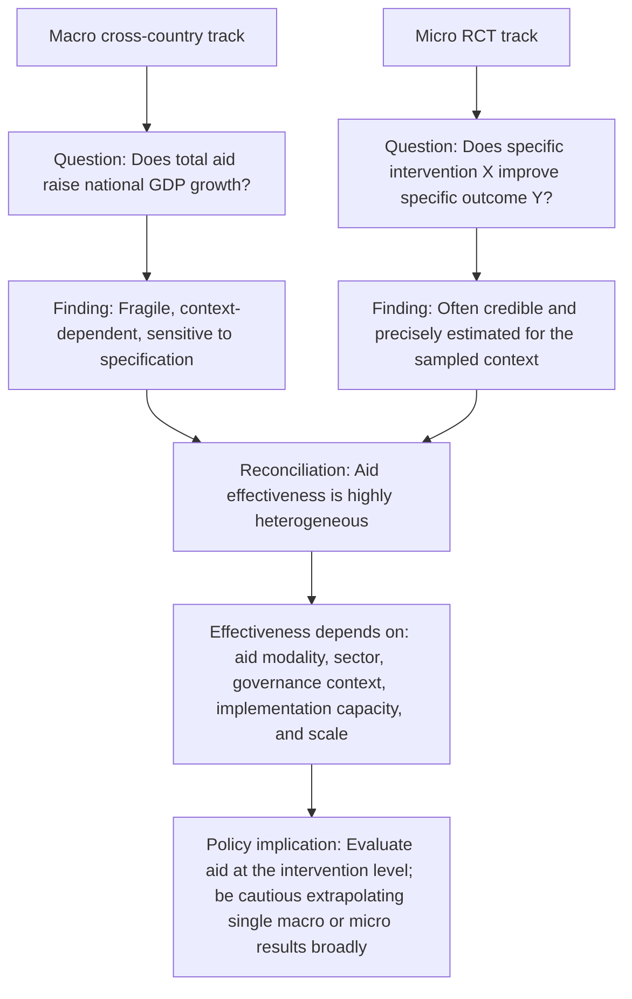

## Aid Effectiveness Debates

### Definitions and Scope

The **aid effectiveness debate** refers to the sustained academic and policy controversy over whether, and under what conditions, foreign aid produces measurable improvements in economic growth, poverty reduction, and human welfare outcomes in recipient countries. The debate operates on two largely distinct methodological tracks that are frequently conflated in popular discussion but should be kept analytically separate: (1) **macro-level, cross-country studies** asking whether aggregate aid inflows raise national economic growth rates, and (2) **micro-level, intervention-specific studies** asking whether particular aid-funded programs achieve their stated outcomes. A central lesson of the mature literature is that these two tracks can yield apparently contradictory conclusions without being genuinely inconsistent, because they are measuring different things at different levels of aggregation.

### The Macro-Level Track: Aid and Growth

**Early financing-gap models**

The theoretical starting point, rooted in Harrod-Domar growth accounting, treated aid as simply filling a "savings gap" or "foreign exchange gap" that constrained investment in capital-scarce developing economies; under this framework, aid should mechanically raise growth in proportion to the investment it finances, absent any consideration of institutional quality, absorptive capacity, or incentive effects. This framework underpinned much of the "Big Push" era aid allocation described in the historical overview of foreign aid.

**Early empirical skepticism (1990s)**

Cross-country growth regressions from the 1990s (including work by Peter Boone, "Politics and the Effectiveness of Foreign Aid," 1996) generally failed to find a robust positive relationship between aid and growth across the full sample of aid recipients, and found evidence that aid was often diverted toward increased government consumption rather than investment, particularly in recipient countries with poor governance.

**The Burnside-Dollar "good policy" hypothesis (2000)**

A pivotal study by Craig Burnside and David Dollar ("Aid, Policies, and Growth," *American Economic Review*, 2000) used a cross-country panel regression framework with an interaction term between aid and a policy index (covering fiscal, monetary, and trade policy quality) and found that aid was associated with higher growth only in countries with a sufficiently sound macroeconomic policy environment; in countries with poor policy, aid showed no significant growth effect. This result was highly influential in donor policy circles during the late 1990s and 2000s, providing an empirical rationale for selectivity-based aid allocation models (concentrating aid on "good performers" rather than spreading it broadly), most visibly institutionalized in the design of the US Millennium Challenge Corporation (established 2004), which explicitly conditions eligibility on quantified governance, economic freedom, and social investment indicators.

**Critiques and non-robustness findings**

Subsequent work, notably by William Easterly, Ross Levine, and David Roodman ("Aid, Policies, and Growth: Comment," *American Economic Review*, 2004), re-examined the Burnside-Dollar result using an extended dataset (additional countries and years beyond the original sample) and found that the key aid-policy interaction coefficient was not statistically robust — it lost significance under small changes to the sample period, country coverage, or outlier treatment. This finding, alongside a broader body of work by Easterly critiquing aid effectiveness claims (including his 2006 book *The White Man's Burden*), substantially undermined confidence in any single robust cross-country finding linking aid, policy quality, and growth, and is widely cited as a cautionary case study in the fragility of cross-country growth regressions generally (a broader methodological critique associated with work by Xavier Sala-i-Martin on the sensitivity of growth regressions to variable selection, sometimes summarized as "I just ran two million regressions").

**Diminishing returns and absorptive capacity models**

A separate strand of macro literature (e.g., work by Dalgaard, Hansen, and Tarp, and by Arvind Subramanian and Raghuram Rajan) explores whether aid exhibits **diminishing returns** to growth at high volumes, potentially due to limited institutional and administrative "absorptive capacity" to productively deploy very large aid inflows, or due to **Dutch disease**-type effects, whereby large aid inflows cause real exchange rate appreciation that harms the competitiveness of the tradable goods sector (particularly manufacturing and agricultural exports), a mechanism analogous to the resource curse literature applied to aid rather than natural resource revenue.

**Persistent methodological problems in the macro track**

- **Reverse causality/endogeneity**: Aid may be allocated in response to poor growth performance or humanitarian crises (e.g., post-disaster or post-conflict aid surges), biasing simple correlations toward finding a negative or null aid-growth relationship even if aid is genuinely effective, since the counterfactual (what growth would have been without aid) is unobserved.
- **Aggregation problems**: Highly heterogeneous types of aid (emergency humanitarian relief, budget support, project aid, technical assistance) are frequently pooled into a single "total aid" variable in cross-country regressions, obscuring potentially very different effectiveness profiles across aid modalities.
- **Measurement of "growth effects"**: Even where a positive correlation is found, cross-country regressions cannot cleanly establish the specific causal mechanism, leaving open whether aid operates through capital accumulation, human capital investment, institutional improvement, or some other channel.

### The Micro-Level Track: The RCT Revolution

**Methodological shift**

Beginning in the mid-2000s and accelerating through the 2010s, a large share of the most influential aid effectiveness research shifted away from macro cross-country regressions toward randomized controlled trials (RCTs) evaluating specific, narrowly defined interventions — a methodological approach associated most closely with Abhijit Banerjee, Esther Duflo, and Michael Kremer (jointly awarded the 2019 Nobel Memorial Prize in Economic Sciences "for their experimental approach to alleviating global poverty"), and institutionalized through organizations including the Abdul Latif Jameel Poverty Action Lab (J-PAL, founded 2003) and Innovations for Poverty Action (IPA).

**Rationale for the RCT approach**

RCTs address the identification problems plaguing macro cross-country work by randomly assigning an intervention (e.g., a specific health subsidy, an education input, a cash transfer design) across a sample of eligible individuals, households, or communities, generating a credible counterfactual (the control group) uncontaminated by selection bias or reverse causality — directly analogous to the logic of randomized clinical trials in medicine.

**Representative findings and their policy influence**

- **Deworming**: Miguel and Kremer's study of a school-based deworming program in Kenya (2004) found substantial effects on school attendance, and — notably — significant positive spillover effects on children in nearby schools not directly treated, due to reduced disease transmission; this became one of the most-cited and most-debated RCTs in development economics, with a subsequent, highly public replication and re-analysis controversy (a 2015 reanalysis by Aiyar, Davis, and colleagues at the International Initiative for Impact Evaluation) that became a landmark case study in the field's ongoing engagement with replication and robustness.
- **Free bed nets vs. cost-sharing for malaria prevention**: RCT evidence (including work by Pascaline Dupas and colleagues) generally found that charging even small positive prices for health products such as insecticide-treated bed nets substantially reduced uptake without improving usage rates or targeting efficiency among purchasers, providing evidence against the "psychological ownership" argument for cost-sharing and informing a shift in donor and NGO practice toward free or heavily subsidized distribution of certain public-health commodities.
- **Cash transfers as a benchmark**: Unconditional and conditional cash transfer RCTs (including extensive work on Mexico's Progresa/Oportunidades program, one of the earliest large-scale randomized government policy evaluations, and subsequent work by GiveWell and GiveDirectly-affiliated researchers) established direct cash transfers as a well-evidenced, low-overhead intervention increasingly used as a comparison benchmark ("cash benchmarking") against which the cost-effectiveness of other, more complex aid interventions is now routinely measured.
- **Microcredit RCTs**: As discussed in the financial inclusion literature, a coordinated set of microcredit RCTs published together in 2015 found modest average effects on income and consumption, substantially tempering the earlier claims made for microfinance as a transformative poverty intervention — illustrating how RCT evidence has, in several prominent cases, overturned or substantially qualified prior consensus views built on non-experimental evidence.

### Critiques of the RCT Approach

**External validity**: The most persistent methodological critique (raised prominently by Lant Pritchett, Angus Deaton, and others) is that an RCT's internal validity (a credible causal estimate for the specific sample and context studied) does not guarantee **external validity** — that the same effect will generalize to a different population, implementation context, or at a different scale ("scaling up"). A program that works well in a tightly monitored pilot with highly motivated NGO implementers may perform very differently when scaled up through a national government bureaucracy.

**Angus Deaton's critique**: Deaton (2019 Nobel laureate for work on consumption, poverty, and welfare measurement, though his RCT critique predates that recognition, having also been more broadly influential across development economics) has argued that RCTs, despite their internal-validity strengths, are frequently oversold as generating universally generalizable "what works" policy prescriptions, when in fact the underlying causal mechanisms and heterogeneous treatment effects across contexts require substantially more theoretical and structural interpretation than a bare RCT estimate provides on its own.

**Narrow scope and "cream-skimming" of easily-randomizable questions**: A structural critique holds that RCTs are best suited to evaluating discrete, well-defined interventions (a specific subsidy, a specific information campaign) and are poorly suited to evaluating broader institutional, governance, or macroeconomic policy questions (e.g., the effects of a currency devaluation or a large infrastructure investment), potentially biasing the field's research and funding attention toward a narrower set of "randomizable" questions rather than the full range of development policy priorities.

**Ethical considerations**: Randomizing access to a potentially beneficial intervention (withholding it from a control group) raises ethical questions that RCT practitioners have addressed through various designs (e.g., phased rollout designs, where the control group receives the intervention later rather than never), though debate continues over specific applications.

### Reconciling the Macro and Micro Tracks

The prevailing view within the field (though not a fully settled consensus) treats the macro and micro literatures as complementary rather than contradictory:

A single national GDP growth regression cannot, even in principle, detect the effect of a well-targeted deworming program or a cash transfer pilot, because such a program is far too small relative to the national economy to move aggregate growth statistics in a statistically detectable way, even if the program itself is highly cost-effective at the level it operates. Conversely, evidence that a specific intervention improved outcomes for its sampled population says nothing directly about whether aggregate aid flows (much of which fund very different activities: budget support, infrastructure, humanitarian relief, technical assistance) raise growth economy-wide. This distinction is now widely regarded as essential for correctly interpreting the apparently conflicting signals from the two literatures.

### Additional Effectiveness Dimensions Beyond Growth

**Aid volatility and predictability**: A body of work (including IMF and World Bank research) finds that aid flows to individual recipient countries are often more volatile and less predictable than domestic revenue, complicating recipient government budget planning and potentially undermining the effectiveness of aid-financed programs regardless of the programs' intrinsic design quality.

**Aid fragmentation and transaction costs**: The proliferation of donors, each with distinct reporting, procurement, and monitoring requirements, has been documented (motivating the Paris Declaration/Accra/Busan harmonization agenda) as imposing substantial administrative burden on recipient government capacity, a cost that is separate from, but can offset, the effectiveness of well-designed individual aid projects.

**Political economy and elite capture**: A distinct literature examines whether aid, particularly when channeled through weak-governance recipient governments, is vulnerable to elite capture or diversion (e.g., work using satellite nighttime-light data as an independent proxy for local economic activity to detect aid diversion, such as research by Jorge Guzman, or subnational aid-tracking studies using georeferenced project data from AidData), a concern distinct from, but related to, the original Burnside-Dollar "good policy" selectivity argument.

### Key Points

- The debate operates on two distinct levels: macro cross-country growth regressions (generally fragile, contested results) and micro RCT-based intervention evaluation (generally more credible internal validity, but limited external validity/generalizability)
- The Burnside-Dollar (2000) "aid works only with good policy" result was highly influential in donor selectivity design but was later shown by Easterly, Levine, and Roodman (2004) to be non-robust to sample extension
- The RCT revolution (Banerjee, Duflo, Kremer, 2019 Nobel) shifted much of the field's evidentiary weight toward intervention-specific causal estimates, with landmark studies on deworming, bed net pricing, cash transfers, and microcredit
- Angus Deaton and Lant Pritchett's critiques emphasize that RCT internal validity does not guarantee external validity or scalability
- The prevailing reconciliation view treats aid effectiveness as fundamentally heterogeneous across modality, sector, and context, cautioning against sweeping "aid works" or "aid doesn't work" conclusions from either literature alone
- Effectiveness debates extend beyond growth/outcome metrics to include aid volatility, fragmentation/transaction costs, and elite capture/diversion risk

### Related Topics

- History and evolution of foreign aid: the institutional and paradigm shifts underlying these debates
- Randomized controlled trials: methodology, ethics, and the external validity problem in depth
- The Millennium Challenge Corporation and selectivity-based aid allocation models
- Dutch disease and aid-driven real exchange rate appreciation
- Cash transfers and cash-benchmarking as a development policy tool
- Replication crises in economics and the deworming reanalysis controversy
- AidData and subnational, georeferenced aid-tracking methodologies
- Growth regressions and the broader cross-country empirics robustness debate (Sala-i-Martin critique)