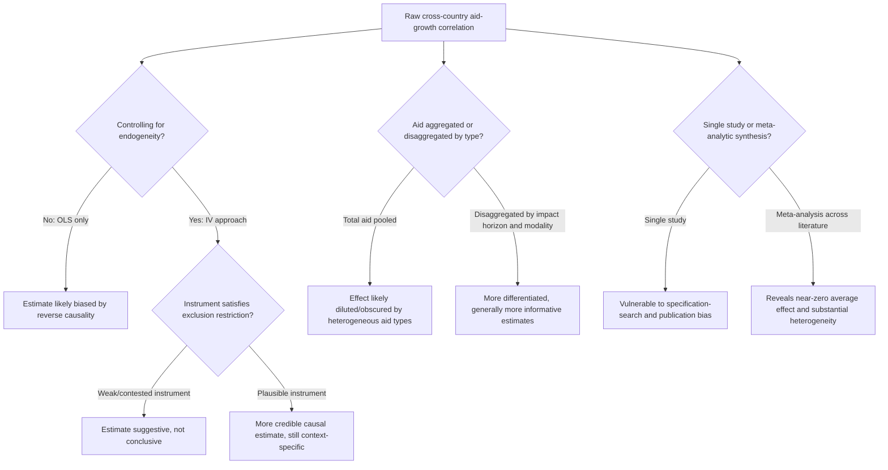

## Aid and Economic Growth Empirical Evidence

### Scope and Relationship to Aid Effectiveness Debates

This topic focuses specifically on the **empirical methodology, econometric specifications, and accumulated evidence base** on the aid-growth relationship, complementing the broader conceptual "Aid Effectiveness Debates" topic by treating the technical estimation issues in greater depth: functional form choices, instrument selection for endogeneity, meta-analytic synthesis of the fragmented literature, and the specific empirical results produced across major studies.

### The Baseline Empirical Specification

Most cross-country aid-growth studies build on an augmented Solow/Barro-style growth regression of the general form:

$$g_{it} = \alpha + \beta_1 \text{Aid}_{it} + \beta_2 X_{it} + \mu_i + \eta_t + \varepsilon_{it}$$

where $g_{it}$ is the growth rate of real per capita GDP for country $i$ in period $t$ (typically averaged over 4- or 5-year panels to smooth business-cycle noise), $\text{Aid}_{it}$ is aid as a share of GDP or gross national income (GNI), $X_{it}$ is a vector of standard growth controls (initial income for conditional convergence, investment share, human capital proxies, trade openness, institutional quality indices), and $\mu_i$, $\eta_t$ are country and time fixed effects. The coefficient of interest, $\beta_1$, is the estimated marginal effect of aid on growth.

The **Burnside-Dollar (2000)** specification augmented this baseline with an aid-policy interaction term:

$$g_{it} = \alpha + \beta_1 \text{Aid}_{it} + \beta_2 \text{Policy}_{it} + \beta_3 (\text{Aid}_{it} \times \text{Policy}_{it}) + \beta_4 X_{it} + \varepsilon_{it}$$

where $\text{Policy}_{it}$ is a composite index of budget balance, inflation, and trade openness. The key finding was $\beta_3 > 0$ and statistically significant, with $\beta_1$ alone insignificant — interpreted as aid raising growth only in the presence of good policy. As detailed in the aid effectiveness debates overview, Easterly, Levine, and Roodman (2004) showed $\beta_3$ lost significance when the sample was extended with additional years and countries, a canonical illustration of specification fragility in this literature.

### The Endogeneity Problem and Instrumental Variable Strategies

**Core identification problem**: Aid allocation is not randomly assigned across countries or over time. Aid may respond to poor growth performance (donors increasing aid to struggling economies) or to good performance (donors rewarding demonstrated policy competence), and it may respond to non-economic factors such as former colonial ties, strategic/geopolitical alignment, or humanitarian emergencies — all of which can bias ordinary least squares (OLS) estimates of $\beta_1$ in either direction depending on which channel dominates in a given sample.

**Common instrumental variable (IV) approaches used in the literature:**

- **Donor-side "supply" instruments**: Using variation in aid driven by donor-country characteristics unrelated to recipient growth prospects — for example, a recipient country's linguistic or colonial ties to donor countries interacted with the donor countries' own aid budget fluctuations (an approach used by Burnside and Dollar and subsequent authors), on the logic that donor budget cycles are plausibly exogenous to a specific recipient's growth trajectory.
- **Population and geographic instruments**: Recipient country population size and geographic characteristics have been used as instruments on the grounds that smaller and more geographically remote countries receive systematically different (often higher per capita) aid allocations for reasons unrelated to their growth prospects, following an approach associated with Craig Burnside and David Dollar's later work and subsequent robustness studies by Michael Clemens, Steven Radelet, and Rikhil Bhavnani.
- **Limitations of available instruments**: A recurring critique (raised by Deaton and others) is that most proposed aid instruments are only weakly justified as satisfying the exclusion restriction (the requirement that the instrument affects growth only through aid, not through any other channel), given that colonial ties, geography, and population also plausibly correlate with numerous other growth-relevant characteristics, making the IV estimates in this literature generally regarded as suggestive rather than fully conclusive.

### Disaggregating Aid by Type and Time Horizon

A significant methodological advance beyond the early "total aid" regressions has been disaggregating aid by category and examining differentiated time horizons, reflecting the recognition that pooling heterogeneous aid types obscures differentiated effects.

**Clemens, Radelet, and Bhavnani (2004, "Counting Chickens When They Hatch")**: This influential paper distinguished between:

- **"Short-impact" aid**: Budget and balance-of-payments support, infrastructure investment, and agricultural aid — categories plausibly expected to affect growth within a relatively short (4-year) window
- **"Long-impact" aid**: Aid for health, education, environment, and democracy/governance-building — categories whose growth effects, if any, would plausibly operate over a much longer horizon than a typical 4-year panel period, and which the study therefore excluded from the growth-effect estimation window
- **Humanitarian/emergency aid**: Excluded from the growth analysis on the grounds that this aid responds directly to crises and shocks (natural disasters, conflict) rather than being a growth-oriented development investment, and its inclusion in pooled aid variables was argued to bias downward any measured aid-growth relationship

The finding, using only the "short-impact" aid category and instrumenting for endogeneity, was a positive and statistically significant effect of aid on growth — one of the more robust positive results in the literature — illustrating how disaggregation by expected causal timeframe can substantially change the estimated relationship relative to pooled specifications.

### Diminishing Returns and Non-Linear Specifications

A body of work (Hansen and Tarp, 2000 and 2001; Dalgaard, Hansen, and Tarp, 2004) tests for **diminishing returns** to aid by including a quadratic aid term:

$$g_{it} = \alpha + \beta_1 \text{Aid}_{it} + \beta_2 \text{Aid}_{it}^2 + \beta_3 X_{it} + \varepsilon_{it}$$

Several studies in this tradition find $\beta_1 > 0$ and $\beta_2 < 0$, consistent with aid having a positive but diminishing marginal growth effect, potentially reaching zero or even turning negative at very high aid-to-GDP ratios — interpreted as reflecting limited institutional absorptive capacity, or Dutch-disease-type real exchange rate effects that intensify as aid volume rises relative to the size of the domestic economy. [The precise threshold at which aid's marginal effect turns negative varies substantially across studies and specifications, and should be treated as model-dependent rather than a settled structural parameter.] [Inference]

### Meta-Analytic Evidence

Given the proliferation of individual studies reporting divergent (and sometimes directly contradictory) point estimates, several meta-analyses have attempted to synthesize the literature systematically:

- **Doucouliagos and Paldam** (a series of papers, roughly 2005–2011) conducted meta-regression analyses aggregating dozens of published aid-growth studies and found that the average reported effect of aid on growth and investment across the literature is close to zero and highly heterogeneous, with substantial evidence of **publication bias** (a tendency for studies finding statistically significant positive results to be more likely published, inflating the apparent average effect relative to the true underlying effect).
- **Interpretation**: The meta-analytic conclusion is generally read not as definitive evidence that "aid does not work," but rather as confirmation that the cross-country macro literature, taken as a whole, has not converged on a robust, generalizable aggregate effect — reinforcing the case (made in the aid effectiveness debates overview) for treating aid effectiveness as a fundamentally heterogeneous, context- and modality-dependent phenomenon rather than a single estimable macro parameter.

### Complementary Evidence: Aid, Investment, and Fiscal Behavior

Distinct from direct growth-effect estimation, a related empirical literature examines specific transmission channels:

- **Aid and domestic savings/fiscal response**: Several studies (including early work by Peter Boone, 1996) find evidence that aid inflows are partially offset by reduced domestic government revenue mobilization effort or increased government consumption rather than being fully channeled into investment, a finding sometimes referred to as aid's **fungibility** problem — aid earmarked for one purpose (e.g., a specific health project) can free up domestic budget resources that the government then redirects to other spending categories, meaning the marginal effect of "labeled" project aid may differ substantially from its literal stated purpose.
- **Aid and private investment crowding-out/in**: Mixed evidence on whether aid-financed public investment crowds out or crowds in private investment, with results varying by aid modality (infrastructure aid more plausibly complementary to private investment; budget support potentially more fungible and prone to crowding out effects depending on fiscal institutions).

### Illustrative Summary of Major Empirical Findings

| Study | Approach | Key Finding |
| --- | --- | --- |
| Boone (1996) | Cross-country OLS, disaggregated by political regime | No robust aid-growth link; aid raises government consumption, not investment |
| Burnside & Dollar (2000) | Aid × policy interaction, panel | Aid raises growth only under good policy (later shown non-robust) |
| Easterly, Levine, Roodman (2004) | Extended sample replication | Burnside-Dollar interaction term not robust to sample extension |
| Hansen & Tarp (2000, 2001) | Quadratic aid term | Positive but diminishing marginal returns to aid |
| Clemens, Radelet, Bhavnani (2004) | Disaggregated by impact horizon, IV | Robust positive effect using only "short-impact" aid categories |
| Rajan & Subramanian (2008) | Cross-section and panel, robustness-focused | No robust positive aid-growth relationship across specifications, including by aid type or recipient characteristics |
| Doucouliagos & Paldam (meta-analyses, 2005–2011) | Meta-regression across published literature | Average effect near zero; substantial publication bias detected |

### Methodological Lessons for Interpreting This Literature

### Key Points

- The standard empirical specification is an augmented cross-country growth regression, with the Burnside-Dollar aid-policy interaction as the most historically influential (and subsequently most contested) variant
- Endogeneity (reverse causality between aid and growth) is the central econometric challenge; available instruments (donor-side budget variation, population, geography) are widely used but only weakly satisfy exclusion restrictions
- Disaggregating aid by expected impact horizon (Clemens, Radelet, Bhavnani) and excluding humanitarian/emergency aid produces more robust positive estimates than pooled "total aid" specifications
- Quadratic specifications generally support diminishing (and potentially negative at high volumes) marginal returns to aid, consistent with absorptive capacity and Dutch disease mechanisms
- Meta-analyses (Doucouliagos and Paldam) find the literature's average reported effect is close to zero with substantial publication bias, reinforcing that no single robust aggregate aid-growth parameter has been established
- Aid's fungibility (recipient government reallocation of freed-up domestic budget resources) complicates interpretation of aid's effect even where project-level outcomes are positively measured

### Related Topics

- Aid effectiveness debates: the broader conceptual and policy framing of this empirical literature
- Cross-country growth regression methodology and the Sala-i-Martin robustness critique
- Instrumental variable methods and exclusion restriction validity in applied econometrics
- Dutch disease and real exchange rate effects of large capital inflows
- Fungibility of earmarked/project aid and its fiscal implications
- Publication bias and meta-analysis methods in empirical economics
- Randomized controlled trials as a complementary micro-level evidence source
- Absorptive capacity constraints in low-income recipient economies