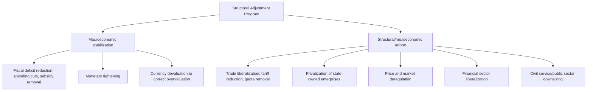

## Conditionality and Structural Adjustment Programs

### Definitions and Scope

**Aid conditionality** refers to the practice of donor institutions or governments attaching specific policy or performance requirements that a recipient country must satisfy in order to receive, or continue receiving, financial assistance. **Structural Adjustment Programs (SAPs)** are the most institutionally elaborated and historically consequential form of conditionality, referring specifically to the lending programs administered principally by the IMF and World Bank from the early 1980s onward, which conditioned loan disbursement on the recipient government's adoption of a defined package of macroeconomic stabilization and market-liberalization policy reforms.

### Historical Origins and Institutional Context

**The 1982 debt crisis as proximate trigger**

SAPs emerged directly out of the developing-country debt crisis that began with Mexico's August 1982 announcement that it could not service its external debt, which rapidly spread to other heavily indebted Latin American and (subsequently) African and Asian economies. The crisis had its roots in the 1970s: OPEC oil price shocks generated large current account surpluses in oil-exporting countries, which were "recycled" through international banks as floating-rate loans to developing countries; the US Federal Reserve's sharp interest rate increases beginning in 1979 (the "Volcker shock," aimed at controlling US domestic inflation) then dramatically raised the debt service burden on this floating-rate debt, precipitating a wave of sovereign defaults and near-defaults across the developing world.

**Institutional division of labor**

- The **IMF** typically provided shorter-term balance-of-payments support conditioned primarily on macroeconomic stabilization measures (fiscal deficit reduction, monetary tightening, exchange rate adjustment).
- The **World Bank** typically provided longer-term "Structural Adjustment Loans" (SALs, introduced 1980) and later sector-specific adjustment loans, conditioned on structural/microeconomic reforms (trade liberalization, privatization, deregulation, public sector reform) intended to address the underlying supply-side and institutional weaknesses viewed as having made the debt crisis possible.
- In practice, IMF and World Bank programs were frequently linked or sequenced (a country typically needed an IMF program in place as a precondition for World Bank and other bilateral/commercial creditor support), giving the IMF a de facto "gatekeeper" role in the broader international finance architecture during this period — a function sometimes referred to in the literature as the IMF's "seal of approval" role.

### The Washington Consensus: Codification of the Policy Package

Economist **John Williamson** coined the term "Washington Consensus" in a 1989 paper to describe and systematize the set of policy prescriptions that had, by that point, become the common denominator across IMF, World Bank, and US Treasury policy advice to Latin American economies. Williamson's original ten-point list comprised:

1. Fiscal discipline (reducing budget deficits)
2. Redirection of public expenditure toward high-return, pro-poor sectors (primary health, education, infrastructure)
3. Tax reform (broadening the base, moderating marginal rates)
4. Interest rate liberalization (market-determined rather than administratively fixed rates)
5. Competitive exchange rates (avoiding sustained currency overvaluation)
6. Trade liberalization (replacing quantitative import restrictions with tariffs, then progressively lowering tariffs)
7. Liberalization of inward foreign direct investment
8. Privatization of state-owned enterprises
9. Deregulation (abolishing barriers to entry and exit, easing regulatory burdens, except where justified by safety, environmental, or consumer protection concerns)
10. Secure property rights, including for the informal sector

Williamson himself subsequently noted that the term was later used far more expansively and often pejoratively (particularly by critics) than his original, more specific list, becoming a broad shorthand for market-fundamentalist or neoliberal policy prescription generally, a usage he argued diverged from his intended, narrower technical meaning.

### Standard SAP Policy Instruments

### Design Rationale

The theoretical justification for this package rested on several strands of economic reasoning prevalent in the 1980s:

- **Macroeconomic stabilization logic**: Persistent fiscal deficits monetized through central bank financing were understood, within standard monetarist and IMF-financial-programming frameworks, as the proximate cause of high inflation and balance-of-payments crises; deficit reduction and monetary tightening were the direct policy response.
- **Import-substitution industrialization (ISI) critique**: Much of Latin America and parts of Africa and Asia had pursued ISI development strategies in preceding decades (high tariff and quota protection intended to nurture domestic manufacturing industries); SAP-era trade liberalization reflected a broader intellectual reassessment (associated with economists including Anne Krueger and Jagdish Bhagwati) arguing ISI had generated inefficient, rent-seeking, internationally uncompetitive industrial sectors, and that outward-oriented, export-promoting trade policy (associated with the perceived success of East Asian economies) offered a superior growth model.
- **State failure / public choice critique**: A parallel intellectual current (drawing on public choice theory) argued that extensive state ownership and market intervention in developing economies had generated pervasive rent-seeking, corruption, and allocative inefficiency, providing the rationale for privatization and deregulation components.

### Conditionality Mechanics: How Conditions Are Attached and Enforced

- **Prior actions**: Specific policy steps a government must complete before a loan or loan tranche is approved or disbursed (e.g., passing a specific piece of legislation, announcing a specific price liberalization).
- **Performance criteria / quantitative targets**: Measurable macroeconomic targets (e.g., a fiscal deficit ceiling, a monetary aggregate ceiling, a minimum level of international reserves) that must be met at specified test dates for continued disbursement, most closely associated with IMF-style conditionality.
- **Structural benchmarks**: Non-quantitative structural reform milestones (e.g., completing a specific privatization transaction, adopting a specific regulatory framework), more closely associated with World Bank-style conditionality and generally harder to verify objectively than quantitative performance criteria.
- **Tranching**: Disbursing loan funds in installments ("tranches") tied to the satisfaction of the above conditions at each review point, rather than as a single upfront transfer, giving the lending institution ongoing leverage over the reform trajectory.

### Criticisms and Controversies

**Social and distributional costs**

The most influential and widely cited critique is UNICEF's 1987 report *Adjustment with a Human Face* (edited by Giovanni Andrea Cornia, Richard Jolly, and Frances Stewart), which documented adverse effects of SAP-era fiscal austerity — particularly cuts to health and education spending and removal of food and fuel subsidies — on child nutrition, health outcomes, and school enrollment in numerous adjusting countries, and argued for explicitly incorporating social protection safeguards ("adjustment with a human face") into program design rather than treating social outcomes as an afterthought to macroeconomic stabilization.

**One-size-fits-all design and insufficient country specificity**

Critics (including, at various points, economists within the World Bank itself, and prominently articulated by Joseph Stiglitz, World Bank Chief Economist 1997–2000, in his 2002 book *Globalization and Its Discontents*) argued that SAP conditionality applied a largely standardized policy template across highly heterogeneous countries without sufficient attention to local institutional context, sequencing considerations (e.g., whether trade liberalization should precede or follow financial sector reform), or the speed at which liberalization was implemented, contributing in some cases to adjustment costs exceeding the intended benefits.

**Sequencing debates**

A substantial technical literature emerged around the correct **sequencing of liberalization** — for example, whether capital account liberalization should precede or follow adequate domestic financial sector regulatory strengthening. The 1997–98 Asian financial crisis was widely interpreted (including in subsequent IMF self-assessment, notably its Independent Evaluation Office reports) as partly attributable to premature capital account liberalization in several East Asian economies ahead of adequate prudential banking regulation, informing a subsequent, more cautious IMF stance on capital account liberalization sequencing in later program design.

**Effectiveness and compliance concerns**

Empirical studies of SAP outcomes (including World Bank's own evaluations) found highly mixed growth results across adjusting countries, and documented a persistent pattern of **partial compliance** — governments frequently implementing some conditions (particularly those most visible or easily monitored) while resisting or reversing others (particularly those with concentrated political costs, such as civil service downsizing or subsidy removal), complicating any clean before/after or treatment/control assessment of SAP effectiveness.

**Sovereignty and political economy critiques**

A broader political critique holds that extensive policy conditionality represents an erosion of recipient country sovereignty over domestic economic policy, with reform priorities effectively set by external creditor institutions rather than through domestic democratic deliberation — a critique that fed directly into the subsequent "ownership" principle articulated in the 2005 Paris Declaration on Aid Effectiveness (covered in the aid effectiveness debates and history of foreign aid topics) as a deliberate corrective to the SAP-era conditionality model.

### Evolution Beyond Classic SAPs: Post-1999 Reforms

In response to the accumulated criticisms, the IMF and World Bank substantially revised their conditionality frameworks around the turn of the millennium:

- **Poverty Reduction Strategy Papers (PRSPs)**, introduced in 1999, required low-income countries seeking concessional IMF/World Bank support (and eligibility for HIPC debt relief) to prepare a nationally-owned poverty reduction strategy, in principle developed through a participatory process involving civil society and other domestic stakeholders, replacing the more externally-imposed structural adjustment conditionality model with a nominally recipient-driven framework.
- **Streamlined IMF conditionality (2002 conditionality guidelines)**: The IMF formally committed to "streamlining" structural conditionality to focus only on measures deemed "critical" to the program's macroeconomic objectives, reducing the number and breadth of structural benchmarks relative to the 1980s–1990s peak, following internal and external criticism that conditionality had become excessively detailed and intrusive into areas only tangentially related to macroeconomic stability.
- **Emphasis shift toward "ownership"**: Reflecting the broader aid effectiveness agenda (Paris Declaration, 2005), subsequent program design increasingly emphasized recipient government ownership of reform sequencing and content, though critics have argued that de facto conditionality (donor influence over program content, even where nominally recipient-authored) persisted in practice under new institutional labels.

### Comparative Table: Classic SAP Era vs. Post-1999 Reform Era

| Dimension | Classic SAP Era (1980s–1990s) | Post-1999 Reform Era |
| --- | --- | --- |
| Reform ownership | Externally designed and imposed | Nominally recipient-authored (PRSPs) |
| Conditionality breadth | Extensive, detailed structural benchmarks | "Streamlined," focused on macro-critical measures |
| Social safeguards | Largely absent from initial design | Explicit poverty/social impact analysis increasingly incorporated |
| Governing framework document | Structural Adjustment Loan agreements | Poverty Reduction Strategy Papers |
| Dominant critique addressed | — | Sovereignty, social cost, one-size-fits-all design |

### Key Points

- SAPs emerged from the 1982 debt crisis, with the IMF handling macro stabilization conditionality and the World Bank handling structural/microeconomic reform conditionality
- The "Washington Consensus" (Williamson, 1989) codified the standard ten-point policy package, though the term later took on a broader, more contested meaning than Williamson's original list
- Conditionality operates through prior actions, quantitative performance criteria, structural benchmarks, and tranched disbursement
- UNICEF's *Adjustment with a Human Face* (1987) remains the most influential critique documenting adverse social and distributional effects of SAP-era austerity
- Sequencing failures (particularly premature capital account liberalization) are widely implicated in the 1997–98 Asian financial crisis, informing subsequent IMF caution on liberalization ordering
- Post-1999 reforms (PRSPs, streamlined IMF conditionality) responded to sovereignty and one-size-fits-all critiques by emphasizing nominal recipient ownership, though debates over genuine vs. nominal ownership persist

### Related Topics

- History and evolution of foreign aid: SAPs situated within the broader periodization
- Aid effectiveness debates: conditionality vs. ownership as a recurring tension
- The 1982 Latin American debt crisis and the Volcker shock
- HIPC and MDRI debt relief initiatives and their link to PRSP frameworks
- The 1997-98 Asian financial crisis and capital account liberalization sequencing
- Import-substitution industrialization vs. export-oriented growth strategies
- Joseph Stiglitz's critique of IMF crisis management and globalization
- Paris Declaration on Aid Effectiveness and the ownership/alignment/harmonization principles