## Bilateral Versus Multilateral Aid Architecture

### Definitions and Basic Distinction

**Bilateral aid** refers to development assistance provided directly from a donor country's government (typically through a dedicated national aid agency) to a recipient country's government, institutions, or, in some cases, non-governmental implementing organizations, on a government-to-government or government-to-country basis. **Multilateral aid** refers to development assistance channeled through international institutions — the World Bank Group, regional development banks, United Nations agencies, the Global Fund, and similar bodies — that pool contributions from multiple donor countries and allocate resources according to the institution's own governance structure, criteria, and processes, rather than each donor country directly controlling the specific use of its contribution. A conceptually intermediate category, **multi-bi aid** (or "earmarked multilateral" aid), refers to funds a bilateral donor channels through a multilateral institution but earmarks for specific purposes, countries, or projects the donor selects — blurring the clean bilateral/multilateral distinction and now representing a substantial and growing share of overall aid flows.

### Institutional Architecture

```mermaid
flowchart TD
    A[Donor country treasury/budget] --> B[Bilateral channel]
    A --> C[Multilateral channel]
    B --> B1[National aid agency: e.g. USAID, JICA, GIZ]
    B1 --> B2[Recipient government or NGO implementing partner]
    C --> C1[Core/unearmarked contributions]
    C --> C2[Earmarked multi-bi contributions]
    C1 --> D[Multilateral institution governance: World Bank, UN agencies, regional dev banks]
    C2 --> D
    D --> D1[Institution's own allocation criteria and country programs]
    D1 --> E[Recipient country]
    B2 --> E
```

**Major bilateral aid agencies (illustrative, not exhaustive)**:

- USAID (United States Agency for International Development)
- JICA (Japan International Cooperation Agency)
- GIZ (Deutsche Gesellschaft für Internationale Zusammenarbeit, Germany) and KfW (German development bank)
- FCDO (UK Foreign, Commonwealth & Development Office, which absorbed the former DFID in 2020)
- AFD (Agence Française de Développement, France)

**Major multilateral institutions (illustrative, not exhaustive)**:

- The World Bank Group, comprising IBRD (non-concessional lending to middle-income countries), IDA (concessional financing for the poorest countries), IFC (private sector investment arm), and MIGA (political risk insurance)
- Regional development banks: the African Development Bank, Asian Development Bank, Inter-American Development Bank, European Bank for Reconstruction and Development
- UN development and humanitarian agencies: UNDP, UNICEF, WFP (World Food Programme), UNHCR
- Vertical/thematic funds: the Global Fund to Fight AIDS, Tuberculosis and Malaria; Gavi, the Vaccine Alliance; the Green Climate Fund

### Comparative Analysis: Strengths and Weaknesses

| Dimension | Bilateral Aid | Multilateral Aid |
| --- | --- | --- |
| Donor control over use of funds | High — donor directly selects recipients, sectors, and often specific projects | Lower — subject to institution's governance and allocation processes |
| Political/strategic alignment | Explicitly permitted and common (aid can serve donor foreign policy, commercial, or security interests) | Formally insulated from individual donor political interests, though donor voting power/influence persists |
| Administrative overhead for recipients | Potentially high in aggregate, given many donors each with distinct procedures (fragmentation problem) | Lower per-dollar overhead for recipients dealing with a single institution, though multiple multilaterals also create some fragmentation |
| Technical/sectoral expertise | Varies by donor agency; some concentrate in specific sectors | Often deep sector-specific technical capacity (e.g., World Bank's economic policy expertise, WHO's health expertise) |
| Perceived legitimacy/neutrality | Lower in politically sensitive contexts, given visible donor-country association | Generally higher, given pooled, rules-based governance, though not immune to major-shareholder influence critiques |
| Tied aid prevalence | Historically higher (procurement tied to donor-country goods/services) | Generally lower; multilateral procurement is typically internationally competitive |
| Transparency and reporting standardization | Variable across donors | Generally higher, particularly for institutions subject to standardized reporting frameworks (e.g., World Bank project databases) |
| Speed and flexibility of disbursement | Can be faster for bilateral priorities/relationships | Can be slower, given multi-stakeholder governance and standardized appraisal processes |

### The Political Economy of Aid Allocation: Bilateral vs. Multilateral Motivations

**Bilateral aid allocation determinants**

A substantial empirical literature (notably Alesina and Dollar, "Who Gives Foreign Aid to Whom and Why?", 2000) finds that bilateral aid allocation patterns are frequently better explained by donor strategic, colonial-historical, and commercial interests than by recipient need or policy performance alone. Documented patterns include:

- Former colonial ties strongly predicting aid allocation (e.g., French aid disproportionately flowing to former French colonies in Africa, UK aid historically weighted toward Commonwealth countries)
- UN General Assembly voting alignment with the donor country (particularly the US) as a predictor of bilateral aid receipts, interpreted as evidence of aid being used to purchase or reward diplomatic alignment
- Security and strategic alliance considerations (e.g., US aid patterns during the Cold War, and subsequently to strategically important states in conflict-affected regions)
- Commercial interest, reflected historically in tied-aid procurement requirements benefiting donor-country firms

**Multilateral aid allocation determinants**

Multilateral institutions, in principle, allocate resources according to more formally codified, needs- and performance-based criteria:

- The World Bank's **IDA allocation formula** (the "Performance-Based Allocation" system) explicitly weights country allocations by a combination of population, per capita income, and a **Country Policy and Institutional Assessment (CPIA)** score — a standardized annual assessment of each recipient country's economic management, structural policies, social inclusion policies, and public sector/institutional quality — making IDA allocation formally rules-based and performance-linked in a way most bilateral aid is not.
- Empirical comparisons (e.g., work by Eric Neumayer and other researchers comparing bilateral and multilateral allocation patterns) generally find multilateral aid allocation more closely correlated with recipient need (poverty levels, population) and policy/governance quality, and less correlated with donor strategic or colonial-historical variables, than bilateral aid — though multilateral institutions are not entirely insulated from major-shareholder political influence (for example, in IMF program design or World Bank board decisions on politically sensitive country programs).

### Governance Structures and Voting Power

Multilateral institutions differ substantially in their internal governance and voting arithmetic, with direct implications for how much genuine autonomy from major donor-country influence the "multilateral" label actually confers:

- **Shareholder-weighted voting (World Bank, IMF)**: Voting power is allocated primarily according to financial contribution ("quota" in the IMF's case, capital subscription in the World Bank's case), meaning the largest financial contributors (historically and currently the US, followed by other G7 and major emerging economies) retain effective control or veto power over major institutional decisions — the US alone has historically held sufficient voting share to block certain categories of decisions requiring supermajorities in both institutions. This structure has been a persistent subject of governance reform debate, particularly regarding the underrepresentation of emerging economies (China, India, and others) relative to their current share of the global economy, partially addressed through periodic quota/shareholding reviews (e.g., the IMF's 2010 and subsequent quota reform rounds, though implementation has often lagged proposed reforms).
- **One-country-one-vote (most UN agencies)**: UN General Assembly-affiliated bodies typically operate on formal sovereign equality (one vote per member state) for governance decisions, though this formal equality coexists with informal major-donor influence exercised through voluntary (non-assessed) funding contributions, since agencies heavily dependent on voluntary funding have practical incentives to remain responsive to major voluntary funders' priorities even absent formal voting weight.
- **Regional development banks**: Generally follow a hybrid model, with regional member countries and non-regional (typically wealthy donor) member countries both holding capital shares and voting power, with governance debates around the appropriate balance between regional "ownership" and non-regional financial contributor influence.

### Aid Fragmentation and the Case for Multilateralism

A significant strand of the aid effectiveness literature (connecting to the Paris Declaration/Accra/Busan harmonization agenda covered in related topics) argues that the proliferation of bilateral donors, each with distinct procedures, reporting requirements, project cycles, and priorities, imposes substantial **transaction costs** and administrative burden on recipient governments — a cost argued to be structurally reduced when aid is channeled multilaterally through a smaller number of institutions with harmonized procedures. This has motivated a policy preference in aid effectiveness circles (though not a universal donor practice) for shifting a greater share of aid toward multilateral or pooled/basket-funding mechanisms, and toward "multi-bi" arrangements that combine bilateral funding sources with multilateral administrative and technical delivery infrastructure.

### Trends in the Bilateral-Multilateral Balance

- Historically, the majority of ODA has flowed bilaterally rather than multilaterally, though the multilateral (and multi-bi) share has grown over time, particularly through the expansion of thematic vertical funds (Global Fund, Gavi, Green Climate Fund) that combine multilateral governance and technical delivery with donor country-specific earmarking and visibility.
- The rise of **vertical/thematic funds** since the early 2000s represents a distinct institutional innovation within the multilateral category: rather than general-purpose country programming (the traditional World Bank/UN agency model), these funds are organized around a specific disease, sector, or thematic priority (e.g., the Global Fund's HIV/AIDS, tuberculosis, and malaria focus; Gavi's vaccine-specific focus), often featuring innovative results-based or performance-based disbursement mechanisms and, in some cases, private philanthropic co-financing (the Bill & Melinda Gates Foundation being a major co-financier of both the Global Fund and Gavi).
- **Multi-bi earmarking growth**: OECD-DAC data has documented a rising share of nominally "multilateral" contributions that are in fact earmarked by the donor for specific purposes, countries, or projects, raising analytical questions about whether the traditional bilateral/multilateral dichotomy remains a fully accurate description of the current aid architecture, since heavily earmarked multilateral funding can functionally resemble bilateral aid in terms of donor control while retaining multilateral administrative and reporting infrastructure.

### Illustrative Case: Contrasting Allocation Logics

A stylized contrast illustrating the differing typical allocation logic:

- A **bilateral** aid agency from a former colonial power may allocate a disproportionate share of its aid budget to former colonies with which it retains strong diplomatic, linguistic, and commercial ties, largely independent of those countries' relative poverty ranking among all possible recipients.
- The **World Bank's IDA**, using its Performance-Based Allocation formula, would in principle allocate more heavily toward a very poor, large-population country with a strong CPIA score, regardless of that country's historical or diplomatic ties to any specific major shareholder — though critics note that CPIA scoring itself is not immune to methodological and judgment-based variation, and that major shareholders retain indirect influence through board-level country program approval.

### Key Points

- Bilateral aid offers donors direct control and flexibility but is empirically more strongly associated with donor strategic, colonial, and commercial interests than recipient need alone
- Multilateral aid, particularly via formally rules-based mechanisms like the World Bank's IDA Performance-Based Allocation formula, is generally found to correlate more closely with recipient need and governance quality, though major-shareholder influence persists through weighted voting structures
- Governance models vary substantially across multilaterals: shareholder-weighted voting (World Bank/IMF) vs. one-country-one-vote (most UN agencies) vs. hybrid regional models
- "Multi-bi" aid — donor-earmarked funding channeled through multilateral institutions — has grown substantially and blurs the traditional bilateral/multilateral dichotomy
- Vertical/thematic funds (Global Fund, Gavi, Green Climate Fund) represent a distinct institutional innovation combining multilateral governance with sector-specific focus and, often, private philanthropic co-financing
- Aid fragmentation costs from a proliferation of bilateral donors are a key argument favoring greater multilateral or harmonized/pooled funding channels, per the Paris Declaration aid effectiveness agenda

### Related Topics

- History and evolution of foreign aid: institutional origins of the World Bank/IMF system
- Aid effectiveness debates: fragmentation, harmonization, and the Paris Declaration principles
- Political economy of aid allocation: colonial ties, strategic alignment, and donor commercial interests
- IMF and World Bank quota/shareholding reform debates
- Vertical funds and results-based financing in global health (Global Fund, Gavi)
- Conditionality and structural adjustment programs: multilateral institutions' conditionality role
- China's bilateral development finance as an alternative model outside the traditional DAC architecture
- Tied aid and procurement practices across bilateral donors