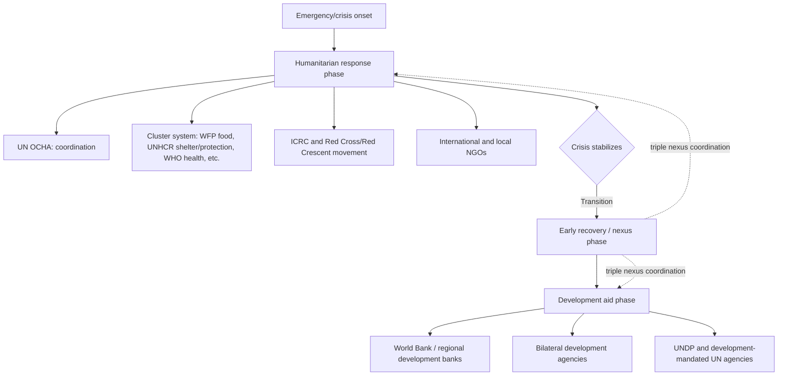

## Humanitarian Aid Versus Development Aid

### Definitions and Core Distinction

**Humanitarian aid** refers to assistance provided to save lives, alleviate suffering, and maintain human dignity during and immediately after emergencies — armed conflict, natural disasters, epidemics, and famines — governed by the principle that it should be delivered based solely on need, without regard to political, ethnic, religious, or other affiliation. **Development aid** refers to assistance aimed at longer-term structural improvements in economic capacity, institutions, and human welfare, oriented toward sustained poverty reduction and growth rather than immediate crisis response. The distinction is foundational to the international aid architecture, reflected in distinct institutional mandates, funding mechanisms, coordination structures, and — most consequentially — distinct core operating principles that can, in some circumstances, come into tension with each other.

### Core Humanitarian Principles

The Inter-Agency Standing Committee (IASC), the primary coordination mechanism for UN and non-UN humanitarian actors, codifies four core humanitarian principles, originally articulated in the Red Cross/Red Crescent movement's foundational principles and adopted in UN General Assembly Resolution 46/182 (1991), which also established the position of the UN Emergency Relief Coordinator:

- **Humanity**: Human suffering must be addressed wherever it is found, with the purpose of protecting life and health and ensuring respect for human beings.
- **Neutrality**: Humanitarian actors must not take sides in hostilities or engage in political, racial, religious, or ideological controversies.
- **Impartiality**: Humanitarian action must be carried out on the basis of need alone, giving priority to the most urgent cases of distress, without discrimination.
- **Independence**: Humanitarian action must be autonomous from the political, economic, military, or other objectives that any actor may hold with regard to the areas where the action is being implemented.

These principles are operationally significant, not merely rhetorical: they justify humanitarian actors' claims to access populations in active conflict zones (including areas controlled by non-state armed groups) on the basis that they are not aligned with any party to the conflict, and they underpin the distinct legal and normative protections afforded to humanitarian workers and operations under international humanitarian law (the Geneva Conventions and their Additional Protocols).

### Institutional Architecture

**Humanitarian coordination architecture**: The UN Office for the Coordination of Humanitarian Affairs (OCHA) coordinates response through the **cluster system** (established following the 2005 Humanitarian Reform), which organizes response by sector — for example, the World Food Programme (WFP) leads the food security/logistics cluster, UNHCR leads protection and shelter in many contexts, WHO leads the health cluster — intended to reduce duplication and gaps across the many actors typically present in a major emergency response.

**Key distinct actors**: The International Committee of the Red Cross (ICRC) occupies a distinctive institutional position, with a specific mandate under the Geneva Conventions to protect victims of armed conflict and a particularly strict adherence to neutrality and independence (including a general practice of not publicly criticizing parties to conflict, in order to preserve access), distinguishing it operationally from most other humanitarian NGOs and from development-mandated institutions.

### Funding Mechanisms and Financial Architecture

- **Humanitarian funding**: Predominantly channeled through UN-coordinated appeals (the annual Global Humanitarian Overview and country-specific Humanitarian Response Plans), pooled funds (the UN Central Emergency Response Fund, CERF, and Country-Based Pooled Funds), and direct bilateral or NGO-channeled emergency funding — generally characterized by shorter funding cycles, rapid disbursement mechanisms, and a persistent and well-documented **funding gap** between appealed needs and funds actually received (UN humanitarian appeals have frequently been funded at well under half of stated requirements in recent years, though the precise shortfall varies year to year and by crisis). [Exact annual funding-gap percentages fluctuate and should be checked against the current year's Global Humanitarian Overview for the latest figures.] [Unverified]
- **Development funding**: Generally channeled through longer project or program cycles (multi-year World Bank/bilateral country programs, typically involving extensive appraisal, design, and monitoring frameworks), reflecting the longer time horizons over which development outcomes are expected to materialize and the greater emphasis on institutional capacity-building and sustainability.

### The Humanitarian-Development Nexus ("Triple Nexus")

A major and increasingly prominent area of policy and institutional reform concerns the **humanitarian-development-peace nexus** (commonly shortened to the "triple nexus" or "HDP nexus"), formally endorsed in the 2016 World Humanitarian Summit and subsequent OECD-DAC recommendations (2019).

**The core problem the nexus agenda addresses**: Protracted crises — particularly prolonged conflicts and forced displacement situations lasting years or decades rather than a single acute emergency — do not fit cleanly into either the "humanitarian" or "development" institutional box. A refugee camp or an area experiencing a decade-long civil conflict may require both immediate life-saving assistance and longer-term investments in education, livelihoods, and infrastructure simultaneously, yet historically these needs were addressed by separate institutional actors, funding streams, and planning cycles, often with limited coordination or even active institutional competition over mandate and funding.

**Nexus-informed reforms**:

- Joint humanitarian-development needs assessments and planning frameworks in protracted crisis contexts
- Multi-year humanitarian funding instruments (moving away from strictly annual humanitarian appeal cycles) to better support sustained programming in protracted crises
- Explicit institutional collaboration mandates between humanitarian coordination structures (OCHA, clusters) and development actors (World Bank, UNDP) in specific protracted-crisis countries
- The World Bank's establishment of dedicated financing windows for fragile and conflict-affected states, and for refugee-hosting countries specifically (e.g., the IDA "sub-window" for refugees and host communities, introduced in the IDA18 replenishment cycle, 2017), representing a direct institutional adaptation bridging the traditional humanitarian/development divide

**Persistent tensions in nexus implementation**: A recurring critique holds that blending humanitarian and development programming risks compromising humanitarian principles — particularly neutrality and independence — if humanitarian actors become too closely associated with development actors' longer-term institutional and state-building objectives (which often require closer engagement with host government authorities than pure humanitarian principles would otherwise dictate), especially in active conflict settings where host government neutrality cannot be assumed. This tension is a live and unresolved debate within the humanitarian policy community rather than one with a settled resolution. [Inference]

### Localization Agenda

A related and overlapping reform agenda, formalized in the "Grand Bargain" commitments made at the 2016 World Humanitarian Summit, calls for increasing the share of humanitarian (and, to a lesser extent, development) funding channeled directly to local and national responders (local NGOs, civil society organizations, and in some cases national governments) rather than through international intermediary organizations, on the grounds that local actors often have superior contextual knowledge, faster response capacity, and lower overhead costs, and that the traditional model concentrates funding and decision-making disproportionately with international actors headquartered in donor countries. Progress against localization funding targets has been widely assessed (including in Grand Bargain independent reviews) as falling substantially short of the commitments made, reflecting persistent structural, risk-management, and capacity-related barriers to direct local funding.

### Comparative Table: Humanitarian Aid vs. Development Aid

| Dimension | Humanitarian Aid | Development Aid |
| --- | --- | --- |
| Primary objective | Save lives, alleviate acute suffering | Sustained poverty reduction, institutional/economic capacity building |
| Time horizon | Immediate to short-term (though protracted crises extend this) | Medium to long-term |
| Governing principles | Humanity, neutrality, impartiality, independence | No equivalent universally codified principle set; guided by aid effectiveness principles (ownership, alignment) |
| Engagement with host government | Often limited/cautious, to preserve neutrality, especially in conflict | Typically close and direct, working through government systems and institutions |
| Coordination mechanism | UN cluster system, OCHA | Country-specific donor coordination, aid effectiveness frameworks |
| Funding cycle | Annual appeals, rapid pooled funds, persistent funding gaps | Multi-year project/program cycles |
| Typical lead institutions | OCHA, WFP, UNHCR, ICRC, humanitarian NGOs | World Bank, regional development banks, bilateral development agencies |

### Illustrative Case: Protracted Displacement as a Nexus Test Case

Large-scale, long-duration refugee situations (for example, protracted displacement situations that have persisted for a decade or more in various regions) exemplify the practical stakes of the humanitarian-development distinction: purely humanitarian approaches (emergency food and shelter distribution) can become inefficient and fail to build self-reliance when a displacement situation persists for years, while displaced populations often face legal, administrative, or political barriers to accessing standard development programming (which is typically designed around a host country's own citizens), leaving a structural gap that nexus-oriented reforms (such as the World Bank's refugee-focused IDA financing window mentioned above) are specifically intended to address.

### Key Points

- Humanitarian aid is governed by four codified principles (humanity, neutrality, impartiality, independence) that justify access claims in conflict settings and are operationally, not merely rhetorically, significant
- Development aid operates on different institutional logic, typically involving closer, longer-term engagement with host government systems and multi-year program cycles
- Protracted crises (prolonged conflict, long-term displacement) expose the limitations of a clean humanitarian/development institutional divide, motivating the "triple nexus" (humanitarian-development-peace) reform agenda since 2016
- Nexus implementation faces a genuine and unresolved tension: closer humanitarian-development coordination can improve efficiency and sustainability but risks compromising humanitarian neutrality and independence, particularly in active conflict contexts
- The "localization" agenda (Grand Bargain, 2016) seeks to shift more funding and decision-making to local/national responders, with implementation widely assessed as lagging behind stated commitments
- Institutional innovations like the World Bank's IDA refugee sub-window represent direct structural adaptations bridging the traditional humanitarian/development funding divide

### Related Topics

- History and evolution of foreign aid: institutional origins of humanitarian and development architecture
- Bilateral versus multilateral aid architecture: UN cluster system and pooled fund governance
- Fragile and conflict-affected states as a distinct development finance category
- International humanitarian law and the Geneva Conventions framework
- Refugee and forced displacement economics
- The Grand Bargain and humanitarian system reform since 2016
- Climate change and disaster risk as an emerging driver of humanitarian caseloads
- Cash-based humanitarian assistance vs. in-kind aid delivery models