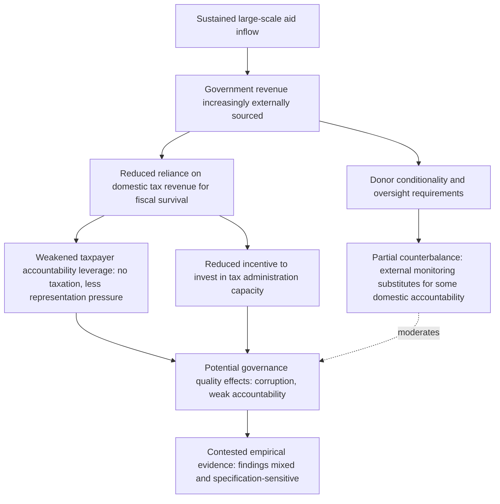

## Aid Dependency and Governance Effects

### Definitions and Scope

**Aid dependency** refers to a condition in which a recipient country's government budget, foreign exchange availability, or broader economic functioning becomes structurally reliant on sustained, large-scale foreign aid inflows, such that a sudden reduction in aid would produce significant fiscal, macroeconomic, or service-delivery disruption. This topic examines the specific theoretical mechanisms and empirical evidence connecting sustained aid dependency to **governance outcomes** — the quality of domestic political accountability, institutional development, and state-society relations — a distinct analytical question from the aid-growth relationship covered in related topics, though the two literatures overlap and inform each other.

### Measurement of Aid Dependency

Common indicators used in the literature to classify or measure the degree of aid dependency include:

- **Aid as a share of Gross National Income (GNI)**: The OECD-DAC and World Bank commonly flag countries receiving aid above roughly 10% of GNI as highly aid-dependent, with some of the most extreme cases (particularly small island states and fragile/conflict-affected states) receiving aid inflows representing a substantially larger share still.
- **Aid as a share of government expenditure or the government budget**: Often considered a more policy-relevant measure than the GNI ratio, since it directly captures the degree to which a government's fiscal operations depend on aid financing rather than domestic revenue mobilization.
- **Aid as a share of gross capital formation (investment)**: Reflects the degree to which a country's investment activity depends on aid-financed capital rather than domestic savings.
- **Duration**: Some frameworks (e.g., work distinguishing "chronic" aid dependency from short-term post-crisis aid surges) emphasize the number of consecutive years a country has received aid above a given threshold, on the reasoning that the governance effects of concern are hypothesized to operate cumulatively over sustained periods rather than through short-term aid spikes.

### Theoretical Mechanism 1: The Rentier/Fiscal Social Contract Channel

The most influential theoretical mechanism connecting aid to governance quality draws an explicit analogy to the **resource curse** and **rentier state** literature (originally developed to explain governance patterns in oil-exporting states, associated with scholars including Michael Ross and Terry Lynn Karl).

**Core logic**: In a standard "fiscal social contract" model, government revenue derived primarily from domestic taxation creates an incentive structure in which citizens, as taxpayers, have both the motivation and, historically, the political leverage (deriving from the "no taxation without representation" dynamic central to numerous historical state-building processes, including the development of parliamentary institutions in early modern Europe) to demand government accountability, transparency, and responsiveness in exchange for their tax contributions. When government revenue instead derives substantially from an external, non-tax source — whether natural resource rents or foreign aid — this accountability linkage is argued to weaken, because the government's fiscal survival no longer depends on maintaining citizen buy-in through taxation, potentially producing:

- Reduced incentive for governments to invest in effective, broad-based domestic tax administration capacity
- Weakened citizen leverage over government spending priorities and accountability, since the "power of the purse" that underpins much democratic accountability theory operates less forcefully when the purse is substantially externally financed
- Potential for aid to substitute for, rather than complement, domestic institutional capacity-building, if governments face reduced pressure to develop effective public financial management systems

**Aid-specific extensions and distinctions from the pure resource-curse analogy**: Scholars including Deborah Brautigam and Stephen Knack have extended and qualified this "aid rentier" argument, noting important disanalogies between aid and natural resource rents — aid is typically far more conditional, monitored, and subject to donor oversight than resource revenue, and (unlike oil revenue, which can sometimes be extracted with minimal broader economic engagement) aid disbursement often requires some degree of functioning government administrative capacity to receive and account for funds, potentially creating a different, more complex relationship to institutional development than the pure rentier analogy suggests.

### Theoretical Mechanism 2: Tax Effort and Fiscal Substitution

A distinct but related empirical literature examines whether aid inflows cause recipient governments to reduce domestic **tax effort** (a country's tax revenue relative to what its economic structure would predict, given a standard tax-capacity model).

- **Early findings**: Several studies from the 1990s and 2000s (e.g., work associated with the aid-fiscal-response literature, building on Peter Boone's 1996 findings) found evidence consistent with aid partially crowding out domestic revenue mobilization effort, particularly for grant aid (as opposed to concessional loans, which carry repayment obligations that may preserve stronger fiscal discipline incentives).
- **More recent and nuanced findings**: Subsequent research (including IMF and World Bank technical work on domestic revenue mobilization) has produced more mixed results, with some studies finding limited or context-dependent crowding-out effects, and increasing donor attention (reflected in initiatives such as the Addis Tax Initiative launched alongside the 2015 Addis Ababa Financing for Development conference) to explicitly supporting, rather than substituting for, domestic tax administration capacity as a complementary aid objective in its own right.

### Theoretical Mechanism 3: Aid, Elections, and Political Budget Cycles

A political economy literature examines whether aid inflows are associated with distorted electoral incentives or patronage dynamics in recipient countries:

- **Aid volatility and election-timing evidence**: Some studies find that aid disbursements or approvals from certain bilateral and multilateral sources correlate with recipient election timing (interpreted variably as either donors rewarding democratic transitions, or as strategic aid deployment designed to support incumbent political survival), a pattern documented in country-specific and cross-country studies of aid disbursement timing.
- **Patronage and elite capture concerns**: Where aid flows through weak public financial management systems, a body of case-study and subnational empirical evidence (including georeferenced project-tracking work by research initiatives such as AidData) has examined whether aid resources are disproportionately directed toward regions or groups aligned with incumbent political leadership, a concern distinct from, but related to, the broader "does aid reach its intended beneficiaries" effectiveness question.

### Empirical Evidence on Aid and Democratization/Institutional Quality

**Cross-country evidence is notably mixed and contested**, reflecting many of the same identification challenges (reverse causality, aggregation of heterogeneous aid types) that complicate the aid-growth literature:

- Some studies (e.g., work by Stephen Knack, "Aid Dependence and the Quality of Governance," 2001) find a negative association between aid dependence and measures of bureaucratic quality, corruption control, and rule of law, using cross-country governance indices (such as the International Country Risk Guide ratings).
- Other researchers have questioned the robustness of these findings to alternative specifications, sample periods, and the same reverse-causality concerns present in the aid-growth literature (poor governance may attract more aid on humanitarian/need grounds, rather than aid causing governance deterioration).
- **Democracy-promoting aid specifically** (aid explicitly targeted at governance, civil society, and democratic institution-building, as distinct from general economic aid) has its own separate and also mixed evaluation literature, with some studies finding modest positive associations with subsequent democratic indicators and others finding limited or context-dependent effects, complicated by the difficulty of isolating democracy aid's effect from the broader political trajectory of recipient countries.

### The Dambisa Moyo "Dead Aid" Critique and Its Reception

Economist Dambisa Moyo's 2009 book *Dead Aid* presented an influential (though also substantially contested) popular articulation of the aid-dependency-governance critique, arguing that sustained large-scale aid to Africa had entrenched corrupt, unaccountable governments by removing their reliance on domestic taxation and productive economic activity for fiscal survival, and proposing a phased withdrawal of traditional aid in favor of alternative financing sources (international bond markets, foreign direct investment, expanded trade access, and remittances).

**Critical reception**: The book generated substantial academic and policy debate; critics (including several academic development economists) argued that Moyo's empirical case relied heavily on selective country examples and did not adequately grapple with the heterogeneity of aid types and contexts, the counterfactual difficulty of isolating aid's specific governance effect from numerous confounding factors, or the demonstrated success of aid in specific well-governed contexts (e.g., aid's documented contribution to health outcome improvements in a number of African countries). The book is nonetheless widely cited as a landmark popular reference point in the aid-dependency debate, reflecting genuine and unresolved tensions in the underlying academic literature rather than a settled academic consensus in either direction. [The balance of the academic literature does not fully validate or fully refute Moyo's central thesis, and reasonable researchers continue to disagree on the magnitude and generalizability of aid-dependency governance effects.] [Inference]

### Illustrative Causal Pathway Diagram

### Policy Responses Informed by the Aid Dependency Literature

- **Domestic revenue mobilization support**: A shift in donor practice (reflected in the 2015 Addis Tax Initiative and subsequent IMF/World Bank technical assistance programming) toward explicitly supporting recipient tax administration capacity as a complement to, rather than substitute concern for, general aid provision, directly responding to the tax-effort crowding-out concern.
- **Budget support design and public financial management conditionality**: Donor emphasis on strengthening recipient public financial management systems (transparent budgeting, procurement, audit institutions) as an explicit precondition or complement to general budget support aid, intended to preserve some accountability infrastructure even where aid substantially finances the budget.
- **Graduation and aid transition planning**: Increasing donor attention to structured "graduation" pathways for middle-income and rapidly growing countries moving out of high aid-dependency status, informed partly by dependency-related governance concerns and partly by straightforward income-based eligibility criteria (e.g., World Bank IDA graduation thresholds).
- **Diversification toward alternative financing**: Consistent with (though independent of) the Dead Aid critique, growing donor and recipient-country attention to diversifying development financing sources — domestic resource mobilization, diaspora remittances, sovereign bond market access, and private capital mobilization (the "billions to trillions" agenda associated with the 2015 Addis Ababa Financing for Development conference) — partly as a means of reducing the governance risks associated with concentrated aid dependency.

### Key Points

- Aid dependency is measured through aid-to-GNI, aid-to-government-expenditure, and aid-to-investment ratios, with duration/chronicity also considered analytically relevant
- The dominant theoretical mechanism draws on rentier-state theory: externally sourced government revenue is hypothesized to weaken the domestic tax-accountability linkage central to fiscal social contract models
- Aid's relationship to the rentier mechanism differs from pure resource rents in important ways — aid is typically more conditional and monitored, and often requires baseline administrative capacity to receive
- Empirical cross-country evidence on aid-dependency-governance effects (e.g., Knack, 2001) is directionally suggestive but faces the same reverse-causality and specification-sensitivity challenges as the aid-growth literature
- Dambisa Moyo's *Dead Aid* (2009) popularized the aid-dependency-governance critique but remains academically contested rather than a settled consensus finding
- Policy responses include explicit donor support for domestic revenue mobilization (Addis Tax Initiative), public financial management strengthening, and diversification toward alternative development financing sources

### Related Topics

- Aid and economic growth empirical evidence: shared identification challenges across both literatures
- Aid effectiveness debates: broader framing of the "does aid work" question
- Resource curse and rentier state theory in natural-resource-exporting economies
- Domestic resource mobilization and tax capacity building in developing countries
- Fiscal social contract theory and the political economy of taxation
- Bilateral versus multilateral aid architecture: differing conditionality and oversight structures
- Conditionality and structural adjustment programs: donor oversight as a partial governance counterbalance
- The Addis Ababa Financing for Development agenda and "billions to trillions"