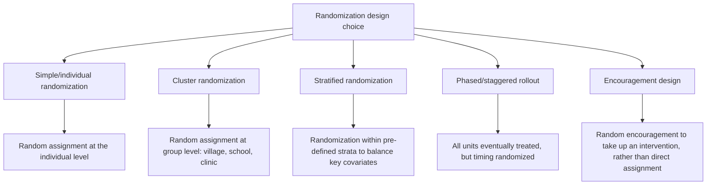

## Randomized Evaluation of Aid Programs

### Definitions and Relationship to Related Topics

**Randomized evaluation** (used interchangeably with randomized controlled trial, RCT, in the development economics literature) refers to an impact evaluation methodology in which units of analysis — individuals, households, schools, villages, or other administrative units — are randomly assigned to receive a program, treatment, or intervention (the "treatment group") or not (the "control group"), enabling estimation of the intervention's causal effect by comparing outcomes between the two groups. This topic treats the **methodology itself** in technical depth — study design, statistical inference, threats to validity, and implementation practice — complementing the "Aid Effectiveness Debates" topic, which addresses the RCT movement's substantive findings and broader place within the aid effectiveness discourse.

### Methodological Foundations

**Why randomization solves the identification problem**

The fundamental challenge in estimating any program's causal effect is the **fundamental problem of causal inference**: for any given unit, one can observe either its outcome under treatment or its outcome under control, never both simultaneously (the counterfactual is inherently unobserved). Non-experimental evaluation methods must therefore rely on assumptions to construct a credible counterfactual — for example, comparing program participants to non-participants requires assuming no systematic unobserved differences between the two groups (a **selection bias** problem, since individuals who choose to participate in a program, or are selected into it by implementers, often differ systematically from non-participants in ways that also affect outcomes, such as motivation, wealth, or existing social connections).

Random assignment addresses this by construction: because treatment status is assigned by a random process (a lottery, a random number generator, or equivalent) rather than by self-selection or administrator discretion, treatment and control groups are, in expectation and for a sufficiently large sample, statistically identical on both observable and unobservable characteristics prior to treatment, allowing any subsequent difference in average outcomes to be attributed to the treatment itself rather than to pre-existing differences between groups.

### Core Statistical Framework

**The basic estimator**: The Average Treatment Effect (ATE) under simple randomization is estimated as the difference in mean outcomes between treatment and control groups:

$$\widehat{ATE} = \bar{Y}_T - \bar{Y}_C$$

where $\bar{Y}_T$ and $\bar{Y}_C$ are the sample average outcomes in the treatment and control groups respectively. This is commonly implemented via ordinary least squares (OLS) regression of the outcome on a treatment indicator, often with baseline covariates included to improve statistical precision (though not required for unbiasedness under proper randomization):

$$Y_i = \alpha + \beta \cdot T_i + \gamma X_i + \varepsilon_i$$

where $T_i$ is a binary treatment indicator and $X_i$ is a vector of pre-treatment covariates included to reduce residual variance and increase statistical power, not to correct for bias (which randomization has already addressed).

**Statistical power and sample size**: A central practical design question is ensuring the study sample is large enough to detect an effect of policy-relevant magnitude, if one exists, with acceptable statistical confidence. Power calculations depend on the expected effect size, the outcome variable's underlying variance, the desired significance level (conventionally 5%) and power level (conventionally 80%), and — critically in many field settings — the degree of **intra-cluster correlation** when randomization occurs at a group level (village, school, clinic) rather than the individual level, since outcomes for individuals within the same cluster tend to be correlated, reducing the effective sample size relative to a naive individual-level calculation.

### Common Randomization Designs

- **Simple/individual randomization**: Appropriate when treatment can be administered to individuals independently without spillover to others (e.g., an individual cash transfer, an individual information intervention), and generally offers the highest statistical power per unit of sample size.
- **Cluster randomization**: Required when treatment is naturally administered at a group level (a school-wide curriculum change, a village-level infrastructure project) or when individual-level randomization risks contamination through spillovers (e.g., randomizing a health intervention among individuals within the same village risks the untreated individuals benefiting indirectly from reduced disease transmission among treated neighbors, as documented in the Miguel-Kremer deworming study referenced in the aid effectiveness debates topic). Cluster designs require larger overall sample sizes to achieve equivalent statistical power, due to intra-cluster correlation.
- **Stratified randomization**: Pre-treatment covariates (e.g., baseline wealth, region, gender composition) are used to divide the sample into strata, with randomization conducted separately within each stratum, ensuring balance on these key variables even in moderately sized samples where pure random assignment might, by chance, produce some imbalance.
- **Phased/staggered rollout ("randomized rollout")**: All eligible units eventually receive the intervention, but the timing of rollout is randomized, allowing later-treated units to serve as a temporary control group for earlier-treated units — a design frequently used to address ethical concerns about permanently denying a potentially beneficial intervention to a control group, while still generating experimental variation for identification.
- **Encouragement design**: Rather than directly randomizing access to a program, researchers randomize an "encouragement" to take up an already-available program (e.g., a randomly distributed information session or subsidy voucher), used when directly denying program access to a control group is not ethically or logistically feasible; this design requires instrumental variable estimation (using randomized encouragement as an instrument for actual take-up) rather than simple mean comparison, and estimates a **Local Average Treatment Effect (LATE)** specific to the "compliers" — those induced to take up the program by the encouragement — rather than the full population average effect.

### Threats to Validity and Common Implementation Challenges

**Internal validity threats**

- **Attrition**: Differential loss of study participants (dropout, migration, survey non-response) between treatment and control groups over the study period can reintroduce selection bias if attrition is correlated with treatment status and with the outcome of interest — for example, if a program's failures disproportionately drop out of a follow-up survey, remaining treatment-group observations may overstate the program's true effect. Standard practice includes tracking and reporting attrition rates by treatment arm and conducting bounding exercises (e.g., Lee bounds) to assess how sensitive results are to plausible attrition-driven bias.
- **Spillovers and contamination**: Effects of treatment "spilling over" to control units (through social networks, market price effects, or migration between treatment and control areas) can bias simple treatment-control comparisons; cluster randomization with adequately separated clusters is a standard design response, alongside explicit ex-post testing for spillover effects on nearby control units.
- **Hawthorne and John Henry effects**: Behavioral changes induced simply by awareness of being observed or studied (Hawthorne effect, potentially inflating treatment-group performance) or by control-group participants exerting extra effort specifically because they know they are the "comparison" group (John Henry effect, potentially suppressing the measured treatment-control gap) — both representing threats specific to the observation/study context rather than the underlying intervention itself.
- **Non-compliance**: Where some assigned treatment-group members do not actually take up the intervention (or some control-group members obtain it through other channels), the simple treatment-control comparison estimates an **Intention-to-Treat (ITT)** effect (the effect of being assigned to treatment, regardless of actual uptake), which may differ substantially from the **Treatment-on-the-Treated (TOT)** effect (the effect specifically among those who actually received treatment); TOT is typically estimated via instrumental variables, using random assignment as an instrument for actual receipt.

**External validity threats**

- **Site-selection bias**: RCT implementing partners (typically NGOs or research teams with specific operational capacity) may work in atypically well-functioning administrative contexts relative to the broader population of interest, raising questions about whether results generalize to implementation by a national government bureaucracy operating at larger scale — a concern central to Lant Pritchett and Justin Sandefur's critique of over-generalizing RCT results across contexts.
- **General equilibrium effects**: A small-scale pilot RCT cannot capture effects that would only emerge at large scale — for example, a small-scale cash transfer program is unlikely to move local prices, but a national-scale rollout of the same program might generate inflationary effects on local goods and labor markets that would not appear in the pilot-scale evaluation, a concern raised prominently by Angus Deaton and by structural/general-equilibrium-oriented economists as a fundamental limitation of partial-equilibrium RCT estimates for informing large-scale policy.
- **Implementer effects**: Results achieved by a highly motivated, well-resourced research/NGO implementation team may not replicate when the same intervention is delivered through standard government administrative channels with different incentive structures, monitoring intensity, and staff capacity.

### Pre-Registration, Pre-Analysis Plans, and the Replication Movement

In response to concerns about **specification searching** ("p-hacking" — running many possible analyses and selectively reporting significant results) and publication bias, the field has increasingly adopted:

- **Pre-registration**: Publicly registering a study's design, hypotheses, and planned outcome measures before data collection begins (via registries such as the AEA RCT Registry, operated by the American Economic Association), creating a public, time-stamped record against which final published results can be checked for consistency with the originally planned analysis.
- **Pre-Analysis Plans (PAPs)**: A more detailed pre-specification of the exact statistical models, primary and secondary outcome variables, subgroup analyses, and multiple-hypothesis-testing corrections to be used, intended to reduce researcher discretion in the analysis stage after outcome data are observed.
- **Replication and reanalysis**: The 2015 reanalysis of the Miguel-Kremer deworming study (referenced in the aid effectiveness debates topic) by researchers at the International Initiative for Impact Evaluation became a widely discussed case study in the field's engagement with replication, ultimately reaffirming the study's core findings after correcting some data and coding issues, while also prompting broader field-wide attention to data transparency and replication practice, including growing journal requirements for public data and code availability.

### Ethical Considerations in Randomized Aid Evaluation

- **Equipoise**: The ethical justification for randomizing access to a potentially beneficial program rests on genuine uncertainty ("equipoise") about whether the intervention actually works or represents the best use of limited resources relative to alternatives — if an intervention's benefit were already well-established, randomizing its denial to a control group would raise more serious ethical objections.
- **Institutional Review Board (IRB) oversight**: Human subjects research protections (informed consent, risk disclosure, data privacy) apply to development RCTs as to other human subjects research, typically requiring review by university or independent ethics boards, alongside increasing attention to context-specific ethical considerations (power dynamics between researchers and study participants, appropriate compensation, community consent processes in addition to individual consent).
- **Design mitigations for ethical concerns**: Phased/staggered rollout designs (described above) are frequently adopted specifically to address the ethical concern of permanently denying a plausibly beneficial program to a control group, by ensuring all eligible units eventually receive treatment.

### Illustrative Comparison of Estimand Types

| Estimand | Definition | When Used |
| --- | --- | --- |
| Intention-to-Treat (ITT) | Effect of being assigned to treatment, regardless of actual uptake | Default and most policy-relevant estimate when assignment, not just take-up, is what a policymaker controls |
| Treatment-on-the-Treated (TOT) / Local Average Treatment Effect (LATE) | Effect specifically among those who complied with their assignment (took up treatment if assigned, or would have refused if not assigned) | When non-compliance is substantial and the effect specifically among "compliers" or actual recipients is of interest |
| Average Treatment Effect (ATE) | Effect for the full study population if all were treated vs. all untreated | Requires full compliance or additional assumptions to estimate from an RCT with partial compliance |

### Institutional Infrastructure Supporting the Field

- **J-PAL (Abdul Latif Jameel Poverty Action Lab)**: Founded 2003 at MIT, a network of affiliated researchers conducting and disseminating RCT-based evidence on poverty alleviation interventions, maintaining a widely used public evaluation database and policy-influence programs.
- **Innovations for Poverty Action (IPA)**: A related organization focused on RCT implementation, technical assistance, and policy translation of experimental evidence.
- **AEA RCT Registry**: The standard pre-registration repository for economics RCTs, operated by the American Economic Association.
- **3ie (International Initiative for Impact Evaluation)**: An organization focused on funding, synthesizing, and promoting rigorous impact evaluation (including but not limited to RCTs) specifically in development contexts, and the organization responsible for the prominent deworming reanalysis referenced above.

### Key Points

- Randomization solves the selection bias problem by construction, making treatment and control groups statistically comparable in expectation prior to treatment
- Design choice (individual, cluster, stratified, phased rollout, or encouragement) depends on the intervention's nature, spillover risk, and ethical constraints, with cluster designs requiring larger samples due to intra-cluster correlation
- Attrition, spillovers, and non-compliance are the primary internal validity threats, each with standard diagnostic and correction techniques (attrition bounds, spillover testing, IV estimation for TOT)
- External validity — whether pilot-scale, NGO-implemented results generalize to government-scale implementation in different contexts — remains RCTs' most significant and actively debated limitation
- Pre-registration and pre-analysis plans have become standard field practice in response to specification-searching and publication bias concerns
- Ethical justification rests on genuine uncertainty (equipoise) about intervention effectiveness, with phased rollout designs commonly used to mitigate concerns about denying beneficial programs to control groups

### Related Topics

- Aid effectiveness debates: the substantive findings and policy influence of the RCT movement
- External validity and the scale-up problem in development economics (Pritchett-Sandefur critique)
- Instrumental variable methods and Local Average Treatment Effect estimation
- Pre-registration, pre-analysis plans, and the broader replication crisis in economics
- Deworming and the Miguel-Kremer study reanalysis controversy
- Cash transfers and cash-benchmarking methodology
- Behavioral economics field experiments in development contexts
- Structural/general equilibrium modeling as a complement to reduced-form RCT estimates