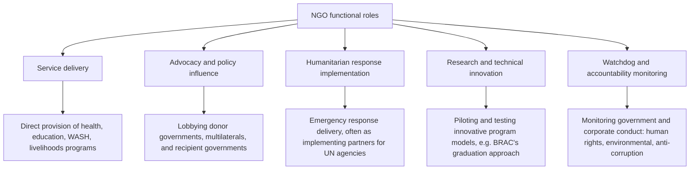

## Role of NGOs in Development

### Definitions and Typology

A **Non-Governmental Organization (NGO)** in the development context refers to a formally organized, non-profit entity operating independently of government, engaged in activities intended to improve social, economic, or humanitarian conditions in developing countries. NGOs occupy a distinct institutional position between the state (bilateral and multilateral official aid actors) and the market (private commercial actors), and are often grouped together with other non-state, non-market actors under the broader label **civil society organizations (CSOs)**.

**Standard typology by scale and origin**:

- **International NGOs (INGOs)**: Headquartered in donor countries with operations spanning multiple developing countries (examples: Oxfam, Save the Children, CARE International, Médecins Sans Frontières/Doctors Without Borders).
- **National NGOs**: Operating within a single developing country, often founded and staffed predominantly by nationals of that country, sometimes serving as implementing partners for INGO or donor-funded programs, and sometimes operating independently with domestic or diaspora funding.
- **Community-Based Organizations (CBOs)**: Smaller, often informal or semi-formal grassroots organizations rooted in a specific local community, frequently the ultimate delivery-point organizations even when funding flows through several intermediary layers of INGOs and national NGOs.
- **GONGOs (Government-Organized NGOs)** and **BINGOs (Business-Organized/Industry NGOs)**: Terms used, sometimes critically, to describe organizations formally structured as NGOs but substantially directed, funded, or controlled by government or corporate interests respectively, raising definitional questions about the boundary of genuine NGO independence.

### Functional Roles in the Development System

**Service delivery**: NGOs frequently serve as direct implementers of development programs — health clinics, schools, water and sanitation infrastructure, microfinance and livelihoods programs — often functioning as the operational delivery arm for funding that originates from bilateral donors, multilateral institutions, or private philanthropy, particularly in contexts where government service delivery capacity is weak, contested (conflict-affected areas), or where donors prefer to bypass government channels for governance or fiduciary reasons (sometimes termed **aid "bypass"**).

**Advocacy and policy influence**: A substantial share of NGO activity, particularly among larger INGOs, is directed toward influencing donor government aid policy, multilateral institution priorities, and recipient government policy — campaigning on issues such as debt relief (the Jubilee 2000 campaign, a globally coordinated NGO-led campaign that contributed to the political momentum behind the HIPC debt relief initiative discussed in the history-of-aid topic), trade policy, human rights, and environmental protection.

**Humanitarian implementation**: As discussed in the humanitarian-vs-development-aid topic, NGOs are central operational actors within the UN cluster coordination system, often serving as the actual on-the-ground implementing organizations for programs funded through UN pooled funds, bilateral humanitarian budgets, or direct private fundraising.

**Research and program innovation**: Some NGOs function as sites of significant program design innovation, subsequently adopted or scaled by governments and multilateral institutions — BRAC (Bangladesh Rural Advancement Committee, one of the world's largest NGOs, founded 1972) is frequently cited for developing the "graduation approach" (a sequenced package combining an initial asset transfer, cash stipend, skills training, and coaching designed to move extremely poor households onto a sustainable economic trajectory), which has since been rigorously evaluated through RCTs (including a multi-country study published in *Science* in 2015 led by researchers including Abhijit Banerjee) and adapted by governments and other organizations across multiple countries.

**Watchdog and accountability functions**: NGOs including Transparency International, Global Witness, and various human rights organizations perform independent monitoring and reporting functions on government and corporate conduct — corruption, environmental damage, human rights violations — that complement, and sometimes directly critique, official donor and government development programming.

### Funding Architecture and Financial Dependency Structure

**Primary funding sources**:

- **Official development assistance channeled through NGOs**: A substantial share of bilateral and multilateral aid is disbursed not directly to recipient governments but through NGO implementing partners — a practice that has grown over time, particularly in fragile states and contexts of governance concern, and that OECD-DAC data tracks as a distinct aid delivery channel category.
- **Private fundraising and individual donations**: Particularly significant for large, well-known INGOs with strong public fundraising brand recognition (emergency appeals following high-profile disasters typically drive substantial private giving surges).
- **Institutional philanthropic funding**: Major foundations (the Bill & Melinda Gates Foundation being the largest and most influential in global health and development specifically) provide substantial grant funding to NGOs, often for specific, well-defined program areas aligned with the foundation's strategic priorities.
- **Government grants and contracts (including from the NGO's own home government)**: Many INGOs receive substantial funding directly from their home-country bilateral aid agency (for example, USAID has historically been a major funder of US-headquartered INGOs), creating financial relationships that some critics argue can compromise NGOs' claimed independence from donor government foreign policy objectives.

**The "NGO-ization" and financial dependency critique**: A body of critical scholarship (including work associated with scholars examining civil society and development, such as work critiquing the broader "NGO-ization" of grassroots social movements) argues that heavy financial dependency on official donor or major foundation funding can subtly reshape NGO priorities, programming choices, and organizational culture toward donor-preferred metrics, reporting formats, and program models, potentially at the expense of more organic, locally-defined priorities or more politically confrontational advocacy that might jeopardize funding relationships — a dynamic sometimes termed "mission drift."

### Comparative Advantages Commonly Attributed to NGOs

- **Grassroots access and trust**: Particularly for smaller national NGOs and CBOs, closer proximity to and trust within local communities than external government or international donor agency staff, potentially enabling more accurate needs assessment and more effective, contextually appropriate program design.
- **Flexibility and innovation capacity**: Generally less encumbered by the bureaucratic procurement, appraisal, and reporting requirements that characterize large bilateral and multilateral institutional programming, potentially allowing faster piloting and adaptation of program models (the BRAC graduation approach example above is frequently cited in this context).
- **Reaching populations government services do not**: In conflict-affected areas, regions controlled by non-state armed actors, or marginalized/excluded population groups, NGOs (particularly those adhering closely to humanitarian neutrality principles) may retain operational access and community trust that government service delivery cannot achieve.
- **Specialized technical expertise**: Some NGOs (particularly larger, more established organizations) have developed deep, specialized technical expertise in specific sectors (e.g., Médecins Sans Frontières in emergency and conflict-zone medical care) exceeding what a broader-mandate government ministry or multilateral agency might maintain in-house.

### Critiques and Limitations

**Accountability and legitimacy questions**: Unlike elected governments (accountable to citizens through elections) or multilateral institutions (accountable through formal member-state governance structures, however imperfect), NGOs are typically accountable primarily "upward" to their funders (donor governments, foundations, individual donors) rather than "downward" to the communities and beneficiaries they serve — a structural asymmetry that critics argue can produce programming driven more by donor priorities and fundraising narratives than by genuinely community-defined needs.

**Fragmentation and coordination challenges**: The proliferation of NGOs, particularly in high-profile emergency response contexts (a phenomenon sometimes described somewhat critically as "disaster tourism" or an oversaturated response environment), can generate significant coordination costs, duplicated effort, and administrative burden on both recipient governments and coordinating bodies (the UN cluster system, discussed in the humanitarian-development topic, is a direct institutional response to this fragmentation concern).

**Substitution for, and potential undermining of, state capacity**: A significant critique, related to the "aid bypass" phenomenon mentioned above, holds that heavy reliance on NGO service delivery — while often pragmatically justified by weak or contested government capacity in the near term — can, over a longer horizon, reduce pressure on governments to build their own service delivery capacity and can fragment service provision into a patchwork of donor-funded, NGO-implemented projects lacking the coherence, sustainability, and accountability structures of an integrated national public service system. This concern connects directly to the aid dependency and governance effects literature discussed in the related topic.

**Effectiveness evidence base**: As with official aid more broadly, NGO program effectiveness varies substantially, and the increasing adoption of RCT-based evaluation (discussed in the randomized evaluation topic) has been applied to NGO programming specifically, in some cases (the BRAC graduation approach evaluations being a positive example) generating strong supportive evidence, and in other cases revealing more modest or context-dependent effects, underscoring that "NGO-implemented" is not itself a guarantee of program effectiveness relative to government or private-sector implementation.

**The localization critique**: As discussed in the humanitarian-development-aid topic's coverage of the 2016 Grand Bargain commitments, INGOs specifically have been a focus of the "localization" reform agenda, which argues that the traditional model — funding flowing from donors through INGOs, which then subcontract to national NGOs and CBOs, retaining a substantial share of overhead and decision-making authority at the INGO level — should shift toward more direct funding and decision-making authority for local and national organizations, a shift that has been assessed in independent reviews as proceeding more slowly than the stated commitments.

### Comparative Table: NGO Roles Across the Aid Value Chain

| Position in Value Chain | Typical Actor Type | Illustrative Example |
| --- | --- | --- |
| Funding source | Bilateral/multilateral donor, foundation, private donors | USAID, Gates Foundation |
| Primary implementing/coordinating layer | International NGO | Oxfam, CARE, Save the Children |
| Subcontracted/partner implementation | National NGO | Country-specific NGOs |
| Last-mile delivery | Community-Based Organization | Local community groups |
| Advocacy/policy influence (cross-cutting) | International and national NGOs, campaign coalitions | Jubilee 2000 debt relief campaign |
| Innovation/piloting (cross-cutting) | Specialized NGOs with research capacity | BRAC (graduation approach) |
| Watchdog/monitoring (cross-cutting) | Rights- and governance-focused NGOs | Transparency International |

### Key Points

- NGOs occupy a distinct institutional space between state and market, spanning international, national, and community-based organizational scales
- Core functional roles include direct service delivery, policy advocacy, humanitarian implementation, program innovation/piloting, and independent watchdog/accountability monitoring
- NGO funding architecture (official aid channeled through NGOs, private fundraising, foundation grants, home-government contracts) creates a structural "upward" accountability orientation toward funders rather than "downward" accountability to beneficiary communities
- Comparative advantages commonly cited include grassroots trust, bureaucratic flexibility, access to conflict-affected or marginalized populations, and specialized technical expertise
- Key critiques include accountability/legitimacy gaps, fragmentation and coordination costs, potential substitution for (and undermining of) state capacity building, and financial-dependency-driven "mission drift"
- The 2016 Grand Bargain localization agenda specifically targets the traditional INGO-intermediated funding model, with implementation progress assessed as lagging behind stated commitments

### Related Topics

- Humanitarian aid versus development aid: NGO roles within the UN cluster coordination system
- Aid dependency and governance effects: the "aid bypass" and state-capacity substitution critique
- Randomized evaluation of aid programs: BRAC's graduation approach as an RCT-evaluated NGO innovation
- Bilateral versus multilateral aid architecture: NGOs as an aid delivery channel distinct from both
- Debt relief campaigns and civil society advocacy: the Jubilee 2000 movement
- Institutional philanthropy in global development: the Gates Foundation model
- Localization and the Grand Bargain commitments in depth
- Civil society and democratization theory in development contexts