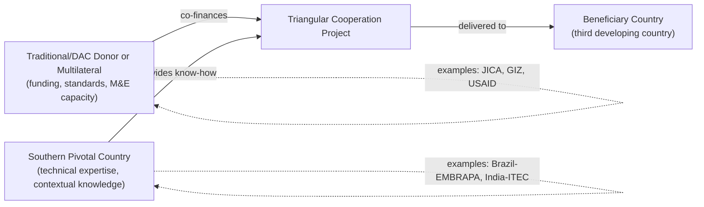

## Emerging Donors and South-South Cooperation

### Definitions and Conceptual Foundations

**South-South Cooperation (SSC)** refers to the exchange of resources, technology, and knowledge between developing countries (the "Global South"), as distinct from traditional North-South aid flows from OECD/DAC donors to developing countries. SSC is typically framed by its practitioners as a partnership among equals, grounded in solidarity, non-interference in domestic affairs, and mutual benefit, rather than the donor-recipient hierarchy associated with traditional Official Development Assistance (ODA).

**Emerging donors** (also called "non-traditional," "non-DAC," or "new" donors) are countries that provide development assistance but are not members of the OECD's Development Assistance Committee (DAC), which historically set the norms and reporting standards for global aid. This category includes:

- **Major emerging economies**: China, India, Brazil, Turkey, Saudi Arabia, the UAE, South Africa
- **Gulf states**: Kuwait, Qatar, and other Gulf Cooperation Council (GCC) members with long-standing aid programs predating the "emerging donor" discourse
- **Former aid recipients turned donors**: South Korea (which joined the DAC in 2010, making it a hybrid case), Poland, and other post-transition economies

**Triangular Cooperation** is a related but distinct modality: a partnership where a traditional (DAC) donor or multilateral institution co-finances or facilitates a Southern provider's assistance to a third developing country, combining Southern expertise with Northern or multilateral resources.

### Key Points

- SSC is not new (Non-Aligned Movement and Bandung Conference roots go back to 1955), but its financial scale and geopolitical visibility have grown substantially since the 2000s, particularly with China's expansion.
- Emerging donors generally reject DAC terminology and definitions, arguing that ODA's framework was designed by and for former colonial powers.
- Data comparability is a persistent problem: China, India, and Gulf states do not report to the OECD's Creditor Reporting System (CRS) using DAC-standard definitions, making cross-country comparison difficult and estimates contested.
- Many emerging donors blend aid, trade, and investment in ways that do not fit the ODA concessionality threshold cleanly.

### Historical Origins

**Bandung Conference (1955)**: 29 Asian and African states met in Indonesia to promote economic and cultural cooperation and oppose colonialism, laying ideological groundwork for South-South solidarity.

**Non-Aligned Movement (NAM, founded 1961)**: Institutionalized political cooperation among newly independent states, avoiding alignment with either Cold War bloc.

**Buenos Aires Plan of Action (BAPA, 1978)**: Adopted at the UN Conference on Technical Cooperation among Developing Countries (TCDC); remains the normative reference document for SSC, later reaffirmed and expanded through **BAPA+40 (2019)**.

**Cold War-era donors**: China's aid to Africa and Asia (e.g., the TAZARA railway in Tanzania/Zambia, completed 1975) and Gulf states' oil-wealth-funded institutions (Kuwait Fund for Arab Economic Development, established 1961) predate the post-2000 "rise of emerging donors" narrative by decades.

### Core Principles Distinguishing SSC from Traditional ODA

| Dimension | Traditional (DAC) ODA | South-South Cooperation |
| --- | --- | --- |
| Framing | Donor-recipient | Partnership among equals |
| Conditionality | Often tied to governance, human rights, policy reform | Emphasis on non-interference in domestic affairs |
| Reporting | OECD CRS/DAC statistical standards | No unified reporting standard; often self-reported |
| Modalities | Grants, concessional loans, technical assistance | Grants, concessional loans, but also non-concessional loans, barter, resource-backed loans, in-kind transfers |
| Tying | DAC members formally committed to untying aid (2001 Recommendation) | Frequently tied to use of donor-country contractors, goods, and labor |
| Sectoral focus | Governance, health, education emphasized in DAC totals | Heavy weighting toward infrastructure, energy, extractives |

### China as the Dominant Emerging Donor

China is the largest and most studied non-DAC provider of development finance. Key features:

- **Institutional architecture**: China International Development Cooperation Agency (CIDCA, established 2018) coordinates aid policy; China Exim Bank and China Development Bank are the principal financing vehicles for loans, which constitute the bulk of Chinese outward development finance (distinct from grant-based aid).
- **Belt and Road Initiative (BRI, launched 2013)**: A global infrastructure and connectivity program spanning transport, energy, and digital infrastructure across over 140 countries as of the mid-2020s. BRI financing blends commercial, concessional, and export-credit instruments, making it methodologically difficult to classify as pure ODA.
- **AidData (William & Mary)** tracking project: The most widely cited independent dataset on Chinese overseas financial flows (the "Global Chinese Development Finance Dataset"), given China's non-disclosure to the OECD CRS. [Unverified: exact current figures change with each AidData release; consult the latest dataset version for up-to-date totals.]
- **"Eight Principles for Economic Aid and Technical Assistance to Other Countries" (1964, Zhou Enlai)**: Foundational doctrine emphasizing equality, mutual benefit, no strings attached, and respect for sovereignty — still invoked rhetorically in Chinese aid discourse.
- **Forum on China-Africa Cooperation (FOCAC)**: Triennial summit mechanism (since 2000) used to announce financing pledges and set priorities for China-Africa cooperation.
- **Debt sustainability debates**: China's resource-backed and infrastructure loans have generated the contested "debt-trap diplomacy" narrative, which is disputed in the academic literature; empirical studies (e.g., Brautigam's work) find limited evidence of deliberate asset-seizure strategies but acknowledge governance and debt-transparency concerns are real. [Inference: the balance of evidence in the academic literature leans toward rejecting a coordinated "trap" strategy, though individual cases of debt distress linked to Chinese lending are well documented.]

### Other Major Emerging Donors

**India**:

- **Indian Technical and Economic Cooperation (ITEC) Programme** (since 1964): flagship capacity-building and training program.
- **Development Partnership Administration (DPA)** within the Ministry of External Affairs coordinates lines of credit, grants, and technical assistance.
- Focus on the Indian Ocean region, Africa, and neighboring South Asian states; concessional lines of credit are the primary financial instrument, often tied to Indian goods and contractors.

**Brazil**:

- **Brazilian Cooperation Agency (ABC)**, under the Ministry of Foreign Affairs, emphasizes technical cooperation rather than large-scale financial transfers.
- Notable for agricultural and health cooperation (e.g., EMBRAPA's tropical agriculture expertise shared with African states; HIV/AIDS antiretroviral cooperation).
- Historically resource-constrained compared to China/Gulf states; cooperation is more knowledge- and expertise-based than capital-based.

**Turkey**:

- **Turkish Cooperation and Coordination Agency (TİKA)**: rapidly expanded aid footprint since the 2000s, notably in Sub-Saharan Africa, the Balkans, and Central Asia.
- Turkey has reported relatively high ODA/GNI ratios in some years driven substantially by humanitarian spending on Syrian refugees hosted domestically, which complicates comparison with conventional cross-border aid.

**Gulf States (Saudi Arabia, UAE, Kuwait, Qatar)**:

- Long-standing institutionalized aid architecture: **Saudi Fund for Development**, **Kuwait Fund for Arab Economic Development**, **Abu Dhabi Fund for Development**.
- Historically among the most generous donors relative to GNI in specific years, though flows are concentrated regionally (MENA, Islamic world) and often channeled bilaterally or via the **Islamic Development Bank**.
- Motivated by a blend of religious solidarity (Islamic finance principles), regional stability concerns, and strategic influence.

**South Korea**: A unique hybrid — a former major aid recipient (post-Korean War) that transitioned to donor status and formally joined the OECD DAC in 2010, often cited as the model case of the "traditional-emerging" continuum and studied for lessons on translating domestic development experience (the *Korea Development Institute* model) into aid programming.

### Multilateral and Institutional Architecture of SSC

**New Development Bank (NDB)**, formerly BRICS Bank: established 2014 by Brazil, Russia, India, China, South Africa; headquartered in Shanghai; finances infrastructure and sustainable development projects, positioned as an alternative to World Bank/IMF conditionality frameworks.

**Asian Infrastructure Investment Bank (AIIB)**: China-led multilateral development bank launched 2016, with over 100 members by the mid-2020s including many traditional DAC donors as shareholders — illustrating blurring lines between "traditional" and "emerging" donor categories at the multilateral level.

**UN Office for South-South Cooperation (UNOSSC)**: UN system body promoting and coordinating SSC and triangular cooperation, custodian of the BAPA/BAPA+40 framework and the biennial **South-South and Triangular Cooperation** reporting.

**Global South-South Development Expo**: UNOSSC-convened annual forum showcasing solutions and partnerships.

### Triangular Cooperation Mechanics

**Example**: Japan's JICA co-financing Brazilian agricultural technical assistance (via EMBRAPA) for cooperation in Mozambique (the **ProSAVANA** program) — although this specific case became controversial over land-rights concerns, it illustrates the canonical triangular structure of Northern financing plus Southern technical delivery.

### Measurement and Data Challenges

- The OECD DAC's **ODA definition** (grant element ≥25%, concessionality threshold, promotion of economic development/welfare as main objective) is the global reporting standard, but non-DAC providers are not obligated to report against it.
- China, in particular, discloses aid data inconsistently; the **2011 and 2014 Chinese government White Papers on Foreign Aid** offered partial official disclosure, but these remain far less granular than DAC CRS microdata.
- Researchers use proxy methods: media-based data collection (AidData's "Tracking Underreported Financial Flows," TUFF, methodology), loan contract analysis (e.g., **AidData/Kiel Institute "How China Lends"** study on the unusual confidentiality and collateral clauses in Chinese loan contracts), and satellite/geospatial verification of infrastructure projects.
- The **OECD's "Total Official Support for Sustainable Development" (TOSSD)** framework, introduced in the late 2010s, was partly designed to create a broader, more inclusive statistical standard that could capture South-South and blended flows alongside traditional ODA, with mixed uptake among non-DAC providers.

### Motivations of Emerging Donors

**Key Points**:

- **Economic self-interest**: securing resource access (especially China in extractives), opening export markets, tying aid to procurement from donor-country firms.
- **Geopolitical influence**: building voting blocs in multilateral fora (UN, WTO), countering rival powers' influence (US-China strategic competition is frequently cited as a driver of accelerated Chinese and, reactively, Western engagement in Africa).
- **South-South solidarity and identity politics**: positioning as an alternative development partner untainted by colonial history, appealing to shared post-colonial or non-aligned identity.
- **Domestic legitimacy and soft power**: aid programs used to project national prestige and "rising power" status (e.g., China's FOCAC summitry, India's IORA/Africa outreach).
- **Diaspora and religious ties**: Gulf aid patterns often correlate with Islamic solidarity networks and support for coreligionist populations.

### Critiques and Debates

**From traditional donor / governance perspective**:

- Concern that non-conditional lending undermines governance reforms and anti-corruption safeguards that DAC donors attempt to embed via conditionality.
- "Debt trap" narrative regarding Chinese infrastructure loans (contested — see above).
- Environmental and labor standards sometimes weaker than those attached to World Bank/DAC-financed projects, though this varies significantly by project and country.

**From Global South / SSC advocates' perspective**:

- Traditional ODA's conditionality is itself a form of neocolonial control; SSC's non-interference principle is framed as more respectful of sovereignty.
- DAC statistical categories were designed without Southern input and structurally disadvantage alternative modalities (e.g., concessional loans, barter, technical exchange) that don't fit the ODA grant-element formula.
- Critics of the critics note that "non-interference" can also enable continued cooperation with authoritarian or human-rights-abusing governments that DAC donors would sanction or condition aid against.

**Empirical ambiguity**: [Inference] The academic consensus is that emerging donor behavior is heterogeneous — China's state-driven, infrastructure-heavy model differs substantially from Brazil's technical-cooperation model, which differs again from Gulf sovereign-fund-based aid — making blanket generalizations about "emerging donors" as a bloc analytically weak, even though the term remains in common policy use.

### Impact on the Traditional Aid System

- **Erosion of DAC normative dominance**: Recipient countries increasingly can choose among financing sources, reducing traditional donors' leverage to attach governance conditions ("forum shopping" or the "Beijing/Washington Consensus" framing).
- **Convergence pressures**: Some emerging donors (South Korea, increasingly parts of China's development finance discourse) have gradually adopted elements of DAC-style reporting and safeguard standards, suggesting partial socialization into international norms over time.
- **Fragmentation vs. complementarity debate**: Some scholars argue proliferation of donors increases aid fragmentation and coordination costs in recipient countries; others argue it increases recipient bargaining power and financing options, potentially improving aid effectiveness through competition.

### Illustrative Comparative Framework (SVG Diagram)

<svg xmlns="http://www.w3.org/2000/svg" viewBox="0 0 760 460" font-family="Helvetica, Arial, sans-serif">
<text x="380" y="28" text-anchor="middle" font-size="17" font-weight="bold" fill="#1a1a1a">Donor Landscape Spectrum (svg_diagram)</text>
<line x1="60" y1="80" x2="700" y2="80" stroke="#888" stroke-width="2" />
<text x="60" y="65" font-size="12" fill="#444">Traditional / DAC</text>
<text x="620" y="65" font-size="12" fill="#444">Purely Southern / Non-DAC</text>
<circle cx="120" cy="80" r="9" fill="#2b6cb0" />
<text x="120" y="105" text-anchor="middle" font-size="11">USA / EU / Japan</text>
<circle cx="260" cy="80" r="9" fill="#3182ce" />
<text x="260" y="105" text-anchor="middle" font-size="11">South Korea</text>
<text x="260" y="118" text-anchor="middle" font-size="9" fill="#666">(DAC member, ex-recipient)</text>
<circle cx="400" cy="80" r="9" fill="#805ad5" />
<text x="400" y="105" text-anchor="middle" font-size="11">Turkey / Gulf States</text>
<text x="400" y="118" text-anchor="middle" font-size="9" fill="#666">(institutionalized, partial reporting)</text>
<circle cx="540" cy="80" r="9" fill="#d53f8c" />
<text x="540" y="105" text-anchor="middle" font-size="11">India / Brazil</text>
<text x="540" y="118" text-anchor="middle" font-size="9" fill="#666">(technical cooperation emphasis)</text>
<circle cx="660" cy="80" r="9" fill="#e53e3e" />
<text x="660" y="105" text-anchor="middle" font-size="11">China</text>
<text x="660" y="118" text-anchor="middle" font-size="9" fill="#666">(largest scale, non-CRS reporting)</text>
<rect x="60" y="160" width="640" height="270" rx="8" fill="none" stroke="#ccc" stroke-width="1" />
<text x="380" y="185" text-anchor="middle" font-size="13" font-weight="bold" fill="#1a1a1a">Comparative Dimensions</text>

<text x="80" y="215" font-size="12" font-weight="bold" fill="`#2b6cb0`">Reporting Standard</text>

<text x="80" y="233" font-size="11" fill="#333">DAC/CRS full disclosure -&gt; partial -&gt; self-reported only</text>

<text x="80" y="260" font-size="12" font-weight="bold" fill="`#805ad5`">Primary Instrument</text>

<text x="80" y="278" font-size="11" fill="#333">Grants/concessional loans -&gt; lines of credit -&gt; blended/commercial loans</text>

<text x="80" y="305" font-size="12" font-weight="bold" fill="`#d53f8c`">Conditionality</text>

<text x="80" y="323" font-size="11" fill="#333">Governance/policy conditions -&gt; light conditionality -&gt; non-interference norm</text>

<text x="80" y="350" font-size="12" font-weight="bold" fill="`#e53e3e`">Sectoral Focus</text>

<text x="80" y="368" font-size="11" fill="#333">Governance/health/education -&gt; infrastructure -&gt; extractives/energy</text>

<text x="80" y="395" font-size="12" font-weight="bold" fill="`#38a169`">Coordinating Body</text>

<text x="80" y="413" font-size="11" fill="#333">OECD DAC -&gt; national agencies (CIDCA, TİKA, ABC, DPA) -&gt; UNOSSC (cross-cutting)</text>

</svg>

### Practical Example: Comparing Financing Instruments

Consider a hypothetical $500 million infrastructure project (a regional highway):

- **DAC-style concessional loan**: grant element ≥ 25% required to count as ODA; typically bundled with environmental/social safeguard requirements (World Bank Environmental and Social Framework-equivalent), procurement often untied since the 2001 DAC Recommendation on untying aid to least-developed countries.
- **Chinese Exim Bank loan**: often near-commercial or concessional rate depending on facility, frequently tied to Chinese state-owned enterprise (SOE) contractors and Chinese labor/materials procurement, sometimes structured with resource-backed repayment (e.g., oil-for-infrastructure arrangements), and historically featuring confidentiality clauses that limit public disclosure of loan terms. [Unverified: specific contract terms vary substantially by country and year; the "How China Lends" dataset documents common but not universal clauses.]
- **Gulf Fund loan (e.g., Saudi Fund for Development)**: typically concessional, often tied to regional/Islamic-world project eligibility criteria, administratively similar in form to DAC concessional lending but outside CRS reporting.

### Relevance to Broader Development Economics Debates

- Connects to **aid effectiveness literature** (Paris Declaration 2005, Accra Agenda 2008, Busan Partnership 2011) — the Busan Partnership was notable for the first formal, if partial, inclusion of Southern providers (including China) in a global aid-effectiveness dialogue, alongside creation of the parallel principle of "effective development cooperation" meant to be more inclusive of non-DAC actors.
- Connects to **debt sustainability analysis** (IMF/World Bank Debt Sustainability Framework) given the rise of non-Paris-Club bilateral creditors complicating debt restructuring negotiations (relevant to the **G20 Common Framework for Debt Treatment**, launched 2020, which explicitly sought to bring China and other non-traditional creditors into coordinated restructuring processes).
- Connects to **aid fragmentation and proliferation** literature in the broader ODA effectiveness debate.

### Related Topics

- Debt sustainability and the G20 Common Framework for Debt Treatment
- Belt and Road Initiative: financing structures and case studies
- OECD DAC aid effectiveness agenda (Paris Declaration, Accra, Busan)
- Tied vs. untied aid and procurement conditionality
- Multilateral development banks: World Bank vs. NDB vs. AIIB
- Aid conditionality and governance reform debates
- Triangular cooperation case studies (JICA-Brazil-Mozambique ProSAVANA)
- TOSSD (Total Official Support for Sustainable Development) as an alternative measurement framework
- Resource-backed lending and extractive-sector development finance
- Soft power and foreign policy dimensions of development assistance