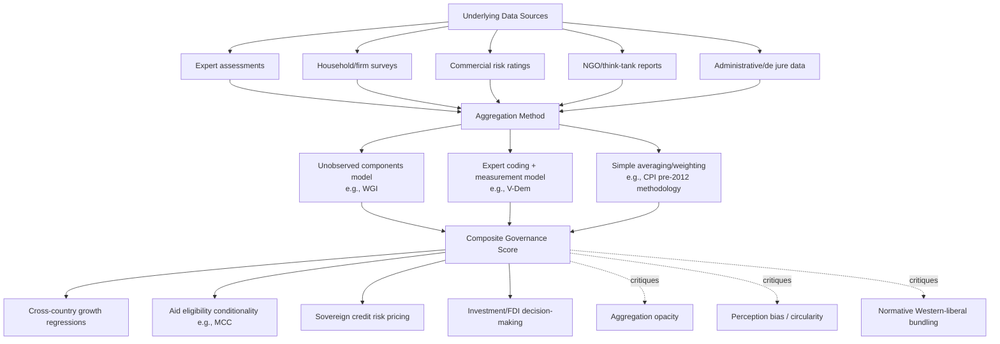

## Defining and Measuring Governance Quality

### Conceptual Definitions

**Governance** broadly refers to the processes, institutions, and traditions by which authority is exercised in a country — how decisions are made, implemented, and enforced, and how those in power are held accountable. There is no single universally accepted definition; different institutions emphasize different dimensions:

- **World Bank**: "the traditions and institutions by which authority in a country is exercised," encompassing (1) the process by which governments are selected, monitored, and replaced; (2) the capacity of government to formulate and implement sound policies; and (3) the respect of citizens and the state for institutions governing economic and social interactions.
- **UNDP**: emphasizes governance as "the exercise of economic, political, and administrative authority to manage a country's affairs at all levels," with a normative emphasis on participation, transparency, and accountability.
- **Institutional economics tradition (North, Acemoglu-Robinson)**: frames governance quality in terms of the strength of **inclusive vs. extractive institutions** — the degree to which political and economic institutions constrain elites, protect property rights, and enable broad-based participation in economic life.

**Good governance**, as a normative construct, typically bundles together: rule of law, control of corruption, government effectiveness, regulatory quality, voice and accountability, and political stability — a bundling that itself embeds contestable value judgments about what "good" means (see critiques below).

### Key Points

- Governance is inherently multidimensional; no single indicator captures it fully, so cross-country comparison depends heavily on aggregation choices.
- A foundational distinction in the literature is between governance as **institutions** (the rules of the game — formal and informal constraints) versus governance as **outcomes/performance** (effectiveness of service delivery, policy implementation).
- Measurement approaches split broadly into **perception-based indices** (surveys of experts/citizens) and **objective/fact-based indicators** (de jure rules, de facto outcomes, administrative data).
- The choice of measurement approach has significant implications for development policy, since indices like the Worldwide Governance Indicators are used to allocate aid, guide investment decisions, and condition IMF/World Bank programs.

### Theoretical Foundations

**New Institutional Economics**: Douglass North's distinction between formal institutions (constitutions, laws, property rights regimes) and informal institutions (norms, conventions, codes of conduct) provides the conceptual scaffolding for most governance measurement frameworks. Institutions matter because they shape transaction costs and the credibility of commitments.

**Acemoglu and Robinson's inclusive/extractive institutions framework** (*Why Nations Fail*, 2012): Argues governance quality is best understood through whether political institutions distribute power broadly (pluralistic) versus concentrate it (extractive elites), and whether economic institutions secure property rights and encourage participation versus enable rent extraction by narrow groups. [Inference: this framework is highly influential in development economics but remains contested regarding its capacity to explain within-country variation and reversals over time.]

**Principal-agent theory applied to governance**: Citizens (principals) delegate authority to political leaders and bureaucrats (agents); governance quality reflects the effectiveness of accountability mechanisms (elections, courts, free press, audit institutions) in aligning agent behavior with principal interests, and the severity of information asymmetries and monitoring costs that allow agency slack (including corruption).

**State capacity literature** (Fukuyama, Besley and Persson): Distinguishes governance *quality* (how power is used — accountable vs. arbitrary) from state *capacity* (the technical and administrative ability to extract revenue, provide public goods, and enforce rules), arguing both dimensions are analytically distinct and empirically dissociable — a state can be capable but unaccountable (developmental authoritarianism) or accountable but weak (fragile democracies).

### Major Governance Measurement Frameworks

**Worldwide Governance Indicators (WGI)** — World Bank (Kaufmann, Kraay, Mastruzzi, since 1996, updated annually):

- Aggregates over 30 underlying data sources (surveys of firms/households, expert assessments, NGO reports, commercial risk-rating agencies) into six composite dimensions:
  1. **Voice and Accountability**
  2. **Political Stability and Absence of Violence/Terrorism**
  3. **Government Effectiveness**
  4. **Regulatory Quality**
  5. **Rule of Law**
  6. **Control of Corruption**
- Uses an **unobserved components model** (a form of statistical aggregation) to combine disparate sources into a single percentile-rank score per dimension (0-100) with explicit margins of error.
- Widely used but criticized (see below) for opacity in weighting, reliance on subjective perception data, and treating conceptually distinct dimensions as if commensurable.

**Polity Project (Polity5)**: Focuses narrowly on regime authority characteristics — a composite scale (-10 autocracy to +10 full democracy) based on the competitiveness and openness of executive recruitment, constraints on executive authority, and competitiveness of political participation. Widely used in political science and cross-country growth regressions as an instrument for "institutional quality," but measures regime type rather than governance performance per se.

**Varieties of Democracy (V-Dem)** (University of Gothenburg, since 2014): The most granular contemporary dataset, using thousands of country experts to code hundreds of indicators across five high-level democracy principles (electoral, liberal, participatory, deliberative, egalitarian), disaggregated to allow researchers to construct customized sub-indices rather than relying on a single bundled score.

**Ibrahim Index of African Governance (IIAG)** (Mo Ibrahim Foundation): Africa-specific composite index covering security/rule of law, participation/human rights, sustainable economic opportunity, and human development, built to be regionally comparable and policy-relevant for African governments specifically.

**Transparency International's Corruption Perceptions Index (CPI)**: A narrower, corruption-specific perception index (see companion topic on corruption measurement); often used as a component source within broader indices like WGI's Control of Corruption dimension.

**International Country Risk Guide (ICRG)** (PRS Group): Commercial political risk index used heavily in econometric growth literature (e.g., in Knack and Keefer's influential institutions-and-growth studies) — covers government stability, corruption, law and order, bureaucratic quality, among other components; valued in academic use for its long time series extending back to the early 1980s.

**Doing Business / Business Enabling Environment (World Bank)**: Discontinued in 2021 following an internal data-irregularities scandal implicating senior Bank leadership; replaced by the **Business Ready (B-READY)** project launched in the mid-2020s, reflecting a broader methodological shift toward triangulated, less easily-gameable indicators after the scandal exposed how high-stakes rankings created incentives for data manipulation. [Inference: this episode is frequently cited in the methodology literature as a cautionary case about the political economy risks of headline-ranking governance indices.]

**Bertelsmann Transformation Index (BTI)**: Biennial expert-assessment index of governance and political/economic transformation specifically in developing and transition countries, distinguished by its explicit focus on the *quality of governance management* (i.e., how well governments navigate reform trade-offs) rather than only static institutional snapshots.

### Comparison of Measurement Approaches

| Approach | Examples | Strengths | Weaknesses |
| --- | --- | --- | --- |
| Expert perception surveys | WGI, ICRG, BTI | Capture hard-to-observe qualities (de facto rule of law); comparable across many countries | Subjective bias; possible correlation among expert sources inflating apparent agreement; "halo effects" from general country reputation |
| Citizen/firm perception surveys | Afrobarometer, Gallup World Poll, Enterprise Surveys | Reflect lived experience of governance; large samples | Perceptions shaped by media, expectations, and recent events, not just objective conditions; cross-cultural comparability of survey response norms is contested |
| De jure/legal indicators | Constitutional constraints, formal checks and balances (Polity, V-Dem components) | Objective, verifiable, less subject to annual perception swings | Formal rules may diverge substantially from enforcement/practice ("paper laws") |
| De facto/outcome indicators | Public service delivery data, budget execution rates, administrative data | Directly measure performance | Data availability and quality often worst precisely where governance is weakest (missing-data bias correlated with the outcome of interest) |
| Composite/aggregated indices | WGI, IIAG | Single comparable score simplifies communication and policy use | Aggregation obscures which specific dimension drives the score; implicit weighting choices embed value judgments |

### Methodological and Conceptual Critiques

- **Aggregation problem**: Combining perception scores from sources with different definitions, respondent pools, and time frames into a single number (as WGI does) can mask genuine disagreement among sources and create false precision. Critics (notably Thomas, 2010; Arndt and Oman, 2006) argue WGI's percentile-rank scoring is particularly problematic because a country's score is relative to the sample of countries in a given year, making genuine over-time comparisons within a country methodologically fraught unless raw (non-percentile) scores are used.
- **Endogeneity and circularity**: Perception-based indices risk circularity if expert raters' perceptions of "governance quality" are themselves partly formed by observed economic outcomes (e.g., raters may infer "good governance" from strong growth performance, creating a spurious governance-growth correlation in cross-country regressions).
- **Western/liberal bias in normative content**: Indices bundling "voice and accountability" (essentially, liberal-democratic participation) together with "government effectiveness" (essentially, technocratic competence) embed a Western liberal-democratic definition of good governance that may not travel well to contexts like China's or Vietnam's developmental-authoritarian trajectories, which the literature has increasingly needed to accommodate given their strong growth performance under lower-democracy conditions. [Inference: this is a genuinely contested normative point rather than a settled measurement flaw — reasonable scholars disagree on whether decoupling capacity from accountability in the index design is a fix or itself a value-laden choice.]
- **Reverse causality with growth and income**: A large econometric literature (Kaufmann and Kraay's own work included) documents strong positive correlations between governance indicators and GDP per capita, but the underlying causal direction (does good governance cause growth, does growth-driven state capacity enable good governance, or do both stem from a common historical/geographic cause) remains actively debated — see Acemoglu, Johnson, and Robinson's use of colonial-era settler mortality as an instrument to try to isolate institutional causation.
- **Political economy of ranking design**: The Doing Business scandal (above) illustrates that headline rankings used for aid/investment allocation create direct incentives for governments to lobby, manipulate, or "game" the underlying data-collection process.
- **Micro vs. macro governance gap**: Country-level composite scores can obscure substantial subnational variation (e.g., governance quality differing sharply across states/provinces within a single country), which has motivated growing use of subnational and sector-specific governance indicators (health-system governance, public financial management assessments like PEFA — Public Expenditure and Financial Accountability).

### Governance Measurement in Empirical Development Economics

**Growth regressions**: Governance/institutional quality indices (frequently Polity, ICRG's "Investment Profile," or WGI's Rule of Law/Control of Corruption) are standard right-hand-side variables in cross-country growth regressions since Knack and Keefer (1995) and Mauro (1995) established the institutions-growth correlation empirically.

**Instrumental variables strategies**: Because governance quality is plausibly endogenous to income (richer countries can afford better institutions), influential papers use historical instruments — Acemoglu, Johnson, and Robinson's (2001) colonial settler mortality instrument for institutions; La Porta et al.'s legal-origin (English common law vs. French/German/Scandinavian civil law) framework as a determinant of investor-protection quality.

**Aid allocation applications**: The **Millennium Challenge Corporation (MCC)**, a US foreign aid agency established 2004, explicitly conditions eligibility for its compacts on a country passing a threshold on 20 quantitative indicators spanning "ruling justly" (drawing heavily on WGI-type indicators), "investing in people," and "economic freedom" — a direct, high-stakes operational use of governance indices to allocate development finance.

**Public Expenditure and Financial Accountability (PEFA)**: A joint donor-initiative diagnostic tool (World Bank, IMF, EU, and bilateral partners) assessing public financial management systems against 31 performance indicators across seven pillars (budget reliability, transparency, asset/liability management, policy-based fiscal strategy, predictability/control in budget execution, accounting/reporting, external scrutiny/audit) — representative of the shift toward narrower, technically verifiable governance-adjacent assessments rather than broad composite perception indices.

### Governance Measurement Architecture (Diagram)

### Practical Example: Interpreting a WGI Score

Suppose Country X scores at the **35th percentile** on Control of Corruption in a given WGI release. This means:

$$\text{percentile rank} = \frac{\text{number of countries with a score} \leq X}{\text{total countries scored}} \times 100$$

This indicates Country X is perceived by the underlying data sources as having weaker corruption control than roughly 65% of countries in that year's sample. Two important interpretive cautions apply: (1) because the score is a *relative rank*, it can shift from year to year even with no real change in Country X, simply because other countries' scores moved or the sample composition changed; and (2) the WGI reports an explicit standard error/confidence interval for each score (typically wide enough that many countries' apparent rank differences are not statistically distinguishable), which is frequently omitted when the index is cited in policy or media contexts. [Inference: the standard error is a documented feature of the WGI methodology; how consistently it is reported in downstream policy use varies and is a common critique.]

### Emerging Directions in Governance Measurement

- **Big data and digital trace approaches**: Using satellite nighttime-lights data, mobile-phone metadata, or administrative digital-payment records as objective proxies for state capacity and service delivery, aiming to reduce reliance on subjective perception surveys. [Speculation: this remains a fast-evolving area of methodological research rather than a fully standardized replacement for existing indices; consult recent development-economics journals for current state of the art.]
- **Process-tracing and qualitative comparative case studies**: A complementary methodological turn (e.g., work associated with the Effective States and Inclusive Development research consortium) emphasizing that quantitative indices should be paired with in-depth case studies to capture causal mechanisms that cross-country regressions cannot identify.
- **Disaggregated, sector-specific indicators**: Growing preference in both research and operational (World Bank, IMF) practice for narrower, more verifiable measures (PEFA, health system governance indices, judicial performance indicators) over broad composite indices, partly in response to the aggregation critiques above.

### Related Topics

- Corruption: definitions, typologies, and measurement (CPI, Global Corruption Barometer)
- State capacity and fiscal capacity building
- Institutions and long-run growth (Acemoglu-Johnson-Robinson; North; Rodrik)
- Public Financial Management and PEFA assessments
- Millennium Challenge Corporation eligibility and conditionality design
- Democratic institutions and development outcomes (Polity, V-Dem applications)
- The Doing Business Index scandal and its methodological aftermath
- Decentralization and subnational governance measurement