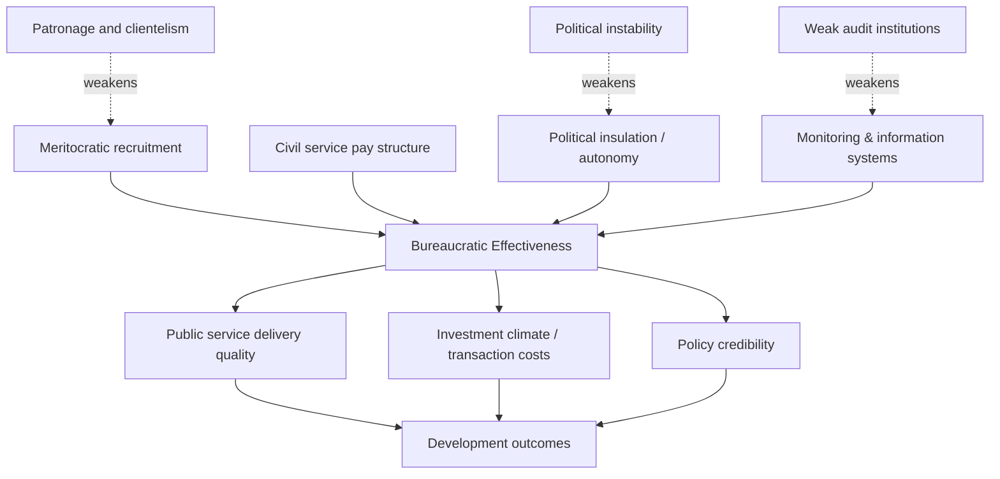

## Bureaucratic Effectiveness in Developing States

### Definition and Conceptual Scope

Bureaucratic effectiveness refers to the capacity of public administration systems to formulate, implement, and enforce policy in a manner that achieves intended outcomes efficiently, predictably, and impartially. In development economics, it is treated as a component of state capacity — distinct from but related to fiscal capacity (the ability to raise revenue) and legal capacity (the ability to enforce contracts and property rights).

Bureaucratic effectiveness is typically decomposed into several dimensions:

- **Administrative capacity**: the technical and organizational ability to design and deliver public services (staffing, information systems, logistics)
- **Meritocracy**: recruitment and promotion based on qualifications rather than patronage
- **Autonomy**: insulation of career bureaucrats from short-term political interference
- **Accountability**: mechanisms (audits, oversight, citizen feedback) that constrain rent-seeking and non-performance
- **Coherence**: consistency of implementation across agencies and levels of government

### Theoretical Foundations

**Weberian bureaucracy.** Max Weber's ideal-type bureaucracy — characterized by hierarchical authority, written rules, specialization, career tenure, and separation of office from person — remains the normative benchmark. Empirical work by Evans and Rauch (1999) operationalized "Weberianness" using survey data on meritocratic recruitment and predictable long-term career rewards across developing-country bureaucracies, finding it positively associated with economic growth.

**Embedded autonomy.** Peter Evans' concept describes bureaucracies that are simultaneously insulated from capture by particularistic interests (autonomy) and densely connected to productive sectors of society (embeddedness), enabling coordinated industrial policy. The canonical contrast is the developmental states of South Korea and Taiwan versus more fragmented, clientelist administrations elsewhere.

**Principal-agent framing.** Bureaucratic effectiveness can be modeled as a nested principal-agent problem: citizens (principals) delegate to politicians, who delegate to bureaucrats (agents), each layer introducing informational asymmetries and incentive misalignment. Weak monitoring at any layer produces slippage — policy that looks correct on paper but is poorly implemented or captured.

**State capacity as a historical variable.** Work by Besley and Persson models state capacity (fiscal and legal/bureaucratic) as the result of past investment decisions by governments, shaped by war, political competition, and the expected returns to building institutions. This treats bureaucratic quality as endogenous rather than exogenous to a country's development trajectory.

### Key Empirical Measures

| Measure | Source/Method | What It Captures |
| --- | --- | --- |
| Worldwide Governance Indicators (WGI) — Government Effectiveness | World Bank, aggregated expert/survey perceptions | Perceived quality of public services, civil service, and policy implementation |
| Bureaucracy indicators (Evans & Rauch) | Structured surveys of country experts | Meritocratic recruitment, predictable career ladders |
| Quality of Government (QoG) Institute datasets | University of Gothenburg | Impartiality, corruption, and administrative quality indices |
| International Country Risk Guide (ICRG) — Bureaucratic Quality | Commercial risk assessment | Investor-facing measure of administrative continuity and insulation from political shocks |
| Public Sector employment/wage micro-surveys | World Bank Bureaucracy Lab, civil service surveys | Absenteeism, motivation, pay compression, promotion criteria |

[Inference] Perception-based indices such as the WGI are widely used because objective cross-country administrative data is scarce, but they are subject to measurement concerns including halo effects (raters inferring bureaucratic quality from observed growth outcomes) and limited within-country variation over time.

### Causes of Low Bureaucratic Effectiveness

**Patronage and clientelism.** Political systems built on personalized exchange (votes or loyalty for jobs and favors) tend to staff bureaucracies with loyalists rather than qualified personnel, weakening technical capacity and creating turnover with every change of government.

**Low and compressed public wages.** When public-sector pay is low relative to the private sector, effective administrations struggle to attract and retain talent, and low pay relative to internal seniority-based scales can also blunt performance incentives; this is frequently cited as one channel enabling petty corruption as officials supplement income informally.

**Weak monitoring and information systems.** Absence of reliable record-keeping, audit trails, and performance data makes it difficult for principals (both political leaders and citizens) to detect shirking or diversion of resources.

**Political instability and short time horizons.** Frequent leadership turnover discourages investment in long-term administrative capacity, since incumbents cannot capture the future returns to institution-building.

**Colonial and historical legacies.** Comparative-historical scholarship (e.g., work following Lange, Mahoney, and Acemoglu–Robinson–Johnson traditions) links some contemporary bureaucratic weaknesses to extractive colonial institutions designed for resource extraction rather than broad-based administration, though the strength and mechanisms of this legacy remain debated. [Inference]

**Fragmented or overlapping mandates.** Multiple agencies with unclear jurisdiction over the same policy area create coordination failures and diffuse accountability.

### Consequences for Development Outcomes

- **Public service delivery**: Weak bureaucracies correlate with lower-quality health, education, and infrastructure delivery, independent of the level of budgetary allocation — money spent does not translate proportionally into outcomes ("leakage" and implementation gaps).
- **Investment climate**: Predictable, competent administration reduces transaction costs for firms (permitting, customs, tax administration), influencing investment decisions.
- **Policy credibility**: Weberian bureaucracies increase the credibility of long-term policy commitments (e.g., property rights enforcement, regulatory stability), which matters for private capital formation.
- **Aid effectiveness**: Studies of foreign aid delivery find that bureaucratic quality mediates whether aid translates into growth or public goods, motivating "selectivity" approaches in aid allocation.
- **State legitimacy**: Poor bureaucratic performance can erode citizen trust in the state, with downstream effects on tax compliance and civic participation.

### Reform Approaches

**Meritocratic civil service reform.** Competitive, exam-based recruitment and depoliticized promotion criteria, often modeled on East Asian or Weberian civil service systems. [Inference] Evidence on transferability of this model is mixed; institutional context (political will, enforcement capacity) appears to condition success more than the formal rules themselves.

**Pay and performance reform.** Wage adjustments, performance-based pay, and monitoring technology (e.g., biometric attendance systems) have been tested in randomized evaluations. Results vary by context and outcome measured; effects on absenteeism are sometimes stronger than effects on service quality.

**E-governance and digitization.** Digitizing records, permits, and payments reduces face-to-face discretion at the point of service delivery, a channel frequently linked to reduced opportunities for petty corruption (e.g., India's e-procurement and biometric ID systems, Rwanda's Irembo platform).

**Decentralization.** Devolving administrative authority to local governments can improve responsiveness to local conditions but risks replicating capture problems at a smaller scale if local accountability mechanisms are weak.

**Islands of effectiveness.** Some reform strategies concentrate resources in high-performing "pocket" agencies (e.g., central banks, revenue authorities) rather than attempting economy-wide reform simultaneously, on the premise that broad reform is politically and administratively harder to sustain. [Inference] The generalizability of pocket successes to the wider bureaucracy is contested in the literature.

**Community monitoring and citizen feedback.** Participatory budgeting, scorecards, and grievance-redress platforms aim to strengthen the bottom-up accountability leg of the principal-agent chain.

### Illustrative Case Comparisons

- **South Korea and Taiwan**: Frequently cited examples of embedded, meritocratic bureaucracies coordinating industrial policy during rapid post-war growth.
- **Botswana**: Often contrasted with resource-rich neighbors for maintaining relatively strong administrative institutions and prudent management of mineral revenues since independence.
- **Nigeria's revenue authority reforms**: Frequently studied for tax administration digitization efforts aimed at improving compliance and reducing discretion.
- **Rwanda**: Cited in policy literature for centralized performance-monitoring systems (imihigo performance contracts) linking local administrator evaluation to development targets. [Unverified — specific performance impacts vary across evaluations and should be checked against current studies]

### Conceptual Diagram: Principal-Agent Chain in Public Service Delivery (svg_diagram)

<svg xmlns="http://www.w3.org/2000/svg" viewBox="0 0 800 320">
\<style\>
text { font-family: Arial, sans-serif; font-size: 14px; fill: #1a1a1a; }
.title { font-size: 16px; font-weight: bold; }
.box { fill: #eef3f8; stroke: #2c5282; stroke-width: 2; rx: 8; }
.arrow { stroke: #2c5282; stroke-width: 2; marker-end: url(#arrowhead); fill: none; }
.label { font-size: 12px; fill: #4a5568; }
\</style\>
<text x="400" y="24" class="title" text-anchor="middle">Principal-Agent Chain in Public Service Delivery (svg_diagram)</text>
<rect x="30" y="60" width="160" height="70" class="box" />
<text x="110" y="90" text-anchor="middle">Citizens</text>
<text x="110" y="108" text-anchor="middle" class="label">(principal 1)</text>
<rect x="320" y="60" width="160" height="70" class="box" />
<text x="400" y="90" text-anchor="middle">Politicians</text>
<text x="400" y="108" text-anchor="middle" class="label">(agent of citizens /</text>
<text x="400" y="122" text-anchor="middle" class="label">principal of bureaucrats)</text>
<rect x="610" y="60" width="160" height="70" class="box" />
<text x="690" y="90" text-anchor="middle">Bureaucrats</text>
<text x="690" y="108" text-anchor="middle" class="label">(agent 2)</text>
<path d="M190 95 H320" class="arrow" />
<text x="255" y="85" text-anchor="middle" class="label">elect / vote</text>
<path d="M480 95 H610" class="arrow" />
<text x="545" y="85" text-anchor="middle" class="label">appoint / direct</text>
<rect x="320" y="220" width="160" height="70" class="box" />
<text x="400" y="250" text-anchor="middle">Service Delivery</text>
<text x="400" y="268" text-anchor="middle" class="label">(health, education,</text>
<text x="400" y="282" text-anchor="middle" class="label">infrastructure)</text>
<path d="M690 130 V255 H480" class="arrow" />
<text x="600" y="200" text-anchor="middle" class="label">implement</text>
<path d="M320 255 H190 V130" class="arrow" />
<text x="255" y="270" text-anchor="middle" class="label">receive outcomes</text>
<path d="M110 130 V210 Q110 255 320 255" class="arrow" stroke-dasharray="4,3" />
<text x="150" y="180" text-anchor="middle" class="label">feedback /</text>
<text x="150" y="195" text-anchor="middle" class="label">accountability</text>
</svg>

### Analytical Diagram: Determinants and Channels of Bureaucratic Effectiveness (svg_diagram)

### Illustrative Simplified Model

A stylized way to represent effective policy delivery as a function of bureaucratic quality and resource input:

$$O = f(R, B) = R^{\alpha} B^{\beta}$$

where $O$ is realized development outcomes, $R$ is budgetary/resource input, $B$ is a bureaucratic effectiveness index, and $\alpha, \beta$ are elasticities. [Inference] This functional form is a simplification for pedagogical purposes and is not drawn from a specific estimated model; it illustrates the empirical point that increasing $R$ alone yields diminishing returns to $O$ when $B$ is low — i.e., spending more money does not substitute for weak implementation capacity.

### Common Pitfalls in Analysis

- Conflating perception-based governance indices with directly measured administrative outcomes
- Treating "corruption" and "low bureaucratic effectiveness" as interchangeable, when they are related but conceptually distinct (a bureaucracy can be honest but slow, or corrupt but functionally responsive in narrow channels)
- Assuming reforms that worked in one institutional context (e.g., Singapore's civil service model) transfer directly to different political economies without adaptation
- Overlooking within-country heterogeneity — bureaucratic quality often varies significantly by agency, region, and administrative level within the same country

**Related Topics**

- Corruption measurement and anti-corruption institutions
- State capacity: fiscal versus legal versus administrative dimensions
- Weberian bureaucracy and Evans–Rauch meritocracy index
- Civil service reform and public-sector pay policy
- Principal-agent theory in public economics
- Decentralization and local government accountability
- E-governance and digital service delivery in developing states
- Aid effectiveness and institutional selectivity
- Developmental state theory (East Asian industrial policy)
- Colonial institutional legacies and long-run state capacity