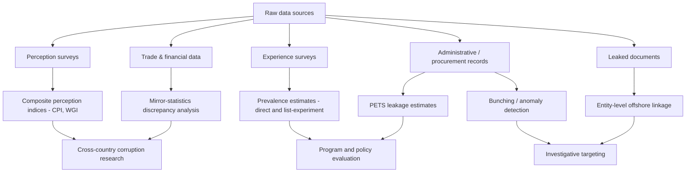

## Corruption Measurement Methodologies

### Definitional Challenges

Corruption is commonly defined as "the abuse of entrusted power for private gain" (Transparency International's working definition), but this masks substantial variation in what is being measured: petty versus grand corruption, bureaucratic versus political corruption, bribery versus embezzlement versus state capture, and de jure legal violations versus de facto norm violations that may not be codified as illegal. Measurement methodology depends heavily on which conceptual slice is targeted, and cross-study comparability is often limited because instruments are not measuring the same underlying construct. [Inference]

A foundational measurement problem is that corruption is, by its nature, a hidden transaction between consenting parties (briber and bribed) with strong incentives for both to conceal it, unlike crimes with an identifiable victim who might report them. This shapes nearly every methodological choice discussed below.

### Broad Taxonomy of Approaches

| Approach Family | Core Method | Typical Unit of Analysis |
| --- | --- | --- |
| Perception-based indices | Expert/business surveys aggregated | Country-year |
| Experience-based surveys | Household/firm self-reports of bribery | Individual/firm-year |
| Objective/audit-based measures | Forensic audits, procurement price analysis | Project/transaction |
| Behavioral and experimental measures | Lab-in-field games, corruption experiments | Individual/session |
| Indirect/statistical proxies | Discrepancies in trade data, wealth vs. income mismatches | Country or firm-year |
| Media and text-based measures | News coverage, court records, leaks (e.g., Panama Papers) | Event or entity |

### Perception-Based Indices

**Corruption Perceptions Index (CPI)** — published annually by Transparency International, the CPI aggregates multiple independent expert assessments and business surveys into a single composite score per country, scaled 0 (highly corrupt) to 100 (very clean). It draws on a set of underlying data sources (varying by year, historically including sources such as the World Bank, World Economic Forum, and various risk-rating agencies) that are standardized and averaged.

**Worldwide Governance Indicators (WGI) — Control of Corruption** — produced by the World Bank, this aggregates dozens of underlying data sources using an unobserved components model to produce a percentile-ranked score with confidence intervals, explicitly designed to communicate measurement uncertainty.

**Methodological limitations of perception indices:**

- **Halo/reputation effects**: raters may infer corruption levels from observed economic performance or media narratives rather than direct evidence, creating reverse-causality concerns in research using these indices as explanatory variables.
- **Limited within-country time variation**: perceptions change slowly and indices are often criticized as "sticky," making them poor instruments for studying short-run policy effects.
- **Aggregation opacity**: composite indices combine heterogeneous underlying sources with different definitions of corruption, methodologies, and country coverage, making the composite difficult to interpret as measuring one specific construct.
- **Elite bias**: expert and business-respondent surveys disproportionately reflect the corruption experiences of firms and elites rather than ordinary citizens' interactions with the state (e.g., petty bribery for basic services).
- **Non-comparability across years for the CPI specifically**: Transparency International has cautioned that pre-2012 CPI methodology changes mean scores are not strictly comparable year-to-year prior to that revision.

### Experience-Based Surveys

**Household and citizen surveys.** Instruments such as Afrobarometer, Latinobarómetro, and the Global Corruption Barometer ask respondents directly whether they paid a bribe for a specific service (police, courts, utilities, health, education) within a recall period. This approach measures direct experience rather than perception, reducing (though not eliminating) some elite-bias and halo-effect concerns.

**Firm-level surveys.** The World Bank Enterprise Surveys ask firm managers about bribery incidence, the share of contract value paid informally to secure government contracts, and time spent dealing with regulatory officials, enabling cross-country firm-level corruption comparisons alongside firm performance data.

**Limitations:**

- **Social desirability and recall bias**: respondents may underreport bribery due to fear of self-incrimination or shame, or misremember frequency/amounts.
- **Definitional inconsistency across respondents**: what counts as a "bribe" versus a customary gift or facilitation fee varies culturally and is not always distinguished in survey instruments.
- **Sample selection**: firm surveys may systematically exclude the most corrupt-dependent informal-sector firms that decline to participate at all.

**List experiments and randomized response techniques (RRT).** To address social desirability bias directly, researchers use indirect elicitation methods: in a list experiment, one randomly assigned group sees a list of items (including a sensitive item like "paid a bribe") and reports only the count of items that apply, while a control group sees the same list minus the sensitive item; the difference in average counts between groups estimates prevalence of the sensitive behavior without requiring individual disclosure. RRT similarly uses a randomizing device (e.g., a coin flip) to give respondents deniability when answering sensitive yes/no questions. [Inference] These methods generally reduce (but do not eliminate) social desirability bias relative to direct questioning, and require larger sample sizes to achieve comparable statistical precision.

### Objective and Audit-Based Measures

**Forensic/expenditure tracking audits.** A well-known example is Olken's (2007) study of Indonesian road-building projects, which used independent engineering re-surveys to physically measure the actual materials and labor used in completed village roads, then compared this to reported expenditures — the resulting "missing expenditure" gap serves as a direct, non-self-reported corruption estimate.

**Public Expenditure Tracking Surveys (PETS).** These trace budgeted funds from the central government down through administrative layers to the frontline facility (e.g., school, clinic) receiving them, measuring the share of funds that "leak" at each stage. Reinikka and Svensson's study of Ugandan primary school capitation grants is a canonical example, finding a large share of intended funding did not reach schools.

**Procurement price benchmarking.** Comparing prices paid in public procurement to market or engineering-estimated benchmark prices for comparable goods/services (or comparing prices across bidding processes with differing levels of competition/oversight) can flag anomalous overpricing consistent with kickback arrangements.

**Bunching and discontinuity analysis in administrative data.** Statistical detection of suspicious patterns — e.g., bunching of procurement contract values just below competitive-bidding thresholds, or bunching of self-reported incomes/assets just below audit trigger points — can reveal strategic manipulation consistent with corrupt intent, using regression discontinuity or bunching estimator techniques.

**Limitations:** audit-based measures are typically expensive, logistically demanding, and sector/project-specific, limiting generalizability; they also generally require a credible "ground truth" benchmark (an engineering estimate, a comparable market price) that may itself be contestable.

### Behavioral and Experimental Measures

**Lab-in-the-field games.** Adapted trust games, dictator games, or bribery games are run with real participants (often civil servants or students) to observe corrupt-like behavior — e.g., a briber-official game where one party can offer a payment to receive a favorable illegitimate outcome and the other decides whether to accept. These allow controlled variation of incentives (e.g., audit probability, penalty size) to test comparative statics predicted by theory.

**Fake company/audit experiments.** Field experiments have used fictitious shell companies or observers posing as citizens seeking a service (e.g., registering a business, obtaining a driver's license) to directly observe solicitation of bribes, providing a ground-truth measure in a specific bureaucratic interaction.

**External validity concerns.** [Inference] Findings from lab-in-field corruption games and audit-style field experiments may not generalize to grand corruption or high-stakes political corruption, since the stakes, repeated-game dynamics, and institutional context differ substantially from petty bureaucratic bribery.

### Indirect and Statistical Proxy Measures

**Trade mis-invoicing / mirror statistics discrepancies.** Comparing a country's reported exports to its trading partners' reported imports of the same goods (which should match after adjusting for freight/insurance) can reveal systematic discrepancies consistent with trade misinvoicing used to move corrupt proceeds across borders or evade customs duties/capital controls.

**Wealth-income mismatches ("unexplained wealth").** Comparing officials' visible asset accumulation (property, vehicles) against their declared official income, sometimes formalized through mandatory asset-declaration systems, to flag implausible wealth growth.

**Firm registration and death-rate anomalies.** Studies have used unusual patterns in firm entry, exit, or subsidiary structuring (e.g., spikes in shell company registration in specific jurisdictions) as indirect evidence of corruption-facilitating structures.

**Leaked-data analysis.** Large-scale document leaks (Panama Papers, Pandora Papers, Paradise Papers) have enabled researchers to directly link named public officials to offshore holdings, providing rare individual-level, non-self-reported corruption-adjacent data, though coverage is non-random (dependent on which firms/jurisdictions were breached) and generalizability beyond the leaked sample is limited.

### Text and Media-Based Measures

**News and court-record text analysis.** Natural language processing applied to news archives or legal case databases can construct corruption-event indices by counting/classifying reported corruption incidents, prosecutions, or scandal coverage over time, offering higher-frequency time variation than annual perception indices.

**Machine learning classification of procurement red flags.** Algorithms trained on known corruption cases can flag anomalous features in large administrative procurement datasets (e.g., single-bidder contracts, contract splitting to avoid thresholds, unusual bidder-official network ties) for further investigation. [Inference] These approaches are increasingly used by anti-corruption agencies and researchers but their classification accuracy depends heavily on the quality and representativeness of the labeled training data used.

### Choosing a Measurement Strategy

| Research Goal | Recommended Approach |
| --- | --- |
| Broad cross-country comparison over time | Perception indices (CPI, WGI) with caveats on causal interpretation |
| Micro-level prevalence among citizens | Household experience surveys, ideally with list experiments |
| Estimating actual leakage in a specific program | PETS or forensic/engineering audits |
| Testing behavioral responses to anti-corruption policy | Lab-in-field experiments or RCTs with audit-based outcome measures |
| Detecting specific corrupt transactions/networks | Procurement bunching analysis, leaked-data linkage, ML red-flag detection |
| High-frequency monitoring | Text/media-based indices, administrative anomaly detection |

### Conceptual Diagram: Corruption Measurement Approaches by Directness and Scope (svg_diagram)

<svg xmlns="http://www.w3.org/2000/svg" viewBox="0 0 800 420">
\<style\>
text { font-family: Arial, sans-serif; font-size: 13px; fill: #1a1a1a; }
.title { font-size: 16px; font-weight: bold; }
.axis { stroke: #4a5568; stroke-width: 1.5; }
.axislabel { font-size: 12px; fill: #4a5568; }
.pt { fill: #2c5282; }
.ptlabel { font-size: 12px; fill: #1a1a1a; }
\</style\>
<text x="400" y="24" class="title" text-anchor="middle">Corruption Measurement Approaches by Directness and Scope (svg_diagram)</text>
<line x1="100" y1="370" x2="740" y2="370" class="axis" marker-end="url(#ah)" />
<line x1="100" y1="370" x2="100" y2="60" class="axis" marker-end="url(#ah)" />
<text x="420" y="400" text-anchor="middle" class="axislabel">Scope: Micro (transaction) → Macro (country)</text>
<text x="40" y="215" text-anchor="middle" class="axislabel" transform="rotate(-90 40 215)">Directness: Indirect proxy → Direct observation</text>
<circle cx="180" cy="330" r="6" class="pt" />
<text x="195" y="334" class="ptlabel">CPI / WGI (indirect, macro)</text>
<circle cx="600" cy="330" r="6" class="pt" />
<text x="440" y="334" class="ptlabel">Trade mis-invoicing (indirect, macro)</text>
<circle cx="230" cy="220" r="6" class="pt" />
<text x="245" y="224" class="ptlabel">Household bribery surveys</text>
<circle cx="600" cy="220" r="6" class="pt" />
<text x="440" y="224" class="ptlabel">Firm enterprise surveys</text>
<circle cx="180" cy="100" r="6" class="pt" />
<text x="195" y="104" class="ptlabel">PETS / forensic audits (direct, micro)</text>
<circle cx="560" cy="100" r="6" class="pt" />
<text x="380" y="104" class="ptlabel">Leaked-data linkage (direct, broader scope)</text>
<circle cx="180" cy="160" r="6" class="pt" />
<text x="195" y="164" class="ptlabel">Lab-in-field games</text>
</svg>

### Analytical Diagram: Layered Corruption Detection Pipeline (svg_diagram)

### Key Statistical Consideration: Measurement Error and Attenuation

Because most corruption proxies contain substantial measurement error (particularly perception-based indices), regression estimates using these as either dependent or independent variables are subject to attenuation bias — a classical errors-in-variables problem that biases coefficient estimates toward zero when the mismeasured variable is a regressor:

$$\hat{\beta} \xrightarrow{p} \beta \cdot \frac{\sigma^2_{x^*}}{\sigma^2_{x^*} + \sigma^2_{u}}$$

where $x^*$ is the true (unobserved) corruption level, $u$ is classical measurement error, and $\hat{\beta}$ is the estimated coefficient on the mismeasured proxy. This underlies methodological arguments for combining multiple imperfect measures (as WGI does) or using instrumental variable strategies when corruption indices are used as regressors in applied development econometrics. [Inference] The direction of bias described here assumes classical (mean-zero, uncorrelated) measurement error; non-classical error, which is plausible for systematically biased perception surveys, can produce different bias patterns.

### Common Pitfalls in Applied Research

- Using CPI/WGI scores as a dependent variable in short-panel studies where the index barely moves year to year, misattributing index stickiness to policy ineffectiveness
- Treating perception-index corruption as causally prior to growth outcomes without addressing likely reverse causality (rich, well-governed countries are also rated as less corrupt)
- Comparing bribery survey results across countries without accounting for differing baseline exposure to the state (a country with fewer bureaucratic touchpoints may show artificially lower bribery prevalence)
- Assuming audit-based "missing expenditure" estimates from one sector/country generalize to other institutional contexts
- Ignoring the non-random sampling frame of leaked-document datasets when generalizing findings to the broader population of officials

**Related Topics**

- Bureaucratic effectiveness in developing states
- Public Expenditure Tracking Surveys (PETS) methodology in depth
- Randomized Controlled Trials for anti-corruption policy evaluation
- List experiments and sensitive-question survey design
- State capture and political corruption versus bureaucratic corruption
- Illicit financial flows and trade mis-invoicing estimation
- Anti-corruption agency design and institutional independence
- Asset declaration systems and beneficial ownership registries
- Machine learning applications in public procurement monitoring