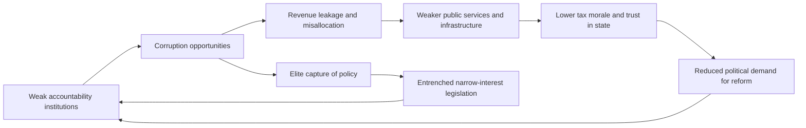

## Causes and Consequences of Corruption

### Conceptual Framing

The economic analysis of corruption typically begins from Klitgaard's formula, which decomposes corruption as a function of the discretion officials hold, their monopoly power over a decision, and the degree of accountability they face:

$$C = M + D - A$$

where $C$ is corruption, $M$ is monopoly power, $D$ is discretion, and $A$ is accountability. This is a heuristic rather than an estimated equation, but it organizes most subsequent causal analysis: corruption tends to emerge where officials have unchecked discretion over valuable decisions and face weak consequences for abusing it. [Inference] The formula is additive/subtractive by convention rather than derived from a formal model, and later literature has generally treated it as an organizing framework rather than a literal specification.

A parallel principal-agent framing treats corruption as agency slippage: citizens (principal) delegate authority to the state, which delegates to bureaucrats and politicians (agents); corruption arises when agents' incentives diverge from principals' interests and monitoring is too weak to close the gap.

### Causes of Corruption

**Institutional and governance factors**

- **Weak rule of law and judicial independence**: where courts are slow, politically captured, or under-resourced, the expected cost of prosecution for corrupt acts falls, raising the expected net benefit of engaging in corruption.
- **Low bureaucratic quality and discretion**: administrations with unclear rules, excessive licensing/permitting requirements, and wide official discretion create more opportunities for rent extraction (closely related to the bureaucratic effectiveness literature).
- **Weak press freedom and civil society**: a free press and active civil society organizations raise the probability that corrupt acts are detected and publicized, functioning as an external monitoring mechanism absent strong formal audit institutions.
- **Political competition and electoral accountability**: in weakly competitive or non-democratic systems, voters have limited ability to sanction corrupt incumbents at the ballot box, reducing the political cost of corruption.
- **Decentralization design**: decentralization can cut both ways — bringing decision-making closer to citizens can improve monitoring, but where local accountability institutions are weak, it can also multiply the number of discretionary "toll booths" at which bribery occurs. [Inference] The empirical literature on decentralization and corruption is mixed and appears to depend on the strength of local accountability mechanisms.

**Economic factors**

- **Public-sector wage levels**: low civil-service pay relative to comparable private-sector wages is frequently modeled (following efficiency-wage style arguments, e.g., Becker and Stigler's original economic treatment of crime and later applications to corruption) as raising the relative attractiveness of bribe income; empirical support for a strong wage-corruption link is mixed across studies. [Inference]
- **Natural resource abundance**: economies heavily dependent on point-source natural resource rents (oil, minerals) are frequently associated with higher corruption, part of the broader "resource curse" literature, plausibly because concentrated rents are easier to capture and less transparent than diffuse tax revenue that requires broad-based extraction from citizens.
- **Trade protection and regulatory barriers**: tariffs, quotas, and licensing regimes create artificial scarcity rents that officials controlling access to them can extract bribes for allocating (rent-seeking, in the Krueger/Tullock tradition).
- **Level of economic development**: corruption and per-capita income are robustly negatively correlated in cross-country data, though the direction of causality is disputed — higher income may fund stronger institutions, or lower corruption may itself enable growth (or omitted institutional variables may drive both).

**Cultural, historical, and social factors**

- **Colonial and historical institutional legacies**: comparative-historical work links some contemporary corruption patterns to institutions originally designed for extraction rather than broad-based governance, echoing the Acemoglu–Johnson–Robinson "reversal of fortune" and extractive-institutions literature. [Inference] The strength and precise mechanisms of this historical persistence remain actively debated.
- **Ethnic fragmentation and clientelism**: in societies with strong ethnic or communal cleavages, politicians may use public resources to reward co-ethnic or co-partisan networks (patronage), a pattern documented extensively in African political economy research (e.g., work by Posner, Padró i Miquel).
- **Social norms and tolerance of corruption**: repeated-game and norms-based models suggest that once corruption becomes widespread, it can become self-reinforcing — individuals expect others to be corrupt, lowering the stigma and coordination cost of participating themselves (a "corruption trap" or multiple-equilibria framing).

**Structural/opportunity factors**

- **Complexity and opacity of public administration**: dense, non-transparent regulatory and procurement processes increase information asymmetries that create both discretion and paying opportunities.
- **Weak asset-declaration and disclosure regimes**: absence of mandatory, verified income/asset disclosure for public officials reduces detection probability for illicit enrichment.
- **International financial secrecy**: availability of offshore financial centers and anonymous shell company structures lowers the cost of concealing and laundering corrupt proceeds, an important structural enabler documented via leaked-document research (Panama Papers, Pandora Papers).

### Consequences of Corruption

**Growth and investment effects**

The dominant view treats corruption as "sand in the wheels" of economic activity — a large empirical literature (following Mauro's 1995 cross-country study) finds a negative association between corruption indices and investment and growth rates, operating through increased transaction costs, uncertainty over contract enforcement, and distorted allocation of talent toward rent-seeking rather than productive activity.

A minority "grease the wheels" hypothesis argues that in contexts with excessively rigid or dysfunctional bureaucratic rules, bribery may allow transactions to proceed that would otherwise be blocked entirely, functioning as a second-best coping mechanism. [Inference] Subsequent empirical work has generally found the "grease" effect, where it exists, is contingent on specific institutional weaknesses and does not offset the larger negative growth relationship found across most cross-country and firm-level studies; support for grease effects being a general phenomenon rather than a context-specific finding is limited.

**Public finance effects**

- **Revenue leakage**: corruption in tax administration and customs reduces effective government revenue collection, constraining fiscal capacity for public investment.
- **Distorted public spending composition**: corrupt incentives can bias governments toward large, complex capital projects (which offer more opportunities for kickbacks) over recurrent spending on health, education, or maintenance, a pattern documented in comparative public-finance research (e.g., Mauro's related work on spending composition).
- **Debt and macroeconomic risk**: diversion of public funds can widen fiscal deficits and, in some documented cases, has been linked to sovereign debt distress and reduced donor/investor confidence.

**Public service delivery effects**

- **Reduced access and quality**: bribery requirements for basic services (healthcare, education, utility connections, policing) function as a regressive informal tax that disproportionately burdens lower-income households who can least afford it.
- **Leakage in targeted programs**: PETS-style research (see corruption measurement methodologies) has documented substantial diversion of intended program funds before reaching frontline facilities in multiple developing-country contexts.
- **Erosion of human capital investment**: bribery and ghost-worker schemes in education and health systems can reduce effective service provision even where nominal budget allocations appear adequate.

**Inequality and distributional effects**

Corruption is generally found to be regressive: wealthier individuals and firms can better absorb bribe costs or use connections to avoid them altogether, while poorer citizens face proportionally larger burdens for accessing basic services, and elite capture of public resources and contracts concentrates gains among politically connected actors, widening income and wealth inequality. [Inference] This distributional finding is fairly consistent across the empirical literature, though quantifying the precise magnitude of the regressive effect is methodologically difficult given the underlying corruption-measurement challenges discussed elsewhere in this chapter.

**Political and institutional effects**

- **Erosion of state legitimacy and trust**: perceived corruption is associated with lower trust in government institutions and, in some studies, reduced tax compliance and civic participation, potentially creating a self-reinforcing cycle of weak fiscal capacity and weak legitimacy.
- **Political instability**: corruption scandals are frequently cited as proximate triggers of protest movements, government collapse, or coups in comparative political-economy case studies, though corruption is typically one of several contributing factors rather than a sole cause.
- **Institutional quality persistence**: state-capture dynamics, where narrow elite interests systematically shape legislation and regulation to their advantage, can entrench weak institutions over long periods, consistent with multiple-equilibria/institutional-persistence models in the state-capacity literature.

**Firm-level and market effects**

- **Barrier to entry for smaller/less-connected firms**: bribery and connections-based contracting favor politically connected incumbents, reducing market competition and potentially misallocating resources away from more productive but less-connected firms.
- **Distorted firm behavior**: firms facing corrupt regulatory environments may under-invest in formalization, remain informal to avoid bureaucratic exposure, or divert managerial time toward navigating officials rather than production — documented extensively in World Bank Enterprise Survey-based research.

### Simplified Causal Model

A stylized rational-choice representation of an official's decision to accept a bribe, following the Becker–Stigler crime-economics tradition applied to corruption:

$$E[U_{corrupt}] = B - p \cdot F$$

where $B$ is the bribe amount received, $p$ is the probability of detection and punishment, and $F$ is the penalty (financial, reputational, or custodial) if caught. An official is modeled as accepting the bribe when $E[U_{corrupt}] > U_{honest}$, i.e., when $B > p \cdot F + (U_{honest} - 0)$ adjusted for risk preferences. [Inference] This is a simplified expected-utility framework for pedagogical purposes; it abstracts from repeated-game reputational dynamics, social norms, and non-monetary motivations that richer models in the literature incorporate.

This model directly motivates the standard policy levers: raising $p$ (better monitoring/audit), raising $F$ (stronger penalties/enforcement), or lowering the value of $B$ available to extract (reducing discretion and rents through deregulation, digitization, or simplification).

### Conceptual Diagram: Causal Chain from Institutional Weakness to Development Outcomes (svg_diagram)

<svg xmlns="http://www.w3.org/2000/svg" viewBox="0 0 820 460">
\<style\>
text { font-family: Arial, sans-serif; font-size: 13px; fill: #1a1a1a; }
.title { font-size: 16px; font-weight: bold; }
.box { fill: #eef3f8; stroke: #2c5282; stroke-width: 2; rx: 8; }
.box2 { fill: #fdf2e9; stroke: #b7621b; stroke-width: 2; rx: 8; }
.box3 { fill: #edf7ee; stroke: #2f7d3a; stroke-width: 2; rx: 8; }
.arrow { stroke: #2c5282; stroke-width: 2; marker-end: url(#ah2); fill: none; }
.label { font-size: 11px; fill: #4a5568; }
\</style\>
<text x="410" y="24" class="title" text-anchor="middle">Causal Chain: Institutional Weakness to Development Outcomes (svg_diagram)</text>
<rect x="30" y="60" width="200" height="60" class="box2" />
<text x="130" y="85" text-anchor="middle">Weak rule of law /</text>
<text x="130" y="102" text-anchor="middle">low accountability</text>
<rect x="310" y="60" width="200" height="60" class="box2" />
<text x="410" y="85" text-anchor="middle">High discretion +</text>
<text x="410" y="102" text-anchor="middle">monopoly power</text>
<rect x="590" y="60" width="200" height="60" class="box2" />
<text x="690" y="85" text-anchor="middle">Low public-sector</text>
<text x="690" y="102" text-anchor="middle">wages / oversight</text>
<path d="M230 90 H310" class="arrow" />
<path d="M510 90 H590" class="arrow" />
<rect x="310" y="180" width="200" height="60" class="box" />
<text x="410" y="205" text-anchor="middle">Corruption</text>
<text x="410" y="222" text-anchor="middle" class="label">(B &gt; p·F threshold met)</text>
<path d="M130 120 V180 Q130 210 310 210" class="arrow" />
<path d="M690 120 V180 Q690 210 510 210" class="arrow" />
<rect x="60" y="310" width="180" height="60" class="box3" />
<text x="150" y="335" text-anchor="middle">Reduced investment</text>
<text x="150" y="352" text-anchor="middle" class="label">and growth</text>
<rect x="320" y="310" width="180" height="60" class="box3" />
<text x="410" y="335" text-anchor="middle">Revenue leakage /</text>
<text x="410" y="352" text-anchor="middle" class="label">service delivery gaps</text>
<rect x="580" y="310" width="200" height="60" class="box3" />
<text x="680" y="335" text-anchor="middle">Rising inequality /</text>
<text x="680" y="352" text-anchor="middle" class="label">eroded state legitimacy</text>
<path d="M370 240 Q250 270 150 310" class="arrow" />
<path d="M410 240 V310" class="arrow" />
<path d="M450 240 Q560 270 680 310" class="arrow" />
<rect x="300" y="410" width="220" height="40" class="box" />
<text x="410" y="435" text-anchor="middle">Weaker development outcomes</text>
<path d="M150 370 Q150 430 300 430" class="arrow" />
<path d="M410 370 V410" class="arrow" />
<path d="M680 370 Q680 430 520 430" class="arrow" />
</svg>

### Analytical Diagram: Feedback Loop Between Corruption and Institutional Erosion (svg_diagram)

### Policy Implications Summary

| Cause Addressed | Typical Policy Lever |
| --- | --- |
| High discretion / monopoly power | Deregulation, e-governance, simplified permitting |
| Low detection probability | Independent audit institutions, asset declarations, whistleblower protection |
| Low penalty severity/enforcement | Judicial independence reform, anti-corruption courts/agencies |
| Low public-sector pay | Civil service pay and career-ladder reform |
| Weak external monitoring | Press freedom protections, civil society support, freedom-of-information laws |
| Financial secrecy enabling concealment | Beneficial ownership transparency, international AML cooperation |

### Common Pitfalls in Causal Analysis

- Treating cross-country correlations between corruption indices and growth as established causal effects without addressing reverse causality and omitted-variable concerns (weak institutions may independently cause both)
- Over-generalizing "grease the wheels" findings from specific regulatory contexts into a general policy justification for tolerating corruption
- Assuming a single universal cause (e.g., low wages alone) when most rigorous studies find corruption is multiply determined and context-dependent
- Ignoring measurement-error problems (see corruption measurement methodologies) when interpreting the strength of causal claims in this literature
- Conflating correlation between resource abundance and corruption with an inevitable "curse," when country-level institutional quality prior to resource discovery appears to condition outcomes substantially

**Related Topics**

- Bureaucratic effectiveness in developing states
- Corruption measurement methodologies
- Resource curse and rentier state theory
- Principal-agent models of public accountability
- Rent-seeking theory (Krueger, Tullock)
- State capture and elite bargains
- Anti-corruption institutional design (specialized agencies, courts)
- Decentralization and local governance accountability
- Illicit financial flows and beneficial ownership transparency